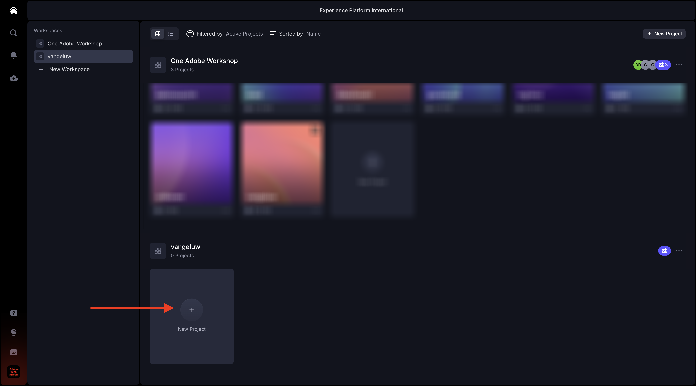

# 1.5.1 Erste Schritte mit Frame.io

>[!NOTE]
>
> Der folgende Screenshot zeigt, wie eine bestimmte Umgebung verwendet wird. Wenn Sie dieses Tutorial durchlaufen, hat Ihre Umgebung höchstwahrscheinlich einen anderen Namen. Wenn Sie sich für dieses Tutorial angemeldet haben, wurden Ihnen die zu verwendenden Umgebungsdetails zur Verfügung gestellt. Befolgen Sie bitte diese Anweisungen.

Navigieren Sie zu [https://next.frame.io/](https://next.frame.io/). Stellen Sie sicher, dass Sie bei der `--aepImsOrgName--` der Umgebung angemeldet sind.

Falls Sie nicht in der rechten Umgebung angemeldet sind, klicken Sie auf das Logo in der linken unteren Ecke und wählen Sie die gewünschte Umgebung aus.

## 1.5.1.1 Erstellen von Arbeitsbereich und Projekt

Klicken Sie auf **+ Neue Workspace**.

Für den Workspace-Namen verwenden Sie: `--aepUserLdap--`. Klicken Sie auf **Speichern**.

Ihr Arbeitsbereich wurde erstellt. Als Nächstes sollten Sie ein neues Projekt erstellen. Klicken Sie auf **+ Neues Projekt**.

Wählen Sie **Leer** aus und verwenden Sie den Namen `CitiSignal`. Klicken Sie **Neues Projekt erstellen**.

Ihr Projekt ist jetzt erstellt. Jetzt müssen Sie Assets in Ihr Projekt hochladen. Klicken Sie **Hochladen**.

Laden Sie diese Dateien: [https://one-adobe-tech-insiders.s3.us-west-2.amazonaws.com/Frame.io_Assets.zip](https://one-adobe-tech-insiders.s3.us-west-2.amazonaws.com/Frame.io_Assets.zip) auf Ihren Desktop herunter und entpacken Sie sie auf Ihren Desktop.

Wählen Sie alle Dateien aus und klicken Sie auf **Öffnen**.

>[!NOTE]
>
>Wie Sie im Screenshot sehen können, ist der Ordner **Soundeffekte** derzeit nicht ausgewählt. Dies liegt daran, dass der manuelle Upload das Hochladen von Ordnern nicht unterstützt. In wenigen Minuten installieren Sie die Frame.io Transfer App, mit der Sie diesen Ordner und seine Dateien hochladen.

Nach einigen Minuten werden Ihre Dateien in Frame.io verfügbar.

Sie haben jetzt Dateien manuell hochgeladen, aber es gibt eine bessere und schnellere Möglichkeit, Dateien in und von Frame.io hochzuladen und herunterzuladen. Die beste Möglichkeit, dies zu tun, besteht in der Verwendung der Frame.io Transfer App.

## 1.5.1.2 Herunterladen und Konfigurieren der Frame.io-Transfer-App

Wechseln Sie zu [https://frame.io/transfer](https://frame.io/transfer) und laden Sie die Version für Ihren Computer herunter.

Installieren Sie die Anwendung und öffnen Sie sie dann.

Beim Öffnen der Anwendung müssen Sie sich anmelden. Klicken Sie **Anmelden**.

Geben Sie die E-Mail-Adresse Ihres Adobe-Kontos ein und klicken Sie **Los**.

Klicken Sie nach erfolgreicher Authentifizierung auf **Frame.io Transfer App öffnen**.

Sie sollten das dann sehen. Um die richtige Umgebung auszuwählen, klicken Sie auf , um die Dropdown-Liste zu öffnen.

Wählen Sie die Umgebung aus, die Sie für dieses Tutorial verwenden müssen, das `--aepImsOrgName--` ist.

Anschließend sollten der zuvor erstellte Arbeitsbereich und das Projekt sowie die Dateien angezeigt werden, die Sie manuell hochgeladen haben.

Klicken Sie **Hochladen**.

Wechseln Sie zu dem zuvor verwendeten Ordner, der die zuvor heruntergeladenen entpackten Dateien enthält. Wählen Sie den Ordner **Soundeffekte** und klicken Sie auf **Hochladen**.

Ihre Dateien werden dann hochgeladen.

Nach dem Hochladen wird der neue Ordner in Frame.io verfügbar.

## Nächste Schritte

Gehen Sie zu [1.5.2-Genehmigungen mit Frame.io](./ex2.md){target="_blank"}

Gehen Sie zurück zu [Optimieren Sie Ihren Workflow mit Frame.io](./frameio.md){target="_blank"}

Zurück zu [Alle Module](./../../../overview.md){target="_blank"}
