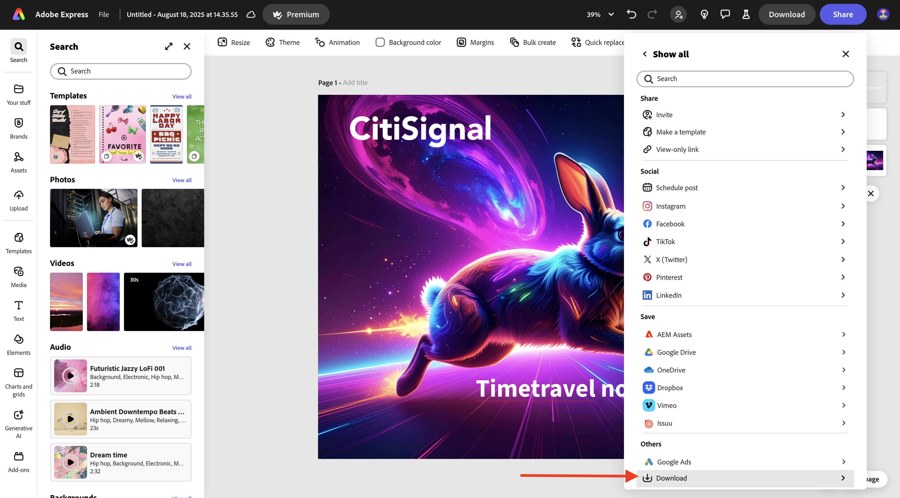
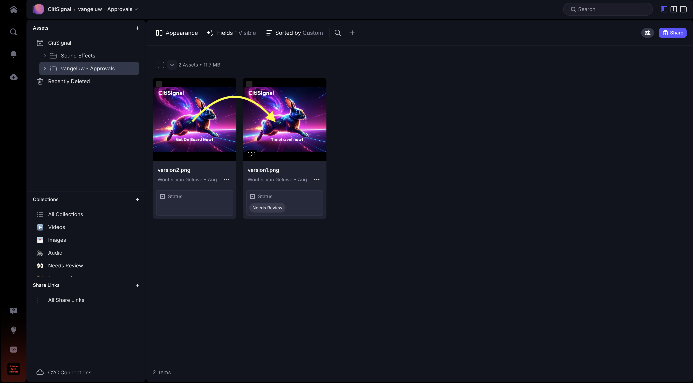
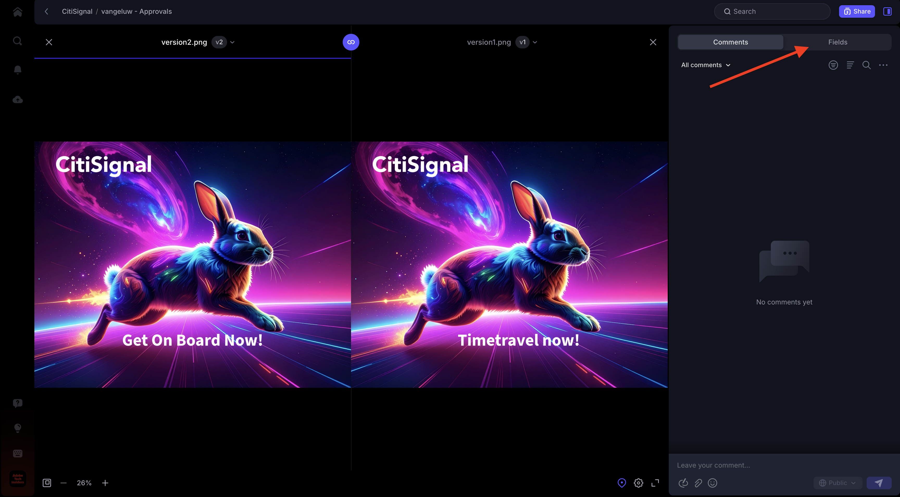

# 1.5.2 Genehmigungen mit Frame.io

>[!NOTE]
>
> Der folgende Screenshot zeigt, wie eine bestimmte Umgebung verwendet wird. Wenn Sie dieses Tutorial durchlaufen, hat Ihre Umgebung höchstwahrscheinlich einen anderen Namen. Wenn Sie sich für dieses Tutorial angemeldet haben, wurden Ihnen die zu verwendenden Umgebungsdetails zur Verfügung gestellt. Befolgen Sie bitte diese Anweisungen.

Um den Genehmigungs-Workflow in Frame.io durchlaufen zu können, benötigen Sie ein Asset. In dieser Übung erstellen Sie zunächst dieses Asset selbst mit Adobe Firefly und Adobe Express. Sobald Sie das Asset haben, laden Sie es in Frame.io hoch und genehmigen es schließlich.

## 1.5.2.1 Erstellen von Assets mit Adobe Firefly Services und Adobe Express

Navigieren Sie zu [https://firefly.adobe.com/](https://firefly.adobe.com/){target="_blank"}. Geben Sie den `a neon rabbit running very fast through space` ein und klicken Sie auf **Generieren**.

Anschließend werden mehrere Bilder generiert. Wählen Sie das Bild aus, das Ihnen am besten gefällt, klicken Sie auf das Symbol **Freigeben** auf dem Bild und wählen Sie dann **In Adobe Express öffnen**.

Anschließend wird das soeben generierte Bild in Adobe Express zur Bearbeitung verfügbar. Jetzt müssen Sie das CitiSignal-Logo auf dem Bild hinzufügen. Navigieren Sie dazu zu **Marken**.

Anschließend sollte eine CitiSignal-Markenvorlage angezeigt werden. die in GenStudio for Performance Marketing erstellt wurden, erscheinen in Adobe Express. Klicken Sie, um eine Markenvorlage auszuwählen, deren Name `CitiSignal` enthält.

Gehen Sie zu **Logos** und klicken Sie auf das **weiß** Citisignal-Logo, um es auf dem Bild abzulegen.

Positionieren Sie das CitiSignal-Logo oben auf Ihrem Bild, nicht zu weit von der Mitte entfernt.

Navigieren Sie zu **Text**.

Klicken Sie **Text hinzufügen**.

Geben Sie die `Timetravel now!` ein, ändern Sie die Schriftfarbe und Schriftgröße, legen Sie den Text auf **Fett** fest, sodass Sie ein Bild wie dieses haben.

Klicken Sie anschließend auf **Freigeben**.

Klicken Sie auf **… Alle**.

Scrollen Sie nach unten und wählen Sie **Herunterladen** aus.

Klicken Sie **Herunterladen**.

Anschließend haben Sie Ihr Asset auf Ihrem lokalen Computer.

## 1.5.2.2 Genehmigen des Assets in Frame.io

Navigieren Sie zu [https://next.frame.io/](https://next.frame.io/). Stellen Sie sicher, dass Sie bei der `--aepImsOrgName--` der Umgebung angemeldet sind.

Falls Sie nicht in der rechten Umgebung angemeldet sind, klicken Sie auf das Logo in der linken unteren Ecke und wählen Sie die gewünschte Umgebung aus.

Gehen Sie zu Ihrem Arbeitsbereich, der `--aepUserLdap--` heißen sollte, und öffnen Sie dann den Ordner **CitiSignal**. Klicken Sie auf das Symbol **+** und wählen Sie dann **Neuer Ordner** aus.

Benennen Sie den Ordner `--aepUserLdap-- - Approvals`. Doppelklicken Sie auf den Ordner, um ihn zu öffnen.

Sie laden nun die in der vorherigen Übung erstellte Datei in diesen Ordner hoch. Klicken Sie **Hochladen**.

Wählen Sie die Datei aus und klicken Sie auf **Öffnen**.

Sie sollten dann diese haben. Doppelklicken Sie auf die Datei, um sie zu öffnen.

Aktivieren Sie das Symbol, um einen verankerten Kommentar zu hinterlassen.

Geben Sie einen Kommentar ein, z. B. `Change CTA to "Get on board now!"`. Klicken Sie auf das **Senden**-Symbol, um Ihren Kommentar zu teilen.

Sie sollten dann diese haben. Navigieren Sie zu **Felder**.

Ändern Sie im Feld **Status** den Status in **Überprüfung erforderlich**.

Sie sollten dann diese haben. Navigieren Sie zurück zum Ordner, indem Sie auf den Pfeil klicken, um zurückzukehren.

Klicken Sie auf die drei Punkte **…** und wählen Sie **Umbenennen**.

Ändern Sie den Dateinamen in `version1.png`.

## 1.5.2.3 Vornehmen von Design-Änderungen in Adobe Express

Wechseln Sie zu [https://new.express.adobe.com/your-stuff/files](https://new.express.adobe.com/your-stuff/files) und öffnen Sie das zuvor erstellte Bild erneut.

Ändern Sie den CTA-Text in `Get On Board Now!`.

Klicken Sie auf **Freigeben** und wählen Sie dann **Herunterladen** aus.

Klicken Sie **Herunterladen**.

Anschließend wird ein neues Bild auf den lokalen Computer heruntergeladen. Benennen Sie die Datei in `version2.png` um.

## 1.5.2.4 Version2 in Frame.io genehmigen

Klicken Sie in Ihrem Ordner in Frame.io auf das Symbol **+** und wählen Sie **Asset hochladen**.

Wählen Sie die Datei **version2.png** aus und klicken Sie auf **Öffnen**.

Ziehen Sie als Nächstes die Datei **version2.png** auf die Datei **version1.png**. Diese Aktion aktiviert das Stapeln von Versionen in Frame.io.

Sie sollten das dann sehen.

Klicken Sie auf die 3 Punkte **…** auf dem Bild und wählen Sie dann **Versionen vergleichen**.

Sie sollten dann diese Vergleichsansicht sehen, die beide Versionen der Datei anzeigt. Navigieren Sie zu **Felder**.

Ändern Sie das Feld **Status** in **Genehmigt**.

Sie sollten dann diese haben. Klicken Sie auf das Pfeilsymbol, um zur Ordneransicht zurückzukehren.

Klicken Sie auf die 3 Punkte **…** und wählen **Herunterladen**, falls Sie diese Datei in einem anderen Programm verwenden möchten.

## Nächste Schritte

[1.5.3 Frame.io und Premiere Pro](./ex3.md){target="_blank"}

Gehen Sie zurück zu [Optimieren Sie Ihren Workflow mit Frame.io](./frameio.md){target="_blank"}

Zurück zu [Alle Module](./../../../overview.md){target="_blank"}
