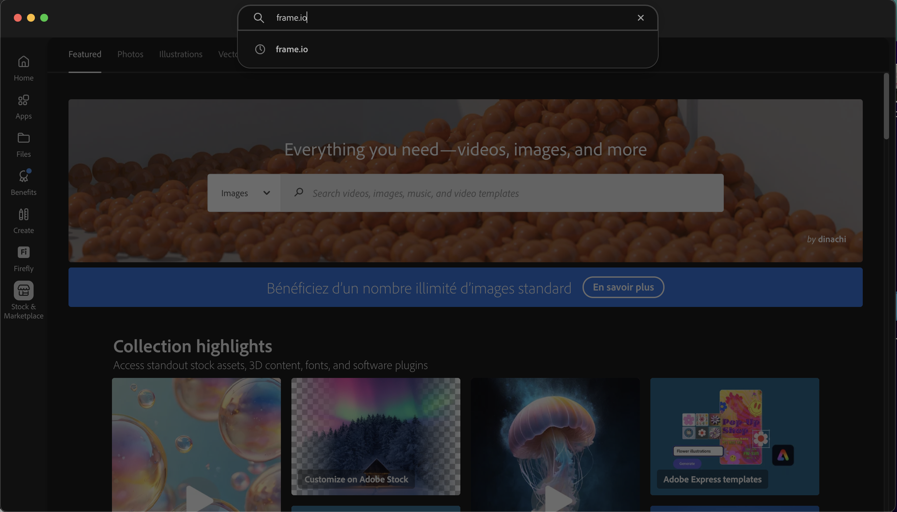

# 1.5.3 Frame.io und Premiere Pro

>[!NOTE]
>
> Der folgende Screenshot zeigt, wie eine bestimmte Umgebung verwendet wird. Wenn Sie dieses Tutorial durchlaufen, hat Ihre Umgebung höchstwahrscheinlich einen anderen Namen. Wenn Sie sich für dieses Tutorial angemeldet haben, wurden Ihnen die zu verwendenden Umgebungsdetails zur Verfügung gestellt. Befolgen Sie bitte diese Anweisungen.

Navigieren Sie zu [https://next.frame.io/](https://next.frame.io/). Stellen Sie sicher, dass Sie bei der `--aepImsOrgName--` der Umgebung angemeldet sind.

Falls Sie nicht in der rechten Umgebung angemeldet sind, klicken Sie auf das Logo in der linken unteren Ecke und wählen Sie die gewünschte Umgebung aus.

## 1.5.3.1 Einrichten von Adobe Premiere Pro Beta

Sie haben Adobe Premiere Pro Beta bereits als Teil des Moduls Erste Schritte installiert. Um Frame.io in Kombination mit Adobe Premiere Pro Beta zu nutzen, können Sie das für diese Integration entwickelte Plugin nutzen.

Öffnen Sie die Creative Cloud-App und suchen Sie nach `frame.io`.

Scrollen Sie in den Suchergebnissen nach unten, um das Plug-in **Frame.io V4-Kommentare** zu finden. Klicken Sie darauf.

Sie sollten das dann sehen. Klicken Sie auf **Installieren**.

Wenn Adobe Premiere Pro Beta geöffnet ist, müssen Sie **Schließen** bevor Sie das Plug-in installieren können.

Klicken Sie auf **OK**. Das Plug-in wird jetzt installiert.

Öffnen Sie nach der Installation des Plug-ins Adobe Premiere Pro Beta auf Ihrem Computer.

## Nächste Schritte

Wechseln Sie zu [Zusammenfassung und Vorteile](./summary.md){target="_blank"}

Gehen Sie zurück zu [Optimieren Sie Ihren Workflow mit Frame.io](./frameio.md){target="_blank"}

Zurück zu [Alle Module](./../../../overview.md){target="_blank"}
