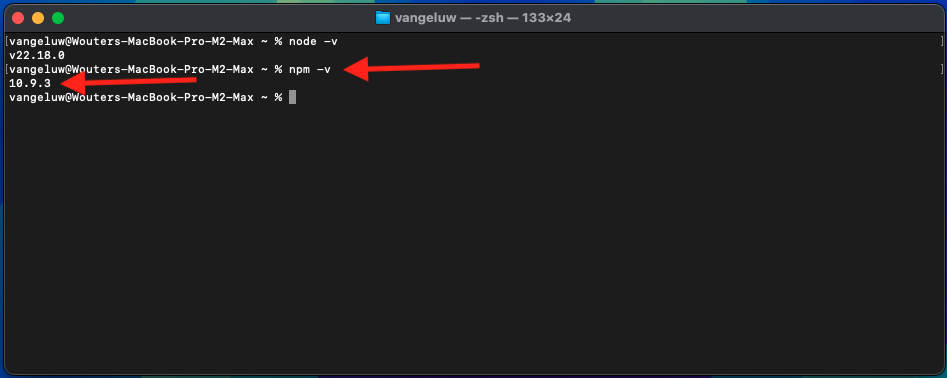

# 1.6.1 Adobe IO und App Builder

## 1.6.1.1 Erstellen eines Adobe I/O-Projekts

Navigieren Sie zu [https://developer.adobe.com/console/home](https://developer.adobe.com/console/home){target="_blank"}.

Achten Sie darauf, dass Sie die richtige Instanz in der oberen rechten Ecke Ihres Bildschirms auswählen. Ihre Instanz ist `--aepImsOrgName--`.

>[!NOTE]
>
> Der folgende Screenshot zeigt, wie eine bestimmte Organisation ausgewählt wird. Wenn Sie dieses Tutorial durchlaufen, hat Ihre Organisation höchstwahrscheinlich einen anderen Namen. Wenn Sie sich für dieses Tutorial angemeldet haben, wurden Ihnen die zu verwendenden Umgebungsdetails zur Verfügung gestellt. Befolgen Sie bitte diese Anweisungen.

Wählen Sie anschließend **Projekt aus Vorlage erstellen**.

**App Builder**.

Geben Sie den `--aepUserLdap-- GSPeM EXT` ein. Klicken Sie auf **Speichern**.

Sie sollten dann so etwas sehen.

## 1.6.1.2 Konfigurieren der Entwicklungsumgebung

Um Ihre erweiterbare Anwendung zu erstellen, zu übermitteln und bereitzustellen, sollten in Ihrer lokalen Entwicklungsumgebung auf Ihrem Computer die folgenden Anwendungen und Pakete installiert sein:

- Node.js (Version 20.x oder höher)
- npm (im Paket mit Node.js)
- Adobe Developer-Befehlszeilenschnittstelle (CLI)

Falls diese Anwendungen oder Pakete noch nicht auf Ihrem Computer installiert sind, führen Sie die folgenden Schritte aus.

### Node.js und npm

Navigieren Sie zu [https://nodejs.org/en/download](https://nodejs.org/en/download). Sie sollten dies dann sehen, mit einer Reihe von Terminal-Befehlen, die ausgeführt werden müssen, um Node.js und npm installiert zu haben. Die hier angezeigten Befehle gelten für MacBook.

Öffnen Sie zunächst ein neues Terminal-Fenster. Fügen Sie den in Zeile 2 des Screenshots genannten Befehl ein und führen Sie ihn aus:

`curl -o- https://raw.githubusercontent.com/nvm-sh/nvm/v0.40.3/install.sh | bash`

Führen Sie als Nächstes den Befehl in Zeile 5 des Screenshots aus:

`\. "$HOME/.nvm/nvm.sh"`

Führen Sie nach erfolgreicher Ausführung beider Befehle den folgenden Befehl aus:

`node -v`

Es sollte eine Versionsnummer zurückgegeben werden.

Führen Sie als Nächstes diesen Befehl aus:

`npm -v`

Es sollte eine Versionsnummer zurückgegeben werden.

Wenn die letzten beiden Befehle erfolgreich eine Versionsnummer zurückgegeben haben, ist Ihre Konfiguration dieser beiden Funktionen erfolgreich.

### Adobe Developer-Befehlszeilenschnittstelle (CLI)

Um die Adobe Developer-Befehlszeilenschnittstelle (CLI) zu installieren, führen Sie den folgenden Befehl in einem Terminal-Fenster aus:

`npm install -g @adobe/aio-cli`

Die Ausführung dieses Befehls kann einige Minuten dauern. Das Endergebnis sollte in etwa wie folgt aussehen:

Die Adobe Developer-Befehlszeilenschnittstelle (CLI) wurde ebenfalls erfolgreich installiert.

Sie haben jetzt die Grundelemente eingerichtet, damit Sie ein App Builder-Projekt ausführen können.

## Nächste Schritte

Navigieren Sie zu [AWS S3-Bucket erstellen](./ex2.md){target="_blank"}

Zurück zu [GenStudio for Performance Marketing - Erweiterbarkeit](./genstudioext.md){target="_blank"}

Zurück zu [Alle Module](./../../../overview.md){target="_blank"}
