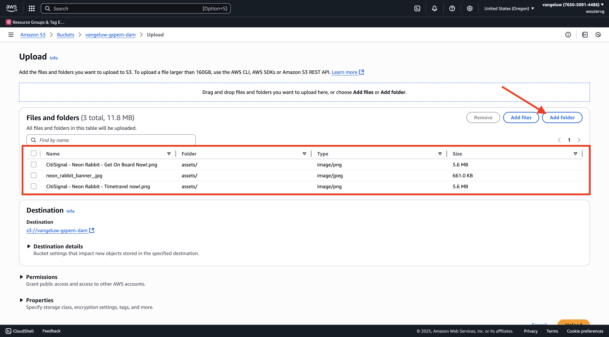

# 1.6.2 AWS S3-Bucket erstellen

## 1.6.2.1 Erstellen eines S3-Buckets

Wechseln Sie zu [https://console.aws.amazon.com](https://console.aws.amazon.com) und melden Sie sich an.

>[!NOTE]
>
>Wenn Sie noch kein AWS-Konto haben, erstellen Sie bitte mit Ihrer persönlichen E-Mail-Adresse ein neues AWS-Konto.

Nach der Anmeldung werden Sie zur **AWS Management Console** weitergeleitet.

Suchen Sie in der Suchleiste nach **s3**. Klicken Sie auf das erste Suchergebnis: **S3 - Scalable Storage in the Cloud**.

Anschließend wird die Startseite von **Amazon S3** angezeigt. Klicken Sie **Bucket erstellen**.

Verwenden **im Bildschirm „Bucket erstellen** den Namen `--aepUserLdap---gspem-dam`.

Belassen Sie alle anderen Standardeinstellungen. Scrollen Sie nach unten und klicken Sie auf **Bucket erstellen**.

Anschließend wird Ihr Bucket erstellt und zur Amazon S3-Homepage weitergeleitet.

## Berechtigungen für den Zugriff auf Ihren S3-Bucket festlegen

Der nächste Schritt besteht darin, den Zugriff auf Ihren S3-Bucket einzurichten.

Navigieren Sie dazu zu [https://console.aws.amazon.com/iam/home](https://console.aws.amazon.com/iam/home).

Der Zugriff auf AWS-Ressourcen wird über Amazon Identity and Access Management (IAM) gesteuert.

Jetzt sehen Sie diese Seite.

Klicken Sie im linken Menü auf **Benutzer**. Anschließend wird der Bildschirm **Benutzer** angezeigt. Klicken Sie **Benutzer erstellen**.

Konfigurieren Sie anschließend Ihren Benutzer:

- Benutzername: `s3_--aepUserLdap--_gspem_dam` verwenden

Klicken Sie auf **Weiter**.

Anschließend wird dieser Bildschirm mit den Berechtigungen angezeigt. Klicken Sie **Richtlinien direkt anhängen**.

Geben Sie den Suchbegriff **s3** ein, um alle zugehörigen S3-Richtlinien anzuzeigen. Wählen Sie die Richtlinie **AmazonS3FullAccess**. Scrollen Sie nach unten und klicken Sie auf **Weiter**.

Überprüfen Sie Ihre Konfiguration. Klicken Sie **Benutzer erstellen**.

Sie werden es dann sehen. Klicken Sie **Benutzer anzeigen**.

Klicken Sie auf **Sicherheitsberechtigungen** und dann auf **Zugriffsschlüssel erstellen**.

Wählen Sie **Anwendung, die außerhalb von AWS ausgeführt wird**. Scrollen Sie nach unten und klicken Sie auf **Weiter**.

Klicken Sie **Zugriffsschlüssel erstellen**

Sie werden es dann sehen. Klicken Sie **Anzeigen**, um Ihren geheimen Zugriffsschlüssel anzuzeigen:

Ihr **geheimer Zugriffsschlüssel** wird jetzt angezeigt.

>[!IMPORTANT]
>
>Speichern Sie Ihre Anmeldedaten in einer Textdatei auf Ihrem Computer.
>
> - Zugriffsschlüssel-ID: …
> - Geheimer Zugriffsschlüssel: …
>
> Wenn Sie auf **Fertig** klicken, werden Ihre Anmeldeinformationen nie mehr angezeigt!

Klicken Sie auf **Fertig**.

Sie haben jetzt erfolgreich einen AWS S3-Bucket erstellt und eine Benutzerin bzw. einen Benutzer mit der Berechtigung zum Zugriff auf diesen Bucket erstellt.

## 1.6.2.2 Assets in Ihren S3-Bucket hochladen

Suchen Sie in der Suchleiste nach **s3**. Klicken Sie auf das erste Suchergebnis: **S3 - Scalable Storage in the Cloud**.

Klicken Sie auf , um den neu erstellten S3-Bucket zu öffnen, der den Namen `--aepUserLdap---gspem-dam` erhalten soll.

Klicken Sie **Hochladen**.

Sie sollten das dann sehen.

Sie können CitiSignal-Bilddateien ([) &#x200B;](./images/package.zip){target="_blank"}.

Exportieren Sie die Dateien auf Ihren Desktop.

Klicken Sie **Ordner hinzufügen**.

Wählen Sie den Ordner **Assets** aus dem Download-Ordner **Package**. Klicken Sie **Hochladen**.

Sie sollten das dann sehen. Klicken Sie **erneut auf** Ordner hinzufügen“.

Wählen Sie den Ordner **Miniaturen** aus dem Download-Ordner **Paket**. Klicken Sie **Hochladen**.

Sie sollten das dann sehen. Klicken Sie **Hochladen**.

Ihr Upload ist jetzt abgeschlossen. Klicken Sie auf **Schließen**.

Diese Ordnerstruktur sollte jetzt in Ihrem S3-Bucket vorhanden sein.

## Nächste Schritte

Navigieren Sie zu [Externe DAM-App erstellen](./ex3.md){target="_blank"}

Zurück zu [GenStudio for Performance Marketing - Erweiterbarkeit](./genstudioext.md){target="_blank"}

Zurück zu [Alle Module](./../../../overview.md){target="_blank"}
