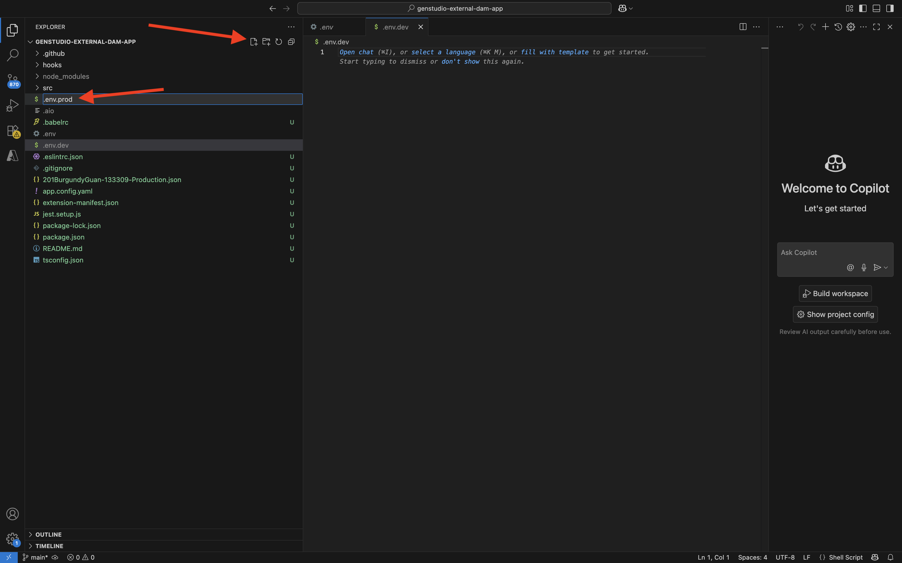

# 1.6.3 Externe DAM-App erstellen

## 1.6.3.1 Herunterladen von Beispiel-App-Dateien

Navigieren Sie zu [https://github.com/adobe/genstudio-extensibility-examples](https://github.com/adobe/genstudio-extensibility-examples). Klicken Sie auf **Code** und wählen Sie dann **ZIP herunterladen**.


Entpacken Sie die ZIP-Datei auf Ihrem Desktop.


Öffnen Sie den Ordner **genstudio-extensibility-samples-main**. Es werden mehrere Beispiel-Apps angezeigt. Das Programm, das für diese Übung interessant ist, ist **genstudio-external-dam-app**.

Kopieren Sie dieses Verzeichnis und fügen Sie es auf Ihrem Desktop ein.


Sie sollten dies jetzt auf Ihrem Desktop haben:


Für die nächsten Übungen verwenden Sie nur den Ordner **genstudio-external-dam-app**.

## 1.6.3.2 Konfigurieren der Adobe Developer-Befehlszeilenschnittstelle

Klicken Sie mit der rechten Maustaste auf den Ordner **genstudio-external-dam-app** und wählen Sie **Neues Terminal im Ordner**.


Sie sollten das dann sehen. Geben Sie den `aio login` ein. Dieser Befehl wird an Ihren Browser weitergeleitet und erwartet, dass Sie sich anmelden.


Nach erfolgreicher Anmeldung sollten Sie diese im Browser sehen.


Der Browser leitet dann zurück zum Terminal-Fenster. Sie sollten eine Meldung mit dem **„Anmeldung erfolgreich** und ein langes Token sehen, das vom Browser zurückgegeben wird.


Der nächste Schritt besteht darin, die Instanz und das Adobe IO-Projekt zu konfigurieren, die Sie für die externe DAM-App verwenden werden.

Dazu müssen Sie eine Datei aus dem zuvor konfigurierten Adobe IO-Projekt herunterladen.

Wechseln Sie zu [https://developer.adobe.com/console/home](https://developer.adobe.com/console/home){target="_blank"} und öffnen Sie das zuvor erstellte Projekt mit dem Namen `--aepUserLdap-- GSPeM EXT`. Öffnen Sie den **Produktions** Arbeitsbereich.


Klicken Sie **Alle herunterladen**. Dadurch wird eine JSON-Datei heruntergeladen.


Kopieren Sie die JSON **Datei aus dem** „Downloads“ in das Stammverzeichnis der externen DAM-App.


Zurück zum Terminal-Fenster. Geben Sie den `aio app use XXX-YYY-Production.json` ein.

>[!NOTE]
>
>Sie müssen den Dateinamen so ändern, dass er mit dem Namen Ihrer Datei übereinstimmt.

Sobald der Befehl ausgeführt wurde, wird Ihre externe DAM-App mit dem zuvor erstellten Adobe IO-Projekt mit App Builder verbunden.


## Installieren 1.6.3.3 GenStudio Extensibility SDK

Als Nächstes müssen Sie die **GenStudio Extensibility SDK** installieren. Weitere Informationen zur SDK finden Sie hier: [https://github.com/adobe/genstudio-extensibility-sdk](https://github.com/adobe/genstudio-extensibility-sdk).

Um SDK zu installieren, führen Sie diesen Befehl im Terminal-Fenster aus:

`npm install @adobe/genstudio-extensibility-sdk`


Nach einigen Minuten wird die SDK installiert.


## 1.6.3.4 Überprüfen der externen DAM-App in Visual Studio Code

Öffnen Sie Visual Studio Code. Klicken Sie **Öffnen…**, um einen Ordner zu öffnen.


Wählen Sie den Ordner **genstudio-external-dam-app** aus, der die zuvor heruntergeladene App enthält.


Klicken Sie, um die Datei **.env** zu öffnen.


Die Datei **.env** wurde vom `aio app use` erstellt, den Sie im vorherigen Schritt ausgeführt haben. Sie enthält die Informationen, die zum Herstellen einer Verbindung zu Ihrem Adobe IO-Projekt mit App Builder erforderlich sind.


Erstellen Sie nun zwei neue Dateien im Stammverzeichnis Ihres Ordners:

- `.env.dev`. Klicken Sie auf **Neue Datei** und geben Sie dann den `.env.dev` Dateinamen ein.


- `.env.prod`.  Klicken Sie auf **Neue Datei** und geben Sie dann den `.env.prod` Dateinamen ein.



Diese Dateien enthalten die Anmeldeinformationen, die zum Herstellen einer Verbindung mit dem zuvor erstellten AWS S3-Bucket erforderlich sind.

```
AWS_ACCESS_KEY_ID=
AWS_SECRET_ACCESS_KEY=
AWS_REGION=
AWS_BUCKET_NAME=
```

Die Felder **AWS_ACCESS_KEY_ID** und **AWS_SECRET_ACCESS_KEY** waren verfügbar, nachdem der IAM-Benutzer in der vorherigen Übung erstellt wurde. Sie wurden gebeten, sie aufzuschreiben. Sie können jetzt die Werte kopieren.


Das Feld **AWS_REGION** kann aus der AWS S3-Startansicht neben Ihrem -Behälternamen entnommen werden. In diesem Beispiel lautet die Region **us-west-2**.


Das Feld **AWS_BUCKET_NAME** sollte `--aepUserLdap---gspem-dam` sein.

Mit diesen Informationen können Sie die Werte der einzelnen Variablen aktualisieren.

```
AWS_ACCESS_KEY_ID=XXX
AWS_SECRET_ACCESS_KEY=YYY
AWS_REGION=us-west-2
AWS_BUCKET_NAME=--aepUserLdap---gspem-dam
```

Sie sollten diesen Text nun in beide Dateien, `.env.dev` und `.env.prod`, einfügen. Vergessen Sie nicht, Ihre Änderungen zu speichern.


Gehen Sie dann zurück zu Ihrem Terminal-Fenster. Führen Sie diesen Befehl aus:

`export $(grep -v '^#' .env.dev | xargs)`


## 1.6.3.5 Ausführen einer externen DAM-App

Führen Sie im Terminal-Fenster den Befehl `aio app run` aus. Dies sollte dann nach 1-2 Minuten angezeigt werden.


## Nächste Schritte

Gehen Sie zu [Code bereitstellen und Ihre App privat veröffentlichen](./ex4.md){target="_blank"}

Zurück zu [GenStudio for Performance Marketing - Erweiterbarkeit](./genstudioext.md){target="_blank"}

Zurück zu [Alle Module](./../../../overview.md){target="_blank"}
