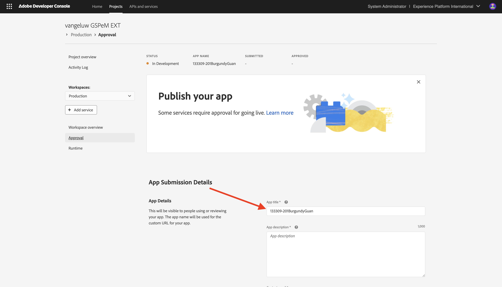
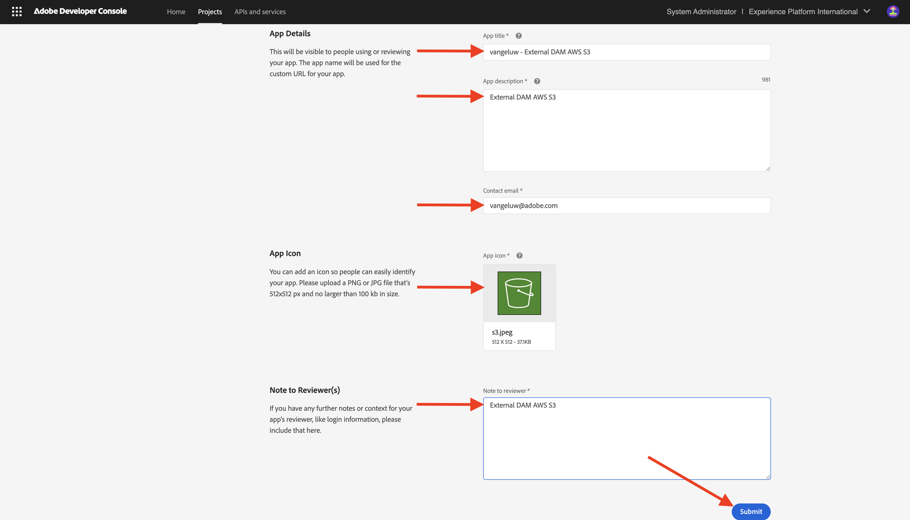

# 1.6.4 Bereitstellen des Codes und Privates Veröffentlichen der App

Wenn Sie Ihre App privat veröffentlichen, ist die App in GenStudio for Performance Marketing verfügbar, ohne den Abfragezeichenfolgenparameter verwenden zu müssen.

## 1.6.4.1 Veröffentlichen der App

Navigieren Sie zu [https://developer.adobe.com/console/projects](https://developer.adobe.com/console/projects){target="_blank"}.

>[!NOTE]
>
> Der folgende Screenshot zeigt, wie eine bestimmte Organisation ausgewählt wird. Wenn Sie dieses Tutorial durchlaufen, hat Ihre Organisation höchstwahrscheinlich einen anderen Namen. Wenn Sie sich für dieses Tutorial angemeldet haben, wurden Ihnen die zu verwendenden Umgebungsdetails zur Verfügung gestellt. Befolgen Sie bitte diese Anweisungen.

Öffnen Sie das Adobe IO-Projekt mit App Builder, dessen Name `--aepUserLdap-- GSPeM EXT` lauten sollte.

Wechseln Sie zu **Produktion**.

Klicken Sie **Privat veröffentlichen**.

Anschließend müssen Sie eine Reihe von Feldern ausfüllen.

Füllen Sie die folgenden Felder wie folgt aus:

- **App-**: `--aepUserLdap-- - External DAM AWS S3`.
- **App-Beschreibung**: `External DAM AWS S3`
- **Kontakt-E-**: Geben Sie Ihre E-Mail-Adresse ein
- **App-Symbol**: Dieses Bild herunterladen und verwenden: [S3-Bild](./images/s3.jpeg)
- **Hinweis für den Prüfer**: Externes DAM AWS S3

Klicken Sie auf **Senden**.

Klicken Sie auf **Senden**.

## 1.6.4.2 App genehmigen

Sobald ein Entwickler eine neue App zur Veröffentlichung einreicht, werden die Systemadministratoren Ihrer Organisation benachrichtigt und aufgefordert, sie zu überprüfen und zu genehmigen.

Wenn Sie Systemadministrator sind, erhalten Sie diese E-Mail und können dann auf &quot;**Exchange“ klicken** um diesen Prozess zu starten.

Auf **Adobe Exchange** werden die App Builder-Programme angezeigt und die soeben gesendete App wartet jetzt auf eine Überprüfung. Klicken Sie auf **Überprüfen**-Schaltfläche für die App-`--aepUserLdap-- - External DAM AWS S3`.

Fügen Sie einen Kommentar hinzu und klicken Sie auf **Genehmigen**.

Ihre App ist jetzt genehmigt und funktioniert automatisch in GenStudio for Performance Marketing, ohne dass der Abfragezeichenfolgenparameter angegeben werden muss.

## Nächste Schritte

Wechseln Sie zu [Zusammenfassung und Vorteile](./summary.md){target="_blank"}

Zurück zu [GenStudio for Performance Marketing - Erweiterbarkeit](./genstudioext.md){target="_blank"}

Zurück zu [Alle Module](./../../../overview.md){target="_blank"}
