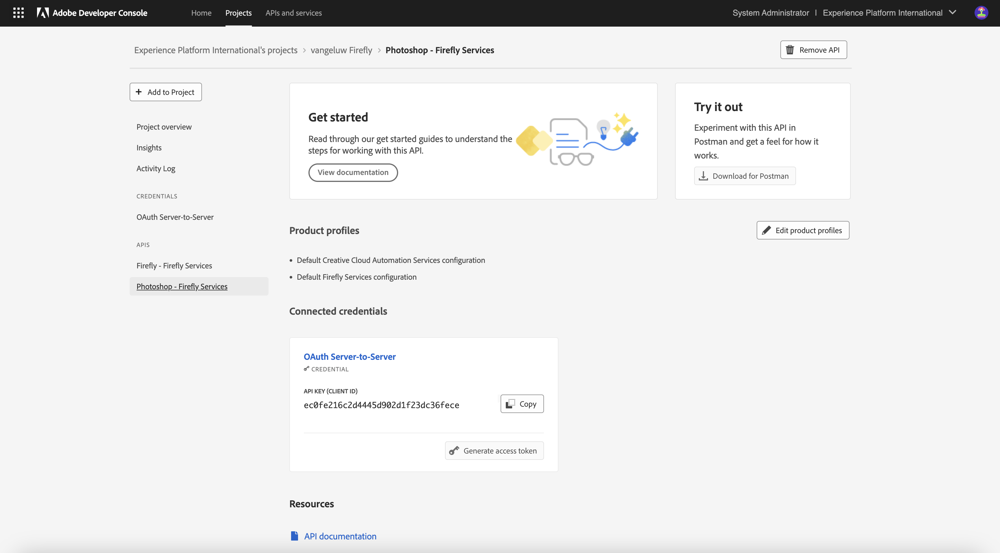

# 1.1.3 Adobe Firefly und Adobe Photoshop

## 1.1.3.1 Aktualisieren der Adobe I/O-Integration

Wechseln Sie zu [https://developer.adobe.com/console/home](https://developer.adobe.com/console/home)

Navigieren Sie **Projekte** und klicken Sie, um das in der vorherigen Übung erstellte Projekt mit dem Namen `--aepUserLdap-- Firefly` zu öffnen.

Klicken Sie auf **+ Zum Projekt hinzufügen** dann auf **API**.

Wählen Sie **Creative Cloud** und klicken Sie auf **Photoshop - Firefly Services**. Klicken Sie auf **Weiter**.

Klicken Sie auf **Weiter**.

Als Nächstes müssen Sie ein Produktprofil auswählen, das definiert, welche Berechtigungen für diese Integration verfügbar sind.

Wählen Sie das Profil **Standardkonfiguration für Firefly-**) und **Standardkonfiguration für Creative Cloud-Automatisierungsdienste** aus.

Klicken Sie **Konfigurierte API speichern**.

Ihr Adobe I/O-Projekt wurde jetzt aktualisiert, um mit Photoshop- und Firefly-Services-APIs arbeiten zu können.

## 1.1.3.2 …

Nächster Schritt:

[Zurück zum Modul 1.1](./firefly-services.md)

[Zurück zu „Alle Module“](./../../../overview.md)
