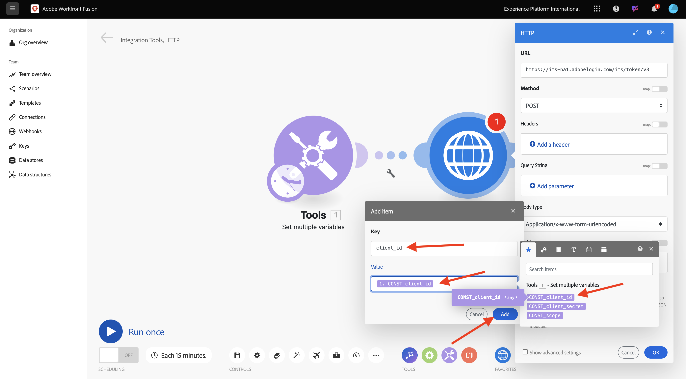
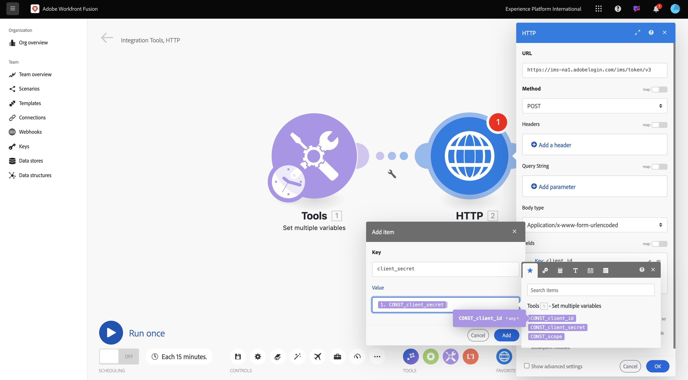

# 1.2.1 Erste Schritte mit Workfront Fusion

In dieser Übung verwenden Sie Workfront Fusion und Adobe I/O, um Adobe Firefly Services-APIs abzufragen.

## 1.2.1.1 Neues Szenario erstellen

Navigieren Sie zu [https://experience.adobe.com/](https://experience.adobe.com/). Klicken, um **Workfront Fusion** zu öffnen.

Sie sollten das dann sehen. Navigieren Sie zu **Szenarien**.

Klicken Sie auf das Symbol **+** , um einen neuen Ordner zu erstellen.

Verwenden Sie für den Ordnernamen: `--aepUserLdap--`. Klicken Sie auf **Speichern**.

Wählen Sie Ihren Ordner aus und klicken Sie dann auf **Neues Szenario erstellen**.

Anschließend sehen Sie ein leeres Szenario. Klicken Sie auf **tools** und wählen Sie **Mehrere Variablen festlegen** aus.

Jetzt müssen Sie das Symbol **Uhr** auf das neu hinzugefügte Symbol **Mehrere Variablen festlegen** verschieben.

Sie werden es dann sehen.

Klicken Sie dann mit der rechten Maustaste auf das Fragezeichen und wählen Sie **Modul löschen**.

Klicken Sie anschließend mit der rechten Maustaste auf das Objekt **Mehrere Variablen festlegen** und wählen Sie **Einstellungen** aus.

## 1.2.1.2 Konfigurieren der Adobe I/O-Authentifizierung

Nun müssen Sie die Variablen konfigurieren, die für die Authentifizierung beim Adobe I/O benötigt werden. In der vorherigen Übung haben Sie ein Adobe I/O-Projekt erstellt. Die Variablen dieses Adobe I/O-Projekts müssen jetzt in Workfront Fusion definiert werden.

Die folgenden Variablen müssen definiert werden:

| Schlüssel | Wert |
|:-------------:| :---------------:| 
| `CONST_client_id` | Ihre Adobe I/O-Projekt-Client-ID |
| `CONST_client_secret` | Ihr Adobe I/O-Projekt Client Secret |
| `CONST_scope` | Umfang Ihres Adobe I/O-Projekts |

Sie können diese Variablen finden, indem Sie zu [https://developer.adobe.com/console/projects wechseln ](https://developer.adobe.com/console/projects) Ihr Adobe I/O-Projekt öffnen, das `--aepUserLdap-- Firefly` heißt.

Klicken Sie in Ihrem Projekt auf **OAuth Server-zu-Server**, um die Werte für die oben genannten Schlüssel anzuzeigen.

Mit den obigen Schlüsseln und Werten können Sie das Objekt **Mehrere Variablen festlegen** konfigurieren. Klicken Sie **Element hinzufügen**.

Geben Sie den **Variablennamen**: **CONST_CLIENT_ID** und dessen **Variablenwert** ein und klicken Sie auf **Hinzufügen**.

Klicken Sie **Element hinzufügen**.

Geben Sie den **Variablennamen**: **CONST_CLIENT_SECRET** und dessen **Variablenwert** ein und klicken Sie auf **Hinzufügen**.

Klicken Sie **Element hinzufügen**.

Geben Sie den **Variablennamen**: **CONST_scope** und den **Variablenwert** ein und klicken Sie auf **Hinzufügen**.

Klicken Sie auf **OK**.

Bewegen Sie den Mauszeiger über Ihr **Mehrere Variablen festlegen**-Objekt und klicken Sie auf das große **+**-Symbol, um ein weiteres Modul hinzuzufügen.

Sie sollten das dann sehen.

Geben Sie in der Suchleiste &quot;**&quot;**. Wählen Sie **HTTP** aus, um es zu öffnen.

und wählen Sie dann **Anfrage stellen** aus.

| Schlüssel | Wert |
|:-------------:| :---------------:| 
| `URL` | `https://ims-na1.adobelogin.com/ims/token/v3` |
| `Method` | `POST` |
| `Body Type` | `x-www-form-urlencoded` |

Klicken Sie **Element hinzufügen**.

Fügen Sie Elemente für jeden der folgenden Werte hinzu:

| Schlüssel | Wert |
|:-------------:| :---------------:| 
| `client_id` | Ihre vordefinierte Variable für `CONST_client_id` |
| `client_secret` | Ihre vordefinierte Variable für `CONST_client_secret` |
| `scope` | Ihre vordefinierte Variable für `CONST_scope` |
| `grant_type` | `client_credentials` |

Konfiguration für `client_id`.

Konfiguration für `client_secret`.

Konfiguration für `scope`.

Konfiguration für `grant_type`.

Konfigurationsübersicht. Scrollen Sie nach unten und aktivieren Sie das Kontrollkästchen für **Antwort analysieren**. Klicken Sie auf **OK**.

Sie sollten das dann sehen. Klicken Sie **Einmal ausführen**.

Sobald das Szenario ausgeführt wurde, sollte Folgendes angezeigt werden.

Klicken Sie auf das **Fragezeichen** auf dem Objekt **Mehrere Variablen festlegen** um zu sehen, was bei der Ausführung dieses Objekts passiert ist.

Klicken Sie auf das **Fragezeichen** auf dem Objekt **HTTP -** ausführen“, um zu sehen, was beim Ausführen dieses Objekts passiert ist. In **OUTPUT** sehen Sie, dass das **access_token** von Adobe I/O zurückgegeben wird.

Bewegen Sie den Mauszeiger über **Objekt „HTTP -**&quot; und klicken Sie auf das Symbol **+** , um ein weiteres Modul hinzuzufügen.

Suchen Sie in der Suchleiste nach `tools`. Wählen Sie **Tools** aus.

Wählen Sie **Mehrere Variablen festlegen** aus.

Wählen Sie **Element hinzufügen** aus.

Legen Sie den **Variablennamen** auf `bearer_token` fest. Wählen Sie `access_token` als dynamischen **Variablenwert**. Klicken Sie auf **Hinzufügen**.

Sie sollten dann diese haben. Klicken Sie auf **OK**.

Klicken Sie **erneut auf &quot;** ausführen“.

Nachdem das Szenario ausgeführt wurde, klicken Sie auf das Symbol **Fragezeichen** im letzten Objekt **Mehrere Variablen festlegen**. Sie sollten dann sehen, dass das Zugriffs-Token in der Variablen `bearer_token` gespeichert wird.

Klicken Sie anschließend mit der rechten Maustaste auf das erste Objekt **Mehrere Werte festlegen** und wählen Sie **Umbenennen**.

Legen Sie den Namen auf **Initialisierungskonstanten** fest. Klicken Sie auf **OK**.

Benennen Sie das zweite Objekt um und legen Sie für den Namen **Authentifizieren für Adobe I/O** fest. Klicken Sie auf **OK**.

Benennen Sie das dritte Objekt um und setzen Sie den Namen auf **Bearer-Token festlegen**. Klicken Sie auf **OK**.

Sie sollten dann diese haben.

Ändern Sie als Nächstes den Namen Ihres Szenarios in `--aepUSerLdap-- - Adobe I/O Authentication`.

Klicken Sie auf **Speichern**.

Nächster Schritt: [1.2.2 Verwenden Sie Adobe-APIs in Workfront Fusion](./ex2.md)

[Zurück zum Modul 1.2](./automation.md)

[Zurück zu „Alle Module“](./../../../overview.md)
