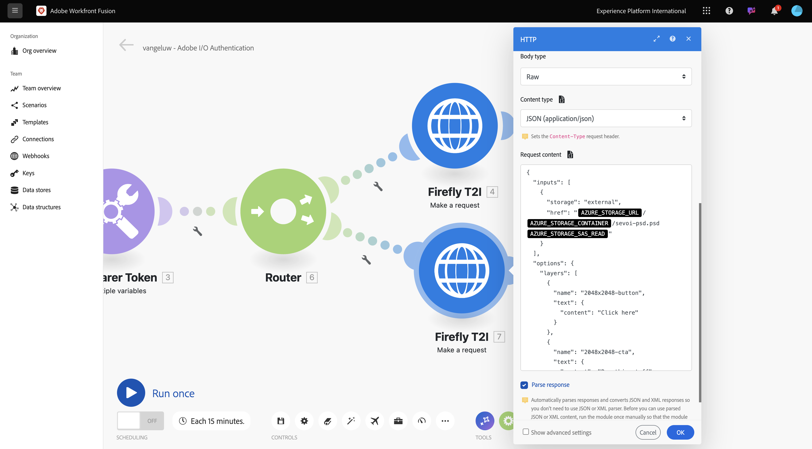
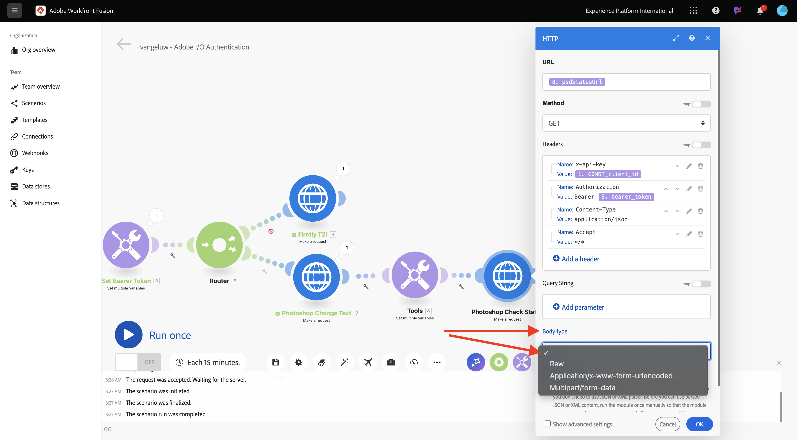
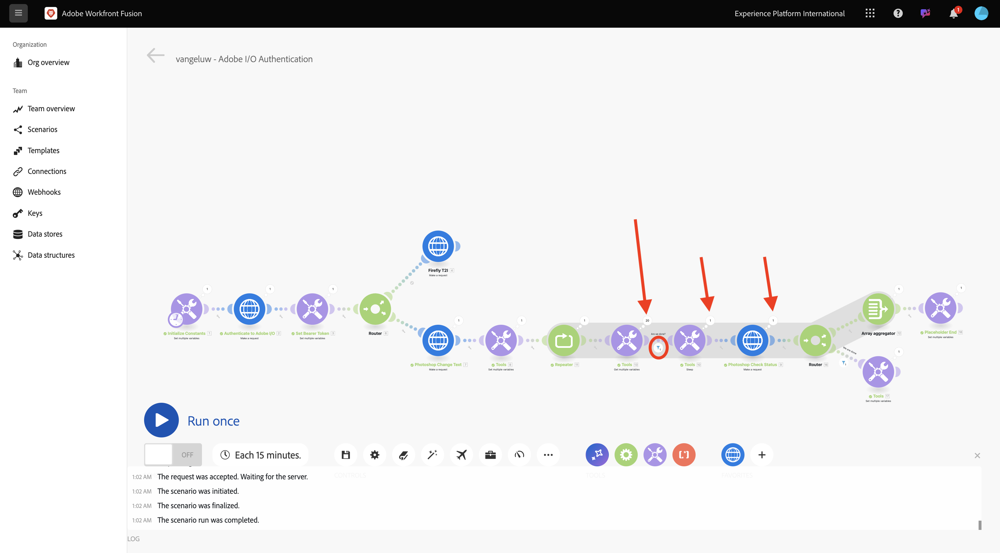

# 1.2.2 Verwenden von Adobe-APIs in Workfront Fusion

## 1.2.2.1 Verwenden der Firefly-Text-zu-Bild-API mit Workfront Fusion

Bewegen Sie den Mauszeiger über den zweiten Knoten **Mehrere Variablen festlegen** und klicken Sie auf **+**, um ein weiteres Modul hinzuzufügen.


Suchen Sie nach **http** und wählen Sie dann **HTTP** aus.


Wählen Sie **Anfrage stellen** aus.


Wählen Sie diese Variablen aus:

- **URL**: `https://firefly-api.adobe.io/v3/images/generate`
- **Methode**: `POST`

Klicken Sie **Kopfzeile hinzufügen**.


Sie müssen die folgenden Kopfzeilen eingeben:

| Schlüssel | Wert |
|:-------------:| :---------------:| 
| `x-api-key` | Ihre gespeicherte Variable für `CONST_client_id` |
| `Authorization` | `Bearer ` + Ihre gespeicherte Variable für `bearer_token` |
| `Content-Type` | `application/json` |
| `Accept` | `*/*` |

Geben Sie die Details für `x-api-key` ein. Klicken Sie auf **Hinzufügen**.


Klicken Sie **Kopfzeile hinzufügen**.


Geben Sie die Details für `Authorization` ein. Klicken Sie auf **Hinzufügen**.


Klicken Sie **Kopfzeile hinzufügen**. Geben Sie die Details für `Content-Type` ein. Klicken Sie auf **Hinzufügen**.


Klicken Sie **Kopfzeile hinzufügen**. Geben Sie die Details für `Accept` ein. Klicken Sie auf **Hinzufügen**.


Legen Sie **Body-Typ** auf **Raw** fest. Wählen **für &quot;**&quot; die Option **JSON (application/json)**.


Fügen Sie diese Payload in das Feld **Inhalt anfragen** ein.

```json
{
  "numVariations": 1,
  "size": {
    "width": 2048,
    "height": 2048
  },
  "prompt": "Horses in a field",
  "promptBiasingLocaleCode": "en-US"
}
```

Aktivieren Sie das Kontrollkästchen für **Antwort parsen**. Klicken Sie auf **OK**.


Klicken Sie **Einmal ausführen**.


Sobald Ihr Szenario ausgeführt wurde, sollten Sie dies sehen.


Auf die **klicken?** Symbol auf dem vierten Knoten, HTTP, um die Antwort anzuzeigen. In der Antwort sollte eine Bilddatei angezeigt werden.


Kopieren Sie die Bild-URL und öffnen Sie sie in einem Browser-Fenster. Sie sollten dann etwas wie das hier sehen:


Klicken Sie mit der rechten Maustaste auf **HTTP**-Objekt und benennen Sie es in **Firefly T2I** um.


Klicken Sie **Speichern**, um Ihre Änderungen zu speichern.


## 1.2.2.2 Verwenden der Photoshop-API mit Workfront Fusion

Klicken Sie auf das **Schraubenschlüssel**-Symbol zwischen den Knoten **Set Bearer Token** und **Firefly T2I**. Wählen Sie **Router hinzufügen**.


Klicken Sie mit der rechten Maustaste auf das **Firefly T2I**-Objekt und wählen Sie **Klonen**.


Ziehen Sie das geklonte Objekt in die Nähe des **Router**-Objekts, und es stellt automatisch eine Verbindung zum **Router** her. Sie sollten dann diese haben.


Sie verfügen jetzt über eine identische Kopie basierend auf der HTTP-Anfrage **Firefly T2I**. Einige der Einstellungen der **Firefly T2I**-HTTP-Anfrage entsprechen denen, die Sie für die Interaktion mit der **Photoshop-API** benötigen, was eine Zeitersparnis darstellt. Sie müssen jetzt nur die Variablen ändern, die nicht identisch sind, wie die Anfrage-URL und die Payload.

Ändern Sie die **URL** in `https://image.adobe.io/pie/psdService/text`.


Ersetzen Sie **Anfrageinhalt** durch die folgende Payload:

```json
{
  "inputs": [
    {
      "storage": "external",
      "href": "{{AZURE_STORAGE_URL}}/{{AZURE_STORAGE_CONTAINER}}/sevoi-psd.psd{{AZURE_STORAGE_SAS_READ}}"
    }
  ],
  "options": {
    "layers": [
      {
        "name": "2048x2048-button",
        "text": {
          "content": "Click here"
        }
      },
      {
        "name": "2048x2048-cta",
        "text": {
          "content": "Buy this stuff"
        }
      }
    ]
  },
  "outputs": [
    {
      "storage": "azure",
      "href": "{{AZURE_STORAGE_URL}}/{{AZURE_STORAGE_CONTAINER}}/sevoi-psd-changed-text.psd{{AZURE_STORAGE_SAS_WRITE}}",
      "type": "vnd.adobe.photoshop",
      "overwrite": true
    }
  ]
}
```


Damit dieser **Anfrageinhalt** ordnungsgemäß funktioniert, fehlen einige Variablen:

- `AZURE_STORAGE_URL`
- `AZURE_STORAGE_CONTAINER`
- `AZURE_STORAGE_SAS_READ`
- `AZURE_STORAGE_SAS_WRITE`

Gehen Sie zurück zu Ihrem ersten Knoten, klicken Sie auf **Konstanten initialisieren** und wählen Sie dann **Element hinzufügen** für jede dieser Variablen aus.


| Schlüssel | Beispielwert |
|:-------------:| :---------------:| 
| `AZURE_STORAGE_URL` | `https://vangeluw.blob.core.windows.net` |
| `AZURE_STORAGE_CONTAINER` | `vangeluw` |
| `AZURE_STORAGE_SAS_READ` | `?sv=2023-01-03&st=2025-01-13T07%3A36%3A35Z&se=2026-01-14T07%3A36%3A00Z&sr=c&sp=rl&sig=4r%2FcSJLlt%2BSt9HdFdN0VzWURxRK6UqhB8TEvbWkmAag%3D` |
| `AZURE_STORAGE_SAS_WRITE` | `?sv=2023-01-03&st=2025-01-13T17%3A21%3A09Z&se=2025-01-14T17%3A21%3A09Z&sr=c&sp=racwl&sig=FD4m0YyyqUj%2B5T8YyTFJDi55RiTDC9xKtLTgW0CShps%3D` |

Sie können Ihre Variablen finden, indem Sie zurück zu Postman gehen und Ihre **Umgebungsvariablen** öffnen.


Kopieren Sie diese Werte nach Workfront Fusion und fügen Sie für jede dieser vier Variablen ein neues Element hinzu.

Sie sollten dann diese haben. Klicken Sie auf **OK**.


Kehren Sie anschließend zur geklonten HTTP-Anfrage zurück, um den **Anfrageinhalt** zu aktualisieren. Diese schwarzen Variablen werden Sie im **Anfrageinhalt** bemerken, bei dem es sich um die Variablen handelt, die Sie aus Postman kopiert haben. Jetzt müssen Sie diese in die Variablen ändern, die Sie gerade in Workfront Fusion definiert haben. Ersetzen Sie jede Variable einzeln, indem Sie den schwarzen Text löschen und durch die richtige Variable ersetzen.



Im Abschnitt **Eingaben** sind drei Änderungen vorzunehmen.


Im Abschnitt **Ausgänge“ sind außerdem** Änderungen vorzunehmen. Klicken Sie auf **OK**.


Klicken Sie mit der rechten Maustaste auf den geklonten Knoten und wählen Sie **Umbenennen**. Ändern Sie den Namen in **Photoshop-Änderungstext**.


Sie sollten dann diese haben.


Klicken Sie **Einmal ausführen**.


Klicken Sie auf das **search**-Symbol im Knoten **Photoshop-**, um die Antwort anzuzeigen. Sie sollten über eine Antwort verfügen, die wie folgt aussieht, mit einem Link zu einer Statusdatei.


Bevor wir mit den Photoshop-API-Interaktionen fortfahren, deaktivieren wir die Route zum Knoten **Firefly T2I**, um nicht benötigte API-Aufrufe an diesen API-Endpunkt zu senden. Klicken Sie auf **Schraubenschlüssel** und wählen Sie dann **Route deaktivieren** aus.


Sie sollten dann diese haben.


Fügen Sie als Nächstes einen weiteren Knoten **Mehrere Variablen festlegen** hinzu.


Platzieren Sie sie nach dem Knoten **Photoshop-**:


Klicken Sie auf **Knoten „Mehrere Variablen festlegen** und wählen Sie **Element hinzufügen** aus. Wählen Sie den Variablenwert aus der Antwort der vorherigen Anfrage aus.

| Variablenname | Variablenwert |
|:-------------:| :---------------:| 
| `psdStatusUrl` | `data > _links > self > href` |

Klicken Sie auf **Hinzufügen**.


Klicken Sie auf **OK**.


Klicken Sie mit der rechten Maustaste auf den Knoten **Photoshop**&#x200B;Änderungstext“ und wählen Sie **Klonen**.


Ziehen Sie die geklonte HTTP-Anfrage nach dem Knoten **Mehrere Variablen festlegen** den Sie gerade erstellt haben.


Klicken Sie mit der rechten Maustaste auf die geklonte HTTP-Anfrage, wählen Sie **Umbenennen** und ändern Sie den Namen in **Photoshop-Prüfungsstatus**.


Klicken Sie, um die HTTP-Anfrage zu öffnen. Ändern Sie die URL so, dass sie auf die Variable verweist, die Sie im vorherigen Schritt erstellt haben, und setzen Sie **Methode** auf **GET**.


Entfernen Sie den **Hauptteil**, indem Sie die leere Option auswählen.



Klicken Sie auf **OK**.


Klicken Sie **Einmal ausführen**.


Sie sollten dann eine -Antwort erhalten, die das Feld **status** enthält, wobei der Status auf &quot;**&quot;**. Photoshop braucht einige Sekunden, um den Vorgang abzuschließen.


Da Sie nun wissen, dass die Antwort etwas mehr Zeit benötigt, um abgeschlossen zu werden, kann es eine gute Idee sein, vor dieser HTTP-Anfrage einen Timer hinzuzufügen, damit sie nicht sofort ausgeführt wird.

Klicken Sie auf den **Tools**-Knoten und wählen Sie dann **Sleep** aus.


Positionieren Sie den **Sleep**-Knoten zwischen **Mehrere Variablen festlegen** und **Photoshop-**. Stellen Sie die **Verzögerung** auf **5** Sekunden ein. Klicken Sie auf **OK**.


Dann hast du das hier. Die Herausforderung bei der folgenden Konfiguration besteht darin, dass 5 Sekunden warten vielleicht genug ist, aber vielleicht nicht genug. In Wirklichkeit wäre es besser, eine intelligentere Lösung wie eine do…while-Schleife zu haben, die den Status alle 5 Sekunden prüft, bis der Status gleich ist **erfolgreich**. Sie werden eine solche Taktik jetzt in den nächsten Schritten implementieren.


Klicken Sie auf das **Schraubenschlüssel**-Symbol zwischen **Mehrere Variablen festlegen** und **Sleep**. Wählen Sie **Modul hinzufügen** aus.


Suchen Sie nach `flow` und wählen Sie **Flusssteuerung** aus.


Wählen Sie **Repeater** aus.


Stellen Sie den **Repeats** auf **20** ein. Klicken Sie auf **OK**.


Klicken Sie anschließend auf **+** auf der **Photoshop-**, um ein weiteres Modul hinzuzufügen.


Suchen Sie nach **flow** und wählen Sie **Fluss-Steuerung** aus.


Wählen Sie **Array-Aggregator** aus.


Setzen Sie **Source Module** auf **Repeater**. Klicken Sie auf **OK**.


Sie sollten dann Folgendes haben:


Klicken Sie auf das **Schraubenschlüssel**-Symbol und wählen Sie **Modul hinzufügen**.


Suchen Sie nach **tools** und wählen Sie **Tools** aus.


Wählen Sie **Mehrere Variablen abrufen**.


Klicken Sie auf **+ Element** und legen Sie **Variablenname** auf `done` fest.


Klicken Sie auf **OK**.


Klicken Sie auf **Knoten „Mehrere Variablen festlegen** den Sie zuvor konfiguriert haben. Um die Variable zu initialisieren **Done** müssen Sie sie hier auf `false` setzen. Klicken Sie auf **+ Element hinzufügen**.


Verwenden Sie `done` für **Variablennamen**. Zum Festlegen des Status ist ein boolescher Wert erforderlich. Um den booleschen Wert zu finden, klicken Sie auf das **Zahnradsymbol** und wählen Sie dann `false` aus. Klicken Sie auf **Hinzufügen**.


Klicken Sie auf **OK**.


Klicken Sie anschließend auf das **Schraubenschlüssel**-Symbol nach dem **Abrufen mehrerer**&quot;, den Sie konfiguriert haben.


Wählen Sie **Filter einrichten** aus. Jetzt müssen Sie den Wert der Variablen (**)**. Wenn dieser Wert auf **false** gesetzt ist, muss der nächste Teil der Schleife ausgeführt werden. Wenn der Wert auf **true** festgelegt ist, bedeutet dies, dass der Prozess bereits erfolgreich abgeschlossen wurde, sodass es nicht erforderlich ist, mit dem nächsten Teil der Schleife fortzufahren.


Verwenden Sie für die Bezeichnung **Sind wir fertig?**. Legen Sie die **Bedingung** mithilfe der bereits vorhandenen Variable **Done** fest. Der Operator sollte auf **Gleich** festgelegt werden und der Wert sollte die boolesche Variable `false` sein. Klicken Sie auf **OK**.


Nehmen Sie als Nächstes etwas Platz zwischen den Knoten **Photoshop-** und **Array-Aggregator**. Klicken Sie dann auf das **Schraubenschlüssel**-Symbol und wählen Sie **Router hinzufügen** aus. Dies liegt daran, dass es nach der Überprüfung des Status der Photoshop-Datei zwei Pfade geben sollte. Wenn der Status `succeeded` ist, sollte die Variable **done** auf `true` gesetzt werden. Wenn der Status nicht gleich `succeeded` ist, sollte die Schleife fortgesetzt werden. Der Router ermöglicht es, dies zu überprüfen und einzustellen.


Klicken Sie nach dem Hinzufügen des Routers auf **Schraubenschlüssel** und wählen Sie **Filter einrichten** aus.


Verwenden Sie für die Bezeichnung **Wir sind fertig**. Legen Sie die **Bedingung** mithilfe der Antwort des Knotens **Photoshop-** fest, indem Sie das Antwortfeld **data.output[].status** auswählen. Der Operator sollte auf **Gleich** gesetzt und der Wert sollte `succeeded` werden. Klicken Sie auf **OK**.


Klicken Sie anschließend auf den leeren Knoten mit dem Fragezeichen und suchen Sie nach **tools**. Wählen Sie dann **Tools** aus.


Wählen Sie **Mehrere Variablen festlegen** aus.


Wenn diese Verzweigung des Routers verwendet wird, bedeutet dies, dass die Erstellung der Photoshop-Datei erfolgreich abgeschlossen wurde. Das bedeutet, dass die do…while-Schleife nicht mehr mit der Überprüfung des Status in Photoshop fortfahren muss, sodass die Variable `done` auf `true` gesetzt werden sollte.

Verwenden Sie `done` für **Variablennamen**. Für den **Variablenwert** sollten Sie den booleschen `true` verwenden. Klicken Sie auf **Zahnrad** und wählen Sie dann `true` aus. Klicken Sie auf **Hinzufügen**.


Klicken Sie auf **OK**.


Klicken Sie anschließend mit der rechten Maustaste auf den **Mehrere Variablen festlegen** Knoten, den Sie gerade erstellt haben, und wählen Sie **Klonen**.


Ziehen Sie den geklonten Knoten, sodass er eine Verbindung mit dem **Array-Aggregator)**. Klicken Sie anschließend mit der rechten Maustaste auf den Knoten und wählen **Umbenennen**, und ändern Sie den Namen in `Placeholder End`.


Entfernen Sie die vorhandene Variable und klicken Sie auf **+ Element hinzufügen**. Verwenden Sie für **Variablenname** den `placeholder`, für den **Variablenwert** den `end`. Klicken Sie auf **Hinzufügen** und dann auf **OK**.


Klicken Sie auf **Speichern**, um Ihr Szenario zu speichern. Klicken Sie anschließend auf **Einmal ausführen**.


Ihr Szenario wird dann ausgeführt und sollte erfolgreich abgeschlossen werden. Sie werden feststellen, dass die von Ihnen konfigurierte do…while-Schleife einwandfrei funktionierte. In der folgenden Ausführung sehen Sie, dass der **Repeater** basierend auf der Sprechblase im Knoten **Tools > Mehrere Variablen abrufen** 20 Mal ausgeführt wurde. Nach diesem Knoten haben Sie einen Filter konfiguriert, der den Status überprüft, und nur wenn der Status nicht **Erfolgreich** war, wurden die nächsten Knoten ausgeführt. In diesem Durchgang wurde das Teil nach dem Filter nur einmal ausgeführt, da der Status bereits **ersten Durchgang** erfolgreich“ war.



Sie können den Erstellungsstatus Ihrer neuen Photoshop-Datei überprüfen, indem Sie auf die Schaltfläche für die **HTTP-Anfrage zur** des Photoshops klicken und nach unten zum Feld **status** bohren.


Sie haben jetzt die Basisversion eines wiederholbaren Szenarios konfiguriert, das eine Reihe von Schritten automatisiert. In der nächsten Übung werden Sie dies durchlaufen, indem Sie Komplexität hinzufügen.

Nächster Schritt: [1.2.3 Prozessautomatisierung mit Workfront Fusion](./ex3.md)

[Zurück zum Modul 1.2](./automation.md)

[Zurück zu „Alle Module“](./../../../overview.md)
