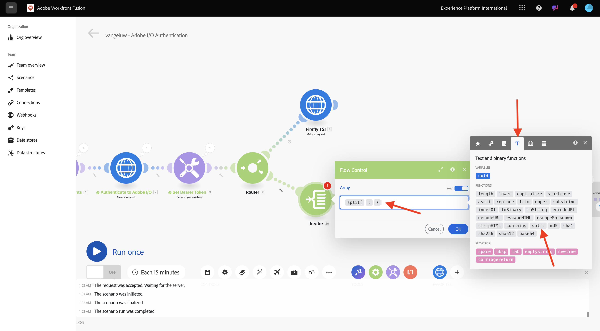

# 1.2.3 Prozessautomatisierung mit Workfront Fusion

Ihr Szenario sieht nun wie folgt aus:


## Iteration über mehrere Werte 1.2.3.1

Bisher haben Sie Text in einer Photoshop-Datei um einen statischen Wert geändert. Um Ihre Workflows zur Inhaltserstellung zu skalieren und zu automatisieren, müssen Sie eine Liste von Werten durchlaufen und diese Werte dynamisch in die Photoshop-Datei einfügen. In den nächsten Schritten fügen Sie hinzu, dass in Ihrem vorhandenen Szenario die Werte durchlaufen werden sollen.

Klicken Sie zwischen dem Knoten **Router** und dem Knoten **Photoshop Change Text** auf das Symbol **Schraubenschlüssel** und wählen Sie **Modul hinzufügen**.


Suchen Sie nach `flow` und wählen Sie **Flusssteuerung** aus.


Wählen Sie **Iterator** aus.


Sie sollten dann diese haben.


Es ist zwar möglich, Eingabedateien wie CSV-Dateien zu lesen, aber Sie müssen zunächst eine einfache Version einer CSV-Datei verwenden, indem Sie eine Textzeichenfolge definieren und diese Textdatei aufteilen.

Die Funktion **Aufspaltung** finden Sie, indem Sie auf das Symbol **T** klicken, wo alle verfügbaren Funktionen zum Bearbeiten von Textwerten angezeigt werden. Klicken Sie auf **Funktion** Aufspaltung“, und Sie sollten dies dann sehen.



Die Aufspaltungsfunktion erwartet ein Array von Werten vor dem Semikolon und erwartet, dass Sie das Trennzeichen nach dem Semikolon angeben. Für diesen Test sollten Sie ein einfaches Array mit zwei Feldern verwenden: **Jetzt kaufen** und **Hier klicken** und das zu verwendende Trennzeichen ist **,**.

Geben Sie dies in das Feld **Array** ein, indem Sie die derzeit leere Funktion **split** ersetzen: `{{split("Buy now, Click here "; ",")}}`. Klicken Sie auf **OK**.


Ihr Iterator ist jetzt konfiguriert, und wenn Sie Ihr Szenario jetzt ausführen würden, würde er es zweimal ausführen. Es gibt jedoch noch ein Problem, da Sie derzeit statische Werte in Ihrem **Photoshop-Änderungstext**-Knoten verwenden. Klicken Sie auf **Photoshop**&#x200B;Änderungstext, um für die Eingabe- und Ausgabefelder einige Variablen anstelle von statischen Werten hinzuzufügen.


Im **Inhalt anfragen** wird der Text angezeigt (**hier klicken**. Dieser Text muss durch die Werte aus Ihrem -Array ersetzt werden.


Löschen Sie den Text **Hier klicken** und ersetzen Sie ihn, indem Sie die Variable **Wert** im Knoten **Iterator** auswählen. Dadurch wird sichergestellt, dass der Text auf der Schaltfläche in Ihrem Photoshop-Dokument dynamisch aktualisiert wird.


Sie müssen auch den Dateinamen aktualisieren, der zum Schreiben der Datei in Ihr Azure-Speicherkonto verwendet wird. Wenn der Dateiname statisch ist, überschreibt jede neue Iteration einfach die vorherige Datei und als solche verlieren Sie die angepassten Dateien. Der aktuelle statische Dateiname lautet **sevoi-psd-changed-text.psd**, und Sie müssen ihn jetzt aktualisieren. Setzen Sie den Cursor hinter das Wort `text`.


Fügen Sie zunächst einen `-` mit Bindestrichen hinzu und wählen Sie dann den Wert **Bundle Order Position**. Dadurch wird sichergestellt, dass Workfront Fusion bei der ersten Iteration `-1` zum Dateinamen hinzufügt, bei der zweiten Iteration `-2`. Klicken Sie auf **OK**.


Speichern Sie Ihr Szenario und klicken Sie dann auf **Einmal ausführen**.


Sobald das Szenario ausgeführt wurde, kehren Sie zu Ihrem Azure Storage-Explorer zurück und aktualisieren Sie den Ordner . Anschließend sollten die beiden neu erstellten Dateien angezeigt werden.


Laden Sie jede Datei herunter und öffnen Sie sie. Sie sollten dann die verschiedenen Texte auf den Schaltflächen sehen. Dies ist die Datei `sevoi-psd-changed-text-1.psd`.


Dies ist die Datei `sevoi-psd-changed-text-2.psd`.


## 1.2.3.2 des aktiven Szenarios mithilfe eines Webhooks

Bisher haben Sie Ihr Szenario zum Testen manuell ausgeführt. Aktualisieren wir nun Ihr Szenario mit einem Webhook, damit es von einer externen Umgebung aus aktiviert werden kann.

Klicken Sie auf das Symbol **+**, suchen Sie nach **Webhook** und wählen Sie **Webhooks** aus.


Wählen Sie **Benutzerdefinierter Webhook** aus.

Ziehen Sie den Knoten **Benutzerdefinierter Webhook** und verbinden Sie ihn, sodass er eine Verbindung mit dem ersten Knoten auf der Arbeitsfläche herstellt, der **Initialisierungskonstanten“**.


Klicken Sie auf **Knoten** Benutzerdefinierter Webhook“. Klicken Sie dann auf **Hinzufügen**.


Legen Sie den **Webhook-Namen** auf `--aepUserLdap-- - Tutorial 1.2` fest.


Aktivieren Sie das Kontrollkästchen für **Anfrage-Header abrufen**. Klicken Sie auf **Speichern**.


Ihre Webhook-URL ist jetzt verfügbar. Kopieren Sie die URL.


Öffnen Sie Postman und fügen Sie einen neuen Ordner in der Sammlung **FF - Firefly Services Tech Insiders** hinzu.


Benennen Sie den Ordner `--aepUserLdap-- - Workfront Fusion`.


Klicken Sie in dem soeben erstellten Ordner auf die 3 Punkte **…** und wählen Sie **Anfrage hinzufügen**.


Legen Sie **Methodentyp** auf **POST fest** fügen Sie die URL Ihres Webhooks in die Adressleiste ein.


Sie müssen einen benutzerdefinierten Hauptteil senden, damit die Variablenelemente von einer externen Quelle für Ihr Workfront Fusion-Szenario bereitgestellt werden können. Wechseln Sie zu **Textkörper** und wählen Sie **Roh** aus.


Fügen Sie den folgenden Text in den Textkörper Ihrer Anfrage ein. Klicken Sie auf **Senden**.

```json
{
    "psdTemplate": "placeholder",
    "xlsFile": "placeholder"
}
```


Zurück zu Workfront Fusion. Im Webhook wird jetzt eine Meldung angezeigt, die lautet: **Erfolgreich ermittelt**.


Klicken Sie auf **Speichern** und dann auf **Einmal ausführen**. Ihr Szenario ist jetzt aktiv, wird aber erst ausgeführt, wenn Sie in Postman erneut **Senden** klicken.


Wechseln Sie zu Postman und klicken Sie erneut **Senden**.


Ihr Szenario wird dann erneut ausgeführt und die beiden Dateien werden wie zuvor erstellt.


Bevor Sie fortfahren, ändern Sie den Namen Ihrer Postman-Anfrage in `POST - Send Request to Workfront Fusion Webhook`.


Nächster Schritt: [Zusammenfassung und Vorteile](./summary.md)

[Zurück zum Modul 1.2](./automation.md)

[Zurück zu „Alle Module“](./../../../overview.md)
