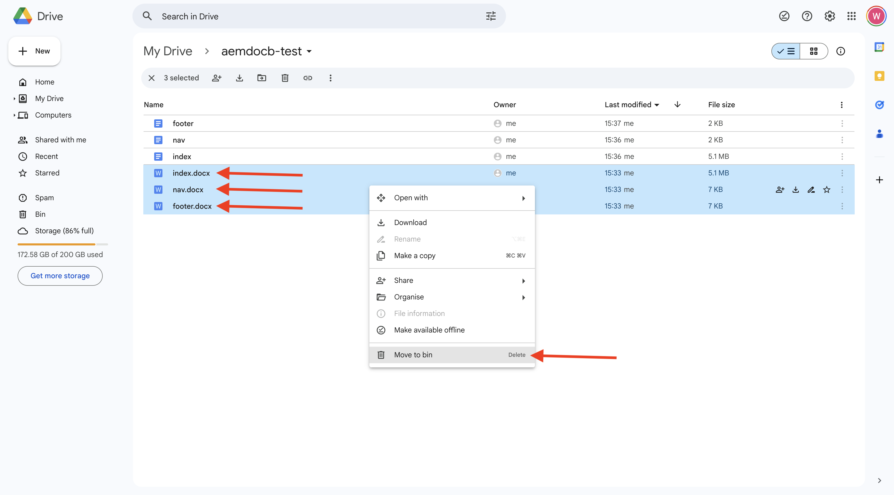
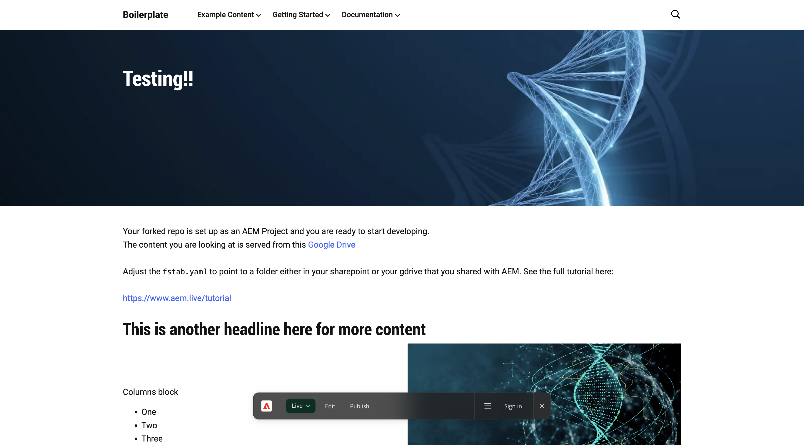

# 2.1.2 Erstellen einer dokumentbasierten Website

Während Sie auf die Erstellung Ihres Cloud Manager-Programms warten, haben Sie genügend Zeit, um Ihre erste dokumentbasierte Authoring-Website einzurichten. Die folgende Übung basiert auf dem [aem.live-Entwickler-Tutorial](https://www.aem.live/developer/tutorial){target="_blank"}. Gehen Sie wie folgt vor, um zu beginnen.

## 2.1.2.1 Einrichten des Google-Laufwerks

Navigieren Sie zu [https://drive.google.com](https://drive.google.com){target="_blank"}. Klicken Sie auf **+ Neu** dann auf **Neuer Ordner**.

Benennen Sie den Ordner `aemdocb-test`. Klicken Sie auf **Erstellen**.

Laden Sie die Datei [aemboilerplate.zip](./../../../assets/aem/aemboilerplate.zip){target="_blank"} herunter und extrahieren Sie sie auf Ihrem Computer.

In diesem Ordner werden 3 Dateien angezeigt. Kopieren Sie diese Dateien in den neuen Google Drive-Ordner.

Jetzt müssen Sie diese Dateien in eine native Google-Datei konvertieren. Öffnen Sie dazu jede Datei und navigieren Sie zu **Datei** > **Als Google Docs speichern**.

Dies sollten Sie für alle drei Dateien tun. Danach werden 6 Dateien in Ihrem Google Drive-Ordner angezeigt.

Sie haben dies dann in Ihrem Ordner.

Damit die dokumentbasierte Authoring-Demo funktioniert, müssen Sie jetzt Ihren Google Drive-Ordner mit der E-Mail-Adresse **helix@adobe.com** freigeben. Klicken Sie auf Ihren Ordnernamen, klicken Sie auf **Freigeben** und klicken Sie dann erneut **Freigeben**.

helix@adobe.com Geben Sie die E-Mail-Adresse **** ein und klicken Sie auf **Senden**.

Kopieren Sie als Nächstes die URL Ihres Google Drive-Ordners und schreiben Sie sie auf, da Sie sie in der nächsten Übung benötigen werden. Klicken Sie auf den Ordnernamen, auf **Freigeben** und dann auf **Link kopieren**.

`https://drive.google.com/drive/folders/1PNIOFeptIfszSebawT-Y_bwB4_anQWk5?usp=drive_link`

Sie sollten den Abfragezeichenfolgenparameter `?usp=drive_link` entfernen, sodass die URL wie folgt aussehen sollte:

`https://drive.google.com/drive/folders/1PNIOFeptIfszSebawT-Y_bwB4_anQWk5`

## 2.1.2.2 Einrichten des GitHub-Repositorys

Navigieren Sie zu [https://github.com](https://github.com){target="_blank"}. Klicken Sie auf **Anmelden**.

Geben Sie Ihre Anmeldedaten ein. Klicken Sie auf **Anmelden**.

Nach der Anmeldung sehen Sie Ihr GitHub-Dashboard.

Navigieren Sie zu [https://github.com/adobe/aem-boilerplate](https://github.com/adobe/aem-boilerplate){target="_blank"}. Sie werden es dann sehen. Klicken Sie **Diese Vorlage verwenden** und anschließend auf **Neues Repository erstellen**.

Für den **Repository-Namen** verwenden Sie `aemdocb-test`. Setzen Sie die Sichtbarkeit auf **Privat**. Klicken Sie **Repository erstellen**.

Nach einigen Sekunden wird dann Ihr Repository erstellt.

Navigieren Sie anschließend zu [https://github.com/apps/aem-code-sync](https://github.com/apps/aem-code-sync){target="_blank"}. Klicken Sie **Konfigurieren**.

Klicken Sie auf Ihr GitHub-Konto.

Klicken Sie **Nur Repositorys auswählen** und fügen Sie dann das soeben erstellte Repository hinzu. Klicken Sie anschließend auf **Installieren**.

Sie erhalten dann diese Bestätigung.

## 2.1.2.3 Aktualisierungsdatei fstab.yaml

Klicken Sie in Ihrem GitHub-Repository auf , um die Datei `fstab.yaml` zu öffnen.

Klicken Sie auf **Symbol** Bearbeiten“.

Jetzt müssen Sie den Wert für das Feld (URL **in** 2 aktualisieren.

Sie müssen den aktuellen Wert durch die URL Ihrer spezifischen AEM CS-Umgebung in Kombination mit den Einstellungen Ihres GitHub-Repositorys ersetzen.

Dies ist der aktuelle Wert der URL: `https://drive.google.com/drive/u/0/folders/1MGzOt7ubUh3gu7zhZIPb7R7dyRzG371j`.

Ersetzen Sie diesen Wert durch die URL, die Sie `https://drive.google.com/drive/folders/1PNIOFeptIfszSebawT-Y_bwB4_anQWk5` aus Ihrem Google-Laufwerksordner kopiert haben. Klicken Sie **Änderungen übernehmen…**.

Klicken Sie **Änderungen übernehmen**.

## 2.1.2.4 Installieren der AEM Sidekick-Erweiterung

Navigieren Sie zu [https://chromewebstore.google.com/detail/aem-sidekick/ccfggkjabjahcjoljmgmklhpaccedipo](https://chromewebstore.google.com/detail/aem-sidekick/ccfggkjabjahcjoljmgmklhpaccedipo){target="_blank"}. Klicken Sie **Zu Chrome hinzufügen**.

Die Erweiterung **AEM Sidekick** anheften.

## 2.1.2.5 der Vorschau und Publish Ihrer dokumentbasierten Website

Kehren Sie zu Ihrem Google Drive-Ordner zurück. Klicken Sie in der Taskleiste auf die Erweiterung **AEM Sidekick**. Daraufhin wird ein Popup mit einer AEM Sidekick-Leiste in Ihrem Ordner angezeigt.

Wählen Sie die drei Dateien in Ihrem Google Drive-Ordner aus. Klicken Sie auf **Vorschau**.

Klicken **erneut auf** Vorschau“.

Klicken, um das grüne Dialogfeld zu schließen.

Wählen Sie die drei Dateien in Ihrem Google Drive-Ordner erneut aus. Klicken Sie jetzt auf **Publish**.

Klicken Sie auf **Veröffentlichen**.

Klicken, um das grüne Dialogfeld wieder zu schließen. Wählen Sie nun die Datei **index**, klicken Sie auf **URLs kopieren** und klicken Sie dann auf **Live-URLs kopieren**.

Die kopierte URL sieht wie folgt aus: `https://main--aemdocb-test--woutervangeluwe.aem.live/`.

In der obigen URL:

- **main** bezieht sich auf die Verzweigung in Ihrem GitHub-Repository
- **aemdocb-test** bezieht sich auf den GitHub-Repository-Namen
- **wouterVangeluwe** bezieht sich auf den Namen des GitHub-Benutzerkontos
- **.live:** auf die Live-Umgebung Ihrer AEM-Instanz
- Sie können **.live** durch **.page ersetzen** um die Vorschauumgebung Ihrer AEM-Instanz zu öffnen

Öffnen Sie ein neues Browser-Fenster und navigieren Sie zur URL.

## 2.1.2.6 Nehmen Sie eine Änderung vor und veröffentlichen Sie Ihre Änderung

Kehren Sie zu Ihrem Google-Laufwerk zurück und öffnen Sie den Filter **index** in Google.

Ersetzen Sie den **Test** durch einen beliebigen anderen Text. Klicken Sie auf **Vorschau**.

Die Vorschauversion Ihrer Website wird dann geöffnet. Überprüfen Sie Ihre Änderung und klicken Sie auf **Publish**.

Anschließend wird die Live-Version Ihrer Website angezeigt.

Die obige Übung war eine gute Möglichkeit, um loszulegen und das dokumentenbasierte Authoring selbst zu erleben. Sie können jetzt mit der nächsten Übung fortfahren, in der Sie Ihre eigene Demo-Website mit CitiSignal als Demo-Marke einrichten.

Nächster Schritt: [2.1.3 Einrichten der AEM CS-Umgebung](./ex3.md){target="_blank"}

[Zurück zum Modul 2.1](./aemcs.md){target="_blank"}

[Zurück zu „Alle Module“](./../../../overview.md){target="_blank"}
