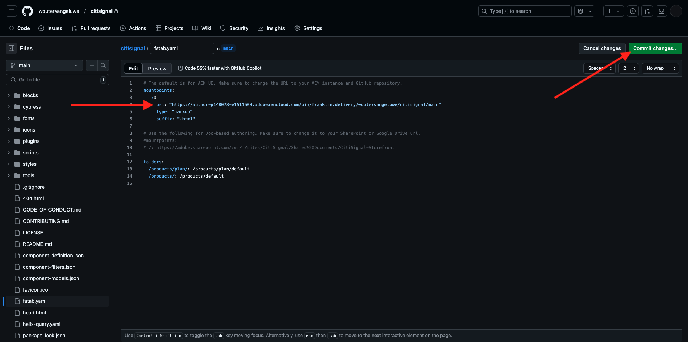
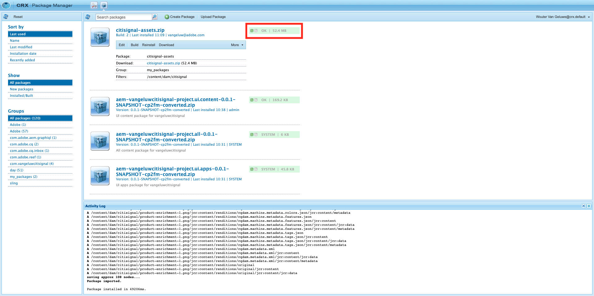
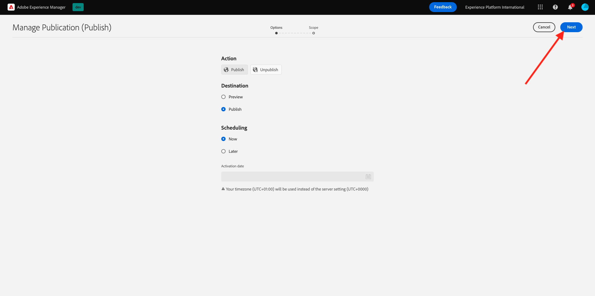
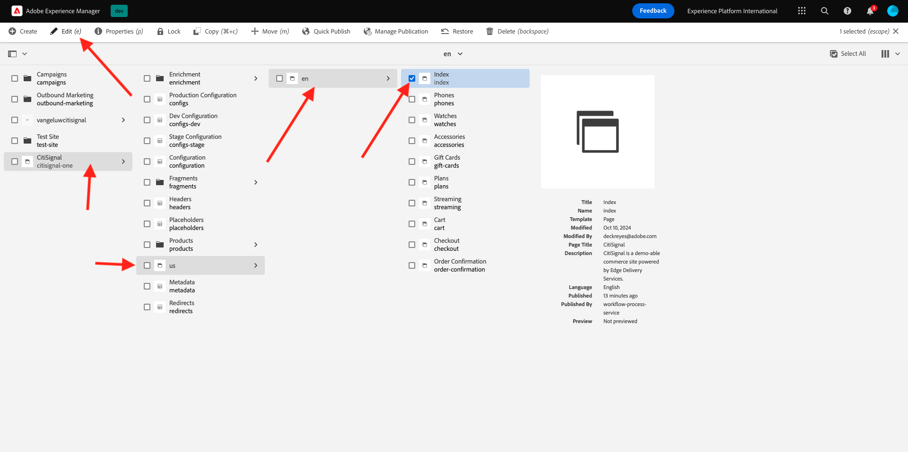

# 2.1.3 Einrichten der AEM CS-Umgebung

## 2.1.3.1 Einrichten des GitHub-Repositorys

Navigieren Sie zu [https://github.com](https://github.com){target="_blank"}. Klicken Sie auf **Anmelden**.

{zoomable="yes"}

Geben Sie Ihre Anmeldedaten ein. Klicken Sie auf **Anmelden**.

{zoomable="yes"}

Nach der Anmeldung sehen Sie Ihr GitHub-Dashboard.

{zoomable="yes"}

Navigieren Sie zu [https://github.com/AdobeDevXSC/citisignal-one](https://github.com/AdobeDevXSC/citisignal-one){target="_blank"}. Sie werden es dann sehen. Klicken Sie **Diese Vorlage verwenden** und anschließend auf **Neues Repository erstellen**.

{zoomable="yes"}

Für den **Repository-Namen** verwenden Sie `citisignal`. Setzen Sie die Sichtbarkeit auf **Privat**. Klicken Sie **Repository erstellen**.

{zoomable="yes"}

Nach einigen Sekunden wird dann Ihr Repository erstellt.

{zoomable="yes"}

Navigieren Sie anschließend zu [https://github.com/apps/aem-code-sync](https://github.com/apps/aem-code-sync){target="_blank"}. Klicken Sie **Konfigurieren**.

{zoomable="yes"}

Klicken Sie auf Ihr GitHub-Konto.

{zoomable="yes"}

Klicken Sie **Nur Repositorys auswählen** und fügen Sie dann das soeben erstellte Repository hinzu. Klicken Sie anschließend auf **Installieren**.

{zoomable="yes"}

Sie erhalten dann diese Bestätigung.

{zoomable="yes"}

## 2.1.3.2 Aktualisierungsdatei fstab.yaml

Klicken Sie in Ihrem GitHub-Repository auf , um die Datei `fstab.yaml` zu öffnen.

{zoomable="yes"}

Klicken Sie auf **Symbol** Bearbeiten“.

{zoomable="yes"}

Jetzt müssen Sie den Wert für das Feld (URL **in** 4 aktualisieren.

{zoomable="yes"}

Sie müssen den aktuellen Wert durch die URL Ihrer spezifischen AEM CS-Umgebung in Kombination mit den Einstellungen Ihres GitHub-Repositorys ersetzen.

Dies ist der aktuelle Wert der URL: `https://author-p131639-e1282833.adobeaemcloud.com/bin/franklin.delivery/adobedevxsc/citisignal-one/main`.

Es gibt drei Teile der URL, die aktualisiert werden müssen

`https://XXX/bin/franklin.delivery/YYY/ZZZ/main`

XXX sollte durch die URL Ihrer AEM CS Author-Umgebung ersetzt werden.

JJJJ sollte durch Ihr GitHub-Benutzerkonto ersetzt werden.

ZZZ sollte durch den Namen des GitHub-Repositorys ersetzt werden, das Sie in der vorherigen Übung verwendet haben.

Die URL Ihrer AEM CS-Autorenumgebung finden Sie unter [https://my.cloudmanager.adobe.com](https://my.cloudmanager.adobe.com){target="_blank"}. Klicken Sie auf **Programm**, um es zu öffnen.

{zoomable="yes"}

Klicken Sie anschließend auf der Registerkarte **Umgebungen** auf die **mit den drei Punkten** und anschließend auf **Details anzeigen**.

{zoomable="yes"}

Anschließend werden die Details Ihrer Umgebung angezeigt, einschließlich der URL Ihrer **Author**-Umgebung. Kopieren Sie die URL.

{zoomable="yes"}

XXX = `author-p148073-e1511503.adobeaemcloud.com`

Den Namen des GitHub-Benutzerkontos finden Sie leicht in der URL Ihres Browsers. In diesem Beispiel ist der Name des Benutzerkontos `woutervangeluwe`.

JJJJ = `woutervangeluwe`

{zoomable="yes"}

Den GitHub-Repository-Namen finden Sie auch im Browser-Fenster, das Sie in GitHub geöffnet haben. In diesem Fall ist der Repository-Name `citisignal`.

ZZZ = `citisignal`

{zoomable="yes"}

Diese drei Werte zusammen führen zu dieser neuen URL, die im `fstab.yaml` konfiguriert werden muss.

`https://author-p148073-e1511503.adobeaemcloud.com/bin/franklin.delivery/woutervangeluwe/citisignal/main`

Klicken Sie **Änderungen übernehmen…**.

{zoomable="yes"}

Klicken Sie **Änderungen übernehmen**.

{zoomable="yes"}

Die Datei `fstab.yaml` wurde aktualisiert.

## 2.1.3.3 Hochladen von CitiSignal-Assets

Navigieren Sie zu [https://my.cloudmanager.adobe.com](https://my.cloudmanager.adobe.com){target="_blank"}. Klicken Sie auf **Programm**, um es zu öffnen.

{zoomable="yes"}

Klicken Sie anschließend auf die URL Ihrer Autorenumgebung.

{zoomable="yes"}

Klicken Sie **Mit Adobe anmelden**.

{zoomable="yes"}

Anschließend wird Ihre Autorenumgebung angezeigt.

{zoomable="yes"}

Ihre URL sieht dann wie folgt aus: `https://author-p148073-e1511503.adobeaemcloud.com/ui#/aem/aem/start.html?appId=aemshell`

Sie müssen jetzt auf die Umgebung **CRX Package Manager** von AEM zugreifen. Entfernen Sie dazu `ui#/aem/aem/start.html?appId=aemshell` aus der URL und ersetzen Sie sie durch `crx/packmgr`. Ihre URL sollte jetzt wie folgt aussehen:
`https://author-p148073-e1511503.adobeaemcloud.com/crx/packmgr`.
Drücken Sie **Eingabetaste**, um die Package Manager-Umgebung zu laden

{zoomable="yes"}

Klicken Sie anschließend auf **Paket hochladen**.

{zoomable="yes"}

Klicken Sie **Durchsuchen**, um das hochzuladende Paket zu suchen.

Das Paket, das hochgeladen werden soll, heißt **Citisignal-assets.zip** und kann hier heruntergeladen werden: [https://tech-insiders.s3.us-west-2.amazonaws.com/one-adobe/citisignal-assets.zip](https://tech-insiders.s3.us-west-2.amazonaws.com/one-adobe/citisignal-assets.zip){target="_blank"}.

{zoomable="yes"}

Wählen Sie das Paket aus und klicken Sie auf **Öffnen**.

{zoomable="yes"}

Klicken Sie anschließend auf **OK**.

{zoomable="yes"}

Das Paket wird dann hochgeladen.

{zoomable="yes"}

Klicken Sie anschließend auf **Installieren** auf dem soeben hochgeladenen Paket.

{zoomable="yes"}

Klicken Sie auf **Installieren**.

{zoomable="yes"}

Nach einigen Minuten wird Ihr Paket installiert.

{zoomable="yes"}

Sie können dieses Fenster jetzt schließen.

## 2.1.3.4 von Publish CitiSignal-Assets

Navigieren Sie zu [https://my.cloudmanager.adobe.com](https://my.cloudmanager.adobe.com){target="_blank"}. Klicken Sie auf **Programm**, um es zu öffnen.

{zoomable="yes"}

Klicken Sie anschließend auf die URL Ihrer Autorenumgebung.

{zoomable="yes"}

Klicken Sie **Mit Adobe anmelden**.

{zoomable="yes"}

Anschließend wird Ihre Autorenumgebung angezeigt. Klicken Sie auf **Sites**.

{zoomable="yes"}

Klicken Sie auf **Dateien**.

{zoomable="yes"}

Klicken Sie auf den Ordner **CitiSignal** und dann auf **Veröffentlichung verwalten**.

{zoomable="yes"}

Klicken Sie auf **Weiter**.

{zoomable="yes"}

Klicken Sie auf **Veröffentlichen**.

{zoomable="yes"}

Ihre Assets wurden veröffentlicht.

## 2.1.3.5 Erstellen einer CitiSignal-Website

Navigieren Sie zu [https://my.cloudmanager.adobe.com](https://my.cloudmanager.adobe.com){target="_blank"}. Klicken Sie auf **Programm**, um es zu öffnen.

{zoomable="yes"}

Klicken Sie anschließend auf die URL Ihrer Autorenumgebung.

{zoomable="yes"}

Klicken Sie **Mit Adobe anmelden**.

{zoomable="yes"}

Anschließend wird Ihre Autorenumgebung angezeigt. Klicken Sie auf **Sites**.

{zoomable="yes"}

Klicken Sie auf **Erstellen** und dann auf **Site aus Vorlage**.

{zoomable="yes"}

Klicken Sie **Importieren**.

{zoomable="yes"}

Sie müssen jetzt eine vorkonfigurierte Vorlage für Ihre Site importieren. Sie können die Vorlage ([) ](./../../../assets/aem/citisignal-edge-delivery-services-template-0.0.4.zip){target="_blank"}. Speichern Sie die Datei auf Ihrem Desktop.

Wählen Sie als Nächstes die `citisignal-edge-delivery-services-template-0.0.4.zip` aus und klicken Sie auf **Öffnen**.

{zoomable="yes"}

Sie werden es dann sehen. Klicken Sie auf die gerade hochgeladene Vorlage, um sie auszuwählen, und klicken Sie dann auf **Weiter**.

{zoomable="yes"}

Nun müssen Sie einige Details ausfüllen.

- Site-Titel: Verwenden **CitiSignal**
- Site-Name: verwenden **Citisignal-One**
- GitHub-URL: Kopieren Sie die URL des GitHub-Repositorys, das Sie zuvor verwendet haben

{zoomable="yes"}

Dann hast du das hier. Klicken Sie auf **Erstellen**.

{zoomable="yes"}

Ihre Site wird jetzt erstellt. Dies kann einige Minuten dauern. Klicken Sie auf **OK**.

{zoomable="yes"}

Aktualisieren Sie Ihren Bildschirm nach einigen Minuten. Danach sehen Sie Ihre neu erstellte CitiSignal-Website.

{zoomable="yes"}

## 2.1.3.6 Publish CitiSignal-Website

Klicken Sie anschließend auf das Kontrollkästchen vor **CitiSignal**. Klicken Sie dann auf **Veröffentlichung verwalten**.

{zoomable="yes"}

Klicken Sie auf **Weiter**.

{zoomable="yes"}

Klicken Sie auf **Untergeordnete Einstellungen einschließen**.

{zoomable="yes"}

Aktivieren Sie das Kontrollkästchen **Untergeordnete Elemente einbeziehen** und heben Sie dann die Auswahl der anderen Kontrollkästchen auf. Klicken Sie auf **OK**.

{zoomable="yes"}

Klicken Sie auf **Veröffentlichen**.

{zoomable="yes"}

Sie werden dann hierher zurückgeschickt. Navigieren Sie **CitiSignal** > **us** > **en**. Aktivieren Sie das Kontrollkästchen vor **index** und klicken Sie dann auf **Bearbeiten**.

{zoomable="yes"}

Ihre Website wird dann im **universellen Editor** geöffnet.

{zoomable="yes"}

Sie können nun auf Ihre Website zugreifen, indem Sie zu `main--citisignal--XXX.aem.page/us/en` und/oder `main--citisignal--XXX.aem.live/us/en` wechseln, nachdem Sie XXX durch Ihr GitHub-Benutzerkonto ersetzt haben, was in diesem Beispiel `woutervangeluwe` ist.

In diesem Beispiel lautet die vollständige URL wie folgt:
`https://main--citisignal--woutervangeluwe.aem.page/us/en` und/oder `https://main--citisignal--woutervangeluwe.aem.live/us/en`.

Es kann einige Zeit dauern, bis alle Assets korrekt angezeigt werden, da sie zuerst veröffentlicht werden müssen.

Sie sehen dann Folgendes:

{zoomable="yes"}

Nach einigen Minuten werden die Assets alle ordnungsgemäß geladen.

{zoomable="yes"}

## 2.1.3.7 der Testseitenleistung

Navigieren Sie zu [https://pagespeed.web.dev/](https://pagespeed.web.dev/){target="_blank"}. Geben Sie Ihre URL ein und klicken Sie auf **Analysieren**.

{zoomable="yes"}

Anschließend sehen Sie, dass Ihre Website sowohl in einer Mobile- als auch in einer Desktop-Visualisierung einen Highscore erhält:

**Mobil**:

{zoomable="yes"}

**Desktop**:

{zoomable="yes"}

Nächster Schritt: [2.1.4 Konfigurieren eines benutzerdefinierten Blocks](./ex4.md){target="_blank"}

[Zurück zum Modul 2.1](./aemcs.md){target="_blank"}

[Zurück zu „Alle Module“](./../../../overview.md){target="_blank"}
