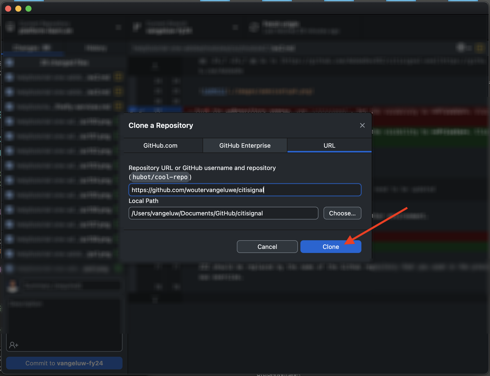
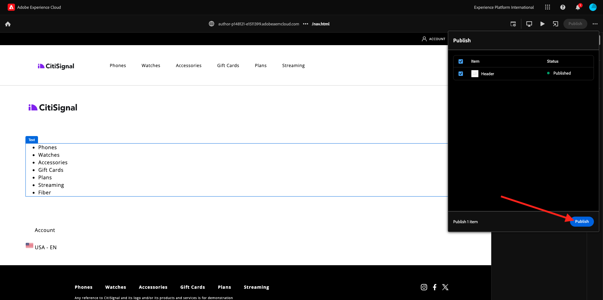

# 2.1.4 Entwickeln eines einfachen benutzerdefinierten Bausteins

## Einrichten 2.1.4.1 lokalen Entwicklungsumgebung

Wechseln Sie zu [https://desktop.github.com/download/](https://desktop.github.com/download/){target="_blank"}, laden Sie (GitHub **) herunter und installieren Sie**.


Sobald GitHub Desktop installiert ist, wechseln Sie zum GitHub-Repository, das Sie in der vorherigen Übung erstellt haben. Klicken Sie auf **&lt;> Code** dann auf **Mit GitHub Desktop öffnen**.


Ihr GitHub-Repository wird dann in GitHub Desktop geöffnet. Sie können auch den **Lokaler Pfad** ändern. Klicken Sie **Klonen**.



Ein lokaler Ordner wird jetzt erstellt.


Öffnen Sie Visual Studio Code. Navigieren Sie **Datei** > **Ordner öffnen**.


Wählen Sie den Ordner aus, der von Ihrem GitHub-Setup für **Citisignal** verwendet wird.


Sie sehen nun, dass der Ordner in Visual Studio Code geöffnet ist und Sie nun bereit sind, einen neuen Block zu erstellen.


## 2.1.4.2 Erstellen eines einfachen benutzerdefinierten Blocks

Adobe empfiehlt die Entwicklung von Bausteinen in einem dreistufigen Ansatz:

- Erstellen Sie die Definition und das Modell für den Block, überprüfen Sie ihn und bringen Sie ihn in die Produktion.
- Erstellen Sie Inhalte mit dem neuen Block.
- Implementierung der Dekoration und Stile für den neuen Block.

### component-definition.json

Öffnen Sie in Visual Studio Code die Datei **component-definition.json**.


Scrollen Sie nach unten, bis Sie die Komponente **Zitat** sehen. Setzen Sie den Cursor neben die schließende Klammer der letzten Komponente.


Fügen Sie diesen Code ein und geben Sie **nach dem Codeblock ein** ein:

```json
{
  "title": "FiberOffer",
  "id": "fiberoffer",
  "plugins": {
    "xwalk": {
      "page": {
        "resourceType": "core/franklin/components/block/v1/block",
        "template": {
          "name": "FiberOffer",
          "model": "fiberoffer",
          "offerText": "<p>Fiber will soon be available in your region!</p>",
          "offerCallToAction": "Get your offer now!",
          "offerImage": ""
        }
      }
    }
  }
}
```

Speichern Sie Ihre Änderungen.


### component-models.json

Öffnen Sie in Visual Studio Code die Datei **component-models.json**.


Scrollen Sie nach unten, bis Sie das letzte Element sehen. Setzen Sie den Cursor neben die schließende Klammer der letzten Komponente.


Geben Sie einen **ein,** drücken Sie dann die Eingabetaste, und fügen Sie in der nächsten Zeile diesen Code ein:

```json
{
  "id": "fiberoffer",
  "fields": [
     {
       "component": "richtext",
       "name": "offerText",
       "value": "",
       "label": "Offer Text",
       "valueType": "string"
     },
     {
       "component": "richtext",
       "valueType": "string",
       "name": "offerCallToAction",
       "label": "Offer CTA",
       "value": ""
     },
     {
       "component": "reference",
       "valueType": "string",
       "name": "offerImage",
       "label": "Offer Image",
        "multi": false
     }
   ]
}
```

Speichern Sie Ihre Änderungen.


### component-filters.json

Öffnen Sie in Visual Studio Code die Datei **component-filters.json**.


Geben **unter** Abschnitt“ einen **,** und die ID Ihrer Komponente **Fiberoffer** nach der aktuellen letzten Zeile ein.

Speichern Sie Ihre Änderungen.


## 2.1.4.3 Übertragen Sie Ihre Änderungen

Sie haben jetzt mehrere Änderungen an Ihrem Projekt vorgenommen, die wieder in Ihr GitHub-Repository übertragen werden müssen. Öffnen Sie dazu „GitHub **Desktop**.

Anschließend sollten die 3 Dateien angezeigt werden, die Sie gerade unter &quot;**&quot; bearbeitet**. Überprüfen Sie Ihre Änderungen.


Geben Sie einen Namen für Ihren PR ein, `Fiber Offer custom block`. Klicken Sie **Auf Haupt übertragen**.


Sie sollten das dann sehen. Klicken Sie auf **Push-Herkunft**.


Nach einigen Sekunden wurden Ihre Änderungen an Ihr GitHub-Repository gepusht.


Navigieren Sie in Ihrem Browser zu Ihrem GitHub-Konto und zu dem Repository, das Sie für CitiSignal erstellt haben. Sie sollten dann etwas wie das hier sehen, das anzeigt, dass Ihre Änderungen empfangen wurden.


## 2.1.4.4 Hinzufügen eines Blocks zu einer Seite

Nachdem Sie nun Ihren einfachen Zitatblock definiert und an das CitiSignal-Projekt übergeben haben, können Sie einen **fiberoffer**-Block zu einer vorhandenen Seite hinzufügen.

Navigieren Sie zu [https://my.cloudmanager.adobe.com](https://my.cloudmanager.adobe.com){target="_blank"}. Klicken Sie auf **Programm**, um es zu öffnen.


Klicken Sie anschließend auf der Registerkarte **Umgebungen** auf die **mit den drei Punkten** und anschließend auf **Details anzeigen**.


Anschließend werden Ihre Umgebungsdetails angezeigt. Klicken Sie auf die URL Ihrer **Author**-Umgebung.

>[!NOTE]
>
>Möglicherweise befindet sich Ihre Umgebung im Ruhezustand. In diesem Fall müssen Sie zunächst den Ruhezustand Ihrer Umgebung aufheben.


Anschließend sollte Ihre AEM-Autorenumgebung angezeigt werden. Navigieren Sie zu **Sites**.


Gehen Sie **CitiSignal** > **us** > **en**.


Klicken Sie **Erstellen** und wählen Sie **Seite** aus.


Wählen Sie **Seite** aus und klicken Sie auf **Weiter**.


Geben Sie die folgenden Werte ein:

- Titel: **CitiSignal Fibre**
- Name: **citsignal-fiber**
- Seitentitel: **CitiSignal Fibre**

Klicken Sie auf **Erstellen**.


Sie sollten das dann sehen.


Klicken Sie in den leeren Bereich, um die Komponente **Abschnitt** auszuwählen. Klicken Sie dann im rechten Menü auf das Pluszeichen **+**.


Anschließend sollte der benutzerdefinierte Block in der Liste der verfügbaren Blöcke angezeigt werden. Zur Auswahl klicken.


CTA Anschließend werden Felder wie **Angebotstext**, **Angebotsbild** und **Angebotsbild** zum Editor hinzugefügt. Klicken Sie im Feld **Angebotsbild** auf **+ Hinzufügen**, um ein Bild auszuwählen.


Sie sollten das dann sehen. Klicken, um den Ordner **Citisignal** zu öffnen.


Wählen Sie das Bild **product-enrichment-1.png** aus. Klicken Sie auf **Auswählen**.


Sie sollten dann diese haben. Klicken Sie auf **Veröffentlichen**.


Klicken Sie erneut auf **** Publish.


Ihre neue Seite wurde jetzt veröffentlicht.

## 2.1.4.5 Hinzufügen einer neuen Seite zum Navigationsmenü

AEM Sites Gehen Sie in der Übersicht zu **CitiSignal** > **Fragments** und aktivieren Sie das Kontrollkästchen für **Header**. Klicken Sie auf **Bearbeiten**.


Fügen Sie eine Menüoption zum Navigationsmenü mit dem `Fiber` hinzu. Wählen Sie den Text **Faser** und klicken Sie auf das **link**-Symbol.


Geben Sie dies für die `/us/en/citisignal-fiber` **URL** ein und klicken Sie zum Bestätigen auf das Symbol **V** .


Sie sollten dann diese haben. Klicken Sie auf **Veröffentlichen**.


Klicken Sie erneut auf **** Publish.



Sie können nun die Änderungen an Ihrer Website anzeigen, indem Sie zu `main--citisignal--XXX.aem.page/us/en` und/oder `main--citisignal--XXX.aem.live/us/en` wechseln, nachdem Sie XXX durch Ihr GitHub-Benutzerkonto ersetzt haben, was in diesem Beispiel `woutervangeluwe` ist.

In diesem Beispiel lautet die vollständige URL wie folgt:
`https://main--citisignal--woutervangeluwe.aem.page/us/en` und/oder `https://main--citisignal--woutervangeluwe.aem.live/us/en`.

Sie sollten das dann sehen. Klicken Sie auf **Faser**.


Hier finden Sie Ihren grundlegenden benutzerdefinierten Block, der jetzt auf der Website gerendert wird.


Nächster Schritt: [2.1.5 Erweiterter benutzerdefinierter Block](./ex5.md){target="_blank"}

[Zurück zum Modul 2.1](./aemcs.md){target="_blank"}

[Zurück zu „Alle Module“](./../../../overview.md){target="_blank"}
