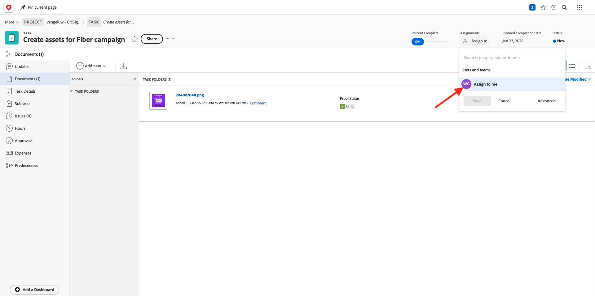
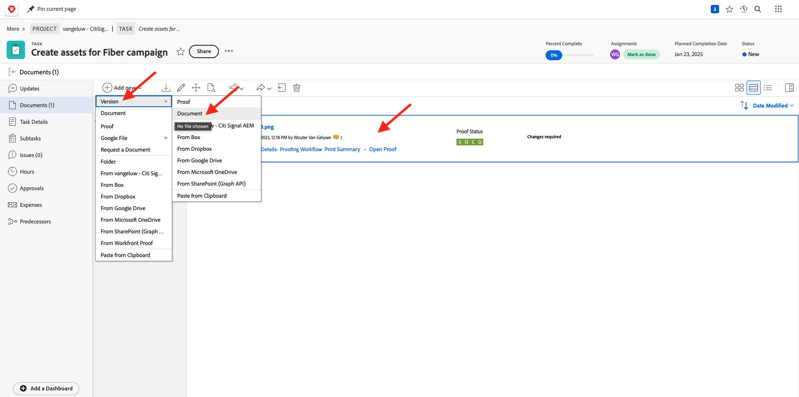
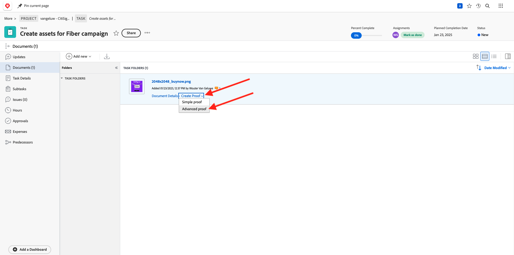
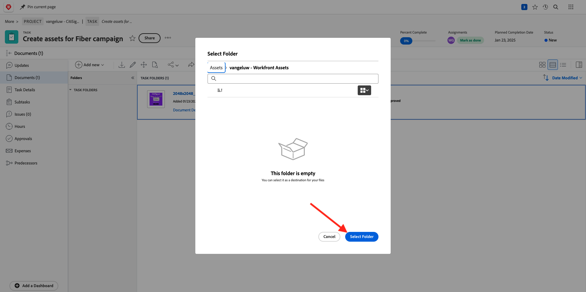
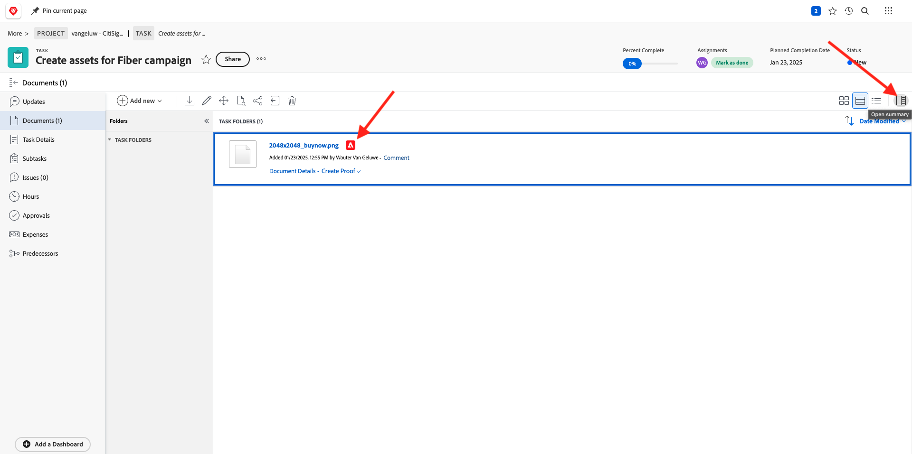

# 2.2.2 Proofing mit Workfront

## 2.2.2.1 Erstellen eines neuen Genehmigungsflusses

Navigieren Sie zu [https://experienceplatform.my.workfront.com/](https://experienceplatform.my.workfront.com/){target="_blank"}.

Klicken Sie auf das 9-Punkte **Hamburger**-Symbol und wählen Sie **Proofing**.

Gehen Sie zu **Workflows**, klicken Sie auf **+ Neu** und wählen Sie dann **Neue Vorlage**.

Legen Sie den **Vorlagennamen** auf `--aepUserLdap-- - Approval Workflow` fest und legen Sie den **Vorlagenbesitzer** auf sich selbst fest.

Scrollen Sie nach unten und fügen Sie unter **Schritte** > **Schritt 1** den Inhalt **Wouter Van Geluwe** mit dem **Rolle** des **Validierungsverantwortlichen und Genehmigenden** hinzu.

Klicken Sie auf **Erstellen**.

Ihr einfacher Genehmigungs-Workflow kann jetzt verwendet werden.

## 2.2.2.2 Neues Projekt erstellen

Klicken Sie auf der Workfront-Startseite auf **Neu** auf der Registerkarte **Meine Projekte** . Wählen Sie **Leeres Projekt** aus.

Sie sollten das dann sehen. Ändern Sie den Namen in `--aepUserLdap-- - CitiSignal Fiber Launch`.

Ihr Projekt ist jetzt erstellt.

## 2.2.2.3 Neue Aufgabe erstellen

Geben Sie den folgenden Namen für Ihre Aufgabe ein: **Erstellen von Assets für Fibre-**-Kampagnen. Klicken Sie **Aufgabe erstellen**.

Sie sollten das dann sehen.

## 2.2.2.4 Ein neues Dokument zu Ihrer Aufgabe hinzufügen, durchlaufen Sie den Genehmigungsfluss

Klicken Sie auf **+ Neu hinzufügen** wählen Sie dann **Dokument** aus.

Laden Sie [diese Datei](./images/2048x2048.png) auf Ihren Desktop herunter.

{width="50px" align="left"}

Wählen Sie die Datei **2048x2048.png** aus und klicken Sie auf **Öffnen**.

Sie sollten dann diese haben. Klicken Sie **Korrekturabzug erstellen** und wählen Sie dann **Erweiterter Korrekturabzug**.

Wählen Sie im Fenster **Neuer Korrekturabzug** die zuvor erstellte Workflow-Vorlage aus, die `--aepuserLdap-- - Approval Workflow` benannt werden soll. Klicken Sie **Korrekturabzug erstellen**.

Dann sind Sie wieder bei Ihrer Aufgabe. Klicken Sie auf die **Zuweisen zu** und wählen Sie **Mir zuweisen** aus.

Klicken Sie auf **Speichern**.

Klicken Sie **Bearbeiten**.

Klicken Sie **Korrekturabzug öffnen**

Sie können den Korrekturabzug jetzt überprüfen. Wählen Sie **Kommentar hinzufügen** aus, um eine Anmerkung hinzuzufügen, für die das Dokument geändert werden muss.

Geben Sie Ihren Kommentar ein und klicken Sie auf **Posten**. Klicken Sie auf **Schließen**.

Als Nächstes müssen Sie Ihre Rolle von &quot;**&quot; in &quot;** und **&quot;**. Gehen Sie dazu zurück zu Ihrer Aufgabe und klicken Sie auf **Proofing-Workflow**.

Ändern Sie Ihre Rolle von **Prüfer** in **Prüfer und Genehmiger**.

Kehren Sie zu Ihrer Aufgabe zurück und öffnen Sie den Korrekturabzug erneut. Jetzt sehen Sie eine neue Schaltfläche **Entscheidung treffen**. Klicken Sie darauf.

Wählen Sie **Änderungen erforderlich** und klicken Sie auf **Entscheidung treffen**.

Dann solltest du wieder hier sein. Sie müssen jetzt ein zweites Bild hochladen, das die angegebenen Kommentare berücksichtigt.

Laden Sie [diese Datei](./images/2048x2048_buynow.png) auf Ihren Desktop herunter.

{width="50px" align="left"}

Wählen Sie in Ihrer Aufgabenansicht die alte Bilddatei aus, die nicht genehmigt wurde. Klicken Sie dann auf **+ Neu hinzufügen** wählen Sie **Version** und dann **Dokument** aus.

Wählen Sie die Datei **2048x2048_buynow.png** und klicken Sie auf **Öffnen**.

Sie sollten dann diese haben. Klicken Sie **Korrekturabzug erstellen** und wählen Sie dann erneut **Erweiterter** aus.

Sie werden es dann sehen. Die **Workflow-Vorlage** ist jetzt vorausgewählt, da Workfront davon ausgeht, dass der vorherige Genehmigungs-Workflow weiterhin gültig ist. Klicken Sie **Korrekturabzug erstellen**.

Wählen Sie **Korrekturabzug öffnen** aus.

Sie können nun zwei Versionen der Datei nebeneinander sehen.

Klicken Sie **Entscheidung treffen**, wählen Sie **Genehmigt** und klicken Sie erneut **Entscheidung treffen**.

Schließen Sie die Testversand-Vorschau.

Sie werden dann mit einem genehmigten Asset wieder in Ihrer Aufgabenansicht angezeigt. Dieses Asset muss jetzt für AEM Assets freigegeben werden.

Klicken Sie auf das **Freigabe** Pfeilsymbol und wählen Sie Ihre AEM Assets-Integration aus, die `--aepUserLdap-- - Citi Signal AEM` benannt werden soll.

Doppelklicken Sie auf den zuvor erstellten Ordner, der `--aepUserLdap-- - Workfront Assets` benannt werden soll.

Klicken Sie **Ordner auswählen**.

Nach 1-2 Minuten wird Ihr Dokument jetzt in AEM Assets veröffentlicht. Neben Ihrem Dokumentnamen wird ein AEM-Symbol angezeigt.

Klicken Sie **Zusammenfassung öffnen**.

Navigieren Sie **Metadaten**, Sie sollten Folgendes sehen:

Gehen Sie zu **Übersicht** und klicken Sie auf **+ Hinzufügen** um eine Beschreibung hinzuzufügen.

Geben Sie Ihre Beschreibung ein. Ihre Korrekturabzugs- und Dokumenteneinstellungen sind jetzt abgeschlossen.

## 2.2.2.5 Datei in AEM Assets anzeigen

Wechseln Sie zu Ihrem Ordner in AEM Assets, der `--aepUserLdap - Workfront Assets` heißt.

Klicken Sie auf die drei Punkte unter Ihrem Bild und wählen Sie dann **Details**.

Anschließend sehen Sie das zuvor erstellte Metadatenformular mit den Werten, die automatisch durch die Integration zwischen Workfront und AEM Assets ausgefüllt wurden.

[Zurück zum Modul 2.2](./workfront.md){target="_blank"}

[Zurück zu „Alle Module“](./../../../overview.md){target="_blank"}
