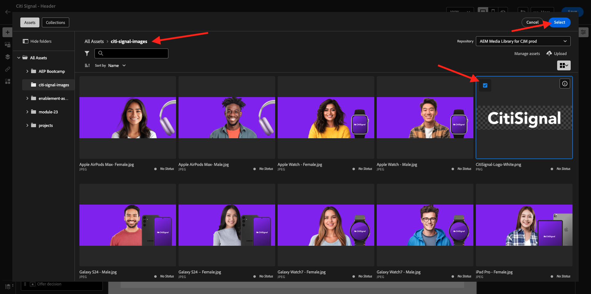
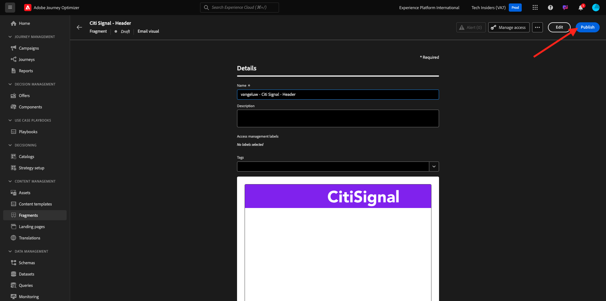
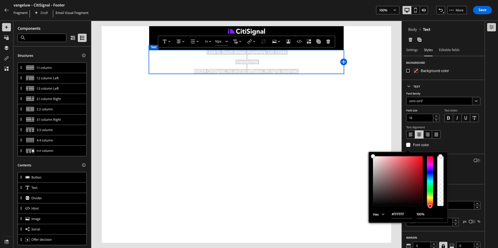
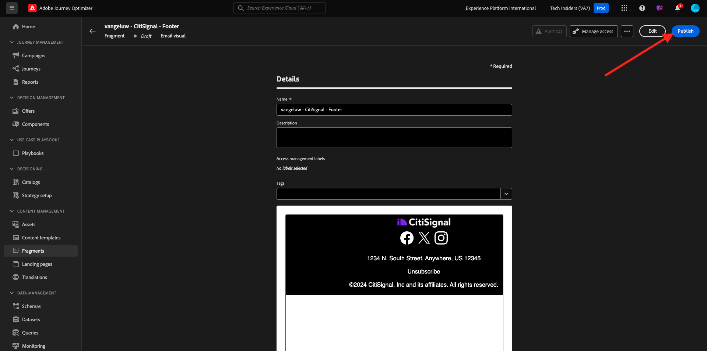

# 3.1.2 Erstellen Sie Fragmente zur Verwendung in Ihrer Nachricht

In dieser Übung konfigurieren Sie zwei Fragmente, eins für eine wiederverwendbare Kopfzeile und eins für eine wiederverwendbare Fußzeile.

Melden Sie sich bei Adobe Journey Optimizer an, indem Sie zu [Adobe Experience Cloud wechseln](https://experience.adobe.com). Auf **Journey Optimizer**.


Sie werden zur Ansicht **Startseite** in Journey Optimizer weitergeleitet. Stellen Sie zunächst sicher, dass Sie die richtige Sandbox verwenden. Die zu verwendende Sandbox heißt `--aepSandboxName--`.


## 3.1.2.1 Erstellen des Header-Fragments

Klicken Sie im linken Menü auf **Fragmente**. Ein Fragment ist eine wiederverwendbare Komponente in Journey Optimizer, die Duplizierungen vermeidet und zukünftige Änderungen erleichtert, die sich auf alle Nachrichten auswirken sollten, z. B. Änderungen an einer Kopf- oder Fußzeile in einer E-Mail-Nachricht.

Klicken Sie **Fragment erstellen**.


Geben Sie den `--aepUserLdap-- - CitiSignal - Header` ein und wählen Sie **Typ: Visuelles Fragment**. Klicken Sie auf **Erstellen**.


Sie werden es dann sehen. Im linken Menü finden Sie die Strukturkomponenten, mit denen Sie die Struktur der E-Mail definieren können (Zeilen und Spalten).

Ziehen Sie per Drag-and-Drop eine **1:1** Spalte aus dem Menü auf die Arbeitsfläche. Dies ist der Platzhalter für das Logo-Bild.


Als Nächstes können Sie Inhaltskomponenten verwenden, um Inhalte in diesen Blöcken hinzuzufügen. Ziehen Sie eine **Bild**-Komponente per Drag-and-Drop in die erste Zelle in der ersten Zeile. Klicken Sie auf **Durchsuchen**.


Anschließend wird ein Popup geöffnet, in dem Ihre AEM Assets Media Library angezeigt wird. Gehen Sie zum Ordner **citi-signal-images**, klicken Sie auf das Bild **CitiSignal-Logo-White.png** und klicken Sie auf **Auswählen**.

>[!NOTE]
>
>Wenn Sie die Citi Signal-Bilder in Ihrer AEM Assets-Bibliothek nicht sehen, finden Sie sie [hier](./../../../../assets/ajo/CitiSignal-images.zip). Laden Sie sie auf Ihren Desktop herunter, erstellen Sie den Ordner **citi-signal-images** und laden Sie alle Bilder in diesem Ordner hoch.



Sie werden es dann sehen. Ihr Bild ist weiß und wird noch nicht angezeigt. Sie sollten jetzt eine Hintergrundfarbe definieren, damit das Bild korrekt angezeigt wird. Klicken Sie **Stile** und dann auf das Feld **Hintergrundfarbe**.


Ändern Sie im Popup den **Hex**-Farbcode in **#8821F4** und ändern Sie dann den Fokus, indem Sie in das Feld **100%** klicken. Anschließend sehen Sie die neue Farbe, die auf das Bild angewendet wurde.


Das Bild ist im Moment auch etwas zu groß. Ändern wir die Breite, indem wir den Umschalter **Breite** auf **40 %** verschieben.


Ihr Header-Fragment ist jetzt bereit. Klicken Sie **Speichern** und anschließend auf den Pfeil, um zum vorherigen Bildschirm zurückzukehren.


Das Fragment muss veröffentlicht werden, bevor es verwendet werden kann. Klicken Sie auf **Veröffentlichen**.



Nach einigen Minuten sehen Sie, dass der Status Ihres Fragments in „Live **geändert**.
Als Nächstes sollten Sie ein neues Fragment für die Fußzeile Ihrer E-Mail-Nachrichten erstellen. Klicken Sie **Fragment erstellen**.


## 3.1.2.2 Erstellen des Fragments Fußzeile

Klicken Sie **Fragment erstellen**.


Geben Sie den `--aepUserLdap-- - CitiSignal - Footer` ein und wählen Sie **Typ: Visuelles Fragment**. Klicken Sie auf **Erstellen**.


Sie werden es dann sehen. Im linken Menü finden Sie die Strukturkomponenten, mit denen Sie die Struktur der E-Mail definieren können (Zeilen und Spalten).

Ziehen Sie per Drag-and-Drop eine **1:1** Spalte aus dem Menü auf die Arbeitsfläche. Dies ist der Platzhalter für den Inhalt der Fußzeile.


Als Nächstes können Sie Inhaltskomponenten verwenden, um Inhalte in diesen Blöcken hinzuzufügen. Ziehen Sie eine **HTML**-Komponente per Drag-and-Drop in die erste Zelle der ersten Zeile. Klicken Sie auf die Komponente, um sie auszuwählen, und klicken Sie dann auf das **&lt;/>**, um den HTML-Quell-Code zu bearbeiten.


Sie werden es dann sehen.


Kopieren Sie das folgende HTML-Codefragment und fügen Sie es in das Fenster **HTML bearbeiten** in Journey Optimizer ein.

```html
<!--[if mso]><table cellpadding="0" cellspacing="0" border="0" width="100%"><tr><td style="text-align: center;" ><![endif]-->
<table style="width: auto; display: inline-block;">
  <tbody>
    <tr class="component-social-container">
      <td style="padding: 5px">
        <a style="text-decoration: none;" href="https://www.facebook.com" data-component-social-icon-id="facebook">
        
        </a>
      </td>
      <td style="padding: 5px">
        <a style="text-decoration: none;" href="https://x.com" data-component-social-icon-id="twitter">
        
        </a>
      </td>
      <td style="padding: 5px">
        <a style="text-decoration: none;" href="https://www.instagram.com" data-component-social-icon-id="instagram">
         
        </a>
      </td>
    </tr>
  </tbody>
</table>
<!--[if mso]></td></tr></table><![endif]-->
```

Dann hast du das hier. In den Zeilen 7, 12 und 17 müssen Sie jetzt eine Bilddatei einfügen, indem Sie die Assets in Ihrer AEM Assets-Bibliothek verwenden.


Vergewissern Sie sich, dass sich Ihr Cursor in Zeile 7 befindet, und klicken Sie dann im **Menü auf** Assets. Klicken Sie **Asset-Auswahl öffnen**, um Ihr Bild auszuwählen.


Öffnen Sie den Ordner **citi-signal-images** und klicken Sie auf das Bild **Icon_facebook.png**. Klicken Sie auf **Auswählen**.


Stellen Sie sicher, dass sich der Cursor in Zeile 12 befindet, und klicken Sie dann auf **Asset-Auswahl öffnen**, um Ihr Bild auszuwählen.


Öffnen Sie den Ordner **citi-signal-images** und klicken Sie auf das Bild **Icon_X.png**. Klicken Sie auf **Auswählen**.


Stellen Sie sicher, dass sich der Cursor in Zeile 17 befindet, und klicken Sie dann auf **Asset-Auswahl öffnen**, um Ihr Bild auszuwählen.


Öffnen Sie den Ordner **citi-signal-images** und klicken Sie auf das Bild **Icon_Instagram.png**. Klicken Sie auf **Auswählen**.


Sie werden es dann sehen. Klicken Sie auf **Speichern**.


Sie werden dann wieder im Editor angezeigt. Ihre Symbole sind noch nicht sichtbar, da der Hintergrund und die Bilddateien alle weiß sind. Um die Hintergrundfarbe zu ändern, gehen Sie zu **Stile** und klicken Sie auf das Kontrollkästchen **Hintergrundfarbe**.


Ändern Sie den **Hex**-Farbcode in **#000000**.


Ändern Sie die Ausrichtung so, dass sie zentriert ist.


Fügen wir der Fußzeile einige andere Teile hinzu. Ziehen Sie eine **image**-Komponente über die soeben erstellte HTML-Komponente. Klicken Sie auf **Durchsuchen**.


Klicken Sie auf die **`CitiSignal_Footer_Logo.png`** Bilddatei, um sie auszuwählen, und klicken Sie auf **Auswählen**.


Wechseln Sie zu **Stile** und klicken Sie auf das Kontrollkästchen **Hintergrundfarbe**, ändern wir es wieder in Schwarz. Ändern Sie den **Hex**-Farbcode in **#000000**.


Ändern Sie die Breite in **20%** und stellen Sie sicher, dass die Ausrichtung zentriert ist.


Ziehen Sie als Nächstes per Drag-and **Drop eine** Textkomponente“ unter die von Ihnen erstellte HTML-Komponente. Klicken Sie auf **Durchsuchen**.


Kopieren Sie den folgenden Text und fügen Sie ihn ein, indem Sie den Platzhaltertext ersetzen.

```
1234 N. South Street, Anywhere, US 12345

Unsubscribe

©2024 CitiSignal, Inc and its affiliates. All rights reserved.
```

Legen Sie die **Textausrichtung** auf Zentriert fest.


Ändern Sie die **Schriftfarbe** in Weiß, **#FFFFFF**.



Ändern Sie die **Hintergrundfarbe** in Schwarz, **#000000**.


Wählen Sie den Text **Abmelden** in der Fußzeile aus und klicken Sie auf das **Link**-Symbol in der Menüleiste. Legen Sie **Typ** auf **Externes Opt-out/Abmeldung** und die URL auf **https://aepdemo.net/unsubscribe.html** fest (es ist nicht zulässig, eine leere URL für den Abmelde-Link zu haben).


Dann hast du das hier. Ihre Fußzeile ist jetzt bereit. Klicken Sie **Speichern** und anschließend auf den Pfeil, um zur vorherigen Seite zurückzukehren.


Klicken Sie **Veröffentlichen**, um Ihre Fußzeile zu veröffentlichen, damit sie in einer E-Mail verwendet werden kann.



Nach einigen Minuten sehen Sie, dass der Status Ihrer Fußzeile auf „Live **geändert**.


Sie haben jetzt diese Übung beendet.

## Nächste Schritte

Wechseln Sie zu [3.1.3 Erstellen Sie Ihre Journey und E-Mail-Nachricht](./ex3.md){target="_blank"}

Zurück zu [Adobe Journey Optimizer: Orchestrierung](./journey-orchestration-create-account.md){target="_blank"}

Zurück zu [Alle Module](./../../../../overview.md){target="_blank"}
