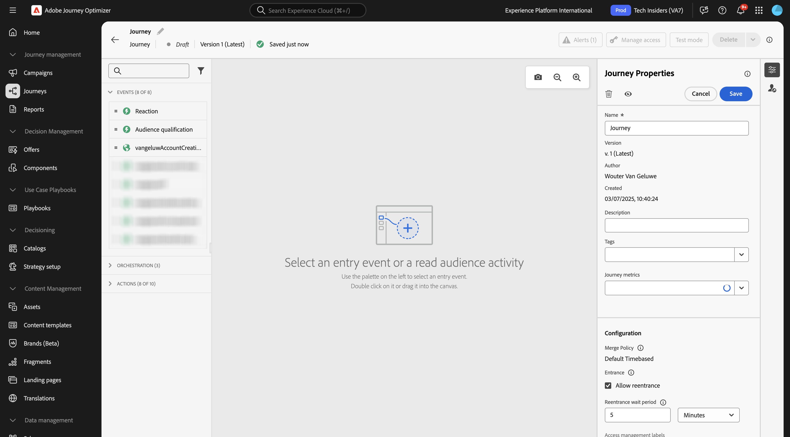
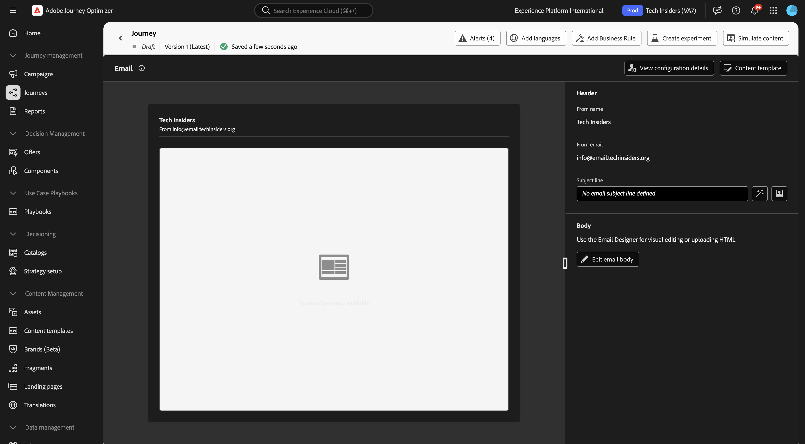
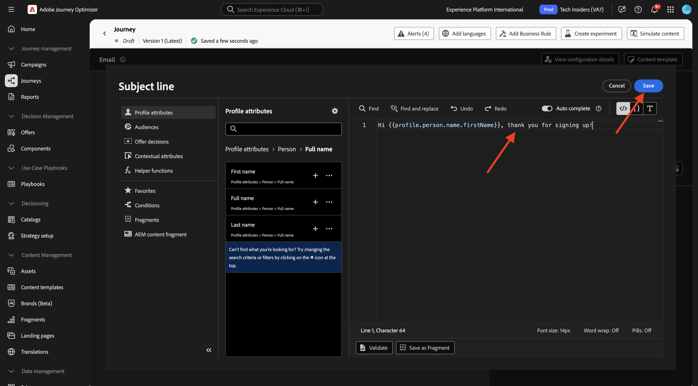
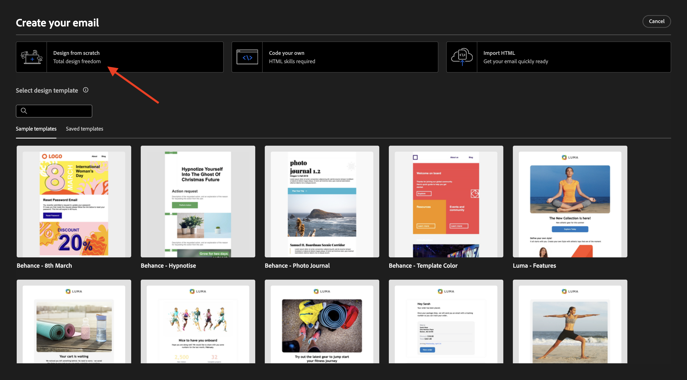
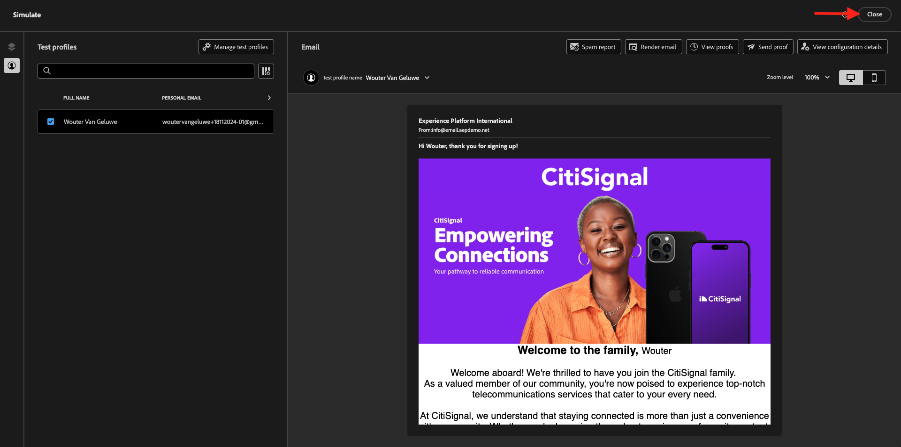
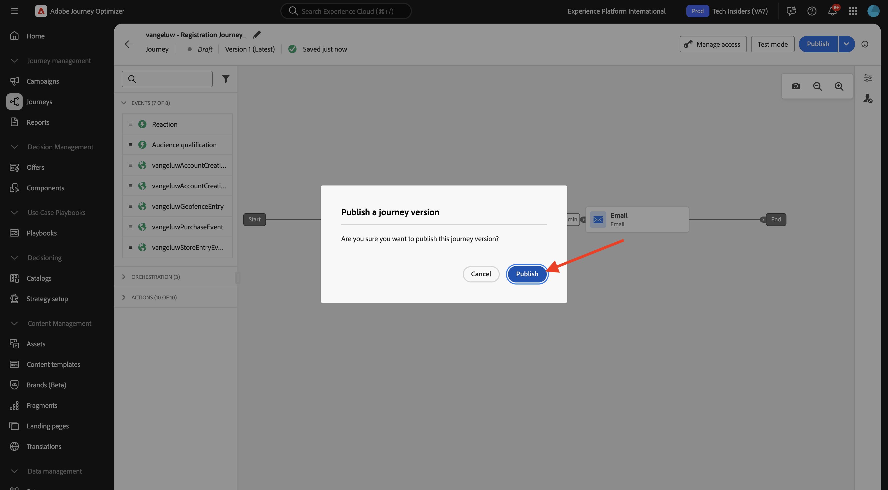

# 3.1.3 Erstellen von Journey, Fragmenten und Nachrichten

In dieser Übung konfigurieren Sie die Journey und die Nachricht, die ausgelöst werden muss, wenn jemand ein Konto auf der Demo-Website erstellt.

Melden Sie sich bei Adobe Journey Optimizer an, indem Sie zu [Adobe Experience Cloud wechseln](https://experience.adobe.com). Auf **Journey Optimizer**.


Sie werden zur Ansicht **Startseite** in Journey Optimizer weitergeleitet. Stellen Sie zunächst sicher, dass Sie die richtige Sandbox verwenden. Die zu verwendende Sandbox heißt `--aepSandboxName--`.


## 3.1.3.1 Journey erstellen

Klicken Sie im linken Menü auf **Journeys**. Klicken Sie anschließend auf **Journey erstellen**, um eine neue Journey zu erstellen.


Daraufhin wird ein leerer Journey-Bildschirm angezeigt.



In der vorherigen Übung haben Sie ein neues &quot;**&quot;**. Sie haben ihn wie `--aepUserLdap--AccountCreationEvent` benannt und `ldap` durch Ihr LDAP ersetzt. Dies war das Ergebnis der Erstellung des Ereignisses:


Jetzt müssen Sie dieses Ereignis als Beginn dieser Journey nehmen. Dies können Sie tun, indem Sie zur linken Seite Ihres Bildschirms gehen und in der Ereignisliste nach Ihrem Ereignis suchen.


Wählen Sie Ihr Ereignis aus und ziehen Sie es per Drag-and-Drop auf die Journey-Arbeitsfläche. Ihr Journey sieht nun wie folgt aus:


Als zweiten Schritt auf der Journey müssen Sie einen kurzen &quot;**&quot;-** hinzufügen. Gehen Sie auf der linken Seite Ihres Bildschirms zum Abschnitt **Orchestrierung**, um dies zu finden. Sie verwenden Profilattribute und müssen sicherstellen, dass diese im Echtzeit-Kundenprofil enthalten sind.


Ihr Journey sieht jetzt wie folgt aus. Auf der rechten Seite des Bildschirms müssen Sie die Wartezeit konfigurieren. Auf 1 Minute einstellen. Dadurch haben Sie genügend Zeit, damit die Profilattribute verfügbar sind, nachdem das Ereignis ausgelöst wird. Klicken Sie **Speichern**, um Ihre Änderungen zu speichern.


Als dritten Schritt auf der Journey müssen Sie eine „E-**&quot;-** hinzufügen. Gehen Sie auf der linken Seite des Bildschirms zu **Aktionen**, wählen Sie die Aktion **E-Mail** aus und ziehen Sie sie dann per Drag-and-Drop auf den zweiten Knoten in Ihrem Journey. Jetzt seht ihr das.


Legen Sie die **Kategorie** auf **Marketing** fest und wählen Sie eine E-Mail-Konfiguration aus, mit der Sie E-Mails senden können. In diesem Fall ist die auszuwählende E-Mail-Konfiguration **E**. Stellen Sie sicher, dass die Kontrollkästchen für **Klicks auf E-**) und **E-Mail-Öffnungen** beide aktiviert sind.


## 3.1.3.2 Nachricht erstellen

Um Ihre Nachricht zu erstellen, klicken Sie auf **Inhalt bearbeiten**.


Jetzt seht ihr das.



Klicken Sie auf das **Personalisierungsdialog öffnen** Symbol.


Schreiben Sie den Text `Hi `. Als Nächstes müssen Sie das Personalisierungs-Token für das Feld **Vorname“**, das unter `profile.person.name.firstName` gespeichert ist. Navigieren Sie im linken Menü zum Feld **Person > Vollständiger Name > Vorname** und klicken Sie auf das Symbol **+** . Anschließend wird das Personalisierungs-Token im Textfeld angezeigt.


Als Nächstes fügen Sie den Text **hinzu, danke für die Anmeldung!**. Klicken Sie auf **Speichern**.



Sie können jetzt mit der Konfiguration des Textkörpers Ihrer E-Mail beginnen. Klicken Sie **E-Mail-Textkörper bearbeiten**.


Bevor Sie mit der Erstellung des Inhalts der eigentlichen Nachricht beginnen, sollten Sie über den Inhalt der Nachricht nachdenken. Ein Teil des Inhalts der Nachricht ist für die Nachricht selbst einzigartig, aber andere Teile sind Standardkomponenten, die wahrscheinlich für jede E-Mail, die Sie an Kunden senden, gleich sind.

In der vorherigen Übung haben Sie diese Standardkomponenten bereits als Fragmente in Journey Optimizer erstellt, die Sie jetzt in dieser Nachricht und allen anderen zukünftigen Nachrichten, die Sie erstellen werden, referenzieren können.

Im nächsten Bildschirm werden Sie mit drei verschiedenen Methoden zum Bereitstellen des E-Mail-Inhalts aufgefordert:

- **Von Grund auf gestalten**: Beginnen Sie mit einer leeren Arbeitsfläche und verwenden Sie den WYSIWYG-Editor, um Struktur- und Inhaltskomponenten per Drag-and-Drop zu verschieben und visuell zum Erstellen des E-Mail-Inhalts zu verwenden.
- **Eigenen Code erstellen** Erstellen Sie Ihre eigene E-Mail-Vorlage, indem Sie sie mit HTML codieren
- **HTML importieren**: Importieren Sie eine vorhandene HTML-Vorlage, die Sie bearbeiten können.

Klicken Sie **Von Grund auf gestalten**.



Im linken Menü finden Sie die Strukturkomponenten, mit denen Sie die Struktur der E-Mail definieren können (Zeilen und Spalten).


Im linken Menü finden **Fragmente** wo die zuvor erstellten Fragmente angezeigt werden.


Bevor Sie die Kopf- und Fußzeile zur Arbeitsfläche hinzufügen können, müssen Sie der E-Mail zwei Strukturen hinzufügen. Klicken Sie auf das Symbol **+** im linken Menü und ziehen Sie 2 **1:1-Spalte**-Komponenten auf die Arbeitsfläche.


Gehen Sie im linken Menü zurück zu **Fragmente**. Ziehen Sie das Kopfzeilenfragment in die erste Komponente und das Fußzeilenfragment in die zweite Komponente. Sie werden es dann sehen.


Klicken Sie auf das Symbol **+** im linken Menü und ziehen Sie zwei weitere **1:1-Spalte**-Komponenten auf die Arbeitsfläche, zwischen der Kopf- und der Fußzeile.


Ziehen Sie eine **Bild**-Komponente per Drag-and-Drop in die erste **1:1-**. Klicken Sie auf **Durchsuchen**.


Im Ordner **citi-signal**. Wählen Sie die **`welcome_email_image.png`** aus und klicken Sie auf **Auswählen**.


Sie erhalten dann Folgendes:


Gehen Sie dann zu **Inhalte** und ziehen Sie per Drag-and-Drop eine **Text**-Komponente in die Strukturkomponente in der vierten Zeile.


Standardtext auswählen (**hier eingeben.** wie bei jedem Texteditor. Schreiben Sie **Willkommen bei der Familie**. Klicken Sie in der Symbolleiste auf das Symbol **Personalisierung hinzufügen**.


Als Nächstes müssen Sie das Personalisierungs **Token „Vorname“**, das unter &quot;`profile.person.name.firstName`&quot; gespeichert ist. Suchen Sie im Menü das Element **Person**, schlüsseln Sie das Element **Full Name** auf und klicken Sie dann auf das Symbol **+**, um dem Ausdruckseditor das Feld Vorname hinzuzufügen.

Klicken Sie auf **Speichern**.


Sie werden nun feststellen, wie das Personalisierungsfeld zu Ihrem Text hinzugefügt wurde.


Drücken Sie im selben Textfeld zweimal die **Eingabetaste**, um zwei Zeilen hinzuzufügen und den folgenden Text zu kopieren und einzufügen:

```
Welcome aboard! We're thrilled to have you join the CitiSignal family. 
As a valued member of our community, you're now poised to experience top-notch telecommunications services that cater to your every need.

At CitiSignal, we understand that staying connected is more than just a convenience - it's a necessity. Whether you're browsing the web, streaming your favourite content, or keeping in touch with loved ones, we're here to ensure you have the best tools and resources at your fingertips.
```


Legen Sie die **Textausrichtung** auf die Mitte fest und passen Sie das Erscheinungsbild der Nachricht an Ihre eigenen Anforderungen an. Wenn Sie fertig sind, klicken Sie auf **Speichern**.


Die letzte Überprüfung, die durchgeführt werden muss, um sicherzustellen, dass Ihre E-Mail bereit für die Vorschau ist, klicken Sie auf die Schaltfläche **Inhalt simulieren**.


Bevor Sie die E-Mail-Nachricht simulieren können, müssen Sie ein Testprofil hinzufügen. Klicken Sie **Testprofile verwalten**.


Wählen Sie den **E** Mail-Namespace aus, indem Sie auf das Symbol neben dem Feld **Identity-Namespace**.

Wählen Sie in der Liste der Identity-Namespaces den Namespace **E** aus. Geben **im Feld Identitätswert** die E-Mail-Adresse eines früheren Profils ein, das Sie in einer vorherigen Übung verwendet haben und das bereits in Adobe Experience Platform gespeichert ist. Klicken Sie **Profil hinzufügen**. Zum vorherigen Bildschirm zurückkehren.


Anschließend wird Ihre E-Mail-Nachricht angezeigt, die jetzt für dieses Kundenprofil simuliert wurde. Sie können jetzt die Personalisierung in der Betreffzeile und im Textkörper validieren und bei Bedarf eine Korrekturabzugs-E-Mail senden.

Klicken Sie auf **Schließen**, um die Vorschau zu schließen.



Klicken Sie auf **Speichern**, um Ihre Nachricht zu speichern, und gehen Sie zurück zum Nachrichten-Dashboard, indem Sie auf den **Pfeil** neben dem Betreffzeilentext in der oberen linken Ecke klicken.


Klicken Sie auf **Pfeil**, um zu Ihrem Journey zurückzukehren.


## 3.1.3.3 Veröffentlichen des Journey

Klicken Sie auf **Speichern**.


Sie müssen Ihrem Journey noch einen Namen geben. Klicken Sie dazu auf das Symbol **Eigenschaften** oben rechts auf Ihrem Bildschirm.


Geben Sie hier den Namen der Journey ein. Bitte verwenden Sie `--aepUserLdap-- - Registration Journey`. Klicken Sie auf **Speichern**.


Sie können Ihren Journey jetzt veröffentlichen, indem Sie auf &quot;**&quot;**.


Klicken **erneut auf** Veröffentlichen“.



Nach einigen Minuten ändert sich der Status Ihrer Journey in **Live** und Sie sehen ein Echtzeit-Dashboard Ihrer Journey-Performance.


Sie haben jetzt diese Übung beendet.

## Nächste Schritte

Navigieren Sie zu [3.1.4 Aktualisieren Sie Ihre Datenerfassungseigenschaft und testen Sie Ihren Journey](./ex4.md){target="_blank"}

Zurück zu [Adobe Journey Optimizer: Orchestrierung](./journey-orchestration-create-account.md){target="_blank"}

Zurück zu [Alle Module](./../../../../overview.md){target="_blank"}
