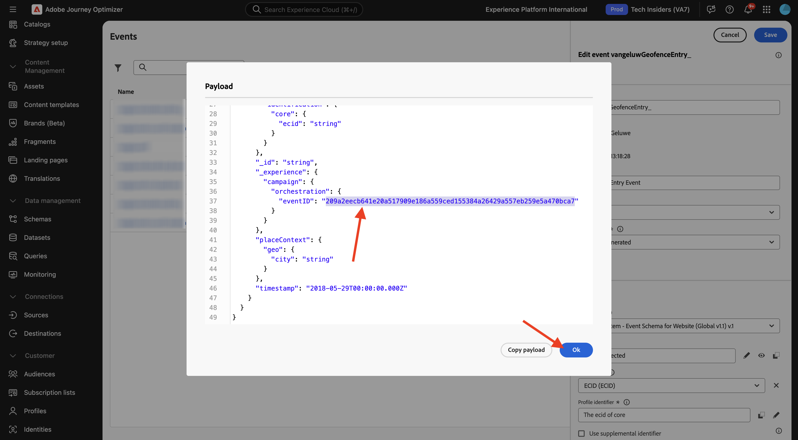

# 3.2.1 Ereignis definieren

Melden Sie sich bei Adobe Journey Optimizer an, indem Sie zu [Adobe Experience Cloud wechseln](https://experience.adobe.com). Auf **Journey Optimizer**.

Sie werden zur Ansicht **Startseite** in Journey Optimizer weitergeleitet. Stellen Sie zunächst sicher, dass Sie die richtige Sandbox verwenden. Die zu verwendende Sandbox heißt `--aepSandboxName--`. Sie befinden sich dann in der **Startseite**-Ansicht Ihres Sandbox-`--aepSandboxName--`.

Scrollen Sie im linken Menü nach unten und klicken Sie auf **Konfigurationen**. Klicken Sie anschließend auf die Schaltfläche **Verwalten** unter **Ereignisse**.

Anschließend sehen Sie eine Übersicht über alle verfügbaren Ereignisse. Klicken Sie auf **Ereignis erstellen**, um mit der Erstellung Ihres eigenen Ereignisses zu beginnen.

Daraufhin wird ein neues, leeres Ereignisfenster angezeigt.
Verwenden Sie `--aepUserLdap--GeofenceEntry` als Namen für das Ereignis.

Beschreibung festlegen auf: `Geofence Entry Event`.

Stellen Sie sicher **dass** Typ“ auf **Unitär** und wählen Sie für die Auswahl **Ereignis-ID-Typ** die Option **Systemgeneriert**

Als Nächstes müssen Sie ein Schema auswählen.

Sie werden feststellen, dass nicht alle Schemata angezeigt werden. In Adobe Experience Platform sind noch viele weitere Schemata verfügbar.
Um in dieser Liste angezeigt zu werden, muss einem Schema eine sehr spezifische Feldergruppe zugeordnet sein. Die Feldergruppe, die hier angezeigt werden soll, heißt `Orchestration eventID`.

Sehen wir uns kurz an, wie diese Schemata in Adobe Experience Platform definiert werden.

Wechseln Sie im linken Menü zu **Schemata** und öffnen Sie diese in einer neuen Browser-Registerkarte. Gehen Sie **Schemata** zu **Durchsuchen**, um die Liste der verfügbaren Schemata anzuzeigen.
Öffnen Sie die `Demo System - Event Schema for Website (Global v1.1)` Schema .

Nach dem Öffnen des Schemas sehen Sie, dass die Feldergruppe `Orchestration eventID` Teil des Schemas ist.
Diese Feldergruppe hat nur zwei Felder: `_experience.campaign.orchestration.eventID` und `originJourneyID`.

Sobald diese Feldergruppe und dieses spezifische eventID-Feld Teil eines Schemas sind, steht dieses Schema zur Verwendung durch Adobe Journey Optimizer zur Verfügung.

Kehren Sie zu Ihrer Ereigniskonfiguration in Adobe Journey Optimizer zurück.

In diesem Anwendungsbeispiel möchten Sie ein Geofence-Ereignis überwachen, um zu verstehen, ob sich ein Kunde an einem bestimmten Ort befindet. Wählen Sie daher jetzt die `Demo System - Event Schema for Website (Global v1.1)` Schema als Schema für Ihr Ereignis aus.

Adobe Journey Optimizer wählt dann automatisch einige erforderliche Felder aus, Sie können jedoch die Felder bearbeiten, die Adobe Journey Optimizer zur Verfügung gestellt werden.

Klicken Sie auf **Stiftsymbol**, um die Felder zu bearbeiten.

Anschließend wird ein Popup-Fenster mit einer Schemahierarchie angezeigt, in der Sie Felder auswählen können.

Felder wie die ECID und die Orchestrierungs-eventID sind erforderlich und als solche vorausgewählt.

Marketing-Experten benötigen jedoch flexiblen Zugriff auf alle Datenpunkte, die Kontext für eine Journey bieten. Wählen wir daher mindestens die folgenden Felder aus (im Kontext-Platzierungsknoten):

- Stadt

Wenn Sie damit fertig sind, klicken Sie auf **OK**.

Adobe Journey Optimizer benötigt außerdem eine Kennung zur Identifizierung des Kunden. Da Adobe Journey Optimizer mit Adobe Experience Platform verknüpft ist, wird die Primäre Kennung eines Schemas automatisch als Kennung für die Journey übernommen.
Die Primäre Kennung berücksichtigt auch automatisch das vollständige Identitätsdiagramm von Adobe Experience Platform und verknüpft das gesamte Verhalten aller verfügbaren Identitäten, Geräte und Kanäle mit demselben Profil, sodass Adobe Journey Optimizer kontextbezogen, relevant und konsistent ist. Klicken Sie auf **Speichern**.

Ihre Veranstaltung wird dann Teil der Liste der verfügbaren Veranstaltungen.

Schließlich müssen Sie die `Orchestration eventID` für Ihr benutzerdefiniertes Ereignis wiederherstellen.

Öffnen Sie die Veranstaltung erneut, indem Sie in der Ereignisliste darauf klicken.
Klicken Sie bei Ihrem Ereignis auf das Symbol **Payload anzeigen** neben **Felder**.

Durch Klicken auf das **Payload anzeigen** wird eine Beispiel-XDM-Payload für dieses Ereignis geöffnet. Scrollen Sie in der **Payload** nach unten, bis Sie die Zeile `eventID` sehen.

Notieren Sie sich die `eventID`, da Sie sie zum Testen Ihrer Konfiguration benötigen werden.

In diesem Beispiel ist der `eventID` `209a2eecb641e20a517909e186a559ced155384a26429a557eb259e5a470bca7`.

Sie haben jetzt das Ereignis definiert, durch das die von uns erstellte Journey Trigger wird. Sobald die Journey ausgelöst wird, werden die Geofencing-Felder wie Stadt und alle anderen, die Sie ausgewählt haben (wie Land, Breitengrad und Längengrad) der Journey zur Verfügung gestellt.

Wie in der Beschreibung des Anwendungsfalls erläutert, müssen wir dann kontextuelle Promotions bereitstellen, die vom Wetter abhängen. Um Wetterinformationen zu erhalten, müssen wir eine externe Datenquelle definieren, die uns die Wetterinformationen für diesen Standort liefert. Sie verwenden den **OpenWeather API**-Service, um uns diese Informationen bereitzustellen.

## Nächste Schritte

Navigieren Sie zu [3.2.2 Externe Datenquelle definieren](./ex2.md){target="_blank"}

Zurück zu [Adobe Journey Optimizer: Externe Datenquellen und benutzerdefinierte Aktionen](journey-orchestration-external-weather-api-sms.md){target="_blank"}

Zurück zu [Alle Module](./../../../../overview.md){target="_blank"}