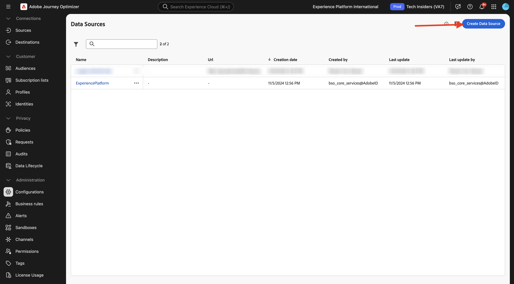
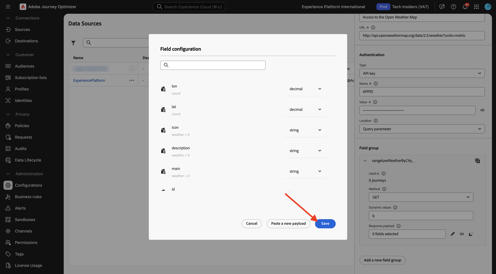

# 3.2.2 Definieren einer externen Datenquelle

In dieser Übung erstellen Sie eine benutzerdefinierte externe Datenquelle, indem Sie Adobe Journey Optimizer verwenden.

Melden Sie sich bei Adobe Journey Optimizer an, indem Sie zu [Adobe Experience Cloud wechseln](https://experience.adobe.com). Auf **Journey Optimizer**.


Sie werden zur Ansicht **Startseite** in Journey Optimizer weitergeleitet. Stellen Sie zunächst sicher, dass Sie die richtige Sandbox verwenden. Die zu verwendende Sandbox heißt `--aepSandboxName--`. Sie befinden sich dann in der **Startseite**-Ansicht Ihres Sandbox-`--aepSandboxName--`.


Scrollen Sie im linken Menü nach unten und klicken Sie auf **Konfigurationen**. Klicken Sie anschließend auf die Schaltfläche **Verwalten** unter **Datenquellen**.


Anschließend wird die Liste **Datenquellen** angezeigt.
Klicken Sie auf **Daten-Source erstellen**, um Ihre Datenquelle hinzuzufügen.



Es wird ein leeres Datenquellen-Popup angezeigt.


Bevor Sie mit der Konfiguration beginnen können, benötigen Sie ein Konto mit dem Service **Open Weather Map**. Führen Sie diese Schritte aus, um Ihr Konto zu erstellen und Ihren API-Schlüssel abzurufen.

Navigieren Sie zu [https://openweathermap.org/](https://openweathermap.org/). Klicken Sie auf der Homepage auf **Anmelden**.


Klicken Sie **Konto erstellen**.


Füllen Sie die Details aus. Klicken Sie **Konto erstellen**.


Sie werden dann zu Ihrer Kontoseite weitergeleitet.


Klicken Sie im Menü auf **API-Schlüssel**, um Ihren API-Schlüssel abzurufen, den Sie zum Einrichten Ihrer benutzerdefinierten externen Datenquelle benötigen.


Ein **API-Schlüssel** sieht wie folgt aus: `b2c4c36b6bb59c3458d6686b05311dc3`.

Die **API-Dokumentation** für **Aktuelles Wetter** finden Sie [hier](https://openweathermap.org/current).

Für diesen Anwendungsfall implementieren Sie die Verbindung mit Open Weather Map basierend auf der Stadt, in der sich der Kunde befindet, mithilfe der **integrierten API-Anfrage nach Stadtname**.


Kehren Sie zurück zu **Adobe Journey Optimizer**, um Ihr leeres Popup **Externe Daten-Source** zu öffnen.


Verwenden Sie `--aepUserLdap--WeatherApi` als Namen für die Datenquelle.

Beschreibung festlegen auf: `Access to the Open Weather Map`.

Die URL für die Open Weather Map-API lautet: `http://api.openweathermap.org/data/2.5/weather?units=metric`.


Als Nächstes müssen Sie die zu verwendende Authentifizierung auswählen.

Verwenden Sie diese Variablen:

| Feld | Wert |
|:-----------------------:| :-----------------------|
| Typ | **API-Schlüssel** |
| Name | **APPID** |
| Wert | **Ihr API-Schlüssel** |
| Standort | **Abfrageparameter** |


Schließlich müssen Sie eine &quot;**&quot; definieren** was im Wesentlichen die Anfrage ist, die Sie an die Wetter-API senden. In unserem Fall möchten wir den Namen der Stadt verwenden, um das aktuelle Wetter für diese Stadt anzufordern.


Gemäß der Dokumentation zur Wetter-API müssen Sie einen `q=City` senden.


Um der erwarteten API-Anfrage zu entsprechen, konfigurieren Sie Ihre Feldergruppe wie folgt:

>[!IMPORTANT]
>
>Der Name der Feldergruppe muss eindeutig sein. Bitte verwenden Sie diese Namenskonvention: `--aepUserLdap--WeatherByCity`


Für die Antwort-Payload müssen Sie ein Beispiel der Antwort einfügen, die von der Wetter-API gesendet wird.

Die erwartete API-JSON-Antwort finden Sie auf der Seite zur API-Dokumentation [hier](https://openweathermap.org/current) unter dem **JSON**-Betreff.


Oder Sie können die JSON-Antwort von hier kopieren:

```json
{
   "coord": {
      "lon": 7.367,
      "lat": 45.133
   },
   "weather": [
      {
         "id": 501,
         "main": "Rain",
         "description": "moderate rain",
         "icon": "10d"
      }
   ],
   "base": "stations",
   "main": {
      "temp": 284.2,
      "feels_like": 282.93,
      "temp_min": 283.06,
      "temp_max": 286.82,
      "pressure": 1021,
      "humidity": 60,
      "sea_level": 1021,
      "grnd_level": 910
   },
   "visibility": 10000,
   "wind": {
      "speed": 4.09,
      "deg": 121,
      "gust": 3.47
   },
   "rain": {
      "1h": 2.73
   },
   "clouds": {
      "all": 83
   },
   "dt": 1726660758,
   "sys": {
      "type": 1,
      "id": 6736,
      "country": "IT",
      "sunrise": 1726636384,
      "sunset": 1726680975
   },
   "timezone": 7200,
   "id": 3165523,
   "name": "Province of Turin",
   "cod": 200
}    
```

Kopieren Sie die obige JSON-Antwort in die Zwischenablage und navigieren Sie dann zu Ihrem Bildschirm für die Konfiguration der benutzerdefinierten Datenquelle.

Klicken Sie auf das **Payload bearbeiten**.


Es wird ein Popup angezeigt, in dem Sie die obige JSON-Antwort einfügen müssen.


Fügen Sie Ihre JSON-Antwort ein. Danach sehen Sie dies. Klicken Sie auf **Speichern**.



Die Konfiguration Ihrer benutzerdefinierten Datenquelle ist jetzt abgeschlossen. Scrollen Sie nach oben und klicken Sie auf **Speichern**.


Ihre Datenquelle wurde erfolgreich erstellt und ist Teil der Liste **Datenquellen**.


## Nächste Schritte

Navigieren Sie zu [3.2.3 Benutzerdefinierte Aktion definieren](./ex3.md){target="_blank"}

Zurück zu [Adobe Journey Optimizer: Externe Datenquellen und benutzerdefinierte Aktionen](journey-orchestration-external-weather-api-sms.md){target="_blank"}

Zurück zu [Alle Module](./../../../../overview.md){target="_blank"}
