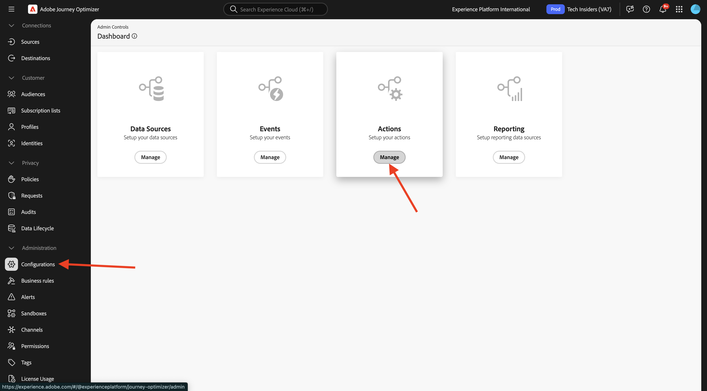
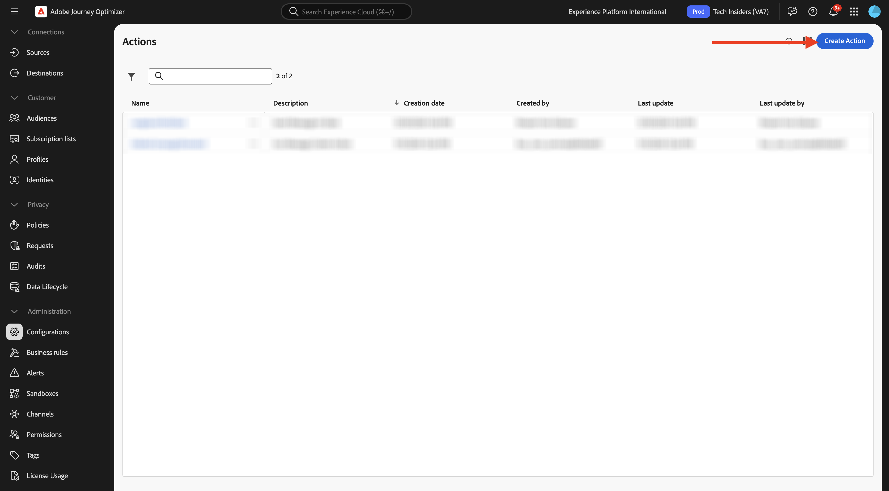
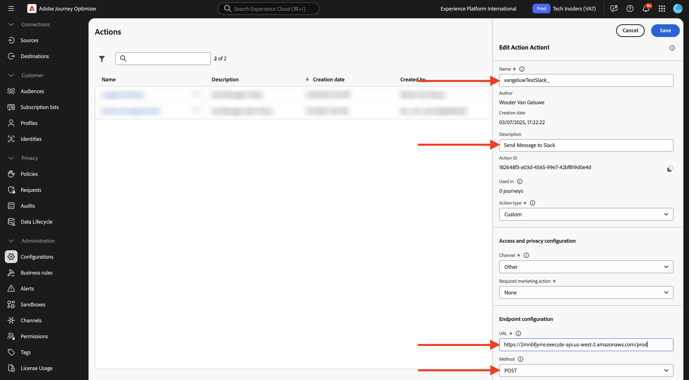

# 3.2.3 Definieren einer benutzerdefinierten Aktion

In dieser Übung erstellen Sie eine benutzerdefinierte Aktion, um eine Nachricht an einen Slack-Kanal zu senden.

Melden Sie sich bei Adobe Journey Optimizer an, indem Sie zu [Adobe Experience Cloud wechseln](https://experience.adobe.com). Auf **Journey Optimizer**.


Sie werden zur Ansicht **Startseite** in Journey Optimizer weitergeleitet. Stellen Sie zunächst sicher, dass Sie die richtige Sandbox verwenden. Die zu verwendende Sandbox heißt `--aepSandboxName--`. Sie befinden sich dann in der **Startseite**-Ansicht Ihres Sandbox-`--aepSandboxName--`.


Sie verwenden jetzt einen vorhandenen Slack-Kanal und senden Nachrichten an diesen Slack-Kanal. Slack verfügt über eine benutzerfreundliche API, für deren Trigger Sie Adobe Journey Optimizer verwenden werden.


Scrollen Sie im linken Menü nach unten und klicken Sie auf **Konfigurationen**. Klicken Sie anschließend auf die Schaltfläche **Verwalten** unter **Aktionen**.



Anschließend wird die Liste **Aktionen** angezeigt. Klicken Sie **Aktion erstellen**.



Es wird ein leeres Aktionspopup angezeigt.


Verwenden Sie `--aepUserLdap--TextSlack` als Namen für die Aktion.

Beschreibung festlegen auf: `Send Message to Slack`.

Verwenden Sie für **URL** Konfiguration Folgendes:

- URL: `https://2mnbfjyrre.execute-api.us-west-2.amazonaws.com/prod`
- Methode: **POST**

>[!NOTE]
>
>Die obige URL bezieht sich auf eine AWS-Lambda-Funktion, die Ihre Anfrage dann wie oben beschrieben an den Slack-Kanal weiterleitet. Dies dient dem Schutz des Zugriffs auf einen Adobe-eigenen Slack-Kanal. Wenn Sie über einen eigenen Slack-Kanal verfügen, sollten Sie eine Slack-App über [https://api.slack.com/](https://api.slack.com/) erstellen. Erstellen Sie dann in dieser Slack-App einen eingehenden Webhook und ersetzen Sie dann die obige URL durch Ihre eingehende Webhook-URL.



Sie müssen die Header-Felder nicht ändern.


**Authentifizierung** sollte auf &quot;**Authentifizierung“** werden.


Unter **Payloads** müssen Sie definieren, welche Felder an Slack gesendet werden sollen. Logischerweise möchten Sie, dass Adobe Journey Optimizer und Adobe Experience Platform das Gehirn der Personalisierung sind. Daher sollte der Text, der an Slack gesendet werden soll, von Adobe Journey Optimizer definiert und dann zur Ausführung an Slack gesendet werden.

Klicken Sie für **Anfrage** auf das Symbol **Payload bearbeiten**.


Daraufhin wird ein leeres Popup-Fenster angezeigt.


Kopieren Sie den unten stehenden Text und fügen Sie ihn in das leere Popup-Fenster ein.

```json
{
 "text": {
  "toBeMapped": true,
  "dataType": "string",
  "label": "textToSlack"
 }
}
```

Sie sehen dann Folgendes:


Scrollen Sie nach oben und klicken Sie noch **auf** Speichern“, um Ihre Aktion zu speichern.


Ihre benutzerdefinierte Aktion ist jetzt Teil der Liste **Aktionen** .


Sie haben Ereignisse, externe Datenquellen und Aktionen definiert. Lassen Sie uns das alles in einer Journey zusammenfassen.

## Nächste Schritte

Wechseln Sie zu [3.2.4 Erstellen von Journey und Nachrichten](./ex4.md){target="_blank"}

Zurück zu [Adobe Journey Optimizer: Externe Datenquellen und benutzerdefinierte Aktionen](journey-orchestration-external-weather-api-sms.md){target="_blank"}

Zurück zu [Alle Module](./../../../../overview.md){target="_blank"}
