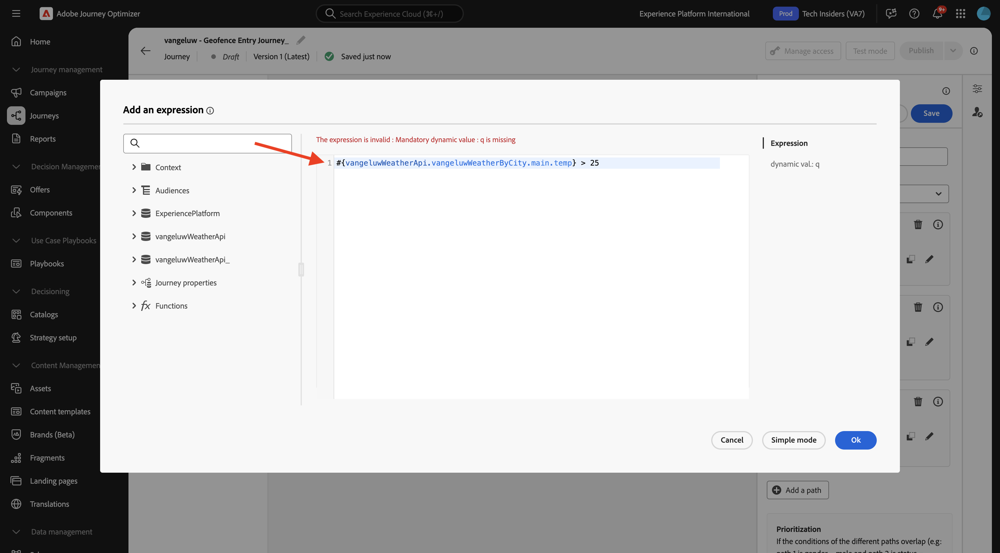
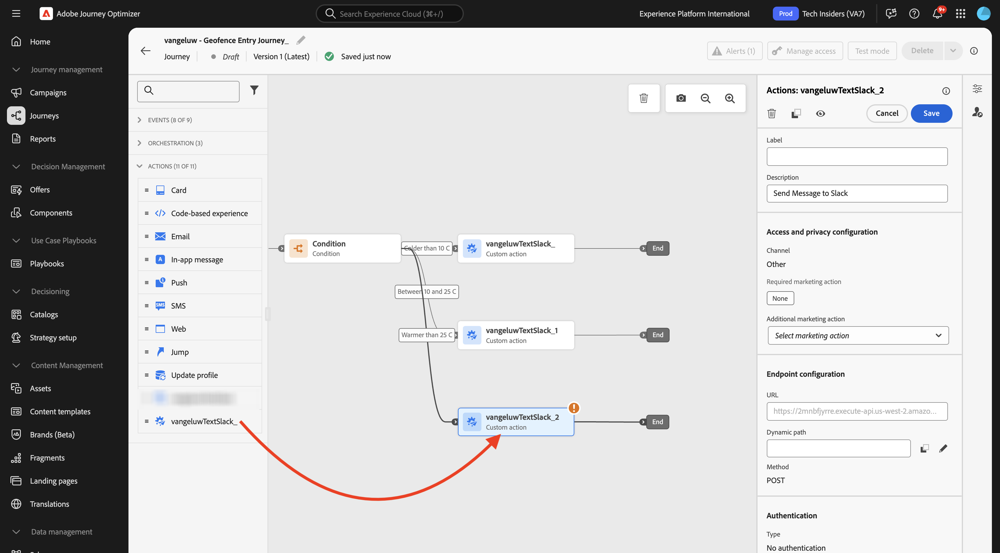

# 3.2.4 Erstellen von Journey und Nachrichten

In dieser Übung erstellen Sie mithilfe von Adobe Journey Optimizer eine Journey und mehrere Textnachrichten.

In diesem Anwendungsfall besteht das Ziel darin, je nach Wetterbedingungen des Standorts Ihres Kunden unterschiedliche Nachrichten zu senden. Es wurden drei Szenarien definiert:

- Kälter als 10° Celsius
- Zwischen 10° und 25° Celsius
- Wärmer als 25° Celsius

Für diese drei Bedingungen müssen Sie drei Nachrichten in Adobe Journey Optimizer definieren.

## 3.2.4.1 Journey erstellen

Melden Sie sich bei Adobe Journey Optimizer an, indem Sie zu [Adobe Experience Cloud wechseln](https://experience.adobe.com). Auf **Journey Optimizer**.


Sie werden zur Ansicht **Startseite** in Journey Optimizer weitergeleitet. Stellen Sie zunächst sicher, dass Sie die richtige Sandbox verwenden. Die zu verwendende Sandbox heißt `--aepSandboxName--`. Sie befinden sich dann in der **Startseite**-Ansicht Ihres Sandbox-`--aepSandboxName--`.


Wechseln Sie im linken Menü zu **Journey** und klicken Sie auf **Journey erstellen** um mit der Erstellung Ihres Journey zu beginnen.


Sie sollten Ihren Journey mit dem Vornamen versehen.

Verwenden Sie `--aepUserLdap-- - Geofence Entry Journey` als Namen für die Journey. Es dürfen derzeit keine anderen Werte festgelegt werden. Klicken Sie auf **Speichern**.


Sehen Sie sich auf der linken Seite Ihres Bildschirms &quot;**&quot;**. Ihr zuvor erstelltes Ereignis sollte in dieser Liste mit dem Namen `--aepUserLdap--GeofenceEntry` angezeigt werden. Wählen Sie es aus und ziehen Sie es dann per Drag-and-Drop auf die Journey-Arbeitsfläche. Ihr Journey sieht dann wie folgt aus:


Klicken Sie anschließend auf **Orchestrierung**. Jetzt sehen Sie die verfügbaren **Orchestration**-Funktionen. Wählen Sie **Bedingung** aus und ziehen Sie es dann per Drag-and-Drop auf die Journey-Arbeitsfläche.


Für diese Bedingung müssen jetzt drei Pfade konfiguriert werden:

- Es ist kälter als zehn Grad Celsius
- Es ist zwischen 10° und 25° Celsius
- Es ist wärmer als 25° Celsius

Definieren wir die erste Bedingung.

### Bedingung 1: Kälter als 10° Celsius

Klicken Sie auf **Bedingung**.  Klicken Sie auf **Path1** und bearbeiten Sie den Namen des Pfads in **älter als 10 C**. Klicken Sie auf das **Bearbeiten**-Symbol für den Ausdruck von Path1.


Daraufhin wird ein leerer Bildschirm **Einfacher Editor** angezeigt. Ihre Abfrage ist etwas komplexer, daher benötigen Sie den **Erweiterten Modus**. Klicken Sie **Erweiterter Modus**.


Daraufhin wird der &quot;**Editor“ angezeigt** mit dem Code eingegeben werden kann.


Wählen Sie den folgenden Code aus und fügen Sie ihn in den **Erweiterten Editor“**.

`#{--aepUserLdap--WeatherApi.--aepUserLdap--WeatherByCity.main.temp} <= 10`

Sie werden es dann sehen.


Um die Temperatur als Teil dieser Bedingung abzurufen, müssen Sie die Stadt angeben, in der sich der Kunde derzeit befindet.
**Stadt** muss mit dem dynamischen `q` verknüpft sein, genau wie Sie es zuvor in der Open Weather-API-Dokumentation gesehen haben.

Klicken Sie auf **Feld (dynamischer Wert: q** wie im Screenshot gezeigt.


Anschließend müssen Sie das Feld finden, das die aktuelle Stadt des Kunden in einer der verfügbaren Datenquellen enthält. In diesem Fall müssen Sie es unter &quot;**&quot;**.


Sie können das Feld finden, indem Sie zu `--aepUserLdap--GeofenceEntry.placeContext.geo.city` navigieren.

Durch Klicken auf dieses Feld oder Klicken auf **+** wird es als dynamischer Wert für den `q` hinzugefügt. Dieses Feld wird beispielsweise mit dem Geolocation-Service ausgefüllt, den Sie in Ihrer Mobile App implementiert haben. In diesem Fall simulieren Sie dies mithilfe der Datenerfassungseigenschaft der Demo-Website. Klicken Sie auf **OK**.


### Bedingung 2: Zwischen 10° und 25° Celsius

Nachdem Sie die erste Bedingung hinzugefügt haben, wird dieser Bildschirm angezeigt. Klicken Sie **Pfad hinzufügen**.


Doppelklicken Sie auf **Path1** und bearbeiten Sie den Pfadnamen in **Zwischen 10 und 25 C**. Klicken Sie auf **Bearbeiten** für den Ausdruck unter diesem Pfad.


Daraufhin wird ein leerer Bildschirm **Einfacher Editor** angezeigt. Ihre Abfrage ist etwas komplexer, daher benötigen Sie den **Erweiterten Modus**. Klicken Sie **Erweiterter Modus**.


Daraufhin wird der &quot;**Editor“ angezeigt** mit dem Code eingegeben werden kann.


Wählen Sie den folgenden Code aus und fügen Sie ihn in den **Erweiterten Editor“**.

`#{--aepUserLdap--WeatherApi.--aepUserLdap--WeatherByCity.main.temp} > 10 and #{--aepUserLdap--WeatherApi.--aepUserLdap--WeatherByCity.main.temp} <= 25`

Sie werden es dann sehen.


Um die Temperatur als Teil dieser Bedingung abzurufen, müssen Sie die Stadt angeben, in der sich der Kunde derzeit befindet.
Der **Stadt** muss mit dem dynamischen Parameter **q** verknüpft sein, wie Sie zuvor in der Open Weather-API-Dokumentation gesehen haben.

Klicken Sie auf **Feld (dynamischer Wert: q** wie im Screenshot gezeigt.


Anschließend müssen Sie das Feld finden, das die aktuelle Stadt des Kunden in einer der verfügbaren Datenquellen enthält.


Sie können das Feld finden, indem Sie zu `--aepUserLdap--GeofenceEntry.placeContext.geo.city` navigieren. Wenn Sie auf dieses Feld klicken, wird es als dynamischer Wert für den Parameter &quot;**&quot;**. Dieses Feld wird beispielsweise mit dem Geolocation-Service ausgefüllt, den Sie in Ihrer Mobile App implementiert haben. In diesem Fall simulieren Sie dies mithilfe der Datenerfassungseigenschaft der Demo-Website. Klicken Sie auf **OK**.


Als Nächstes fügen Sie die dritte Bedingung hinzu.

### Zustand 3: wärmer als 25° Celsius

Nachdem Sie die zweite Bedingung hinzugefügt haben, wird dieser Bildschirm angezeigt. Klicken Sie **Pfad hinzufügen**.


Doppelklicken Sie auf Path1, um den Namen in &quot;**als 25 C“** ändern.
Klicken Sie dann auf das **Bearbeiten**-Symbol für den Ausdruck unter diesem Pfad.


Daraufhin wird ein leerer Bildschirm **Einfacher Editor** angezeigt. Ihre Abfrage ist etwas komplexer, daher benötigen Sie den **Erweiterten Modus**. Klicken Sie **Erweiterter Modus**.


Daraufhin wird der &quot;**Editor“ angezeigt** mit dem Code eingegeben werden kann.


Wählen Sie den folgenden Code aus und fügen Sie ihn in den **Erweiterten Editor“**.

`#{--aepUserLdap--WeatherApi.--aepUserLdap--WeatherByCity.main.temp} > 25`

Sie werden es dann sehen.



Um die Temperatur als Teil dieser Bedingung abzurufen, müssen Sie die Stadt angeben, in der sich der Kunde derzeit befindet.
Der **Stadt** muss mit dem dynamischen Parameter **q** verknüpft sein, wie Sie zuvor in der Open Weather-API-Dokumentation gesehen haben.

Klicken Sie auf **Feld (dynamischer Wert: q** wie im Screenshot gezeigt.


Anschließend müssen Sie das Feld finden, das die aktuelle Stadt des Kunden in einer der verfügbaren Datenquellen enthält.


Sie können das Feld finden, indem Sie zu ```--aepUserLdap--GeofenceEntry.placeContext.geo.city``` navigieren. Wenn Sie auf dieses Feld klicken, wird es als dynamischer Wert für den Parameter &quot;**&quot;**. Dieses Feld wird beispielsweise mit dem Geolocation-Service ausgefüllt, den Sie in Ihrer Mobile App implementiert haben. In diesem Fall simulieren Sie dies mithilfe der Datenerfassungseigenschaft der Demo-Website. Klicken Sie auf **OK**.


Sie haben jetzt drei konfigurierte Pfade. Klicken Sie auf **Speichern**.


Da dies eine Journey für Lernzwecke ist, konfigurieren Sie jetzt eine Reihe von Aktionen, um die Vielfalt der Optionen zu präsentieren, die Marketing-Experten jetzt zum Versand von Nachrichten haben.

## 3.2.4.2 Senden von Nachrichten für Pfad: Kälter als 10° Celsius

Für jeden Temperaturkontext versuchen Sie, eine Textnachricht an einen Kunden zu senden. Für diese Übung senden Sie eine echte Nachricht an einen Slack-Kanal anstelle einer Mobiltelefonnummer.

Konzentrieren wir uns auf den Pfad **Kälter als 10 C**.


Gehen Sie im linken Menü zurück zu **Aktionen** wählen Sie die `--aepUserLdap--TextSlack` Aktion aus und ziehen Sie sie dann nach der Aktion **Nachricht**.


Scrollen Sie nach unten **Anforderungsparameter** und klicken Sie auf das Symbol **Bearbeiten** für die `textToSlack`.


Klicken Sie im Popup-Fenster auf **Erweiterter Modus**.


Wählen Sie den folgenden Code aus, kopieren Sie ihn und fügen Sie ihn in den **Editor für den erweiterten Modus** ein. Klicken Sie auf **OK**.

`"Brrrr..." + #{ExperiencePlatform.ProfileFieldGroup.profile.person.name.firstName} + ",  it's cold and freezing outside. Get comfortable at home with a 20% discount on a Disney+ subscription!"`


Ihre abgeschlossene Aktion wird angezeigt. Scrollen Sie nach oben und klicken Sie auf **Speichern**.


Dieser Pfad der Journey ist jetzt bereit.

## 3.2.4.3 Senden von Nachrichten für den Pfad zwischen 10° und 25° Celsius

Für jeden Temperaturkontext versuchen Sie, eine Nachricht an Ihren Kunden zu senden. Für diese Übung senden Sie eine echte Nachricht an einen Slack-Kanal anstelle einer Mobiltelefonnummer.

Konzentrieren wir uns auf **Zwischen 10 und 25 C** Pfad.


Gehen Sie im linken Menü zurück zu **Aktionen** wählen Sie die `--aepUserLdap--TextSlack` Aktion aus und ziehen Sie sie dann nach der Aktion **Nachricht**.


Scrollen Sie nach unten **Anforderungsparameter** und klicken Sie auf das Symbol **Bearbeiten** für die `textToSlack`.


Klicken Sie im Popup-Fenster auf **Erweiterter Modus**.


Wählen Sie den folgenden Code aus, kopieren Sie ihn und fügen Sie ihn in den **Editor für den erweiterten Modus** ein. Klicken Sie auf **OK**.

`"What nice weather for the time of year, " + #{ExperiencePlatform.ProfileFieldGroup.profile.person.name.firstName} + " 20% discount on Apple AirPods so you can go for a walk and listen to your favorite podcast!"`


Ihre abgeschlossene Aktion wird angezeigt. Scrollen Sie nach oben und klicken Sie auf **Speichern**.


Dieser Pfad der Journey ist jetzt bereit.

## 3.2.4.4 Senden von Nachrichten für Pfad: wärmer als 25° Celsius

Für jeden Temperaturkontext versuchen Sie, eine Nachricht an Ihren Kunden zu senden. Für diese Übung senden Sie eine echte Nachricht an einen Slack-Kanal anstelle einer Mobiltelefonnummer.

Konzentrieren wir uns auf **wärmer als 25 C** Pfad.


Gehen Sie im linken Menü zurück zu **Aktionen** wählen Sie die `--aepUserLdap--TextSlack` Aktion aus und ziehen Sie sie dann nach der Aktion **Nachrichten**.



Scrollen Sie nach unten **Anforderungsparameter** und klicken Sie auf das Symbol **Bearbeiten** für die `textToSlack`.


Klicken Sie im Popup-Fenster auf **Erweiterter Modus**.


Wählen Sie den folgenden Code aus, kopieren Sie ihn und fügen Sie ihn in den **Editor für den erweiterten Modus** ein. Klicken Sie auf **OK**.

`"So warm, " + #{ExperiencePlatform.ProfileFieldGroup.profile.person.name.firstName} + "! 20% discount on adding 10GB of extra data so you can get online at the beach!"`


Ihre abgeschlossene Aktion wird angezeigt. Klicken Sie auf **Speichern**.


Dieser Pfad der Journey ist jetzt bereit.

## 3.2.4.5 Veröffentlichen des Journey

Ihr Journey ist jetzt vollständig konfiguriert. Klicken Sie auf **Veröffentlichen**.


Klicken **erneut auf** Veröffentlichen“.


Ihr Journey ist jetzt veröffentlicht.


## Nächste Schritte

Wechseln Sie zum [3.2.5-Trigger auf Ihrem Journey](./ex5.md){target="_blank"}

Zurück zu [Adobe Journey Optimizer: Externe Datenquellen und benutzerdefinierte Aktionen](journey-orchestration-external-weather-api-sms.md){target="_blank"}

Zurück zu [Alle Module](./../../../../overview.md){target="_blank"}
