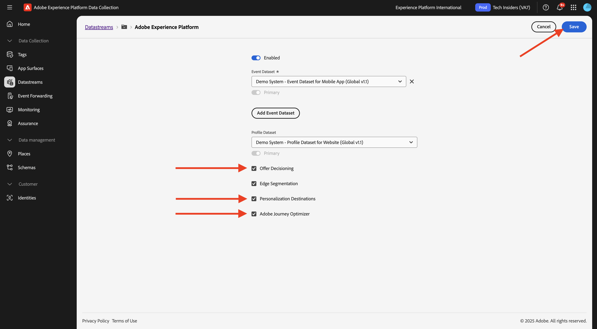
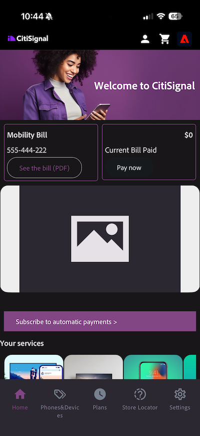
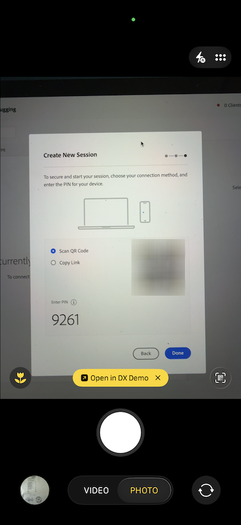

# 3.3.1 Erste Schritte mit Push-Benachrichtigungen

Um Push-Benachrichtigungen mit Adobe Journey Optimizer verwenden zu können, müssen Sie eine Reihe von Einstellungen überprüfen und darüber Bescheid wissen.

Im Folgenden finden Sie alle zu überprüfenden Einstellungen:

- Datensätze und Schemata in Adobe Experience Platform
- Datenstrom für Mobilgeräte
- Datenerfassungseigenschaft für Mobilgeräte
- Programmoberfläche für Push-Zertifikate
- Testen des Push-Setups mit AEP Assurance

Sehen wir uns diese einzeln an.

Melden Sie sich bei Adobe Journey Optimizer an, indem Sie zu [Adobe Experience Cloud wechseln](https://experience.adobe.com). Auf **Journey Optimizer**.

Sie werden zur Ansicht **Startseite** in Journey Optimizer weitergeleitet. Stellen Sie zunächst sicher, dass Sie die richtige Sandbox verwenden. Die zu verwendende Sandbox heißt `--aepSandboxName--`. Sie befinden sich dann in der **Startseite**-Ansicht Ihres Sandbox-`--aepSandboxName--`.

## Push-Datensatz 3.4.4.1

Adobe Journey Optimizer verwendet Datensätze, um Dinge wie die Push-Token von Mobilgeräten oder Interaktionen mit Push-Nachrichten (z. B.: gesendete Nachricht, geöffnete Nachricht usw.) in einem Datensatz in Adobe Journey Optimizer zu speichern.

Diese Datensätze finden Sie unter **[!UICONTROL Datensätze]** im Menü auf der linken Bildschirmseite. Um Systemdatensätze anzuzeigen, klicken Sie auf das Filtersymbol.

Aktivieren Sie die Option **Systemdatensätze anzeigen** und suchen Sie nach **AJO**. Anschließend werden die für Push-Benachrichtigungen verwendeten Datensätze angezeigt.

## 3.4.4.2 für Mobilgeräte

Navigieren Sie zu [https://experience.adobe.com/#/data-collection/](https://experience.adobe.com/#/data-collection/).

Gehen Sie im linken Menü zu **[!UICONTROL Datenstrom]** und suchen Sie nach Ihrem Datenstrom, den Sie in [Erste Schritte](./../../../../modules/getting-started/gettingstarted/ex2.md) erstellt haben, der `--aepUserLdap-- - Demo System Datastream (Mobile)` heißt. Klicken, um sie zu öffnen.

Klicken Sie **{**}Adobe Experience Platform **-Service auf Bearbeiten.**

Anschließend werden die definierten Datenstromeinstellungen angezeigt und Sie erfahren, in welchen Datensätzen Ereignisse und Profilattribute gespeichert werden.

Sie sollten auch die folgenden Optionen aktivieren, wenn sie noch nicht aktiviert sind:

- **Offer Decisioning**
- **Personalisierungsziele**
- **Adobe Journey Optimizer**

Klicken Sie auf **Speichern**.

## 3.4.4.3 Überprüfen der Datenerfassungseigenschaft für Mobilgeräte

Navigieren Sie zu [https://experience.adobe.com/#/data-collection/](https://experience.adobe.com/#/data-collection/). Im Rahmen von [Erste Schritte](./../../../../modules/getting-started/gettingstarted/ex1.md) wurden zwei Datenerfassungseigenschaften erstellt.
Sie haben diese Datenerfassungs-Client-Eigenschaften bereits als Teil früherer Module verwendet.

Klicken Sie, um die Datenerfassungseigenschaft für Mobilgeräte zu öffnen.

Wechseln Sie in Ihrer Datenerfassungseigenschaft zu **Erweiterungen**. Anschließend werden die verschiedenen Erweiterungen angezeigt, die für die Mobile App erforderlich sind. Klicken, um Erweiterung **Adobe Experience Platform Edge Network** zu öffnen.

Anschließend sehen Sie, dass Ihr Datenstrom für Mobilgeräte hier verknüpft ist. Klicken Sie anschließend auf **Abbrechen**, um zur Übersicht über Ihre Erweiterungen zurückzukehren.

Dann bist du wieder hier. Es wird die Erweiterung für **AEP Assurance** angezeigt. Mit AEP Assurance können Sie die Datenerfassung und die Bereitstellung von Erlebnissen in Ihrer Mobile App untersuchen, testen, simulieren und validieren. Weitere Informationen zu AEP Assurance und Project Griffon finden Sie hier [https://aep-sdks.gitbook.io/docs/beta/project-griffon](https://aep-sdks.gitbook.io/docs/beta/project-griffon).

Klicken Sie anschließend auf **Konfigurieren**, um die Erweiterung **Adobe Journey Optimizer** zu öffnen.

Anschließend sehen Sie, dass hier der Datensatz für das Tracking von Push-Ereignissen verknüpft ist.

Sie müssen keine Änderungen an Ihrer Datenerfassungseigenschaft vornehmen.

## 3.4.4.4 Überprüfen der Einrichtung der Programmoberfläche

Navigieren Sie zu [https://experience.adobe.com/#/data-collection/](https://experience.adobe.com/#/data-collection/). Gehen Sie im linken Menü zu **Programmoberflächen** und öffnen Sie die Programmoberfläche für **DX Demo App APNS**.

Anschließend wird die konfigurierte Programmoberfläche für iOS und Android angezeigt.

## 3.4.4.5 Testen der Einrichtung von Push-Benachrichtigungen mit AEP Assurance.

Sobald die App installiert ist, finden Sie sie auf dem Startbildschirm Ihres Geräts. Klicken Sie auf das Symbol, um die App zu öffnen.

Wenn Sie die App zum ersten Mal verwenden, werden Sie aufgefordert, sich mit Ihrer Adobe ID anzumelden. Schließen Sie den Anmeldevorgang ab.

Nach der Anmeldung wird eine Benachrichtigung angezeigt, in der Sie um Ihre Erlaubnis zum Senden von Benachrichtigungen gebeten werden. Wir senden Benachrichtigungen im Rahmen des Tutorials. Klicken Sie daher auf **Zulassen**.

Anschließend wird die Startseite der App angezeigt. Navigieren Sie zu **Einstellungen**.

In den Einstellungen wird angezeigt, dass derzeit ein &quot;**Projekt** in der App geladen ist. Klicken Sie auf **Benutzerdefiniertes Projekt**.

Sie können jetzt ein benutzerdefiniertes Projekt laden. Klicken Sie auf den QR-Code, um Ihr Projekt einfach zu laden.

Nachdem Sie den Abschnitt **Erste Schritte** durchlaufen haben, hatten Sie dieses Ergebnis. Klicken Sie hier, um das **Mobile-Einzelhandelsprojekt** zu öffnen, das für Sie erstellt wurde.

Falls Sie Ihr Browser-Fenster versehentlich geschlossen haben oder zukünftige Demo- oder Aktivierungssitzungen geplant sind, können Sie unter [https://dsn.adobe.com/projects](https://dsn.adobe.com/projects) auch auf Ihr Website-Projekt zugreifen. Nachdem Sie sich mit Ihrer Adobe ID angemeldet haben, sehen Sie Folgendes. Klicken Sie auf Ihr Mobile-App-Projekt, um es zu öffnen.

Klicken Sie anschließend auf **Ausführen**.

Sie sehen dann dieses Popup, das einen QR-Code enthält. Scannen Sie diesen QR-Code aus der mobilen App heraus.

Anschließend wird Ihre Projekt-ID in der App angezeigt, wonach Sie auf &quot;**&quot;** können.

Gehen Sie nun zurück zu **Startseite** in der App. Ihre App kann jetzt verwendet werden.

Sie müssen jetzt einen QR-Code scannen, um Ihr Mobilgerät mit Ihrer AEP Assurance-Sitzung zu verbinden.

Um eine AEP Assurance-Sitzung zu starten, navigieren Sie zu [https://experience.adobe.com/#/data-collection/](https://experience.adobe.com/#/data-collection/). Klicken Sie im **Menü auf** Assurance. Klicken Sie dann auf **Sitzung erstellen**.

Klicken Sie auf **Starten**.

Füllen Sie die Werte aus:

- Sitzungsname: Verwenden Sie `--aepUserLdap-- - push debugging` und ersetzen Sie ldap durch Ihren ldap
- Basis-URL: `dxdemo://default` verwenden

Klicken Sie auf **Weiter**.

Daraufhin wird ein QR-Code auf dem Bildschirm angezeigt, den Sie mit Ihrem iOS-Gerät scannen sollten.

Öffnen Sie auf Ihrem Mobilgerät die Kamera-App und scannen Sie den QR-Code, der von AEP Assurance angezeigt wird.

Daraufhin wird ein Popup-Fenster angezeigt, in dem Sie aufgefordert werden, den PIN-Code einzugeben. Kopieren Sie den PIN-Code von Ihrem AEP Assurance-Bildschirm und klicken Sie auf **Verbinden**.

Sie werden es dann sehen.

In Assurance sehen Sie jetzt, dass ein Gerät zur Assurance-Sitzung hinzugefügt wird. Klicken Sie auf **Fertig**.

Navigieren Sie zu **Push-**.

>[!NOTE]
>
>Falls Sie **Push Debug** im linken Menü nicht finden können, klicken Sie **Konfigurieren** in der linken unteren Ecke Ihres Bildschirms und fügen Sie **Push Debug** zum Menü hinzu.

Sie werden so etwas sehen.

Eine Erklärung:

- Die erste Spalte, **Client**, zeigt die verfügbaren IDs auf Ihrem iOS-Gerät. Es werden eine ECID und ein Push-Token angezeigt.
- In der zweiten Spalte werden die **App Store-Anmeldeinformationen und -** Konfiguration) angezeigt, die im Rahmen der Übung **3.4.5.4Erstellen der App-Konfiguration in Launch eingerichtet wurden**
- Die zweite Spalte zeigt **Profil**-Informationen mit zusätzlichen Informationen darüber, in welcher Plattform das Push-Token lebt (APNS oder APNSSandbox). Wenn Sie auf die Schaltfläche **Profil überprüfen** klicken, gelangen Sie zu Adobe Experience Platform und Sie sehen das vollständige Echtzeit-Kundenprofil.

Um die Einrichtung Ihrer Push-Konfiguration zu testen, navigieren Sie zur Schaltfläche **Test-Push-Einrichtung senden**. Klicken Sie **Test-Push-Benachrichtigung senden**

Stellen Sie sicher, dass die **DX Demo**-App nicht geöffnet ist, wenn Sie auf die Schaltfläche **Push-Benachrichtigung senden** klicken. Wenn die App geöffnet ist, wird die Push-Benachrichtigung möglicherweise im Hintergrund empfangen und nicht angezeigt.

Anschließend wird eine Push-Benachrichtigung wie diese auf Ihrem Mobilgerät angezeigt.

Wenn Sie die Push-Benachrichtigung erhalten haben, bedeutet dies, dass Ihre Einrichtung korrekt ist und gut funktioniert und Sie jetzt eine echte Journey erstellen können, die zum Senden einer Push-Nachricht von Journey Optimizer führt.

## Nächste Schritte

Wechseln Sie zu [3.3.2 Konfigurieren eines Journey mit Push-Nachrichten](./ex2.md){target="_blank"}

Zurück zu [Adobe Journey Optimizer: Push- und In-App-Nachrichten](ajopushinapp.md){target="_blank"}

Zurück zu [Alle Module](./../../../../overview.md){target="_blank"}
