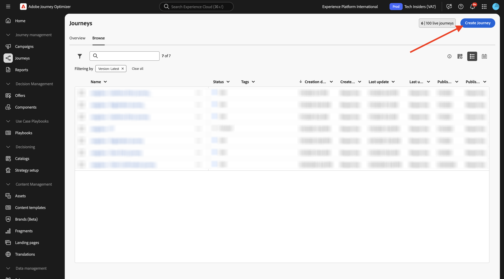
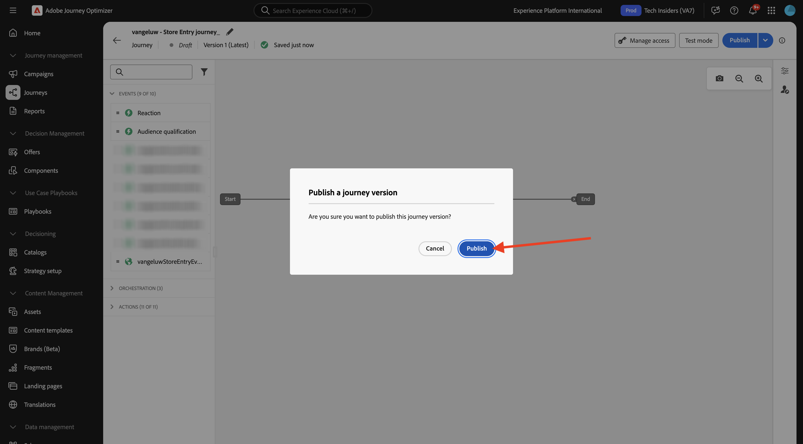
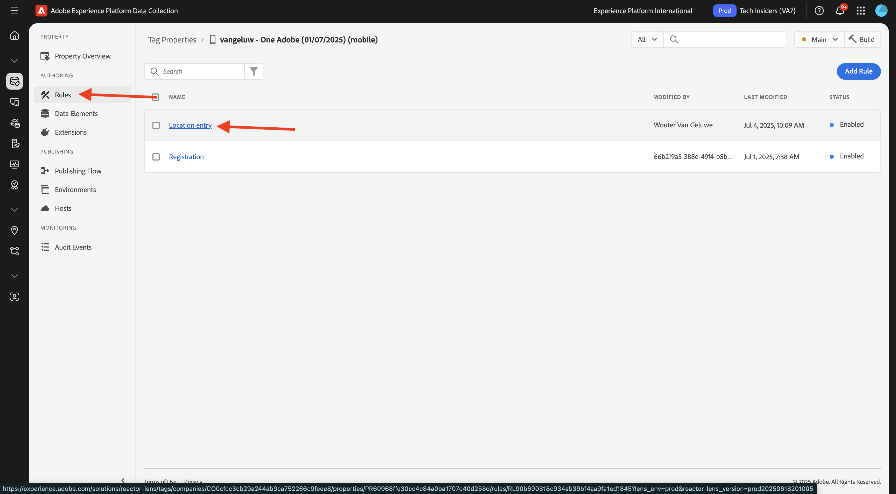
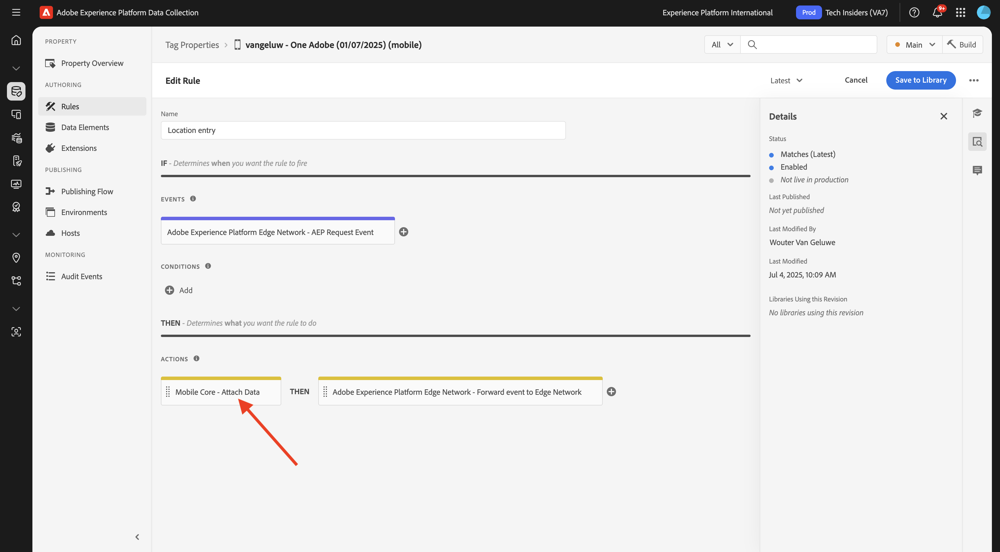

# 3.3.2 Konfigurieren eines Journey mit Push-Nachrichten

Melden Sie sich bei Adobe Journey Optimizer an, indem Sie zu [Adobe Experience Cloud wechseln](https://experience.adobe.com). Auf **Journey Optimizer**.

Sie werden zur Ansicht **Startseite** in Journey Optimizer weitergeleitet. Stellen Sie zunächst sicher, dass Sie die richtige Sandbox verwenden. Die zu verwendende Sandbox heißt `--aepSandboxName--`. Sie befinden sich dann in der **Startseite**-Ansicht Ihres Sandbox-`--aepSandboxName--`.

## 3.3.2.1 Neues Ereignis erstellen

Wechseln Sie im linken Menü zu **Konfigurationen** und klicken Sie unter **Ereignisse** auf **Verwalten**.

Auf dem **Ereignisse** wird eine ähnliche Ansicht angezeigt. Klicken Sie **Ereignis erstellen**.

Anschließend wird eine leere Ereigniskonfiguration angezeigt.
Geben Sie Ihrem Ereignis zunächst einen Namen wie den folgenden: `--aepUserLdap--StoreEntryEvent` und legen Sie die Beschreibung auf `Store Entry Event` fest.
Als Nächstes sehen Sie **Auswahl** Ereignistyp). Wählen Sie **Unitär** aus.
Als Nächstes sehen Sie die Auswahl **Ereignis-ID-**). Wählen Sie **Systemgeneriert** aus.

Als Nächstes sehen Sie die Schemaauswahl. Für diese Übung wurde ein Schema vorbereitet. Verwenden Sie das Schema `Demo System - Event Schema for Mobile App (Global v1.1) v.1`.

Nach Auswahl des Schemas werden Sie eine Reihe von Feldern sehen, die im Abschnitt **Payload** ausgewählt sind. Stellen Sie sicher, **das Feld** Namespace) auf **ECID** eingestellt ist. Ihr Ereignis ist jetzt vollständig konfiguriert.

Klicken Sie auf **Speichern**.

Ihr Ereignis ist jetzt konfiguriert und gespeichert. Klicken Sie erneut auf Ihr Ereignis, um den Bildschirm **Ereignis bearbeiten** erneut zu öffnen.

Bewegen Sie den Mauszeiger über **Feld** Payload“ und klicken Sie auf das Symbol **Payload anzeigen**.

Im Folgenden sehen Sie ein Beispiel für die erwartete Payload.

Ihr Ereignis verfügt über eine eindeutige Orchestrierungs-eventID, die Sie finden können, indem Sie in dieser Payload nach unten scrollen, bis Sie `_experience.campaign.orchestration.eventID` sehen.

Die Ereignis-ID muss an Adobe Experience Platform gesendet werden, um die Journey, die Sie im nächsten Schritt erstellen, zum Trigger zu bringen. Notieren Sie sich diese eventID, da Sie sie im nächsten Schritt benötigen werden.
`"eventID": "aa895251f76831e6440f169f1bb9d2a4388f0696d8e2782cfab192a275817dfa"`

Klicken Sie auf **OK**.

Klicken Sie **Abbrechen**.

## 3.3.2.2 Erstellen einer Journey

Wechseln Sie im linken Menü zu **Journey** und klicken Sie auf **Journey erstellen**.

Sie werden es dann sehen. Benennen Sie Ihren Journey wie folgt: `--aepUserLdap-- - Store Entry journey`. Klicken Sie auf **Speichern**.

Zunächst müssen Sie Ihr Ereignis als Ausgangspunkt Ihres Journey hinzufügen. Suchen Sie nach Ihrer `--aepUserLdap--StoreEntryEvent` und ziehen Sie sie per Drag-and-Drop auf die Arbeitsfläche. Klicken Sie auf **Speichern**.

Suchen Sie als Nächstes unter **Aktionen** nach der **Push**-Aktion. Ziehen Sie die Aktion **Push** per Drag-and-Drop auf die Arbeitsfläche.

Legen Sie die **Kategorie** auf **Marketing** fest und wählen Sie eine Push-Oberfläche aus, mit der Sie Push-Benachrichtigungen senden können. In diesem Fall ist die auszuwählende E-Mail-Oberfläche **Push-iOS-Android**.

>[!NOTE]
>
>Es muss ein Kanal in Journey Optimizer vorhanden sein, der die **App-Oberfläche** wie zuvor beschrieben verwendet.

Der nächste Schritt besteht darin, Ihre Nachricht zu erstellen. Klicken Sie dazu auf **Inhalt bearbeiten**.

Sie werden es dann sehen. Klicken Sie auf **Personalisierung** für das Feld **Titel**.

Sie werden es dann sehen. Sie können jetzt jedes Profilattribut direkt aus dem Echtzeit-Kundenprofil auswählen.

Suchen Sie nach dem Feld **Vorname** und klicken Sie dann auf das Symbol **+** neben dem Feld **Vorname**. Anschließend wird das Personalisierungs-Token für Vorname hinzugefügt: **{{profile.person.name.firstName}}**.

Als Nächstes fügen Sie den Text **hinzu, willkommen in unserem Shop!** hinter **{{profile.person.name.firstName}}**.

Klicken Sie auf **Speichern**.

Jetzt hast du das. Klicken Sie auf **Personalisierung** für das Feld **Hauptteil**.

Geben Sie diesen Text ein **Klicken Sie hier, um einen Rabatt von 10 % zu erhalten, wenn Sie heute kaufen!** und klicken Sie auf **Speichern**.

Dann hast du das hier. Klicken Sie auf den Pfeil oben links, um zu Ihrem Journey zurückzukehren.

Klicken Sie **Speichern**, um die Push-Aktion zu schließen.

Klicken Sie auf **Veröffentlichen**.

Klicken **erneut auf** Veröffentlichen“.

Ihr Journey ist jetzt veröffentlicht.

## 3.3.2.3 Aktualisieren der Datenerfassungseigenschaft für Mobilgeräte

In **Erste Schritte** hat Demosystem Next Tags-Eigenschaften für Sie erstellt: eine für die Website und eine für die Mobile App. Suchen Sie sie, indem Sie im Feld `--aepUserLdap--` nach ****. Klicken Sie, um die Eigenschaft **Mobil** zu öffnen.

Sie sollten das dann sehen.

Wechseln Sie im linken Menü zu **Regeln** und klicken Sie, um die Regel (**) zu**.

Sie sollten das dann sehen. Klicken Sie auf die Aktion **Mobile Core - Daten anhängen**.

Sie sollten das dann sehen.

Fügen Sie die eventID Ihrer `--aepUserLdap--StoreEntryEvent` in das Fenster **JSON Payload** ein. Klicken Sie auf **Änderungen beibehalten**.

Klicken Sie **Speichern** oder **In Bibliothek speichern**.

Wechseln Sie zu **Veröffentlichungsfluss** und klicken Sie, um die Bibliothek **Main** zu öffnen.

Klicken Sie auf **Alle geänderten Ressourcen hinzufügen** und anschließend auf **Für Entwicklung speichern und erstellen**.

## 3.3.2.4 Testen von Journey- und Push-Nachrichten

Öffnen Sie die **DSN Mobile**-Anwendung.

Navigieren Sie zur Seite **Store-Locator**.

Klicken Sie **POI-Eintrag simulieren**.

Nach einigen Sekunden wird die Push-Benachrichtigung angezeigt.

## Nächste Schritte

Navigieren Sie zu [3.3.3 Konfigurieren einer Kampagne mit In-App-Nachrichten](./ex3.md){target="_blank"}

Zurück zu [Adobe Journey Optimizer: Push- und In-App-Nachrichten](ajopushinapp.md){target="_blank"}

Zurück zu [Alle Module](./../../../../overview.md){target="_blank"}