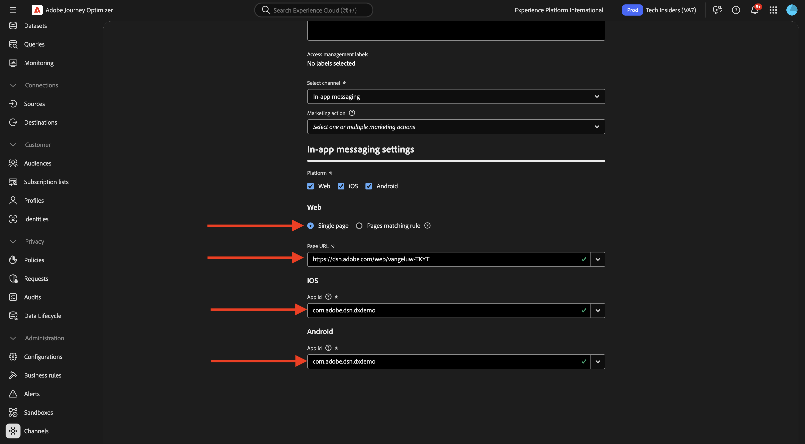
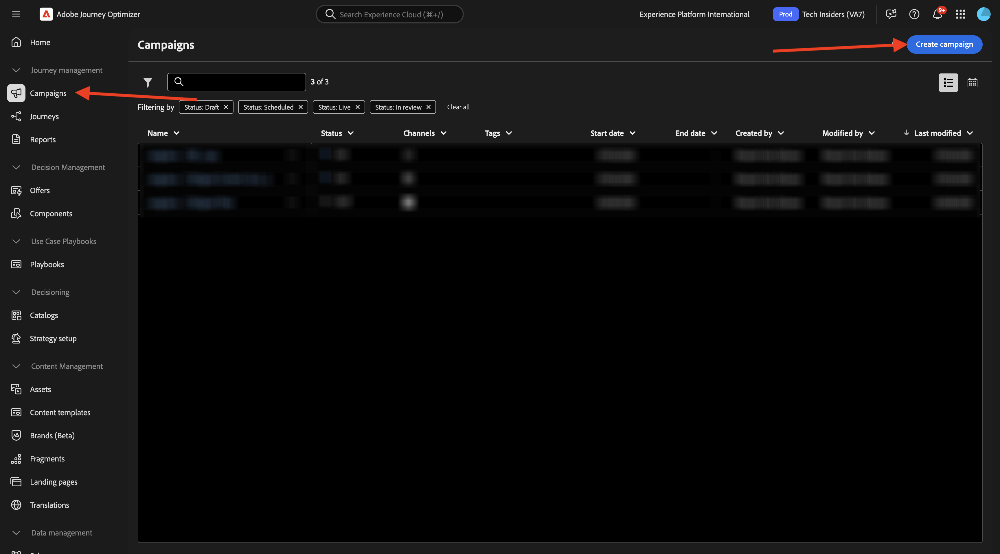

# 3.3.3 Konfigurieren einer Kampagne mit In-App-Nachrichten

Melden Sie sich bei Adobe Journey Optimizer an, indem Sie zu [Adobe Experience Cloud wechseln](https://experience.adobe.com). Auf **Journey Optimizer**.

Sie werden zur Ansicht **Startseite** in Journey Optimizer weitergeleitet. Stellen Sie zunächst sicher, dass Sie die richtige Sandbox verwenden. Die zu verwendende Sandbox heißt `--aepSandboxName--`. Sie befinden sich dann in der **Startseite**-Ansicht Ihres Sandbox-`--aepSandboxName--`.

## Konfiguration 3.3.3.1 In-App-Nachrichtenkanals

Gehen Sie im linken Menü zu **Kanäle** und wählen Sie dann **Kanalkonfigurationen** aus. Klicken Sie **Kanalkonfiguration erstellen**.

Geben Sie den Namen ein: `--aepUserLdap--_In-app_Messages`, wählen Sie den Kanal **In-App-** aus und aktivieren Sie dann die Plattformen **Web**, **iOS** und **Android**.

Scrollen Sie nach unten. Sie sollten dann Folgendes sehen.

Stellen Sie sicher **dass „Einzelne Seite** aktiviert ist.

Geben Sie **Web** die URL der Website ein, die zuvor als Teil des Moduls **Erste Schritte** erstellt wurde. Sie sieht wie folgt aus: `https://dsn.adobe.com/web/--aepUserLdap---XXXX`. Vergessen Sie nicht, den **XXXX** in den eindeutigen Code Ihrer Website zu ändern.

Geben Sie für &lbrace;0 **iOS** und **Android** ein.`com.adobe.dsn.dxdemo`

Scrollen Sie nach oben und klicken Sie auf **Absenden**.

Ihre Kanalkonfiguration kann jetzt verwendet werden.

## 3.3.3.2 Konfigurieren einer geplanten Kampagne für In-App-Nachrichten

Gehen Sie im linken Menü zu **Kampagnen** und klicken Sie dann auf **Kampagne erstellen**.

Wählen Sie **Geplant - Marketing** und klicken Sie dann auf **Erstellen**.

Geben Sie den `--aepUserLdap-- - CitiSignal Fiber Max` ein und klicken Sie dann auf **Aktionen**.

Klicken Sie auf **+ Aktion** und wählen Sie dann **In-App-Nachricht** aus.

Wählen Sie die Konfiguration des In-App-Nachrichtenkanals aus, die Sie im vorherigen Schritt erstellt haben und die folgendermaßen lautet: `--aepUserLdap--_In-app_Messages`. Klicken Sie auf **Inhalt bearbeiten**.

Sie sollten das dann sehen. Klicken Sie auf **Modal**.

Klicken Sie **Layout ändern**.

Klicken Sie auf das **Medien-URL**-Symbol, um Assets aus AEM Assets auszuwählen.

Gehen Sie zum Ordner **Citisignal-images** und wählen Sie die Bilddatei **neon-rabbit.jpg** aus. Klicken Sie auf **Auswählen**.

Verwenden Sie für **Text** Kopfzeile): `CitiSignal Fiber Max`.
Verwenden Sie für **Text** Hauptteil): `Conquer lag with Fiber Max`.

Legen Sie den **#1-Text** auf `Go to Plans` fest.
Legen Sie die **Ziel** auf `com.adobe.dsn.dxdemo://plans` fest.

Klicken Sie auf **Zum Aktivieren überprüfen**.

Klicken Sie **Aktivieren**.

Der Status Ihrer Kampagne ist jetzt auf &quot;**&quot;**. Es kann einige Minuten dauern, bevor die Kampagne live ist.

Sobald der Status auf &quot;**&quot; geändert wurde** können Sie Ihre Kampagne testen.

## 3.3.3.3 Testen der In-App-Messaging-Kampagne auf einem Mobilgerät

Öffnen Sie die App auf Ihrem Mobilgerät. Nach dem Starten der App sollte dann die neue In-App-Nachricht angezeigt werden. Klicken Sie auf die Schaltfläche **Zu Plänen wechseln**.

Sie werden dann zur Seite &quot;**&quot;**.

## Nächste Schritte

Wechseln Sie zu [Zusammenfassung und Vorteile](./summary.md){target="_blank"}

Zurück zu [Adobe Journey Optimizer: Push- und In-App-Nachrichten](ajopushinapp.md){target="_blank"}

Zurück zu [Alle Module](./../../../../overview.md){target="_blank"}
