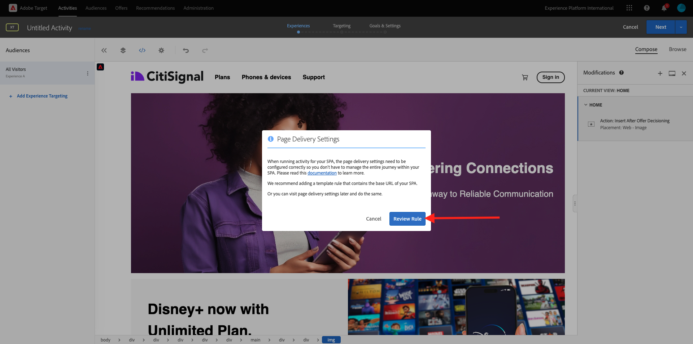

# 3.3.4 Adobe Target und Offer Decisioning kombinieren

## 3.3.4.1 Abruf des freigebbaren Links Ihres Demoprojekts

Um das Demo-Website-Projekt in Adobe Target zu laden, müssen Sie zunächst einen speziellen Link erfassen, über den Adobe Target Ihr Demo-Website-Projekt laden kann.

Navigieren Sie dazu zu [https://dsn.adobe.com/projects](https://builder.adobedemo.com/projects). Nachdem Sie sich mit Ihrer Adobe ID angemeldet haben, sehen Sie Folgendes. Klicken Sie auf Ihr Website-Projekt, um es zu öffnen.

Das wirst du jetzt sehen. Navigieren Sie zu **Freigeben**. Klicken Sie auf **Link erstellen** und kopieren Sie dann den Link in die Zwischenablage.

Wechseln Sie zu [https://bitly.com](https://bitly.com), fügen Sie den kopierten Link ein und klicken Sie auf **Link erstellen**.

Sie erhalten jetzt einen gekürzten Link, der wie folgt aussieht: `https://adobe.ly/3PpGcFk`. Sie benötigen diesen Link in der nächsten Übung.

## 3.3.4.2

Rufen Sie jetzt die Adobe Experience Cloud-Homepage auf. Wechseln Sie dazu zu [https://experiencecloud.adobe.com/](https://experiencecloud.adobe.com/). Klicken Sie auf **Target**.

Auf der Startseite von {**}Adobe Target werden alle vorhandenen Aktivitäten angezeigt.** Klicken Sie auf **Aktivität erstellen** und dann auf **Erlebnis-Targeting**.

Wählen Sie nun **Visual** und fügen Sie den gekürzten Link in das Feld **Enter Activity URL** ein. Klicken Sie auf **Erstellen**.

Anschließend wird Ihr Demo-Website-Projekt in Visual Experience Composer geladen.

>[!NOTE]
>
>Falls Ihre Website nicht korrekt geladen wird, installieren und aktivieren Sie diese Chrome-Erweiterung: **Adobe Target VEC Helper** über den Chrome Web Store, und versuchen Sie es dann erneut.

Klicken Sie auf den Bereich, der das Disney+-Angebot enthält. Stellen Sie sicher, dass Sie den vollständigen **Container** auswählen. Klicken Sie **Einfügen vor** und wählen Sie dann **Angebotsentscheidung** aus.

Dann sehen Sie dieses Popup. Wählen Sie Ihre Sandbox-`--aepSandboxName--` und dann die Platzierung **Web - Bild** aus.

Wählen Sie als Nächstes Ihre `--aepUserLdap-- - CitiSignal Decision` aus. Klicken Sie auf **Speichern**.

Sie werden es dann sehen. Klicken Sie **Regel überprüfen**.

Stellen Sie sicher, dass die zusätzliche Vorlagenregel **URL** **contains** **your-project-name**. Klicken Sie auf **Speichern**.

Sie werden es dann sehen. Klicken Sie auf **Weiter**.

Geben Sie einen Namen für Ihr Angebot ein. Verwenden Sie diesen Namen: `--aepUserLdap-- - XT with Offers (VEC)`. Klicken Sie auf **Weiter**.

Sie werden es dann sehen. Definieren Sie **Zielmetrik** wie angegeben. Klicken Sie **Speichern und schließen**.

Ihr Angebot wurde erstellt und wird veröffentlicht. Sobald Ihr Angebot veröffentlicht wurde, können Sie es aktivieren.

## Nächste Schritte

Navigieren Sie zu [3.3.5 Verwenden Sie Ihre Entscheidung in einer E-Mail und SMS](./ex5.md){target="_blank"}

Zurück zu [Offer Decisioning](offer-decisioning.md){target="_blank"}

Zurück zu [Alle Module](./../../../../overview.md){target="_blank"}
