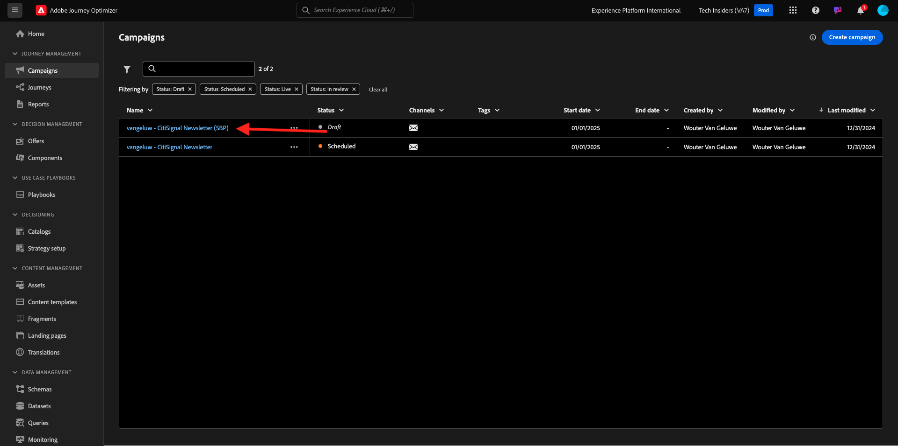
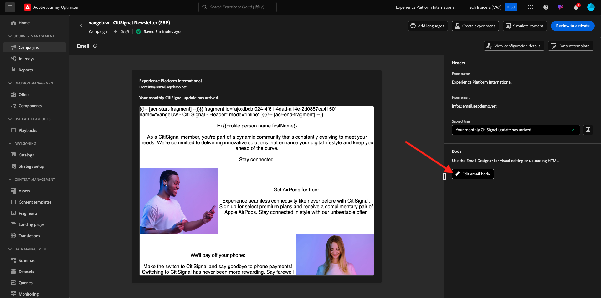

# 3.4.3 Anwenden der segmentbasierten Personalisierung in einer E-Mail-Nachricht

Melden Sie sich bei Adobe Experience Cloud an, indem Sie zu [Adobe Experience Cloud wechseln](https://experience.adobe.com). Auf **Adobe Journey Optimizer**.

Sie werden zur Ansicht **Startseite** in Journey Optimizer weitergeleitet. Bevor Sie fortfahren, müssen Sie eine **Sandbox“**. Die auszuwählende Sandbox hat den Namen ``--aepTenantId--``.

## 3.4.3.1 segmentbasierte Personalisierung

In dieser Übung verbessern Sie die in der vorherigen Übung erstellte Newsletter-E-Mail-Nachricht mit einem personalisierten Text, der auf der Segmentzugehörigkeit basiert.

Navigieren Sie zu **Kampagnen**. Suchen Sie die Newsletter-Journey, die Sie in der vorherigen Übung erstellt haben. Suchen Sie nach `--aepUserLdap-- - CitiSignal Newsletter`. Klicken Sie mit der rechten Maustaste auf die 3 Punkte **…** und klicken Sie auf **Duplizieren**.

Sie werden es dann sehen. Verwenden Sie dies für den **Titel**: `--aepUserLdap-- - CitiSignal Newsletter (SBP)`. Klicken Sie auf **Duplizieren**.

Klicken Sie auf die duplizierte Kampagne, um sie zu öffnen.

Klicken Sie **Bearbeiten**, um den Inhalt zu ändern.

Klicken Sie **E-Mail-Textkörper bearbeiten**.

Sie werden es dann sehen.

Öffnen Sie **Inhaltskomponenten** und ziehen Sie eine **1:1-Spalte** über das AirPods-Angebot.

Ziehen Sie eine **Text**-Komponente per Drag-and-Drop in diese 1:1-Spalte.

Wählen Sie den gesamten Standardtext aus und löschen Sie ihn. Klicken Sie dann auf die **Personalisierung hinzufügen** in der Symbolleiste.

Sie werden es dann sehen. Klicken Sie im linken Menü auf **Zielgruppen**.

Wählen Sie die `--aepUserLdap-- - Interest in Plans` aus und klicken Sie auf das Symbol **+** , um sie zur Arbeitsfläche hinzuzufügen.

Sie sollten dann die erste Zeile so lassen, wie sie ist, und Zeile 2 und 3 durch diesen Code ersetzen:

``
    PS: It may be a good idea to check if your plan still meets your needs! Click here to be contacted by one of our experts!

    PS: Thanks for taking the time to read our newsletter. Here is a 10% promo code to use on the website: NEWSLETTER10

``

Dann hast du das hier. Klicken Sie auf **Speichern**.

Ändern Sie die Textausrichtung in **Ausrichtung zentrieren**.

Sie können diese Nachricht jetzt speichern, indem Sie auf die **Speichern**-Schaltfläche oben rechts klicken. Klicken Sie dann **Pfeil** neben dem Betreffzeilentext in der oberen linken Ecke.

Klicken Sie auf **Zum Aktivieren überprüfen**.

Klicken Sie **Aktivieren**.

Ihr Newsletter mit segmentbasierter Personalisierung ist jetzt veröffentlicht. Ihre Newsletter-E-Mail-Nachricht wird auf der Grundlage Ihres Zeitplans gesendet und Ihr Journey wird gestoppt, sobald die letzte E-Mail gesendet wurde.

Wenn Sie sich für das verwendete Segment qualifizieren, wird dies in der E-Mail angezeigt, die Sie erhalten:

Du hast diese Übung beendet.

## Nächste Schritte

Wechseln Sie zu [Zusammenfassung und Vorteile](./summary.md){target="_blank"}

Zurück zu [Adobe Journey Optimizer](journeyoptimizer.md){target="_blank"}

Zurück zu [Alle Module](./../../../../overview.md){target="_blank"}
