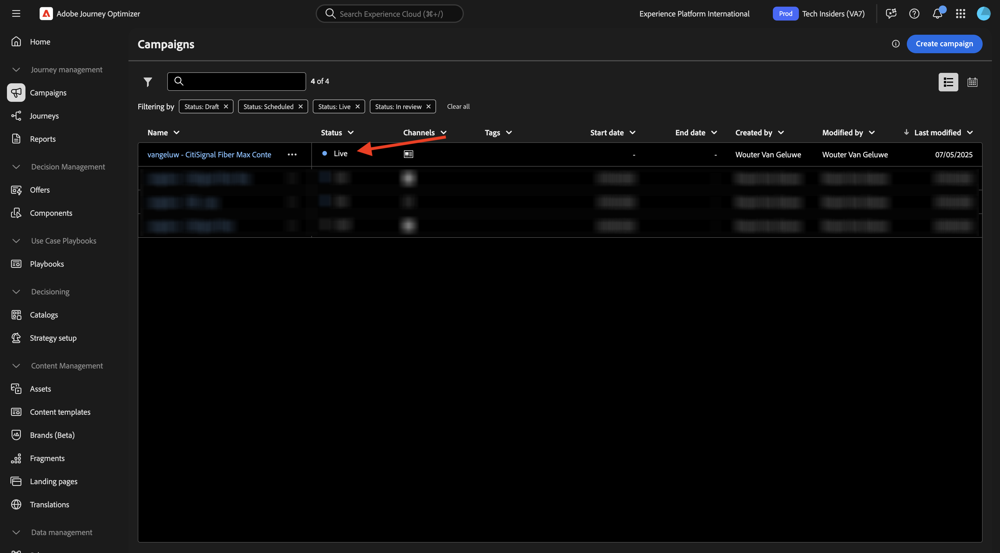
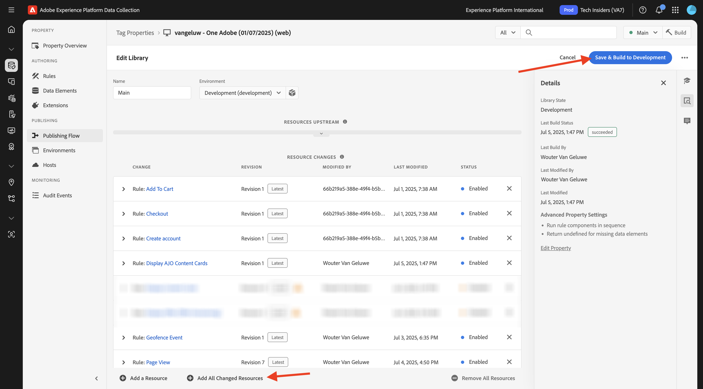

# 3.6.1 Inhaltskarten

Melden Sie sich bei Adobe Journey Optimizer an, indem Sie zu [Adobe Experience Cloud wechseln](https://experience.adobe.com). Auf **Journey Optimizer**.


Sie werden zur Ansicht **Startseite** in Journey Optimizer weitergeleitet. Stellen Sie zunächst sicher, dass Sie die richtige Sandbox verwenden. Die zu verwendende Sandbox heißt `--aepSandboxName--`. Sie befinden sich dann in der **Startseite**-Ansicht Ihres Sandbox-`--aepSandboxName--`.


## 3.6.1.1 der Inhaltskarten-Kanalkonfiguration

Gehen Sie im linken Menü zu **Kanäle** und wählen Sie dann **Kanalkonfigurationen** aus. Klicken Sie **Kanalkonfiguration erstellen**.


Geben Sie den Namen ein: `--aepUserLdap--_Content_Cards_Web`, wählen Sie den Kanal **Inhaltskarten** und aktivieren Sie dann die Plattform **Web**.


Scrollen Sie nach unten und stellen Sie sicher, dass die Option **Einzelne Seite** aktiviert ist.

Geben Sie die URL der Website ein, die zuvor als Teil des Moduls **Erste Schritte** erstellt wurde, das wie folgt aussieht: `https://dsn.adobe.com/web/--aepUserLdap---XXXX`. Vergessen Sie nicht, den **XXXX** in den eindeutigen Code Ihrer Website zu ändern.

>[!IMPORTANT]
>
>Der obige Verweis auf Ihre CitiSignal Demo-Website-URL `https://dsn.adobe.com/web/--aepUserLdap---XXXX` muss in Ihre eigentliche URL geändert werden. Die URL finden Sie unter Ihrem Website-Projekt auf [https://dsn.adobe.com/](https://dsn.adobe.com/).

Legen Sie das Feld **Standort auf Seite** auf `CitiSignalContentCardContainer` fest.


Scrollen Sie nach oben und klicken Sie auf **Absenden**.


Ihre Kanalkonfiguration kann jetzt verwendet werden.


## 3.6.1.2 Konfigurieren einer geplanten Kampagne für Inhaltskarten

Gehen Sie im linken Menü zu **Kampagnen** und klicken Sie dann auf **Kampagne erstellen**.


Wählen Sie **Geplant - Marketing** und klicken Sie dann auf **Erstellen**.


Geben Sie den `--aepUserLdap-- - CitiSignal Fiber Max Content Cards` ein und klicken Sie dann auf **Aktionen**.


Klicken Sie auf **+ Aktion** und wählen Sie dann **Inhaltskarte** aus.


Wählen Sie die Kanalkonfiguration für Inhaltskarten aus, die Sie im vorherigen Schritt erstellt haben und die heißt: `--aepUserLdap--_Content_Cards_Web`.

Klicken Sie anschließend auf **Regeln bearbeiten**.


Klicken Sie auf **X**, um die aktuelle Regel zu entfernen.


Klicken Sie auf **+ Bedingung hinzufügen**.


Wählen Sie die Bedingung **An Platform gesendete Daten** aus. Klicken Sie auf **Fertig**


Sie sollten das dann sehen. Klicken Sie auf **Inhalt bearbeiten**.


Sie sollten das dann sehen.


Konfigurieren Sie die folgenden Einstellungen:

- **Titel**: `CitiSignal Fiber Max`
- **body**: `Lightning speed for gamers`
- **Ziel-URL**: `https://dsn.adobe.com/web/--aepUserLdap---XXXX/plans`

>[!IMPORTANT]
>
>Der obige Verweis auf Ihre CitiSignal Demo-Website-URL `https://dsn.adobe.com/web/--aepUserLdap---XXXX/plans` muss in Ihre eigentliche URL geändert werden. Die URL finden Sie unter Ihrem Website-Projekt auf [https://dsn.adobe.com/](https://dsn.adobe.com/).

Klicken Sie auf das Symbol, um die URL zu ändern, indem Sie ein Asset aus AEM Assets auswählen.


Wechseln Sie zum Ordner **-Citisignal** imaes und wählen Sie die Datei **`neon_rabbit_banner.jpg`**. Klicken Sie auf **Auswählen**.


Sie sollten dann diese haben. Klicken Sie auf **Schaltfläche Hinzufügen**.


Konfigurieren Sie die folgenden Einstellungen für die Schaltfläche:

- **Schaltflächentitel**: `Upgrade now!`
- **Interaction-Ereignis**: `click`
- **target**: `https://dsn.adobe.com/web/--aepUserLdap---XXXX/plans`

>[!IMPORTANT]
>
>Der obige Verweis auf Ihre CitiSignal Demo-Website-URL `https://dsn.adobe.com/web/--aepUserLdap---XXXX/plans` muss in Ihre eigentliche URL geändert werden. Die URL finden Sie unter Ihrem Website-Projekt auf [https://dsn.adobe.com/](https://dsn.adobe.com/).

Klicken Sie auf **Zum Aktivieren überprüfen**.


Klicken Sie **Aktivieren**.


Ihre Kampagne wird dann aktiviert, was einige Minuten dauern kann.


Nach einigen Minuten ist Ihre Kampagne live.



## 3.6.1.3 Aktualisieren der DSN-Website

Um die Inhaltskarte auf der Website anzuzeigen, müssen Sie eine Änderung am Design der Homepage Ihrer CitiSignal Demo-Website vornehmen.

Navigieren Sie zu [https://dsn.adobe.com/](https://dsn.adobe.com/). Klicken Sie auf Ihrer Website auf **3** und dann auf **Bearbeiten**.


Klicken Sie, um die Seite **Startseite** auszuwählen. Klicken Sie auf **Inhalt bearbeiten**.


Bewegen Sie den Mauszeiger über das Hero-Bild und klicken Sie auf die Schaltfläche **+**.


Wechseln Sie zu **Allgemein** wählen Sie **Banner** aus und klicken Sie dann auf **Hinzufügen**.


Klicken Sie, um das neu erstellte Banner auszuwählen. Wechseln Sie zu **Stil** und geben Sie `CitiSignalContentCardContainer` in das Feld **Benutzerdefinierte CSS-Klassen** ein.


Navigieren Sie zu **Ausrichtung**. Legen Sie das Feld **Ausrichtung** auf `left` und das Feld **Vertikale Ausrichtung** auf `middle` fest.

Klicken Sie auf das **X**-Symbol, um das Dialogfenster zu schließen.


Die Änderungen am Website-Design wurden nun vorgenommen.

Wenn Sie Ihre Site jetzt in einem neuen Browser-Fenster öffnen, sollte sie wie folgt aussehen. Der graue Bereich ist das neu erstellte Banner, es enthält jedoch noch keinen Inhalt.


Um sicherzustellen, dass der Inhalt dynamisch in das neu erstellte Banner geladen wird, muss die Datenerfassungs-Tag-Eigenschaft geändert werden.

## 3.6.1.4 Aktualisieren der Datenerfassungs-Tags-Eigenschaft

Wechseln Sie zu [https://experience.adobe.com/#/data-collection/](https://experience.adobe.com/#/data-collection/), zu **Tags**. Im Rahmen des Moduls [Erste Schritte](./../../../../modules/getting-started/gettingstarted/ex1.md) wurden Datenerfassungs-Tags-Eigenschaften erstellt.

Sie haben diese Datenerfassungs-Tags-Eigenschaften bereits als Teil früherer Module verwendet.

Klicken Sie, um die Datenerfassungseigenschaft für das Web zu öffnen.


Wechseln Sie im linken Menü zu **Regeln** und klicken Sie, um die Regel (**)** öffnen.


Klicken Sie auf die Aktion **Erlebnisereignis „Seitenansicht senden**.


Im Rahmen der Regel **Seitenansicht** ist es erforderlich, die Personalisierungsanweisungen von der Edge für eine bestimmte Oberfläche anzufordern. Die Oberfläche ist das Banner, das Sie im vorherigen Schritt konfiguriert haben. Scrollen Sie dazu nach unten zu **Personalization** und geben Sie `web://dsn.adobe.com/web/--aepUserLdap---XXXX#CitiSignalContentCardContainer` unter &quot;**&quot;**.

>[!IMPORTANT]
>
>Der obige Verweis auf Ihre CitiSignal Demo-Website-URL `web://dsn.adobe.com/web/--aepUserLdap---XXXX#CitiSignalContentCardContainer` muss in Ihre eigentliche URL geändert werden. Die URL finden Sie unter Ihrem Website-Projekt auf [https://dsn.adobe.com/](https://dsn.adobe.com/).

Klicken Sie auf **Änderungen beibehalten**.


Klicken Sie **Speichern** oder **In Bibliothek speichern**.


Wechseln Sie im linken Menü zu **Regeln** und klicken Sie auf **Regel hinzufügen**.


Geben Sie den Namen ein: `Display AJO Content Cards`. Klicken Sie auf **+**, um ein neues Ereignis hinzuzufügen.


Wählen Sie **Erweiterung**: **Adobe Experience Platform Web SDK** und dann **Ereignistyp**: **Regelsatzelemente abonnieren**.

Wählen **unter** die Option **Inhaltskarte** aus.

Geben **unter** Oberflächen`web://dsn.adobe.com/web/--aepUserLdap---XXXX#CitiSignalContentCardContainer` ein

>[!IMPORTANT]
>
>Der obige Verweis auf Ihre CitiSignal Demo-Website-URL `web://dsn.adobe.com/web/--aepUserLdap---XXXX#CitiSignalContentCardContainer` muss in Ihre eigentliche URL geändert werden. Die URL finden Sie unter Ihrem Website-Projekt auf [https://dsn.adobe.com/](https://dsn.adobe.com/).

Klicken Sie auf **Änderungen beibehalten**.


Sie sollten das dann sehen. Klicken Sie auf **+ Hinzufügen**, um eine neue Aktion hinzuzufügen.


Wählen Sie **Erweiterung**: **Core** und wählen Sie den **Aktionstyp**: **Benutzerdefinierter Code**.

Aktivieren Sie das Kontrollkästchen für **Sprache**: **JavaScript** und klicken Sie dann auf **Editor öffnen**.


Anschließend sollte ein leeres Editor-Fenster angezeigt werden.


Fügen Sie den folgenden Code in den Editor ein und klicken Sie auf **Speichern**.

```javascript
if (!Array.isArray(event.propositions)) {
  console.log("No personalization content");
  return;
}

console.log(">>> Content Card response from Edge: ", event.propositions);

event.propositions.forEach(function (payload) {
  payload.items.forEach(function (item) {
    if (!item.data || !item.data.content || item.data.content === "undefined") {
      return;
    }
    console.log(">>> Content Card response from Edge: ", item);
    const { content } = item.data;
    const { title, body, image, buttons } = content;
    const titleValue = title.content;
    const description = body.content;
    const imageUrl = image.url;
    const buttonLabel = buttons[0]?.text.content;
    const buttonLink = buttons[0]?.actionUrl;
    const html = `<div  class="Banner Banner--alignment-left Banner--verticalAlignment-left hero-banner ContentCardContainer"  oxygen-component-id="cmp-0"  oxygen-component="Banner"  role="presentation"  style="color: rgb(255, 255, 255); height: 60%;">  <div class="Image" role="presentation">      </div>  <div class="Banner__content">    <div class="Title Title--alignment-left Title--textAlignment-left">      <div class="Title__content" role="presentation">        <strong class="Title__pretitle">${titleValue}</strong>        <h2>${description}</h2>      </div>    </div>    <div class="Button Button--alignment-left Button--variant-cta">              <button          class="Dniwja_spectrum-Button Dniwja_spectrum-BaseButton Dniwja_i18nFontFamily Dniwja_spectrum-FocusRing Dniwja_spectrum-FocusRing-ring"          type="button"          data-variant="accent"          data-style="fill"          onclick="window.open('${buttonLink}')"       style="color:#FFFFFF;padding: 12px 28px;font-size: 24px;font-family: adobe-clean;font-weight: bolder;" >          <span            id="react-aria5848951631-49"            class="Dniwja_spectrum-Button-label"            >${buttonLabel}</span          >        </button>            </div>  </div></div>`;
    if (document.querySelector(".CitiSignalContentCardContainer")) {
      const contentCardContainer = document.querySelector(
        ".CitiSignalContentCardContainer"
      );
      contentCardContainer.innerHTML = html;
      contentCardContainer.style.height = "60%";
    }
  });
});
```


Klicken Sie auf **Änderungen beibehalten**.


Klicken Sie **Speichern** oder **In Bibliothek speichern**.


Wechseln Sie im linken Menü zu **Veröffentlichungsfluss** und klicken Sie, um die Bibliothek **Main** zu öffnen.


Klicken Sie auf **Alle geänderten Ressourcen hinzufügen** und anschließend auf **Für Entwicklung speichern und erstellen**.



## 3.6.1.5 Testen der Inhaltskarte auf Ihrer Website

Navigieren Sie zu [https://dsn.adobe.com](https://dsn.adobe.com). Nachdem Sie sich mit Ihrer Adobe ID angemeldet haben, sehen Sie Folgendes. Klicken Sie auf die 3 Punkte **…** in Ihrem Website-Projekt und dann auf **Ausführen**, um es zu öffnen.


Anschließend wird Ihre Demo-Website geöffnet. Wählen Sie die URL aus und kopieren Sie sie in die Zwischenablage.


Öffnen Sie ein neues Inkognito-Browser-Fenster.


Fügen Sie die URL Ihrer Demo-Website ein, die Sie im vorherigen Schritt kopiert haben. Sie werden dann aufgefordert, sich mit Ihrer Adobe ID anzumelden.


Wählen Sie Ihren Kontotyp aus und schließen Sie den Anmeldevorgang ab.


Sie sollten jetzt die CitiSignal-Website laden, und die von Ihnen konfigurierte Inhaltskarte sollte nun anstelle der leeren Grauzone angezeigt werden, die Sie zuvor dort hatten.


## Nächste Schritte

Gehen Sie zu [3.6.2 Landingpages](./ex2.md)

Zurück zu [Adobe Journey Optimizer: Content-Management](./ajocontent.md){target="_blank"}

Zurück zu [Alle Module](./../../../../overview.md){target="_blank"}
