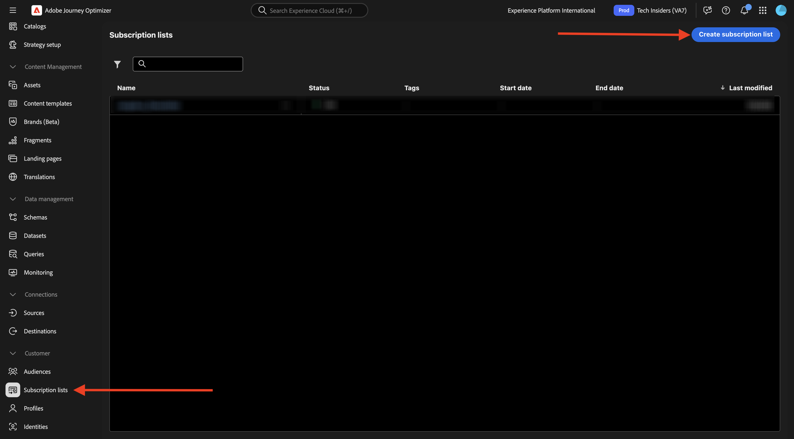
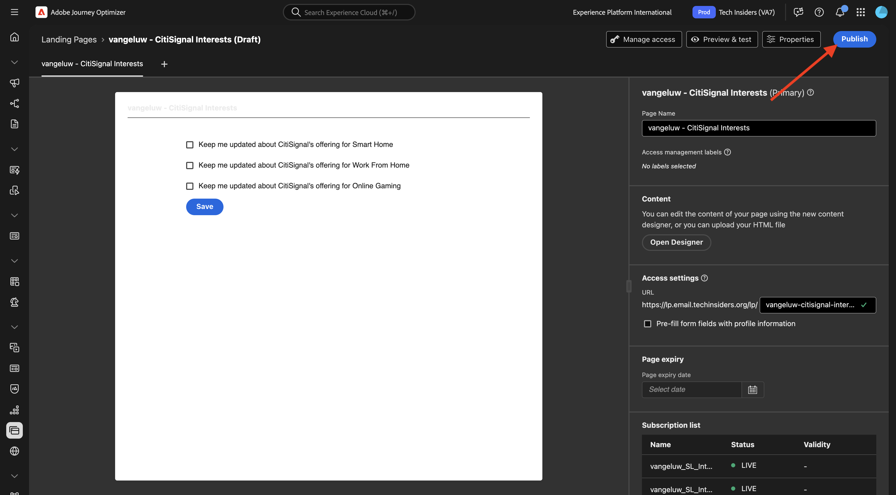

# 3.6.2 Landingpages

Melden Sie sich bei Adobe Journey Optimizer an, indem Sie zu [Adobe Experience Cloud wechseln](https://experience.adobe.com). Auf **Journey Optimizer**.

Sie werden zur Ansicht **Startseite** in Journey Optimizer weitergeleitet. Stellen Sie zunächst sicher, dass Sie die richtige Sandbox verwenden. Die zu verwendende Sandbox heißt `--aepSandboxName--`. Sie befinden sich dann in der **Startseite**-Ansicht Ihres Sandbox-`--aepSandboxName--`.

## Abonnement-Listen 3.6.2.1

Landingpages in Adobe Journey Optimizer funktionieren zusammen mit **Abonnementlisten**. Um Landingpages einzurichten, müssen Sie zunächst „Abonnement **Listen“**.

CitiSignal möchte seine Kunden zu ihrem Interesse an den folgenden Bereichen befragen:

- Smart Home
- Von zu Hause aus arbeiten
- Online-Gaming

Nachdem ein Kunde sein Interesse an einer dieser Domains bekundet hat, sollte dieser Kunde zu einer bestimmten Liste hinzugefügt werden, damit er später im Rahmen bevorstehender Kampagnen mit bestimmten Inhalten angesprochen werden kann.

Sie werden jetzt drei Abonnement-Listen erstellen.

Navigieren Sie im linken Menü zu **Abonnementlisten**. Klicken Sie **Abonnement-Liste erstellen**.

Verwenden **für** Titel`--aepUserLdap--_SL_Interest_in_Smart_Home`.
Für **Beschreibung** verwenden Sie: `Interest in Smart Home`.

Klicken Sie auf **Absenden**.

Klicken Sie **Abonnement-Liste erstellen**, um eine weitere Liste zu erstellen.

Verwenden **für** Titel`--aepUserLdap--_SL_Interest_WFH`.
Für **Beschreibung** verwenden Sie: `Interest in Work From Home`.

Klicken Sie auf **Absenden**.

Klicken Sie **Abonnement-Liste erstellen**, um eine weitere Liste zu erstellen.

Verwenden **für** Titel`--aepUserLdap--_SL_Interest_Online_Gaming`.
Für **Beschreibung** verwenden Sie: `Interest in Online Gaming`.

Klicken Sie auf **Absenden**.

Sie haben jetzt die 3 Listen erstellt, die Sie benötigen.

## Landingpage-Voreinstellung 3.6.2.2

Um Landingpages in Adobe Journey Optimizer verwenden zu können, muss eine Voreinstellung erstellt werden.

Gehen Sie im linken Menü zu **Administration** > **Kanäle** und wählen Sie **Landingpage-Voreinstellungen**.

Klicken Sie **Landingpage-Voreinstellung erstellen**.

Verwenden Sie für **Feld** Name: `--aepUserLdap-- - CitiSignal LP` und wählen Sie die in Ihrer Instanz verfügbare Subdomain aus.

>[!NOTE]
>
>Wenn in Ihrer Instanz keine Subdomain angezeigt wird, wenden Sie sich an Ihren AJO-Administrator, um eine Subdomain hinzuzufügen.

Klicken Sie auf **Absenden**.

Ihre Landingpage-Voreinstellung wurde jetzt erstellt.

## 3.6.2.3 Landingpage

Jetzt können Sie Ihre Landingpage erstellen. Wechseln Sie im linken Menü zu **Content-** > **Landingpages**.

Klicken Sie **Landingpage erstellen**.

Verwenden Sie für **Feld** Titel`vangeluw - CitiSignal Interests`. Wählen Sie als Nächstes die **Landingpage-Voreinstellung** aus, die Sie im vorherigen Schritt konfiguriert haben.

Klicken Sie auf **Erstellen**.

Sie sollten das dann sehen.

Ändern Sie das Feld **Seitenname** in `--aepUserLdap-- - CitiSignal Interests`.

Geben Sie diesen benutzerdefinierten Namen unter **Zugriffseinstellungen** ein: `--aepUserLdap---citisignal-interests`.

Klicken Sie **Designer öffnen**.

Wählen Sie **Von Grund auf gestalten**.

Sie sollten das dann sehen.

Fügen Sie der Arbeitsfläche eine Strukturkomponente **1:** Spalte) hinzu.

Fügen Sie eine Inhaltskomponente **Formular** zur Arbeitsfläche hinzu.

Aktualisieren Sie das Feld **Beschriftung** für **Kontrollkästchen 1** auf `Keep me updated about CitiSignal's offering for Smart Home`.

Stellen Sie sicher, dass das Kontrollkästchen **Opt-in, wenn aktiviert** aktiviert ist und dass **Abonnement-Liste** ausgewählt ist.

Klicken Sie dann auf **Abonnement-Liste auswählen**.

Wählen Sie anschließend die `--aepUserLdap--_SL_Interest_in_Smart_Home` aus und klicken Sie auf **Auswählen**.

Klicken Sie auf **+ Feld hinzufügen** wählen Sie dann **Kontrollkästchen** aus.

Sie sollten das dann sehen.

Aktualisieren Sie das Feld **label** für **Checkbox 2** auf `Keep me updated about CitiSignal's offering for Work From Home`.

Stellen Sie sicher, dass das Kontrollkästchen **Opt-in, wenn aktiviert** aktiviert ist und dass **Abonnement-Liste** ausgewählt ist.

Klicken Sie dann auf **Abonnement-Liste auswählen**.

Wählen Sie anschließend die `--aepUserLdap--_SL_Interest_WFH` aus und klicken Sie auf **Auswählen**.

Klicken Sie auf **+ Feld hinzufügen** wählen Sie dann **Kontrollkästchen** aus.

Sie sollten das dann sehen.

Aktualisieren Sie das Feld **label** für **Checkbox 3** auf `Keep me updated about CitiSignal's offering for Online Gaming`.

Stellen Sie sicher, dass das Kontrollkästchen **Opt-in, wenn aktiviert** aktiviert ist und dass **Abonnement-Liste** ausgewählt ist.

Klicken Sie dann auf **Abonnement-Liste auswählen**.

Wählen Sie anschließend die `--aepUserLdap--_SL_Interest_Online_Gaming` aus und klicken Sie auf **Auswählen**.

Sie sollten das dann sehen.

Wechseln Sie zum Formularfeld **CALL TO ACTION**.

Aktualisieren Sie die folgenden Felder:

- **Text** - Schaltflächenbezeichnung: `Save`.
- **Bestätigungsaktion**: Wählen Sie **Bestätigungstext** aus.
- **Bestätigungstext**: Verwenden Sie: `Thanks for updating your preferences!`
- **Fehleraktion**: Wählen Sie **Fehlertext** aus.
- **Bei Fehlertext**: Verwenden Sie: `There was an error updating your preferences.`

Klicken Sie **Speichern** und dann auf den Pfeil oben links, um zum vorherigen Bildschirm zurückzukehren.

Klicken Sie auf **Veröffentlichen**.

Klicken **erneut auf** Veröffentlichen“.

Ihre Landingpage ist jetzt veröffentlicht und kann in einer E-Mail verwendet werden.

## 3.6.2.4 Landingpage in E-Mail einschließen

In Übung 3.1 haben Sie eine Journey mit dem Namen `--aepUserLdap-- - Registration Journey` erstellt.

Sie sollten jetzt die E-Mail-Nachricht auf dieser Journey aktualisieren, um den Link zur Landingpage aufzunehmen.

Wechseln Sie im linken Menü zu **Journey** und klicken Sie, um die Journey-`--aepUserLdap-- - Registration Journey` zu öffnen.

Klicken Sie auf **Mehr…** und wählen Sie **Neue Version erstellen**.

Klicken Sie **Neue Version erstellen**.

Klicken Sie, um die Aktion **E-Mail** auszuwählen, und wählen Sie dann **Inhalt bearbeiten**.

Klicken Sie **E-Mail-Textkörper bearbeiten**.

Sie sollten dann so etwas sehen. Fügen Sie eine neue Strukturkomponente **1:1-Spalte** zur Arbeitsfläche hinzu.

Fügen Sie eine neue Inhaltskomponente **Text** in die neu erstellte Strukturkomponente ein.

Fügen Sie den folgenden Text in die Inhaltskomponente **Text** ein.

`Would you like to hear from us about Smart Home news? Do you work from home and would you like to hear our tips? Or are you an avid online gamer and do you want to receive our game reviews? Click here to update your preferences and interests!`

Gestalten Sie Ihren Text so, dass er wie folgt aussieht, und wählen Sie dann das Wort `here` aus. Klicken Sie auf **Link**-Symbol.

Legen Sie den **Typ** des Links auf **Landingpage** und das Feld **Ziel** auf **Leer** fest.

Klicken Sie auf **Bearbeiten**, um die Landingpage auszuwählen, die verknüpft werden soll.

Wählen Sie die Landingpage-`--aepUserLdap-- - CitiSignal Interests` aus. Klicken Sie auf **Auswählen**.

Sie sollten das dann sehen. Klicken Sie auf **Speichern**.

Klicken Sie auf den Pfeil in der oberen linken Ecke, um zum vorherigen Bildschirm zurückzukehren.

Klicken Sie auf den Pfeil oben links, um zum vorherigen Bildschirm zurückzukehren.

Klicken Sie auf **Speichern**.

Klicken Sie auf **Veröffentlichen**.

Klicken **erneut auf** Veröffentlichen“.

Ihre Änderungen wurden veröffentlicht, und Sie können Ihren Journey testen.

## 3.6.2.5 Testen von Journey und Landingpage

Navigieren Sie zu [https://dsn.adobe.com](https://dsn.adobe.com). Nachdem Sie sich mit Ihrer Adobe ID angemeldet haben, sehen Sie Folgendes. Klicken Sie auf die 3 Punkte **…** in Ihrem Website-Projekt und dann auf **Ausführen**, um es zu öffnen.

Anschließend wird Ihre Demo-Website geöffnet. Wählen Sie die URL aus und kopieren Sie sie in die Zwischenablage.

Öffnen Sie ein neues Inkognito-Browser-Fenster.

Fügen Sie die URL Ihrer Demo-Website ein, die Sie im vorherigen Schritt kopiert haben. Sie werden dann aufgefordert, sich mit Ihrer Adobe ID anzumelden.

Wählen Sie Ihren Kontotyp aus und schließen Sie den Anmeldevorgang ab.

Ihre Website wird dann in einem Inkognito-Browser-Fenster geladen. Für jede Übung müssen Sie ein neues Inkognito-Browser-Fenster verwenden, um Ihre Demo-Website-URL zu laden. Navigieren Sie zu **Anmelden**

Klicken Sie **KONTO ERSTELLEN**. Füllen Sie Ihre Daten aus und klicken Sie auf **Registrieren**.

Sie werden jetzt zur Homepage weitergeleitet. Öffnen Sie das Bedienfeld Profil-Viewer und navigieren Sie zum Echtzeit-Kundenprofil. Im Profil-Viewer-Fenster sollten Sie alle Ihre personenbezogenen Daten angezeigt bekommen, z. B. Ihre neu hinzugefügten E-Mail- und Telefonkennungen.

1 Minute nach der Erstellung Ihres Kontos erhalten Sie Ihre E-Mail zur Kontoerstellung von Adobe Journey Optimizer.

Klicken Sie auf den Link in der E-Mail, um Ihre Voreinstellungen zu aktualisieren.

Anschließend sollte das von Ihnen erstellte Formular angezeigt werden. Aktivieren Sie einige Kontrollkästchen und klicken Sie auf **Speichern**.

Anschließend sollte eine Bestätigungsmeldung angezeigt werden.

## Berichte zur Abonnement-Liste 3.6.2.6

Um die verfügbaren Berichte zu Abonnement-Listen anzuzeigen, gehen Sie **Abonnement-Listen** im linken Menü und klicken Sie, um eine der zuvor konfigurierten Abonnement-Listen zu öffnen.

Klicken Sie auf **Bericht**.

Sie sollten dann die Übersicht der Liste mit der Anzahl der Personen sehen, die sich an- oder abgemeldet haben.

## Nächste Schritte

Wechseln Sie zu [3.6.3 AJO und GenStudio for Performance Marketing](./ex3.md)

Zurück zu [Adobe Journey Optimizer: Content-Management](./ajocontent.md){target="_blank"}

Zurück zu [Alle Module](./../../../../overview.md){target="_blank"}
