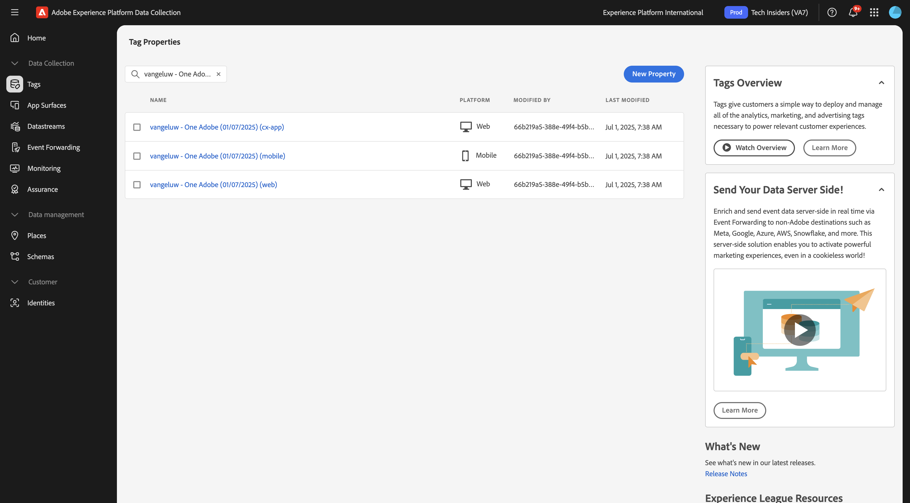

# 3.7.3 Einrichten von Web SDK für Experience Decisioning

## 3.7.3.1 Aktualisieren des Datenstroms

In [Erste Schritte](./../../../../modules/getting-started/gettingstarted/ex2.md) haben Sie Ihren eigenen **Datenstrom** erstellt. Sie haben dann den Namen `--aepUserLdap-- - Demo System Datastream` verwendet.

## 3.7.3.2 Konfigurieren Sie die Client-Eigenschaft der Adobe Experience Platform-Datenerfassung, um personalisierte Angebote anzufordern

Wechseln Sie zu [https://experience.adobe.com/#/data-collection/](https://experience.adobe.com/#/data-collection/), zu **Tags**. Suchen Sie nach Ihren Datenerfassungseigenschaften, die `--aepUserLdap-- - Demo System (DD/MM/YYYY)` heißen. Öffnen Sie Ihre Datenerfassungs-Client-Eigenschaft für das Web.

## 3.7.3.3 Konfigurieren Sie Ihre Client-Eigenschaft für die Adobe Experience Platform-Datenerfassung, um personalisierte Angebote zu empfangen und anzuwenden

Wechseln Sie zu [https://experience.adobe.com/#/data-collection/](https://experience.adobe.com/#/data-collection/), zu **[!UICONTROL Properties]**. Suchen Sie nach Ihren Datenerfassungseigenschaften, die `--aepUserLdap-- - Demo System (DD/MM/YYYY)` heißen. Öffnen Sie die Datenerfassungseigenschaft für das Web.

In der nächsten Übung erfahren Sie, wie Sie Ihre in Adobe Journey Optimizer erstellten Angebote und Entscheidungen mit einer Adobe Target Experience Targeting-Aktivität kombinieren können.

## Nächste Schritte

Wechseln Sie zu [Zusammenfassung und Vorteile](./summary.md){target="_blank"}

Zurück zu [Experience Decisioning](ajo-decisioning.md){target="_blank"}

Zurück zu [Alle Module](./../../../../overview.md){target="_blank"}
