# 3.8.2 Erstellen einer orchestrierten Kampagne

## 3.8.2.1 Erstellen einer orchestrierten Kampagne

Navigieren Sie zu **Kampagnen**. Klicken Sie **Kampagne erstellen**.

Wählen Sie **Orchestrierung - Marketing** und klicken Sie auf **Bestätigen**.

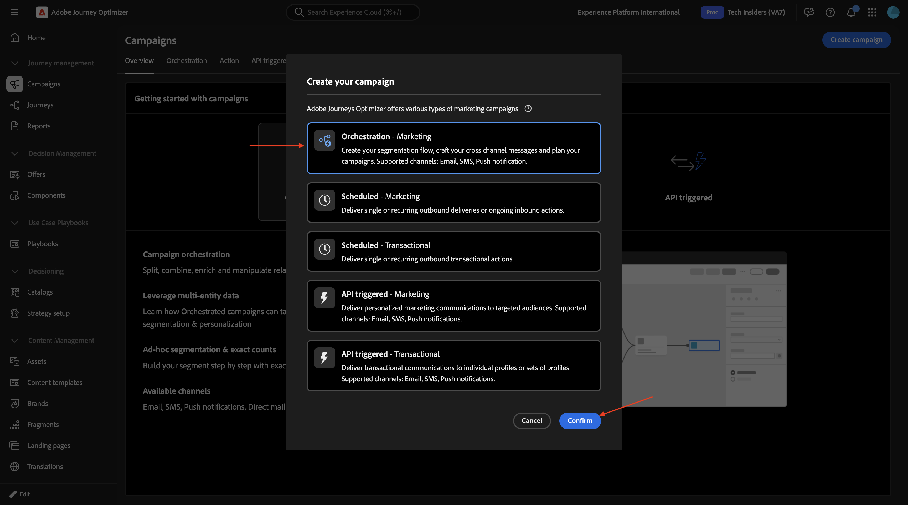

Geben Sie den Kampagnennamen ein: `--aepUserLdap-- - CitiSignal Family Account Optimization Campaign` und klicken Sie auf **Speichern**.

Sie sollten das dann sehen. Klicken Sie auf das Symbol **+**.

Wählen Sie **Verzweigung** aus.

### Zielgruppe 1 erstellen

Klicken Sie auf das Symbol **+** und wählen Sie **Zielgruppe erstellen** aus.

Klicken Sie, um den Ordner für &quot;**&quot;** öffnen.

Wählen Sie **`--aepUserLdap--_citisignal_recipients`** und klicken Sie auf **Bestätigen**.

Klicken Sie **Zielgruppe erstellen**.

Klicken Sie **Bedingung hinzufügen**.

Wählen Sie **recipient_type** aus und klicken Sie auf **Bestätigen**.

Geben Sie **`account_holder`** in das Feld **Wert** ein und klicken Sie auf **Berechnen**.

Anschließend sollte eine Zahl für &quot;**&quot; angezeigt**. Klicken Sie wie angegeben in den grauen Bereich.

Klicken Sie **Bedingung hinzufügen**.

Drilldown nach **`citisignal_accounts`**.

Wählen Sie **`account_status`** und klicken Sie auf **Bestätigen**.

Geben Sie **`active`** in das Feld **Wert** ein. Klicken Sie dann wie angegeben in den grauen Bereich.

Klicken Sie **Bedingung hinzufügen**.

Drilldown nach **`citisignal_mobile_subscriptions`**.

Wählen Sie **`subscription_id`** und klicken Sie auf **Bestätigen**.

Aktivieren Sie den Umschalter für **Aggregatdaten**. Wählen Sie dann Folgendes aus:

- **Aggregatfunktion**: **count**
- **Operator**: **größer oder gleich**
- **Wert**: **1**

Klicken Sie auf **Bestätigen**.

Sie sollten das dann sehen. Klicken Sie auf **Bestätigen**.

### Zielgruppe 2 erstellen

Klicken Sie auf das Symbol **+** auf dem nächsten Knoten im anderen Pfad.

Wählen Sie **Zielgruppe aufbauen** aus.

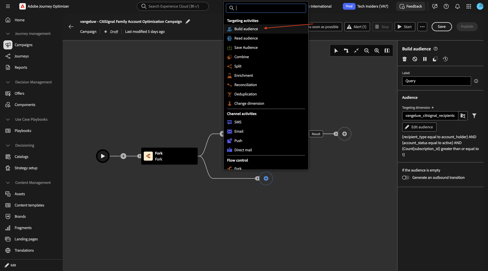

Klicken Sie, um den Ordner für &quot;**&quot;** öffnen.

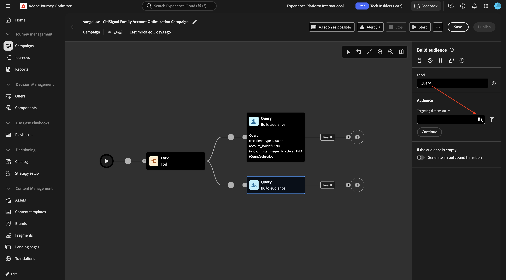

Wählen Sie **`--aepUserLdap--_mobile_subscriptions`** und klicken Sie auf **Bestätigen**.

Klicken Sie **Zielgruppe erstellen**.

Klicken Sie **Bedingung hinzufügen**.

Wählen Sie **subscription_status** aus und klicken Sie auf **Bestätigen**.

Geben Sie **`active`** in das Feld **Wert** ein. Klicken Sie dann auf **Bedingung hinzufügen**.

Wählen Sie **`is_upgrade_eligible`** und klicken Sie auf **Bestätigen**.

Legen Sie den **Wert** auf **true** fest

Klicken Sie **Berechnen** um eine Schätzung der Profile anzuzeigen, die für diese Zielgruppe qualifiziert sind. Klicken Sie dann auf **Bestätigen**

### Aufspaltung

Klicken Sie auf das Symbol **+** und wählen Sie dann **Aufspaltung** aus.

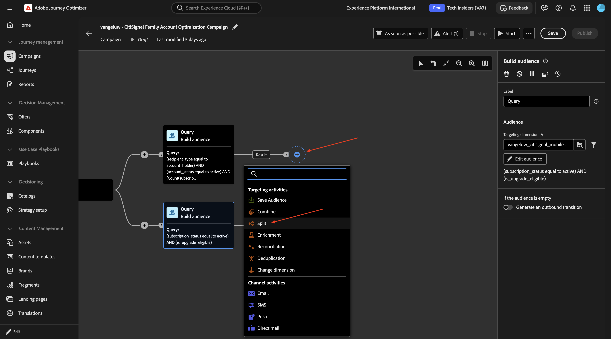

Ändern Sie das Feld **Bezeichnung** in **90/10 Behandlung vs. Kontrolle**. Klicken Sie, um das Objekt &quot;**&quot;** öffnen.

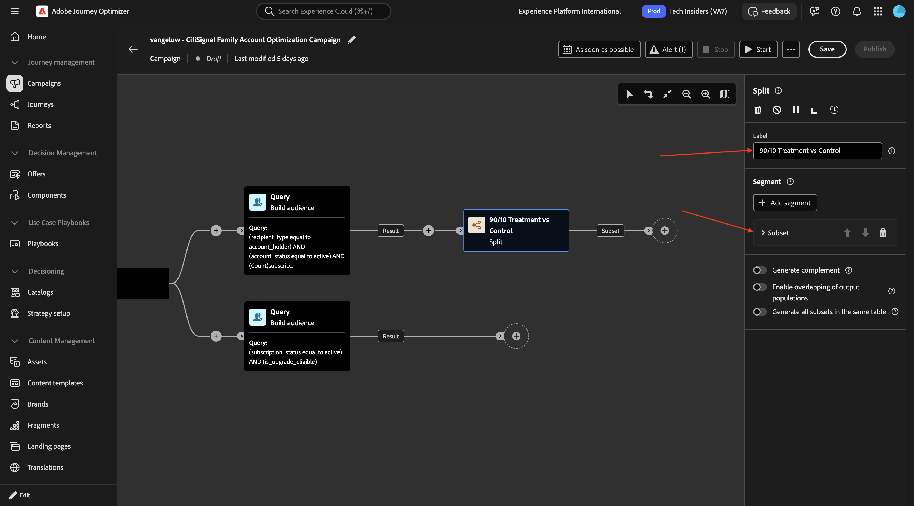

Aktivieren Sie den Umschalter für **Grenzwert aktivieren** und legen Sie **Größenbeschränkung** auf **10 Prozent**.

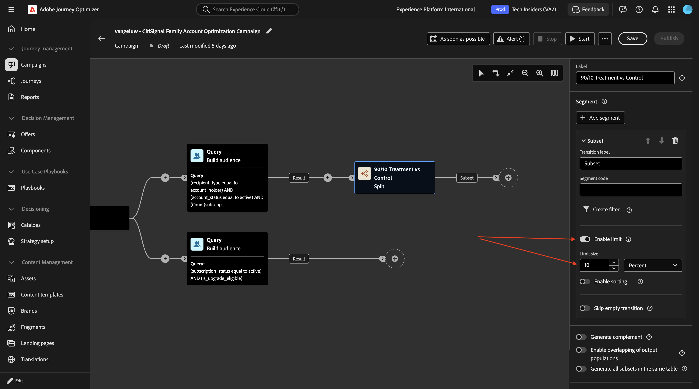

Klicken Sie **Segment hinzufügen** und Sie sollten sehen, wie **Ergebnis**-Objekt hinzugefügt wird.

Klicken Sie auf **Speichern**.

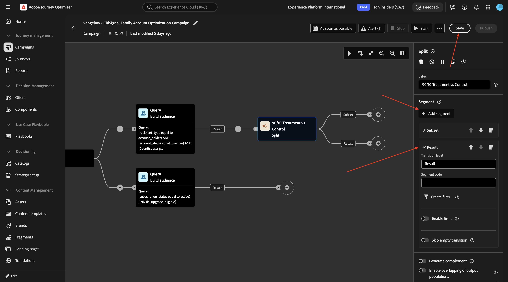

### Speichern einer Zielgruppe

Klicken Sie auf das Symbol **+** und wählen Sie **Audience speichern**.

Legen Sie das Feld **Zielgruppentitel** auf **`--aepUserLdap-- - Control Group`** fest. Klicken Sie **Zielgruppen-Mapping hinzufügen**.

Drilldown zur **Zielgruppendimension**.

Wählen Sie **`account_id`** und klicken Sie auf **Bestätigen**.

Legen Sie **Feld „Profilzuordnung** auf **`--aepUserLdap--_citisignal_recipients - account_id`** fest.

### Anreicherung: Internetabonnement

Klicken Sie auf das Symbol **+**.

Wählen Sie **Anreicherung** aus.

Sie sollten das dann sehen. Klicken Sie auf **Anreicherungsdaten hinzufügen**.

Drilldown nach **`Targeting dimension`**.

Drilldown nach **`citisignal_accounts`**.

Drilldown nach **`citisignal_internet_subscriptions`**.

Wählen Sie **`account_id`** und klicken Sie auf **Bestätigen**.

Sie sollten das dann sehen. Klicken Sie **Attribut hinzufügen**.

Wählen Sie **`subscription_status`** und klicken Sie auf **Bestätigen**.

Klicken Sie **Attribut hinzufügen**.

Wählen Sie **`connection_type`** und klicken Sie auf **Bestätigen**.

Klicken Sie **Attribut hinzufügen**.

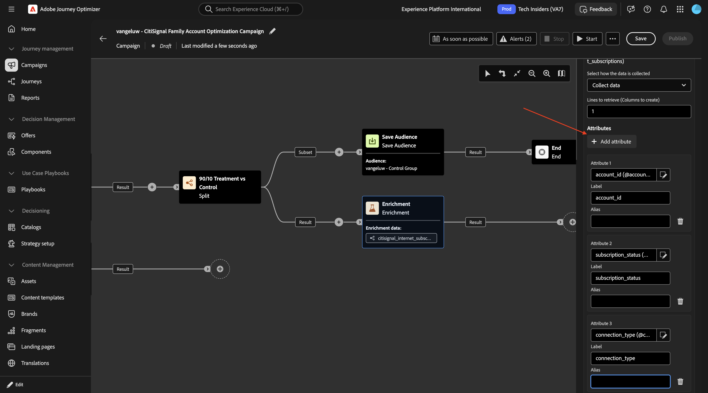

Wählen Sie **`service_city`** und klicken Sie auf **Bestätigen**.

Klicken Sie **Attribut hinzufügen**.

Wählen Sie **`avg_bandwidth_usage_gb`** und klicken Sie auf **Bestätigen**.

Klicken Sie **Attribut hinzufügen**.

Wählen Sie **`data_cap_gb`** und klicken Sie auf **Bestätigen**.

Klicken Sie **Attribut hinzufügen**.

Wählen Sie **`advertised_speed_mbps`** und klicken Sie auf **Bestätigen**.

Klicken Sie **Attribut hinzufügen**.

Wählen Sie **`monthly_recurring_charge`** und klicken Sie auf **Bestätigen**.

Klicken Sie auf **Speichern**.

Scrollen Sie nach oben und ändern Sie das Feld **Beschriftung** in `Enrichment: Internet Subscription`.

### Anreicherung: Mobilgeräte-Abonnement

Klicken Sie auf das Symbol **+** auf dem nächsten Knoten und wählen Sie **Anreicherung** aus.

Ändern Sie das Feld **Beschriftung** in `Enrichment: Mobile Devices Subscription` und klicken Sie dann auf **Anreicherungsdaten hinzufügen**.

Drilldown zur **Zielgruppendimension**.

Drilldown nach **`citisignal_accounts`**.

Drilldown nach **`citisignal_mobile_subscriptions`**.

Wählen Sie **`phone_number`** und klicken Sie auf **Bestätigen**.

Klicken Sie **Attribut hinzufügen**.

Drilldown nach **`citisignal_equipment_subscriptions`**.

Wählen Sie **`model`** und klicken Sie auf **Bestätigen**.

Klicken Sie **Attribut hinzufügen**.

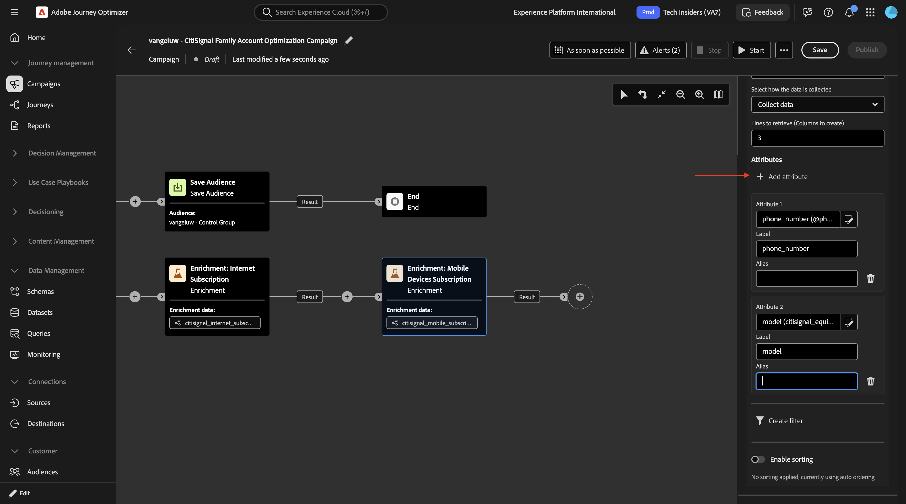

Drilldown nach **`citisignal_equipment_subscriptions`**.

Wählen Sie **`recommended_device_model`** und klicken Sie auf **Bestätigen**.

Klicken Sie **Attribut hinzufügen**.

Drilldown nach **`citisignal_equipment_subscriptions`**.

Wählen Sie **`is_upgrade_eligible`** und klicken Sie auf **Bestätigen**.

Sie können jetzt Ihren Fortschritt testen, indem Sie einen Testlauf durchführen und sehen, welche Daten in Ihrer Kampagne verfügbar sind.

Speichern Sie Ihre Änderungen und klicken Sie dann auf **Starten**.

Nach einiger Zeit sollten Sie dies sehen. Klicken Sie **Vorschau der Ergebnisse**.

Sie sollten dann etwas Ähnliches sehen. Klicken Sie auf **Schließen**.

Kehren Sie zum Knoten zurück **Anreicherung: Mobile-Geräte-Abonnement**.

Klicken Sie **Attribut hinzufügen**.

Wählen Sie **`account_id`** und klicken Sie auf **Bestätigen**.

Klicken Sie **Attribut hinzufügen**.

Wählen Sie **`subscription_id`** und klicken Sie auf **Bestätigen**.

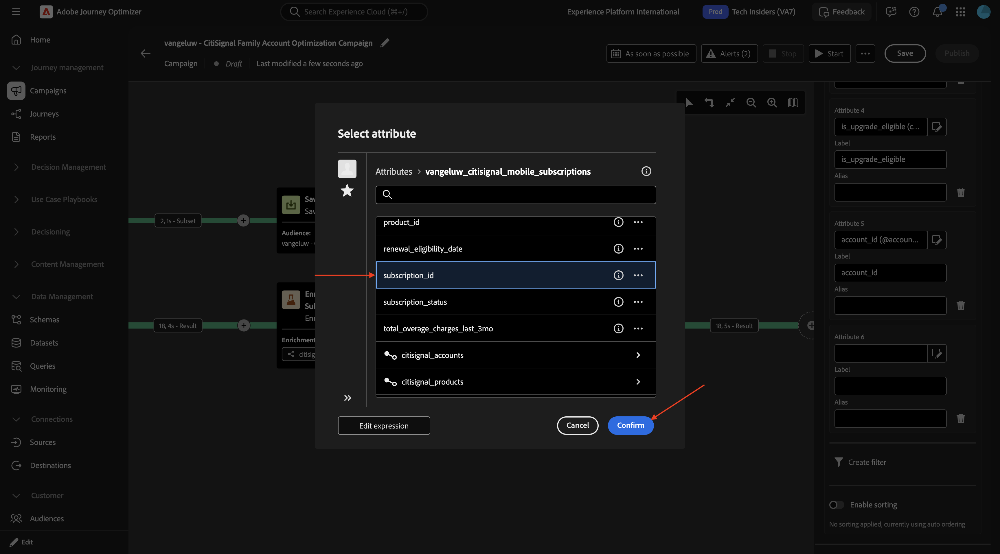

Klicken Sie **Attribut hinzufügen**.

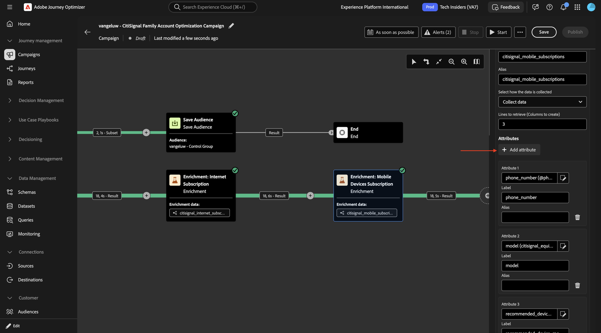

Wählen Sie **`renewal_eligibility_date`** und klicken Sie auf **Bestätigen**.

Klicken Sie **Attribut hinzufügen**.

Wählen Sie **`line_user_recipient_id`** und klicken Sie auf **Bestätigen**.

Klicken Sie **Attribut hinzufügen**.

Wählen Sie **`current_device_id`** und klicken Sie auf **Bestätigen**.

Klicken Sie **Attribut hinzufügen**.

Wählen Sie **`contract_start_date`** und klicken Sie auf **Bestätigen**.

Klicken Sie **Attribut hinzufügen**.

Drilldown nach **`citisignal_equipment_subscriptions`**.

Wählen Sie **`manufacturer`** und klicken Sie auf **Bestätigen**.

Klicken Sie **Attribut hinzufügen**.

Drilldown nach **`citisignal_equipment_subscriptions`**.

Wählen Sie **`device_age_months`** und klicken Sie auf **Bestätigen**.

Klicken Sie **Attribut hinzufügen**.

Drilldown nach **`citisignal_equipment_subscriptions`**.

Wählen Sie **`trade_in_value`** und klicken Sie auf **Bestätigen**.

Klicken Sie **Attribut hinzufügen**.

Drilldown nach **`citisignal_equipment_subscriptions`**.

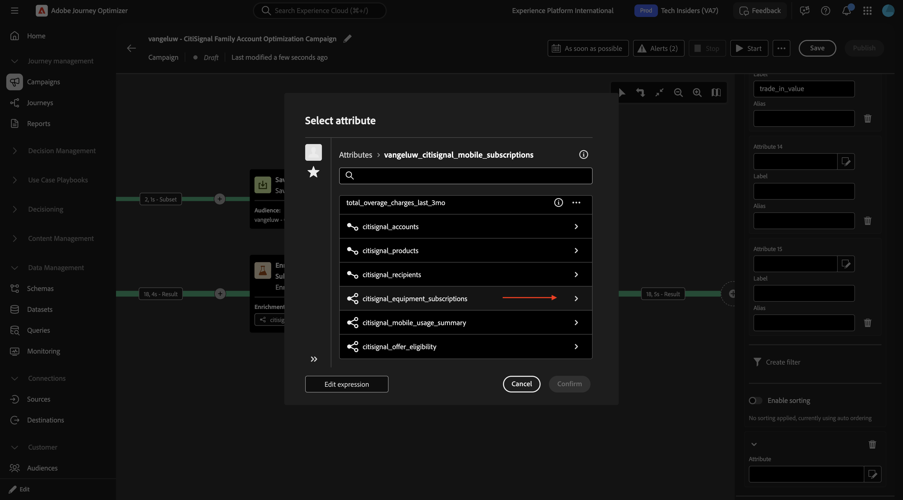

Wählen Sie **`monthly_payment`** und klicken Sie auf **Bestätigen**.

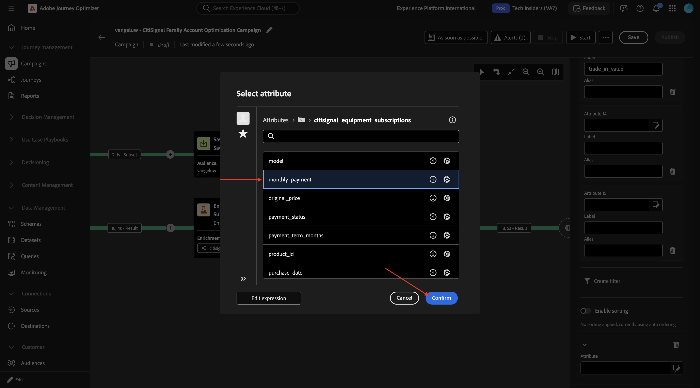

### Anreicherung: Mobilgeräte-Abonnement

Sie sollten dann diese haben. Klicken Sie auf **Speichern**. Klicken Sie dann auf das Symbol **+** , um einen neuen Knoten hinzuzufügen, und wählen Sie **Anreicherung** aus.

Sie sollten das dann sehen. Klicken Sie auf **Anreicherungsdaten hinzufügen**.

Drilldown zur **Zielgruppendimension**.

Drilldown nach **`citisignal_offer_eligibility`**.

Drilldown nach **`citisignal_offers`**.

Wählen Sie **`offer_name`** und klicken Sie auf **Bestätigen**.

Klicken Sie **Attribut hinzufügen**.

Drilldown nach **`citisignal_offers`**.

Wählen Sie **`offer_code`** und klicken Sie auf **Bestätigen**.

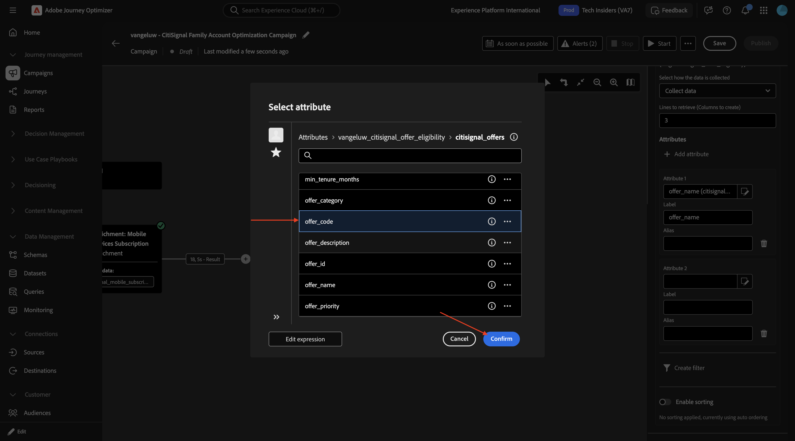

Klicken Sie **Attribut hinzufügen**.

Drilldown nach **`citisignal_offers`**.

Wählen Sie **`offer_description`** und klicken Sie auf **Bestätigen**.

Klicken Sie **Attribut hinzufügen**.

Drilldown nach **`citisignal_offers`**.

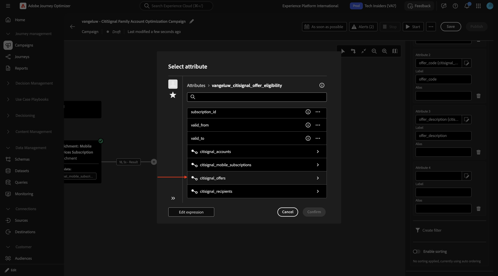

Wählen Sie **`offer_description`** und klicken Sie auf **Bestätigen**.

Aktivieren Sie **Sortierung aktivieren**.

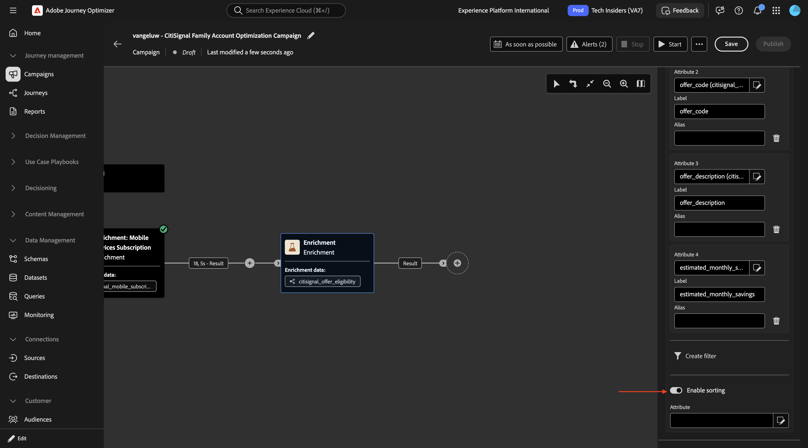

Drilldown nach **`citisignal_offers`**.

Wählen Sie **`offer_priority`** und klicken Sie auf **Bestätigen**.

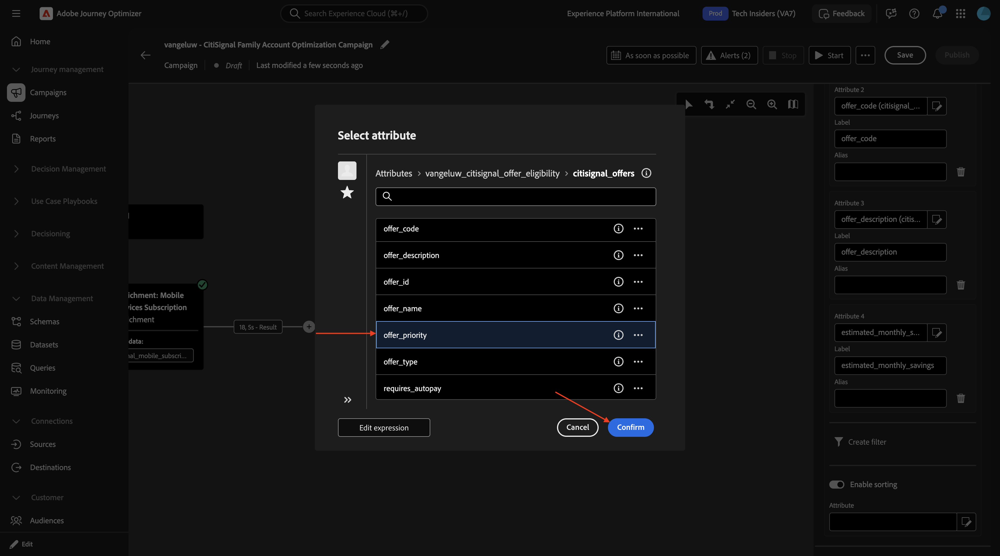

Jetzt können Sie Ihre Kampagne testen. Klicken Sie auf **Starten**.

Nach einiger Zeit sollten Sie dies sehen. Klicken Sie auf **Ergebnis** und wählen Sie dann **Vorschau der Ergebnisse** aus.

Sie sollten dann etwas Ähnliches sehen.

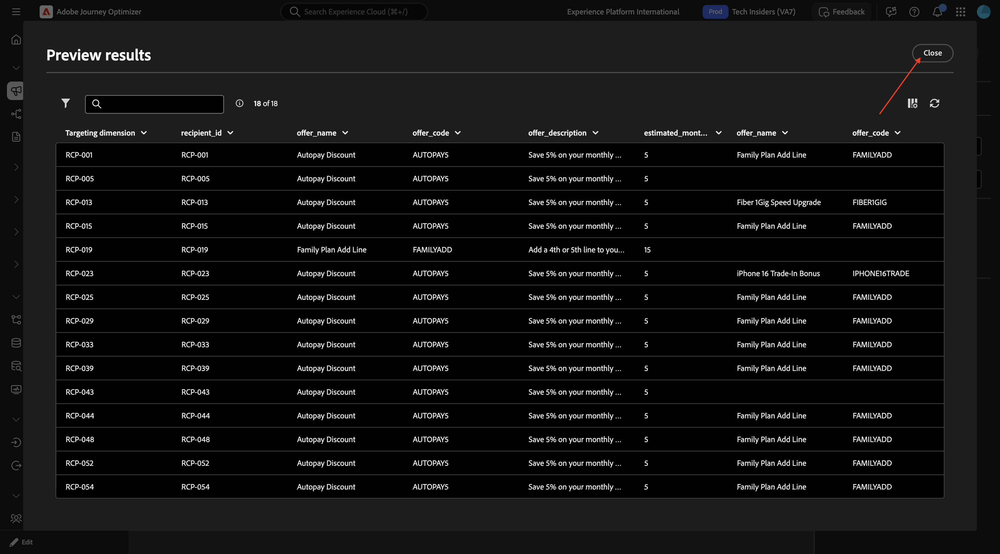

### E-Mail-Aktivität

Klicken Sie auf das Symbol **+** und wählen Sie **E-Mail** aus.

Klicken Sie **E-Mail bearbeiten**.

Navigieren Sie zu **Aktionen**.

Wählen Sie die **E-Mail-Kanalkonfiguration** aus, die Sie zuvor erstellt haben, und klicken Sie dann auf **Inhalt bearbeiten**.

Fügen Sie für **Betreffzeile** Folgendes ein:

`{{target.--aepUserLdap--_citisignal_recipients.first_name}}, Your CitiSignal Family Account Summary`

Klicken Sie **E-Mail-Textkörper bearbeiten**.

## Nächste Schritte

Zurück zu [Adobe Journey Optimizer: Orchestrierte Kampagnen](./ajocampaigns.md){target="_blank"}

Zurück zu [Alle Module](./../../../../overview.md){target="_blank"}
