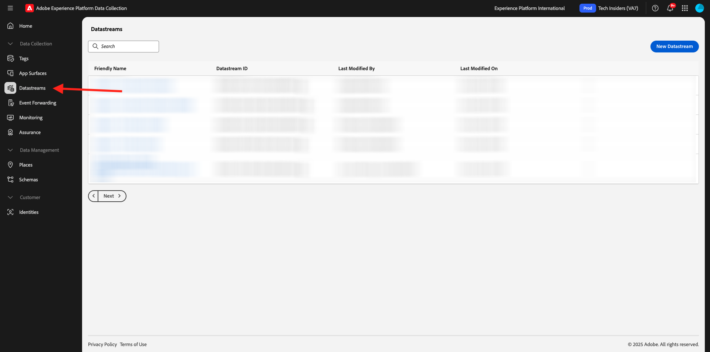

# 1.1.2 Edge Network, Datenströme und Server-seitige Datenerfassung

## Kontext

In dieser Übung erstellen Sie einen **Datenstrom**. Ein **Datenstrom** teilt den Adobe Edge Network-Servern mit, wohin die Daten gesendet werden sollen, nachdem sie von Web SDK erfasst wurden. Möchten Sie beispielsweise die Daten an Adobe Experience Platform senden? Adobe Analytics? Adobe Audience Manager? Adobe Target?

Datenströme werden immer in der Experience Platform-Datenerfassungs-Benutzeroberfläche verwaltet und sind für die Experience Platform-Datenerfassung mit [Web SDK](https://experienceleague.adobe.com/de/docs/experience-platform/web-sdk/home) von entscheidender Bedeutung. Selbst wenn Sie Web SDK mit einer Tag-Management-Lösung implementieren, die nicht von Adobe stammt, müssen Sie dennoch einen Datenstrom erstellen.

In der nächsten Übung implementieren Sie die Web-SDK im Browser. Dann wird Ihnen klarer werden, wie die erfassten Daten aussehen. Für den Moment sagen wir dem Datenstrom nur, wohin er die Daten weiterleiten soll.

## Erstellen eines Datenspeichers

In [Erste Schritte](./../../../../modules/getting-started/gettingstarted/ex2.md) haben Sie bereits einen Datenstrom erstellt, aber wir haben nicht über den Hintergrund und den Grund gesprochen, für den Sie ihn erstellt haben.

Ein [Datenstrom](https://experienceleague.adobe.com/de/docs/experience-platform/datastreams/overview) teilt den Edge Network-Servern mit, wohin die Daten gesendet werden sollen, nachdem sie von der Web-SDK erfasst wurden. In der Dokumentation für [Hinzufügen von Services zu einem Datenstrom](https://experienceleague.adobe.com/de/docs/experience-platform/datastreams/configure#add-services) finden Sie vollständige Details dazu, wohin Sie Ihre Daten über den Datenstrom senden können.

Datenströme werden in der Datenerfassungs-Benutzeroberfläche von Experience Platform verwaltet und sind für die Datenerfassung mit Web SDK von entscheidender Bedeutung, unabhängig davon, ob Sie Web SDK über die Datenerfassung von Adobe Experience Platform implementieren oder nicht.

Überprüfen wir Ihren **[!UICONTROL Datenstrom]**:

Navigieren Sie zu [https://experience.adobe.com/launch/](https://experience.adobe.com/launch/).

Klicken Sie **[!UICONTROL linken Menü auf]** Datenströme“.

Öffnen Sie Ihren Datenstrom mit dem Namen `--aepUserLdap-- - Demo System Datastream`.

Anschließend werden die Details Ihres Datenstroms angezeigt.

Klicken Sie auf **…** neben **Adobe Experience Platform** und klicken Sie auf **Bearbeiten**.

Sie werden es dann sehen. Derzeit haben Sie nur Adobe Experience Platform aktiviert. Ihre Konfiguration sieht in etwa wie folgt aus: (Je nach Umgebung und Adobe Experience Platform-Instanz kann der Sandbox-Name anders lauten.)

Die folgenden Felder sollten folgendermaßen interpretiert werden:

Für diesen Datenstrom…

- Alle erfassten Daten werden in der `--aepSandboxName--` Sandbox in Adobe Experience Platform gespeichert
- Alle Erlebnisereignisdaten werden standardmäßig im Datensatz erfasst **Demosystem - Ereignisdatensatz für die Website (Global v1.1)**
- Alle Profildaten werden standardmäßig im Datensatz erfasst **Demosystem - Profildatensatz für Website (Global v1.1)** (die native Aufnahme von Profildaten in Web SDK wird derzeit von Web SDK noch nicht unterstützt)
- **Edge-**: ist standardmäßig aktiviert, d. h., dass qualifizierte Zielgruppen bei der Aufnahme von eingehendem Traffic am Edge ausgewertet werden
- Wenn Sie „Personalisierungsziele[ verwenden möchten, aktivieren ](https://experienceleague.adobe.com/de/docs/experience-platform/destinations/catalog/personalization/overview) das Kontrollkästchen für **Personalization-Ziele**.
- Wenn Sie die Funktionen von **Adobe Journey Optimizer** in diesem Datenstrom verwenden möchten, müssen Sie das Kontrollkästchen für **Adobe Journey Optimizer** aktivieren.

Für Ihren Datenstrom ist derzeit keine andere Konfiguration erforderlich.

## Nächste Schritte

Wechseln Sie zu [1.1.3 Einführung in die Datenerfassung in Adobe Experience Platform](./ex3.md){target="_blank"}

Kehren Sie zurück zu [Einrichtung der Adobe Experience Platform-Datenerfassung und der Tag-Erweiterung „Web SDK&quot;](./data-ingestion-launch-web-sdk.md){target="_blank"}

Zurück zu [Alle Module](./../../../../overview.md){target="_blank"}
