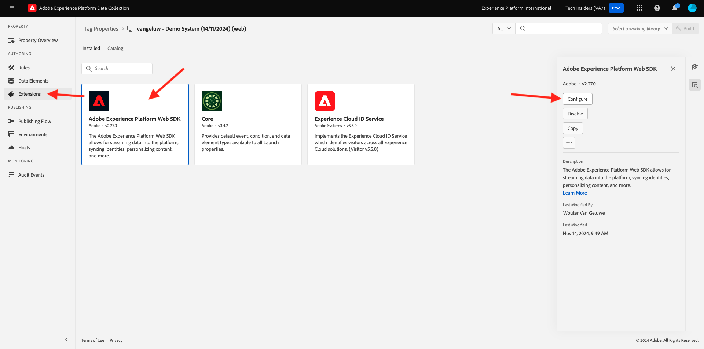
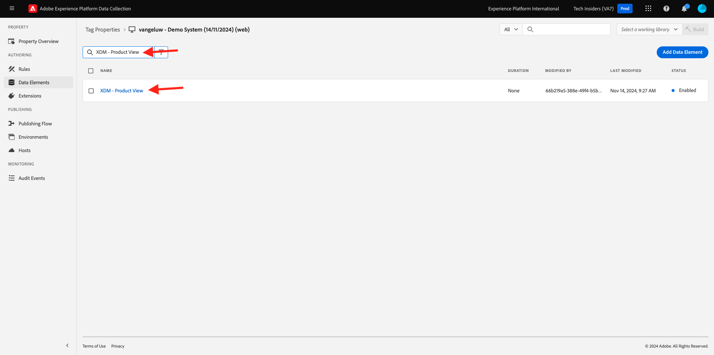

# 1.1.3 Einführung in die Datenerfassung in Adobe Experience Platform

## Kontext

Sehen wir uns nun die Bausteine der Adobe Experience Platform-Datenerfassung genauer an, um zu verstehen, was auf Ihrer Demo-Website installiert ist. Werfen Sie einen genaueren Blick auf die Adobe Experience Platform Web SDK-Erweiterung, konfigurieren Sie ein Datenelement und eine Regel und erfahren Sie, wie Sie eine Bibliothek veröffentlichen.

## Tag-Erweiterung &quot;Adobe Experience Platform Web SDK&quot;

Eine Tag-Erweiterung ist ein gepackter Code-Satz, der die Datenerfassungsschnittstelle von Adobe Experience Platform und die Bibliotheksfunktion erweitert. Die Adobe Experience Platform-Datenerfassung ist die Plattform, und Tag-Erweiterungen sind wie Apps, die auf der Plattform ausgeführt werden. Alle im Tutorial verwendeten Erweiterungen werden von Adobe erstellt und verwaltet. Drittanbieter können jedoch eigene Erweiterungen erstellen, um den Umfang an benutzerdefiniertem Code zu begrenzen, den Benutzende von Adobe Experience Platform-Datenerfassung verwalten müssen.

Wechseln Sie zu [Adobe Experience Platform-](https://experience.adobe.com/launch/) und wählen Sie **Tags** aus.

Dies ist die Seite mit den Eigenschaften der Adobe Experience Platform-Datenerfassung, die Sie zuvor gesehen haben.

In **Erste Schritte** hat Demo System zwei Client-Eigenschaften für Sie erstellt: eine für die Website und eine für die Mobile App. Suchen Sie sie, indem Sie im Feld **[!UICONTROL nach `--aepUserLdap--`]**.
Klicken Sie, um die Eigenschaft **Web** zu öffnen.

Anschließend sehen Sie die Seite Eigenschaftsübersicht . Klicken Sie in **[!UICONTROL Leiste auf]** Erweiterungen“, dann auf **Adobe Experience Platform Web SDK** und anschließend auf **[!UICONTROL Konfigurieren]**.

Willkommen bei der Adobe Experience Platform Web SDK! Hier können Sie die Erweiterung mit dem Datenstrom konfigurieren, den Sie in [Erste Schritte](./../../../../modules/getting-started/gettingstarted/ex2.md) erstellt haben, sowie mit einer erweiterten Konfiguration.

Die Standard-Edge-Domain lautet immer **edge.adobedc.net**. Wenn Sie eine CNAME-Konfiguration in Ihrer Adobe Experience Cloud- oder Adobe Experience Platform-Umgebung implementiert haben, müssen Sie die **[!UICONTROL Edge-Domain aktualisieren]**.

Wenn sich die Edge-Domain Ihrer Instanz von der Standard-Domain unterscheidet, aktualisieren Sie die Edge-Domain hier. Wenn Sie sich nicht sicher sind, verwenden Sie die Standard-Domain. Eine Edge-Domain ermöglicht die Konfiguration eines Tracking-Servers eines Erstanbieters, der dann eine CNAME-Konfiguration im Backend verwendet, um sicherzustellen, dass Daten in Adobe erfasst werden.

Unter **[!UICONTROL Datenströme]** haben Sie Ihren Datenstrom bereits im Abschnitt **Erste Schritte** ausgewählt. Sie haben diesen Datenstrom ausgewählt: `--aepUserLdap-- - Demo System Datastream` aus der Liste im Feld **[!UICONTROL Datenstrom]** für jede der Umgebungen.

Klicken Sie **[!UICONTROL Speichern]**, um zur Ansicht Erweiterungen zurückzukehren.

## Datenelemente

Datenelemente sind Bausteine für Ihr Datenwörterbuch (oder Ihre Datenkarte). Verwenden Sie Datenelemente zum Sammeln, Organisieren und Bereitstellen von Daten in Marketing- und Werbetechnologie.

Ein einzelnes Datenelement ist eine Variable, deren Wert Abfragezeichenfolgen, URLs, Cookie-Werten, JavaScript-Variablen usw. zugeordnet werden kann. Sie können diesen Wert anhand des Variablennamens in der gesamten Datenerfassung von Adobe Experience Platform referenzieren. Diese Sammlung von Datenelementen wird zum Wörterbuch definierter Daten, mit deren Hilfe Sie eigene Regeln erstellen können (Ereignisse, Bedingungen und Aktionen). Dieses Datenwörterbuch ist für die gesamte Adobe Experience Platform-Datenerfassung freigegeben und kann mit allen Erweiterungen verwendet werden, die Sie Ihrer Eigenschaft hinzugefügt haben.

Sie bearbeiten jetzt ein bereits vorhandenes Datenelement in einem benutzerfreundlichen Web-SDK-Format.

Klicken Sie in der linken Leiste auf Datenelemente , um zur Seite „Datenelemente“ zu gelangen.

>[!NOTE]
>
>In dieser Übung bearbeiten Sie nur ein Datenelement, aber Sie können die Schaltfläche **[!UICONTROL Datenelement hinzufügen]** auf dieser Seite sehen. Mit dieser Schaltfläche wird dem Datenwörterbuch eine neue Variable hinzugefügt. Dies kann dann in der gesamten Adobe Experience Platform-Datenerfassung verwendet werden. Sehen Sie sich einige der anderen bereits vorhandenen Datenelemente an, wobei hauptsächlich der lokale Speicher als Datenquelle verwendet wird.

Geben Sie in die Suchleiste **XDM - Produktansicht** ein und klicken Sie auf das zurückgegebene Datenelement.

Auf diesem Bildschirm wird das XDM-Objekt angezeigt, das Sie bearbeiten werden. Das Experience-Datenmodell (XDM) ist ein Konzept, das in diesem technischen Tutorial viel weiter untersucht wird. Für den Moment reicht es jedoch aus, es als das Format zu verstehen, das Adobe Experience Platform Web SDK erfordert. Sie werden den auf Artikelseiten der Demo-Website erfassten Daten etwas mehr Informationen hinzufügen.

Klicken Sie auf das Pluszeichen neben **Web** am unteren Rand der Baumstruktur.

Klicken Sie auf das Pluszeichen neben **webPageDetails**.

Klicken Sie auf **siteSection**. Sie sehen nun, **siteSection** noch mit keinem Datenelement verknüpft ist. Ändern wir das.

Scrollen Sie nach oben, und geben Sie den `%Product Category%` Text ein. Klicken Sie auf **[!UICONTROL Speichern]**.

An dieser Stelle ist die Adobe Experience Platform Web SDK-Erweiterung installiert und Sie haben ein Datenelement aktualisiert, um Daten mit einer XDM-Struktur zu erfassen. Überprüfen wir als Nächstes die Regeln, die Daten zum richtigen Zeitpunkt senden.

## Regeln

Die Adobe Experience Platform-Datenerfassung ist ein regelbasiertes System. Es wird nach Benutzerinteraktionen und verknüpften Daten gesucht. Wenn die in Ihren Regeln formulierten Kriterien erfüllt sind, löst die Regel die jeweils definierte Erweiterung, das Skript oder den clientseitigen Code aus.

Erstellen Sie Regeln, um die Daten und Funktionen von Marketing- und Werbetechnologien zu integrieren, die verschiedene Produkte in einer einzigen Lösung zusammenführen.

Schlüsseln wir die Regel auf, die Daten auf Artikelseiten sendet.

Klicken Sie **[!UICONTROL der linken Leiste]** Regeln“.

**[!UICONTROL Suche]** nach `Product View`.

Klicken Sie auf die Regel, die zurückgegeben wird.

Sehen wir uns die einzelnen Elemente an, aus denen diese Regel besteht.

Für alle Regeln: Wenn ein angegebenes **[!UICONTROL Ereignis]** auftritt, werden die **[!UICONTROL Bedingungen]** ausgewertet, und dann werden bei **die angegebenen** Aktionen“ ausgeführt.

Klicken Sie auf das Ereignis **Core - Benutzerspezifisches Ereignis**. Dies ist die Ansicht, die geladen wird.

Klicken Sie auf die **Ereignistyp** Dropdown.

In dieser Liste sind einige Standardinteraktionen aufgeführt, mit denen Sie die Adobe Experience Platform-Datenerfassung zur Ausführung der Aktionen signalisieren können, wenn die Bedingungen erfüllt sind.

Klicken Sie **[!UICONTROL Abbrechen]**, um zur Regel zurückzukehren.

Klicken Sie auf die Aktion **Erlebnisereignis „Produktansicht senden**.

Hier sehen Sie die Daten, die von Adobe Experience Platform Web SDK an das -Edge-Netzwerk gesendet werden. Genauer gesagt wird hierbei die **Legierung** **[!UICONTROL Instanz]** des Web SDK verwendet. Das Ereignis **[!UICONTROL Typ]** ist auf **Commerce Product (Cart) Views** festgelegt und die XDM-Daten, die Sie senden, sind das Datenelement **XDM - Product View**, das Sie zuvor geändert haben.

Nachdem Sie sich die Regel angesehen haben, können Sie alle Ihre Änderungen in der Datenerfassung von Adobe Experience Platform veröffentlichen.

## In einer Bibliothek veröffentlichen

Um die soeben aktualisierte Regel und das Datenelement zu validieren, müssen Sie eine Bibliothek veröffentlichen, die die bearbeiteten Elemente in unserer Eigenschaft enthält. Im Abschnitt **[!UICONTROL Veröffentlichen“ der Datenerfassung von Adobe Experience Platform]** Sie einige kurze Schritte ausführen.

Klicken Sie **[!UICONTROL linken Navigationsbereich auf]** Publishing Flow“

Klicken Sie auf die vorhandene Bibliothek mit dem Namen **Main**.

Klicken Sie auf **Schaltfläche „Alle geänderten Ressourcen**&quot;. Weiter,
Klicken Sie auf **Schaltfläche „Für Entwicklung speichern und erstellen**.

Es kann einige Minuten dauern, bis die Bibliothek erstellt ist. Nach Abschluss wird links neben dem Bibliotheksnamen ein grüner Punkt angezeigt.

Wie Sie auf dem Bildschirm Veröffentlichungsablauf sehen können, gibt es wesentlich mehr beim Veröffentlichungsprozess in der Datenerfassung von Adobe Experience Platform, was den Rahmen dieses Tutorials sprengt. Wir verwenden jetzt nur eine einzige Bibliothek in unserer Entwicklungsumgebung.

## Nächste Schritte

Wechseln Sie zur Client-seitigen [&#x200B; 1.1.4-Web-Datenerfassung](./ex4.md){target="_blank"}

Kehren Sie zurück zu [Einrichtung der Adobe Experience Platform-Datenerfassung und der Tag-Erweiterung „Web SDK&quot;](./data-ingestion-launch-web-sdk.md){target="_blank"}

Zurück zu [Alle Module](./../../../../overview.md){target="_blank"}
