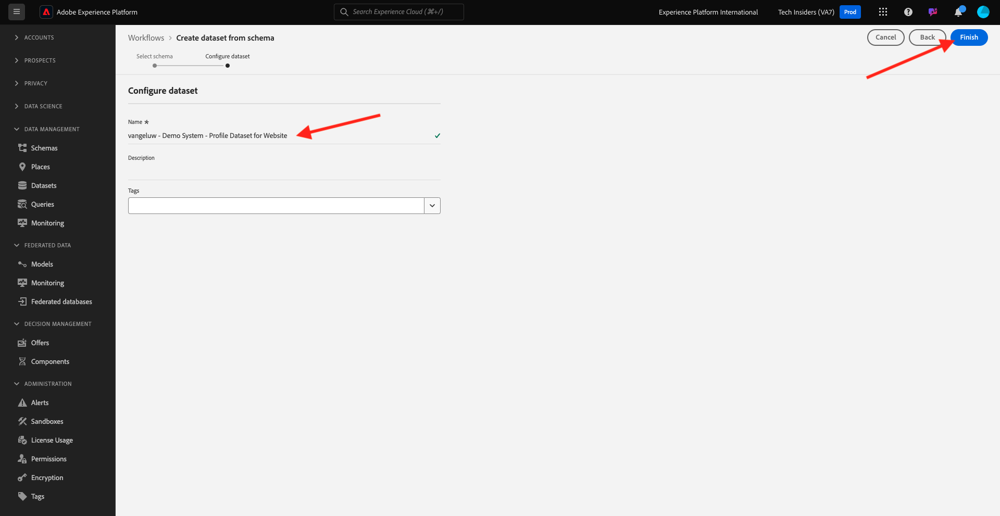
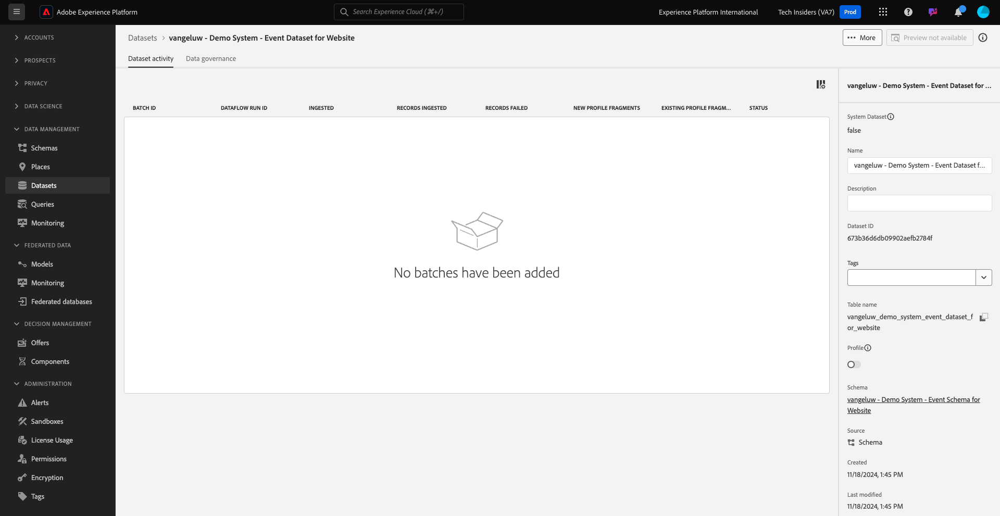

# 1.2.3 Konfigurieren von Datensätzen

In dieser Übung konfigurieren Sie Datensätze, um Profilinformationen und Kundenverhalten zu erfassen und zu speichern. Jeder Datensatz, den Sie in diesem Projekt erstellen, verwendet eines der Schemas, die Sie im vorherigen Schritt erstellt haben.

## Kontext

Nach der Definition, was die Antwort auf die Fragen **Wer ist dieser Kunde?** und **Was tut dieser Kunde?** sollten wie folgt aussehen: Sie müssen jetzt einen Bucket erstellen, der diese Informationen verwendet, um an Adobe Experience Platform gesendete Daten zu empfangen und zu validieren.

## Erstellen von Datensätzen

Jetzt müssen Sie zwei Datensätze erstellen:

- 1 Datensatz, um die Informationen zu erfassen, die den **Wer ist dieser Kunde?** - Frage.
- 1 Datensatz zur Erfassung der Informationen, die den **beantworten (Was tut dieser Kunde?** - Frage.

Melden Sie sich über die folgende URL bei Adobe Experience Platform an: [https://experience.adobe.com/platform](https://experience.adobe.com/platform).

Nach dem Login landen Sie auf der Homepage von Adobe Experience Platform.

Bevor Sie fortfahren, müssen Sie eine **[!UICONTROL Sandbox“]**. Die auszuwählende Sandbox hat den Namen ``--aepSandboxName--``. Nach Auswahl der entsprechenden [!UICONTROL Sandbox] wird der Bildschirm geändert und Sie befinden sich nun in Ihrer dedizierten [!UICONTROL Sandbox].

Klicken Sie in Adobe Experience Platform **[!UICONTROL Datensätze]** im Menü links auf dem Bildschirm.  Sie sehen dann Folgendes:

Erstellen wir zunächst den Datensatz, um die Registrierungsinformationen für die Website zu erfassen.

Sie sollten einen neuen Datensatz erstellen. Um einen neuen Datensatz zu erstellen, klicken Sie auf die Schaltfläche **[!UICONTROL + Datensatz erstellen]**.

Sie müssen einen Datensatz aus dem Schema definieren, das Sie im vorherigen Schritt definiert haben. Klicken Sie auf **[!UICONTROL Option Datensatz aus Schema erstellen]** .

Im nächsten Bildschirm müssen Sie das Schema auswählen, das Sie in 1, `--aepUserLdap-- - Demo System - Profile Schema for Website` erstellt haben.

Klicken Sie auf **Weiter**.

Geben wir Ihrem Datensatz einen Namen.

Verwenden Sie als Namen für Ihren Datensatz Folgendes:

`--aepUserLdap-- - Demo System - Profile Dataset for Website`

Klicken Sie auf **Fertigstellen**.

Sie sehen dies jetzt:

Kehren Sie zur Übersicht [!UICONTROL Datensätze] zurück. Der von Ihnen erstellte Datensatz wird jetzt in der Übersicht eingeblendet.

Als Nächstes konfigurieren Sie einen zweiten Datensatz, um Website-Interaktionen zu erfassen.

Klicken Sie auf **[!UICONTROL + Datensatz erstellen]**.

Sie müssen einen Datensatz aus dem Schema definieren, das Sie im vorherigen Schritt definiert haben. Klicken Sie auf **[!UICONTROL Option Datensatz aus Schema erstellen]** .

Im nächsten Bildschirm müssen Sie das Schema auswählen, das Sie `--aepUserLdap-- - Demo System - Event Schema for Website` zuvor erstellt haben.

Klicken Sie auf **Weiter**.

Geben wir Ihrem Datensatz einen Namen.

Verwenden Sie als Namen für Ihren Datensatz Folgendes:

`--aepUserLdap-- - Demo System - Event Dataset for Website`

Klicken Sie auf **Fertigstellen**.

Sie sehen dann Folgendes:

Kehren Sie zum Bildschirm [!UICONTROL Datensätze] zurück.

Jetzt müssen Sie Ihre Datensätze aktivieren, damit sie Teil des Echtzeit-Kundenprofils von Adobe Experience Platform werden.

Öffnen Sie Ihre `--aepUserLdap-- - Demo System - Profile Dataset for Website`, indem Sie darauf klicken.

Suchen Sie das [!UICONTROL Profil] Umschalter-Symbol auf der rechten Seite des Bildschirms.
Klicken Sie auf [!UICONTROL  Umschalter ]Profil“, um diesen Datensatz für &quot;[!UICONTROL &quot; ] aktivieren.

Klicken Sie **[!UICONTROL Aktivieren]**.

Ihr Datensatz ist jetzt für &quot;[!UICONTROL &quot; ].

Kehren Sie zur Datensatzübersicht zurück und öffnen Sie Ihre `--aepUserLdap-- - Demo System - Event Dataset` für die -Website, indem Sie darauf klicken.

Suchen Sie das [!UICONTROL Profil] Umschalter-Symbol auf der rechten Seite des Bildschirms. Klicken Sie auf [!UICONTROL  Umschalter ]Profil[!UICONTROL , um ] zu aktivieren.

Klicken Sie **[!UICONTROL Aktivieren]**.

Ihr Datensatz ist jetzt für &quot;[!UICONTROL &quot; ].

## Nächste Schritte

Wechseln Sie zu [1.2.4 Datenaufnahme aus Offline-Quellen](./ex4.md){target="_blank"}

Zurück zu [Datenaufnahme](./data-ingestion.md){target="_blank"}

Zurück zu [Alle Module](./../../../../overview.md){target="_blank"}
