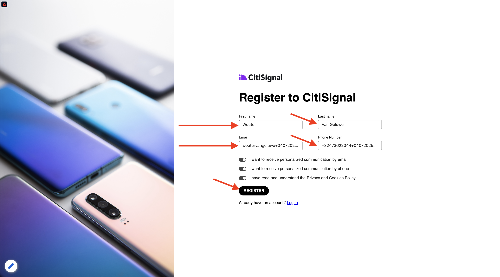
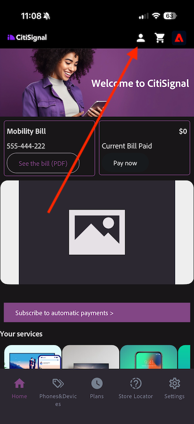

# 2.1.1 Von unbekannt zu bekannt auf der Website

## Kontext

Die Journey von Unbekannt zu Bekanntem ist heutzutage eines der wichtigsten Markenthemen, ebenso wie die Kunden-Journey von der Akquise bis zur Bindung.

Adobe Experience Platform spielt bei dieser Journey eine große Rolle. Plattform ist das Gehirn für Kommunikation, das „Erlebnissystem der Aufzeichnung“.

Platform ist eine Umgebung, in der das Wort Kunde weiter gefasst ist als nur die bekannten Kunden. Ein unbekannter Besucher auf der Website ist auch aus Sicht von Platform ein Kunde. Daher wird das gesamte Verhalten eines unbekannten Besuchers ebenfalls an Platform gesendet. Dank dieses Ansatzes kann sich eine Marke, wenn dieser Besucher schließlich ein bekannter Kunde wird, auch vor diesem Moment vorstellen, was passiert ist. Dies hilft aus Sicht der Attribution und Erlebnisoptimierung.

## Kunden-Journey-Fluss

Navigieren Sie zu [https://dsn.adobe.com](https://dsn.adobe.com). Nachdem Sie sich mit Ihrer Adobe ID angemeldet haben, sehen Sie Folgendes. Klicken Sie auf die 3 Punkte **…** in Ihrem Website-Projekt und dann auf **Ausführen**, um es zu öffnen.

Anschließend wird Ihre Demo-Website geöffnet. Wählen Sie die URL aus und kopieren Sie sie in die Zwischenablage.

Öffnen Sie ein neues Inkognito-Browser-Fenster.

Fügen Sie die URL Ihrer Demo-Website ein, die Sie im vorherigen Schritt kopiert haben. Sie werden dann aufgefordert, sich mit Ihrer Adobe ID anzumelden.

Wählen Sie Ihren Kontotyp aus und schließen Sie den Anmeldevorgang ab.

Ihre Website wird dann in einem Inkognito-Browser-Fenster geladen. Für jede Übung müssen Sie ein neues Inkognito-Browser-Fenster verwenden, um Ihre Demo-Website-URL zu laden.

Klicken Sie auf das Adobe-Logo oben links im Bildschirm, um den Profil-Viewer zu öffnen.

Sehen Sie sich das Bedienfeld Profil-Viewer und das Echtzeit-Kundenprofil mit der **Experience Cloud ID** als primäre Kennung für diesen derzeit unbekannten Kunden an.

Sie können auch alle Erlebnisereignisse sehen, die basierend auf dem Verhalten des Kunden erfasst wurden. Die Liste ist derzeit leer, aber das wird sich bald ändern.

Navigieren Sie zur Produktkategorie **Telefone und Geräte** . Klicken Sie anschließend auf das Produkt **iPhone 16 Pro**.

Anschließend wird die Produktdetailseite angezeigt. Ein Ereignis vom Typ **Produktansicht** wurde jetzt mithilfe der Web-SDK-Implementierung, die Sie in Modul 1 überprüft haben, an Adobe Experience Platform gesendet.

Öffnen Sie das Bedienfeld Profil-Viewer und sehen Sie sich Ihre **Ereignisse** an.

Gehen Sie zurück zur Kategorieseite **Telefone und Geräte** und klicken Sie auf ein anderes Produkt. Ein weiteres Erlebnisereignis wurde an Adobe Experience Platform gesendet. Öffnen Sie das Bedienfeld Profil-Viewer . Es werden jetzt zwei Ereignisse des Typs **Produktansicht** angezeigt. Während das Verhalten anonym ist, können Sie bei ordnungsgemäßem Einverständnis jeden Klick verfolgen und in Adobe Experience Platform speichern. Sobald der anonyme Kunde bekannt wird, können wir das gesamte anonyme Verhalten automatisch mit dem bekannten Profil zusammenführen.

Klicken Sie auf **Anmelden**.

Klicken Sie **Konto erstellen**.

Füllen Sie Ihre Daten aus und klicken Sie **Registrieren**, woraufhin Sie zur vorherigen Seite weitergeleitet werden.

Öffnen Sie das Bedienfeld Profil-Viewer und navigieren Sie zum Echtzeit-Kundenprofil. Im Profil-Viewer-Fenster sollten Sie alle Ihre personenbezogenen Daten angezeigt bekommen, z. B. Ihre neu hinzugefügten E-Mail- und Telefonkennungen.

Wechseln Sie im Bedienfeld Profil-Viewer zu Erlebnisereignisse . Die beiden Produkte, die Sie zuvor angezeigt haben, werden im Bedienfeld Profil-Viewer angezeigt. Beide Ereignisse sind jetzt auch mit Ihrem „bekannten“ Profil verbunden.

Sie haben jetzt Daten in Adobe Experience Platform aufgenommen und diese Daten mit Kennungen wie ECIDs und E-Mail-Adressen verknüpft. Das Ziel ist, den Geschäftskontext von dem zu verstehen, was Sie tun werden. In der nächsten Übung beginnen Sie mit der Konfiguration aller erforderlichen Elemente, um die gesamte Datenaufnahme zu ermöglichen.

### Navigieren in der Mobile App

Nachdem Sie ein bekannter Kunde geworden sind, ist es an der Zeit, die Mobile App zu verwenden. Öffnen Sie die Mobile App auf Ihrem iPhone und melden Sie sich bei der App an.

Wenn Sie die App nicht mehr installiert haben oder Sie sich nicht mehr an die Installation erinnern können, schauen Sie bitte hier: [Verwenden Sie die Mobile App](../../../getting-started/gettingstarted/ex5.md)

Nachdem Sie die App wie angewiesen installiert haben, sehen Sie die Landingpage der App, auf der die Marke Citi Signal geladen ist. Klicken Sie auf das Konto -Symbol oben links im Bildschirm.

Melden Sie sich auf dem Anmeldebildschirm mit der auf der Desktop-Website verwendeten E-Mail-Adresse an. Klicken Sie **Anmelden**.

Sie erhalten dann eine Bestätigung, dass Sie angemeldet sind.

Gehen Sie zum Startbildschirm der App und gehen Sie zur Seite **Telefone und Geräte**.

Klicken Sie auf ein Produkt auf der Seite.

Anschließend wird die Produktdetailseite angezeigt.

Rufen Sie in der App den Startbildschirm auf und klicken Sie auf das Adobe-Symbol, um das Bedienfeld „Profil-Viewer“ anzuzeigen. Anschließend wird die Ansicht **Profilattribute** angezeigt, die jetzt eine kombinierte Ansicht Ihrer Web- und Mobile-App-Aktivität anzeigt. Navigieren Sie zu **Ereignisse**

Anschließend sehen Sie das soeben angezeigte Produkt im Abschnitt **Erlebnisereignisse** zusammen mit allen Produktansichten, die in der vorherigen Website-Sitzung generiert wurden.

>[!NOTE]
>
>Es kann einige Minuten dauern, bis Sie die konsolidierte Ansicht in der App und auf der Website sehen.

Gehen Sie nun zurück zu Ihrem Desktop-Computer und aktualisieren Sie die Homepage. Danach wird das Produkt auch dort angezeigt.

>[!NOTE]
>
>Es kann einige Minuten dauern, bis Sie die konsolidierte Ansicht in der App und auf der Website sehen.

Sie haben jetzt Daten in Adobe Experience Platform aufgenommen und diese Daten mit Kennungen wie ECIDs und E-Mail-Adressen verknüpft. Das Ziel dieser Übung war es, den Geschäftskontext von dem zu verstehen, was Sie tun werden. Sie haben jetzt effektiv ein geräteübergreifendes Echtzeit-Kundenprofil erstellt. In der nächsten Übung visualisieren Sie Ihr Profil in Adobe Experience Platform.

## Nächste Schritte

Navigieren Sie zu [2.1.2 Visualisieren Ihres eigenen Echtzeit-Kundenprofils - Benutzeroberfläche](./ex2.md){target="_blank"}

Zurück zum [Echtzeit-Kundenprofil](./real-time-customer-profile.md){target="_blank"}

Zurück zu [Alle Module](./../../../../overview.md){target="_blank"}
