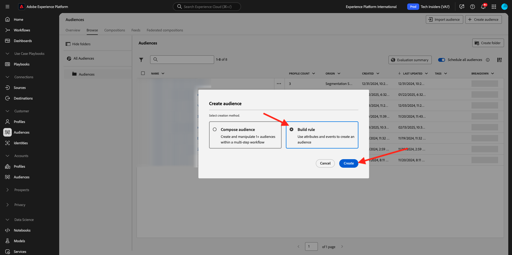
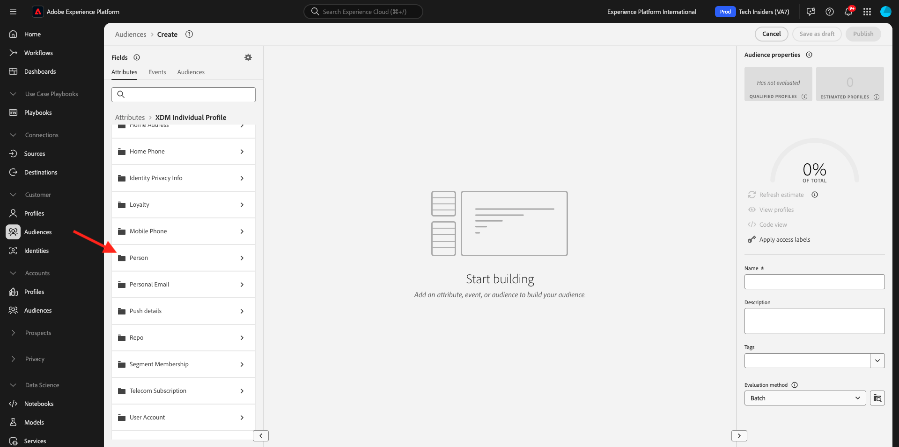
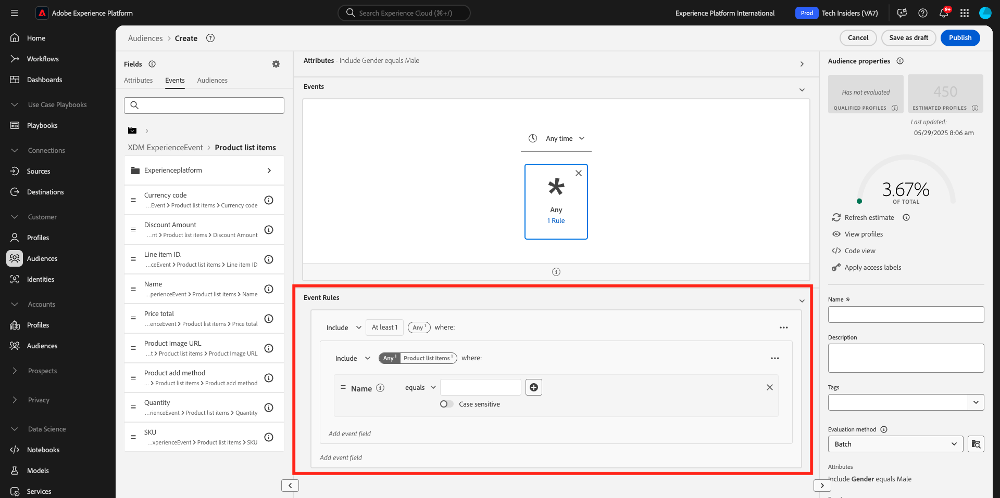

# 2.1.4 Erstellen einer Zielgruppe - Benutzeroberfläche

In dieser Übung erstellen Sie eine Zielgruppe, indem Sie den Audience Builder von Adobe Experience Platform verwenden.

Zu [Adobe Experience Platform](https://experience.adobe.com/platform). Nach dem Login landen Sie auf der Homepage von Adobe Experience Platform.


Bevor Sie fortfahren, müssen Sie eine **Sandbox“**. Die auszuwählende Sandbox hat den Namen ``--aepSandboxName--``. Nach Auswahl der entsprechenden [!UICONTROL Sandbox] wird der Bildschirm geändert und Sie befinden sich nun in Ihrer dedizierten [!UICONTROL Sandbox].


Gehen Sie im Menü auf der linken Seite zu **Zielgruppen**. Auf dieser Seite erhalten Sie einen Überblick über alle bestehenden Audiences. Klicken Sie auf die Schaltfläche **+ Zielgruppe erstellen**, um mit der Erstellung einer neuen Zielgruppe zu beginnen.


Wählen Sie **Regel erstellen** und klicken Sie auf **Erstellen**.



Sobald Sie sich im Audience Builder befinden, bemerken Sie sofort die Menüoption **Attribute** und die Referenz **XDM Individual Profile**.


Da XDM die Sprache ist, die das Experience Business unterstützt, ist XDM auch die Grundlage für den Audience Builder. Alle in Platform aufgenommenen Daten sollten XDM zugeordnet werden. Daher werden alle Daten unabhängig davon, woher sie stammen, Teil desselben Datenmodells. Dies bietet Ihnen beim Erstellen von Zielgruppen einen großen Vorteil, da Sie über diese eine Audience Builder-Benutzeroberfläche Daten aus jedem Ursprung im selben Workflow kombinieren können. In Audience Builder erstellte Zielgruppen können zur Aktivierung an Lösungen wie Adobe Target, Adobe Campaign und Adobe Audience Manager gesendet werden.

Erstellen wir eine Zielgruppe, die alle männlichen **umfasst**.

Um zum Geschlechterattribut zu gelangen, müssen Sie XDM verstehen und kennen.

Das Geschlecht ist ein Attribut der Person, das unter Attribute zu finden ist. Um zu diesem Ziel zu gelangen, klicken Sie zunächst auf **XDM Individual Profile**. Sie werden es dann sehen. Wählen Sie im Fenster **XDM Individual Profile** die Option **Person** aus.



Sie werden es dann sehen. In **Person** finden Sie das Attribut **Gender**. Ziehen Sie das Attribut Geschlecht auf den Zielgruppen-Builder.


Jetzt können Sie das spezifische Geschlecht aus den vorausgefüllten Optionen auswählen. Wählen wir in diesem Fall &quot;**&quot;**.


Nach Auswahl **Männlich** können Sie eine Schätzung der Zielgruppenpopulation abrufen, indem Sie die Schaltfläche **Schätzung aktualisieren** drücken. Dies ist für einen Business-Anwender sehr hilfreich, damit er die Auswirkungen bestimmter Attribute auf die resultierende Zielgruppengröße sehen kann.


Anschließend wird eine Schätzung wie die folgende angezeigt:


Als Nächstes sollten Sie Ihre Audience ein wenig verfeinern. Sie müssen eine Zielgruppe aller männlichen Kunden erstellen, die das Produkt **iPhone 15 Pro** angesehen haben.

Um diese Zielgruppe zu erstellen, müssen Sie ein Erlebnisereignis hinzufügen. Sie können alle Erlebnisereignisse finden, indem Sie auf das Symbol **Ereignisse** in der Menüleiste **Felder** klicken. Als Nächstes sehen Sie den Knoten **XDM ExperienceEvents** der obersten Ebene. Klicken Sie auf **XDM ExperienceEvent**.


Navigieren Sie **Produktlistenelemente**.


Wählen Sie **Name** aus und ziehen Sie das **Name**-Objekt aus dem linken Menü auf die Arbeitsfläche des Audience Builders in den Abschnitt **Ereignisse** .


Sie sehen dann Folgendes:



Der Vergleichsparameter sollte **Gleich** lauten und im Eingabefeld **iPhone 15 Pro** eingeben.


Legen Sie die Zeitbedingung für Ihr Segment auf „In den **24 Stunden“**.


Jedes Mal, wenn Sie ein Element zum Audience Builder hinzufügen, können Sie auf die Schaltfläche **Schätzung aktualisieren** klicken, um eine neue Schätzung der Population in Ihrer Audience zu erhalten.

Bisher haben Sie die Benutzeroberfläche nur zum Erstellen Ihrer Zielgruppe verwendet, es gibt aber auch eine Code-Option, um eine Zielgruppe zu erstellen.

Beim Erstellen einer Zielgruppe erstellen Sie tatsächlich eine Profile Query Language (PQL)-Abfrage. Um den PQL-Code zu visualisieren, können Sie auf den Umschalter **Code-Ansicht** in der oberen rechten Ecke des Audience Builders klicken.


Jetzt können Sie die vollständige PQL-Anweisung sehen:

```sql
person.gender in ["male"] and CHAIN(xEvent, timestamp, [C0: WHAT(productListItems.exists(name.equals("iPhone 15 Pro", false)))])
```

Sie können auch eine Vorschau einer Auswahl der Kundenprofile anzeigen, die zu dieser Zielgruppe gehören, indem Sie auf **Profile anzeigen** klicken.


Schließlich geben wir Ihrer Zielgruppe einen Namen,
Legen Sie die **Auswertungsmethode** auf **Edge** fest und klicken Sie auf **Veröffentlichen**.

Verwenden Sie als Namenskonvention:

- `--aepUserLdap-- - Male customers with interest in iPhone 15 Pro`


Sie werden zur Seite Zielgruppenübersicht zurückgeleitet.


## Nächste Schritte

Wechseln Sie zu [2.1.5. Sehen Sie sich Ihr Echtzeit-Kundenprofil in Aktion im Callcenter an](./ex5.md){target="_blank"}

Zurück zum [Echtzeit-Kundenprofil](./real-time-customer-profile.md){target="_blank"}

Zurück zu [Alle Module](./../../../../overview.md){target="_blank"}
