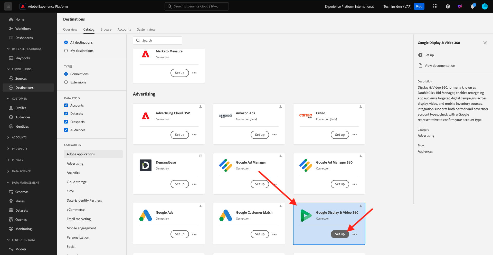
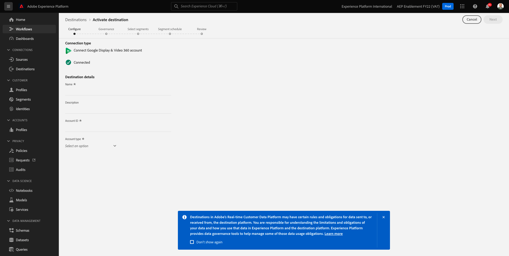

# 2.3.2 Konfigurieren eines Advertising-Ziels wie Google DV360

>[!IMPORTANT]
>
>Der folgende Inhalt ist teilweise als Info-Info gedacht. Wenn ein solches Ziel bereits in Ihrer Instanz vorhanden ist, **Sie** neues Ziel für DV360 konfigurieren. Das Ziel wurde in diesem Fall bereits erstellt und Sie können es in der nächsten Übung verwenden.

Zu [Adobe Experience Platform](https://experience.adobe.com/platform). Nach dem Login landen Sie auf der Homepage von Adobe Experience Platform.

Bevor Sie fortfahren, müssen Sie eine **Sandbox“**. Die auszuwählende Sandbox hat den Namen ``--aepSandboxName--``. Nach Auswahl der entsprechenden [!UICONTROL Sandbox] wird der Bildschirm geändert und Sie befinden sich nun in Ihrer dedizierten [!UICONTROL Sandbox].

Gehen Sie im linken Menü zu **Ziele** und dann zu **Katalog**. Anschließend sehen Sie den **Zielkatalog**.

Klicken Sie **Ziele** auf **Google Display &amp; Video 360** und dann auf **+ Einrichten**.

Sie werden es dann sehen. Klicken Sie **Mit Ziel verbinden**.

Im nächsten Bildschirm können Sie Ihr Ziel für Google DV360 konfigurieren.

Geben Sie einen Wert in die Felder **Name** und **Beschreibung** ein.

Das Feld **Konto-ID** ist die **Advertiser-ID** des DV360-Kontos. Das können Sie hier finden:

Der **Kontotyp** sollte auf &quot;**-Advertiser“** werden.

Jetzt hast du das hier. Klicken Sie auf **Weiter**.

>[!NOTE]
>
>Google muss Adobe auf die Zulassungsliste setzen , damit Adobe Experience Platform Daten an Google DV360 senden kann. Wenden Sie sich an Ihren Google Account Manager, um diesen Datenfluss zu aktivieren.

Nachdem Sie das Ziel erstellt haben, sehen Sie dies. Sie können optional eine Data-Governance-Richtlinie auswählen. Klicken Sie anschließend auf **Speichern und beenden**.

Anschließend wird eine Liste der verfügbaren Ziele angezeigt.
In der nächsten Übung verbinden Sie die in der vorherigen Übung erstellte Zielgruppe mit dem Google DV360-Ziel.

## Nächste Schritte

Wechseln Sie zu [2.3.3 Aktion durchführen: Ihre Zielgruppe an DV360 senden](./ex3.md){target="_blank"}

Kehren Sie zu [Real-Time CDP - Zielgruppe aufbauen und Maßnahmen ergreifen](./real-time-cdp-build-a-segment-take-action.md){target="_blank"}

Zurück zu [Alle Module](./../../../../overview.md){target="_blank"}
