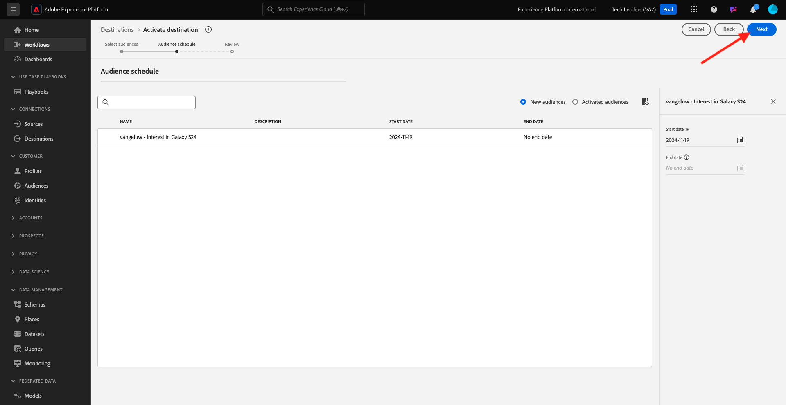

# 2.3.3 Handeln: Zielgruppe an DV360 senden

Zu [Adobe Experience Platform](https://experience.adobe.com/platform). Nach dem Login landen Sie auf der Homepage von Adobe Experience Platform.

Bevor Sie fortfahren, müssen Sie eine **Sandbox“**. Die auszuwählende Sandbox hat den Namen ``--aepSandboxName--``. Nach Auswahl der entsprechenden [!UICONTROL Sandbox] wird der Bildschirm geändert und Sie befinden sich nun in Ihrer dedizierten [!UICONTROL Sandbox].

Gehen Sie im linken Menü zu **Ziele** und dann zu **Durchsuchen**. Anschließend sehen Sie das **DV360**-Ziel. Klicken Sie auf die 3 Punkte **…** und dann auf **Zielgruppen aktivieren**.

Wählen Sie in der Liste der verfügbaren Zielgruppen die Zielgruppe aus, die Sie in der vorherigen Übung erstellt haben. Klicken Sie auf **Weiter**.

Klicken Sie auf der **Zielgruppen** Zeitplan) auf **Weiter**.

Klicken Sie abschließend auf der **Überprüfen**-Seite auf **Beenden**.

Ihre Zielgruppe ist jetzt mit Google DV360 verknüpft. Jedes Mal, wenn sich eine Kundin oder ein Kunde für diese Zielgruppe qualifiziert, wird ein Signal an Google DV360 gesendet, um diese Kundin oder diesen Kunden in die Zielgruppe auf Google DV360-Seite aufzunehmen.

## Nächste Schritte

Gehen Sie zu [2.3.4. Aktion durchführen: Ihre Zielgruppe an ein S3-Ziel senden](./ex4.md){target="_blank"}

Kehren Sie zu [Real-Time CDP - Zielgruppe aufbauen und Maßnahmen ergreifen](./real-time-cdp-build-a-segment-take-action.md){target="_blank"}

Zurück zu [Alle Module](./../../../../overview.md){target="_blank"}
