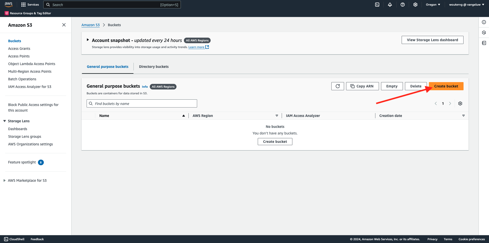

# 2.3.4 Aktion durchführen: Ihre Zielgruppe an ein S3-Ziel senden

Adobe Experience Platform kann auch Zielgruppen für E-Mail-Marketing-Ziele wie Salesforce Marketing Cloud, Oracle Eloqua, Oracle Responsys und Adobe Campaign freigeben.

Sie können FTP oder SFTP als Teil der dedizierten Ziele für jedes dieser E-Mail-Marketing-Ziele verwenden oder Sie können AWS S3 verwenden, um Kundenlisten zwischen Adobe Experience Platform und diesen E-Mail-Marketing-Zielen auszutauschen.

In diesem Modul konfigurieren Sie ein solches Ziel, indem Sie einen AWS S3-Bucket verwenden.

## Erstellen eines S3-Buckets

Wechseln Sie zu [https://console.aws.amazon.com](https://console.aws.amazon.com) und melden Sie sich an.

>[!NOTE]
>
>Wenn Sie noch kein AWS-Konto haben, erstellen Sie bitte mit Ihrer persönlichen E-Mail-Adresse ein neues AWS-Konto.

Nach der Anmeldung werden Sie zur **AWS Management Console** weitergeleitet.

Suchen Sie in der Suchleiste nach **s3**. Klicken Sie auf das erste Suchergebnis: **S3 - Scalable Storage in the Cloud**.

Anschließend wird die Startseite von **Amazon S3** angezeigt. Klicken Sie **Bucket erstellen**.

Verwenden **im Bildschirm „Bucket erstellen** den Namen `aepmodulertcdp--aepUserLdap--`

Belassen Sie alle anderen Standardeinstellungen. Scrollen Sie nach unten und klicken Sie auf **Bucket erstellen**.

Anschließend wird Ihr Bucket erstellt und zur Amazon S3-Homepage weitergeleitet.

## Berechtigungen für den Zugriff auf Ihren S3-Bucket festlegen

Der nächste Schritt besteht darin, den Zugriff auf Ihren S3-Bucket einzurichten.

Navigieren Sie dazu zu [https://console.aws.amazon.com/iam/home](https://console.aws.amazon.com/iam/home).

Der Zugriff auf AWS-Ressourcen wird über Amazon Identity and Access Management (IAM) gesteuert.

Jetzt sehen Sie diese Seite.

Klicken Sie im linken Menü auf **Benutzer**. Anschließend wird der Bildschirm **Benutzer** angezeigt. Klicken Sie **Benutzer erstellen**.

Konfigurieren Sie anschließend Ihren Benutzer:

- Benutzername: `s3_--aepUserLdap--_rtcdp` verwenden

Klicken Sie auf **Weiter**.

Anschließend wird dieser Bildschirm mit den Berechtigungen angezeigt. Klicken Sie **Richtlinien direkt anhängen**.

Geben Sie den Suchbegriff **s3** ein, um alle zugehörigen S3-Richtlinien anzuzeigen. Wählen Sie die Richtlinie **AmazonS3FullAccess**. Scrollen Sie nach unten und klicken Sie auf **Weiter**.

Überprüfen Sie Ihre Konfiguration. Klicken Sie **Benutzer erstellen**.

Sie werden es dann sehen. Klicken Sie **Benutzer anzeigen**.

Klicken Sie auf **Sicherheitsberechtigungen** und dann auf **Zugriffsschlüssel erstellen**.

Wählen Sie **Anwendung, die außerhalb von AWS ausgeführt wird**. Scrollen Sie nach unten und klicken Sie auf **Weiter**.

Klicken Sie **Zugriffsschlüssel erstellen**

Sie werden es dann sehen. Klicken Sie **Anzeigen**, um Ihren geheimen Zugriffsschlüssel anzuzeigen:

Ihr **geheimer Zugriffsschlüssel** wird jetzt angezeigt.

>[!IMPORTANT]
>
>Speichern Sie Ihre Anmeldedaten in einer Textdatei auf Ihrem Computer.
>
> - Zugriffsschlüssel-ID: …
> - Geheimer Zugriffsschlüssel: …
>
> Wenn Sie auf **Fertig** klicken, werden Ihre Anmeldeinformationen nie mehr angezeigt!

Klicken Sie auf **Fertig**.

Sie haben jetzt erfolgreich einen AWS S3-Bucket erstellt und eine Benutzerin bzw. einen Benutzer mit der Berechtigung zum Zugriff auf diesen Bucket erstellt.

## Konfigurieren des -Ziels in Adobe Experience Platform

Zu [Adobe Experience Platform](https://experience.adobe.com/platform). Nach dem Login landen Sie auf der Homepage von Adobe Experience Platform.

Bevor Sie fortfahren, müssen Sie eine **Sandbox“**. Die auszuwählende Sandbox hat den Namen ``--aepSandboxName--``. Nach Auswahl der entsprechenden [!UICONTROL Sandbox] wird der Bildschirm geändert und Sie befinden sich nun in Ihrer dedizierten [!UICONTROL Sandbox].

Gehen Sie im linken Menü zu **Ziele** und dann zu **Katalog**. Anschließend sehen Sie den **Zielkatalog**.

Klicken Sie auf **Cloud-Speicher** und dann auf der Karte {6 **Amazon S3** auf die Schaltfläche Einrichten **(oder** Zielgruppen aktivieren **, je nach Ihrer Umgebung).**

Wählen Sie **Zugriffsschlüssel** als Kontotyp aus. Verwenden Sie die S3-Anmeldeinformationen, die Ihnen im vorherigen Schritt erteilt wurden:

| Zugriffsschlüssel-ID | Geheimer Zugriffsschlüssel |
|:-----------------------:| :-----------------------:|
| AKIA….. | 7icm….. |

Klicken Sie **Mit Ziel verbinden**.

Anschließend wird eine visuelle Bestätigung angezeigt, dass dieses Ziel jetzt verbunden ist.

Sie müssen S3-Bucket-Details angeben, damit Adobe Experience Platform eine Verbindung zum S3-Bucket herstellen kann.

Verwenden Sie als Namenskonvention Folgendes:

| Zugriffsschlüssel-ID | Geheimer Zugriffsschlüssel |
|:-----------------------:| :-----------------------:|
| Name | `AWS - S3 - --aepUserLdap--` |
| Beschreibung | `AWS - S3 - --aepUserLdap--` |
| Bucket-Name | `aepmodulertcdp--aepUserLdap--` |
| Ordnerpfad | /now |

Wählen Sie **Zielgruppen** aus.

Wählen Sie **Dateityp** die Option **CSV** und lassen Sie die Standardeinstellungen unverändert.

Scroll down. Wählen Sie **Komprimierungsformat** die Option **Keine** aus. Klicken Sie auf **Weiter**.

Sie können jetzt optional eine Data Governance-Richtlinie an Ihr neues Ziel anhängen. Klicken Sie auf **Weiter**.

Suchen Sie in der Liste der Zielgruppen nach der Zielgruppe, die Sie in der vorherigen Übung erstellt haben, `--aepUserLdap-- - Interest in Galaxy S24` Sie sie aus. Klicken Sie auf **Weiter**.

Sie werden es dann sehen. Wenn Sie möchten, können Sie den Zeitplan und den Dateinamen bearbeiten, indem Sie auf das **Bleistiftsymbol** klicken. Klicken Sie auf **Weiter**.

Sie können jetzt Profilattribute für den Export in AWS S3 auswählen. Klicken Sie **Neues Feld hinzufügen** und stellen Sie sicher, dass das Feld `--aepTenantId--.identification.core.ecid` hinzugefügt und als **Deduplizierungsschlüssel)**.

Optional können Sie so viele andere Profilattribute wie erforderlich hinzufügen.

Nachdem Sie alle Felder hinzugefügt haben, klicken Sie auf **Weiter**.

Überprüfen Sie Ihre Konfiguration. Klicken Sie **Beenden**, um Ihre Konfiguration abzuschließen.

Anschließend kehren Sie zum Bildschirm für die Zielaktivierung zurück und sehen, wie Ihre Zielgruppe zu diesem Ziel hinzugefügt wird.

Wenn Sie weitere Zielgruppenexporte hinzufügen möchten, können Sie auf **Zielgruppen aktivieren** klicken, um den Prozess neu zu starten und weitere Zielgruppen hinzuzufügen.

## Nächste Schritte

Wechseln Sie zu [2.3.5 Aktion durchführen: Ihre Zielgruppe an Adobe Target senden](./ex5.md){target="_blank"}

Kehren Sie zu [Real-Time CDP - Zielgruppe aufbauen und Maßnahmen ergreifen](./real-time-cdp-build-a-segment-take-action.md){target="_blank"}

Zurück zu [Alle Module](./../../../../overview.md){target="_blank"}
