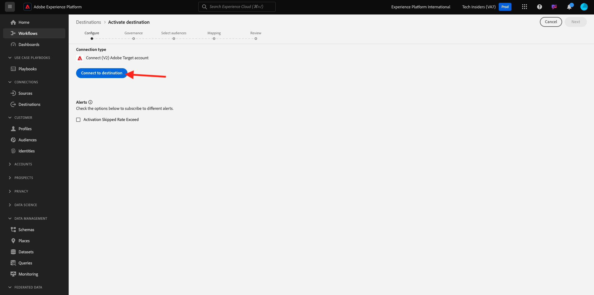
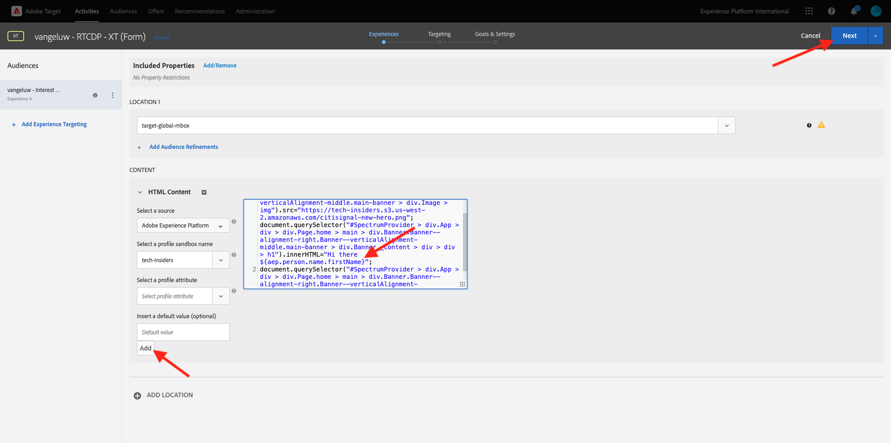

# 2.3.5 Aktion durchführen: Zielgruppe an Adobe Target senden

Zu [Adobe Experience Platform](https://experience.adobe.com/platform). Nach dem Login landen Sie auf der Homepage von Adobe Experience Platform.


Bevor Sie fortfahren, müssen Sie eine **Sandbox“**. Die auszuwählende Sandbox hat den Namen ``--aepSandboxName--``. Nach Auswahl der entsprechenden [!UICONTROL Sandbox] wird der Bildschirm geändert und Sie befinden sich nun in Ihrer dedizierten [!UICONTROL Sandbox].


## Überprüfen des Datenstroms

Das Adobe Target-Ziel in Real-Time CDP ist mit dem Datenstrom verbunden, der zum Aufnehmen von Daten in das Adobe Edge Network verwendet wird. Wenn Sie Ihr Adobe Target-Ziel einrichten möchten, müssen Sie zunächst überprüfen, ob Ihr Datenstrom bereits für Adobe Target aktiviert ist. Ihr Datenstrom wurde in [Übung 0.2 - Erstellen Ihres Datenstroms](./../../../modules/../getting-started/gettingstarted/ex2.md) konfiguriert und erhielt den Namen `--aepUserLdap-- - Demo System Datastream`.

Scrollen Sie im linken Menü nach unten und klicken Sie auf **Datenströme**. Suchen Sie in Datenströme nach Ihrem Datenstrom mit dem Namen `--aepUserLdap-- - Demo System Datastream`. Klicken Sie auf Ihren Datenstrom, um ihn zu öffnen.


Klicken Sie dann auf **…** neben **Adobe Experience Platform** und anschließend auf **Bearbeiten**.


Aktivieren Sie die Kontrollkästchen sowohl für **Edge-** als auch für **Personalization-Ziele**. Klicken Sie auf **Speichern**.


Klicken Sie anschließend auf **+ Service hinzufügen**.


Wählen Sie den Dienst **Adobe Target**. Klicken Sie auf **Speichern**.


Ihr Datenstrom ist jetzt für Adobe Target konfiguriert.


## Einrichten des Adobe Target-Ziels

Adobe Target ist als Ziel über Real-Time CDP verfügbar. Um Ihre Adobe Target-Integration einzurichten, gehen Sie zu **Ziele**, zu **Katalog**.

Klicken Sie im Menü **Kategorien** auf **Personalization&quot;.** Anschließend wird die Zielkarte **(v2) Adobe Target** angezeigt.


Klicken Sie **Mit Ziel verbinden**.



Sie werden es dann sehen. Sie müssen Ihr eigenes Adobe Target-Ziel erstellen, befolgen Sie die folgenden Richtlinien:

- Name: Verwenden Sie den Namen `--aepUserLdap-- - Adobe Target v2  (Web)`.
- Datenstrom-ID: Sie müssen den Datenstrom auswählen, den Sie in [Übung 0.2 - Erstellen Ihres Datenstroms](./../../../modules/../getting-started/gettingstarted/ex2.md) konfiguriert haben. Der Name Ihres Datenstroms sollte sein: `--aepUserLdap-- - Demo System Datastream`.
- Workspace: Dies bezieht sich auf Adobe Target-Arbeitsbereiche. Wenn es keinen spezifischen Arbeitsbereich gibt, den Sie verwenden müssen, wählen Sie **Standard-Workspace**.

Klicken Sie auf **Weiter**.


Sie können jetzt optional eine Data-Governance-Richtlinie auswählen. Klicken Sie auf **Weiter**.


Wählen Sie in der Liste der verfügbaren Zielgruppen die Zielgruppe aus, die Sie in der vorherigen Übung [Zielgruppe erstellen](./ex1.md) erstellt haben. Diese heißt `--aepUserLdap-- - Interest in Galaxy S24`. Klicken Sie dann auf **Weiter**.


Auf dem Bildschirm **Zuordnung** können Sie Profilattribute zuordnen, damit sie in Adobe Target verfügbar werden. Auf diese Weise können Sie Ihrer Website eine zusätzliche Personalisierungsebene hinzufügen. Klicken Sie **Neues Feld hinzufügen**.


Wählen Sie für das neue Feld das Feld **person.name.firstName** aus. Klicken Sie auf **Speichern**.


Dann hast du das hier. Klicken Sie auf **Weiter**.


Klicken Sie auf **Fertigstellen**.


Ihre Zielgruppe ist jetzt für Adobe Target aktiviert.


>[!IMPORTANT]
>
>Wenn Sie soeben Ihr Adobe Target-Ziel in Real-Time CDP erstellt haben, kann es bis zu einer Stunde dauern, bis das Ziel live ist. Dies ist eine einmalige Wartezeit aufgrund der Einrichtung der Backend-Konfiguration. Sobald die anfängliche Wartezeit von einer Stunde und die Backend-Konfiguration abgeschlossen sind, stehen neu hinzugefügte Zielgruppen, die an das Adobe Target-Ziel gesendet werden, für die Zielgruppenbestimmung in Echtzeit zur Verfügung.

## Konfigurieren der formularbasierten Aktivität in Adobe Target

Nachdem Sie nun Ihre Real-Time CDP-Zielgruppe für den Versand an Adobe Target konfiguriert haben, können Sie Ihre Experience Targeting-Aktivität in Adobe Target konfigurieren. In dieser Übung konfigurieren Sie eine formularbasierte Aktivität.

Gehen Sie zur Adobe Experience Cloud-Homepage unter [https://experiencecloud.adobe.com/](https://experiencecloud.adobe.com/). Klicken Sie auf **Target**, um es zu öffnen.


Auf der Startseite von {**}Adobe Target werden alle vorhandenen Aktivitäten angezeigt.** Klicken Sie **Aktivität erstellen** und dann auf **Erlebnis-Targeting**.


Wählen Sie **Web**, **Form** und **Keine Eigenschaftsbeschränkungen**. Klicken Sie auf **Erstellen**.


Sie befinden sich jetzt im Form-Based Activity Composer.


Wählen Sie für das Feld **STANDORT 1** die Option **target-global-mbox**.


Die Standardzielgruppe ist derzeit **Alle Besucher**. Klicken Sie auf die **3** neben **Alle Besucher** und klicken Sie auf **Zielgruppe ändern**.


Jetzt sehen Sie die Liste der verfügbaren Zielgruppen, und die Adobe Experience Platform-Zielgruppe, die Sie zuvor erstellt und an Adobe Target gesendet haben, ist jetzt Teil dieser Liste. Wählen Sie die zuvor in Adobe Experience Platform erstellte Zielgruppe aus. Klicken Sie **Zielgruppe zuweisen**.


Ihre Adobe Experience Platform-Zielgruppe ist jetzt Teil dieser Experience Targeting-Aktivität.


Ändern wir nun das Hero-Bild auf der Homepage der Website. Klicken Sie auf , um die Dropdown-Liste neben **Standardinhalt** zu öffnen, und klicken Sie auf **HTML-Angebot erstellen**.


Fügen Sie den folgenden Code ein.

```javascript
<script>document.querySelector("#SpectrumProvider > div.App > div > div.Page.home > main > div.Banner.Banner--alignment-right.Banner--verticalAlignment-middle.main-banner > div.Image > img").src="https://one-adobe-tech-insiders.s3.us-west-2.amazonaws.com/citisignal-new-hero.png"; document.querySelector("#SpectrumProvider > div.App > div > div.Page.home > main > div.Banner.Banner--alignment-right.Banner--verticalAlignment-middle.main-banner > div.Banner__content > div > div > h1").innerHTML="Hi there ";
document.querySelector("#SpectrumProvider > div.App > div > div.Page.home > main > div.Banner.Banner--alignment-right.Banner--verticalAlignment-middle.main-banner > div.Banner__content > div > div > div > div > p").innerHTML="What about 10% off of your next Galaxy S24 smartphone?";
</script>
```


Als Nächstes müssen Sie ein Personalisierungs-Token aus den Profilattributen von Adobe Experience Platform hinzufügen. Denken Sie daran, dass Sie beim Aktivieren der Zielgruppe für Adobe Target auch das Feld **person.name.firstName** auswählen, das für Adobe Target freigegeben werden soll. Um das Feld abzurufen, wählen Sie die Quelle **Adobe Experience Platform**, wählen Sie Ihre Sandbox (die `--aepSandboxName--` werden soll) und dann das Attribut **person.name.firstName** aus.


Bevor Sie auf die Schaltfläche **Hinzufügen** klicken, gehen Sie zur Zeile, in der Sie `... > h1").innerHTML="Hi there ";` sehen, und setzen Sie den Cursor in die Klammern hinter dem Wort `there` wie folgt:

```
... > h1").innerHTML="Hi there ";
```

Klicken Sie dann auf **Hinzufügen**-Schaltfläche, die anschließend das Token hinzufügen sollte. Dadurch wird der Code wie folgt aktualisiert:

```
... > h1").innerHTML="Hi there ${aep.person.name.firstName}";
```


Klicken Sie auf **Weiter**.



Anschließend sehen Sie einen Überblick über Ihr Erlebnis mit dem neuen Bild für Ihre ausgewählte Zielgruppe. Klicken Sie auf **Weiter**.


Klicken Sie auf den Titel Ihrer Aktivität in der oberen linken Ecke, um sie wie folgt umzubenennen: `--aepUserLdap-- - RTCDP - XT (Form)`


Gehen Sie auf der **Ziele und Einstellungen** zu **Zielmetriken**. Setzen Sie das Primäre Ziel auf **Interaktion** - **Zeit vor Ort**. Klicken Sie **Speichern und schließen**.


Sie befinden sich jetzt auf der Seite **Aktivitätsübersicht**. Sie müssen Ihre Aktivität noch aktivieren. Klicken Sie auf das Feld **Inaktiv** und wählen Sie **Aktivieren** aus.


Sie erhalten dann eine visuelle Bestätigung, dass Ihre Aktivität jetzt live ist.


Ihre Aktivität ist jetzt live und kann auf der Demo-Website getestet werden.

>[!IMPORTANT]
>
>Wenn Sie soeben Ihr Adobe Target-Ziel in Real-Time CDP erstellt haben, kann es bis zu einer Stunde dauern, bis das Ziel live ist. Dies ist eine einmalige Wartezeit aufgrund der Einrichtung der Backend-Konfiguration. Sobald die anfängliche Wartezeit von einer Stunde und die Backend-Konfiguration abgeschlossen sind, stehen neu hinzugefügte Edge-Zielgruppen, die an das Adobe Target-Ziel gesendet werden, für das Targeting in Echtzeit zur Verfügung.

Wenn Sie jetzt zu Ihrer Demo-Website zurückkehren und die Produktseite für Galaxy S24 besuchen, qualifizieren Sie sich für die von Ihnen erstellte Zielgruppe und Sie sehen, dass die Adobe Target-Aktivität in Echtzeit auf der Startseite angezeigt wird.


## Nächste Schritte

Navigieren Sie zu [2.3.6 Ziele - SDK](./ex6.md){target="_blank"}

Kehren Sie zu [Real-Time CDP - Zielgruppe aufbauen und Maßnahmen ergreifen](./real-time-cdp-build-a-segment-take-action.md){target="_blank"}

Zurück zu [Alle Module](./../../../../overview.md){target="_blank"}
