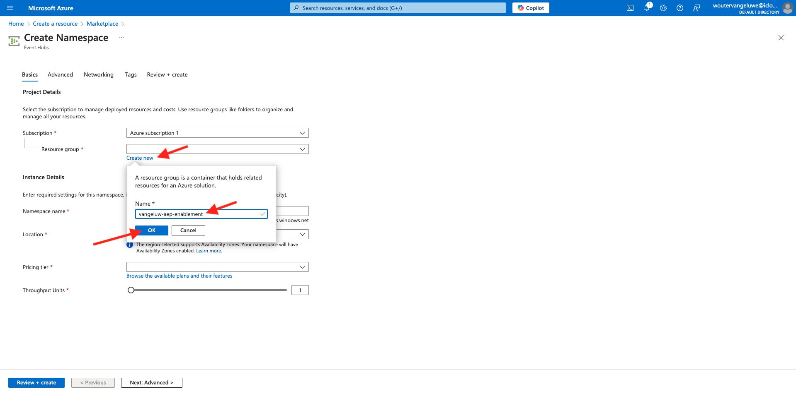
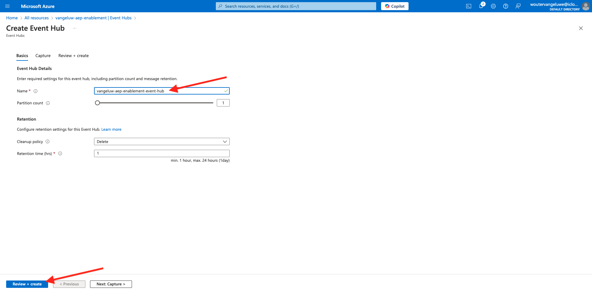

# 2.4.2 Konfigurieren der Microsoft Azure EventHub-Umgebung

Azure Event Hubs ist ein hochgradig skalierbarer Service für Veröffentlichungsabonnements, der Millionen von Ereignissen pro Sekunde aufnehmen und in mehrere Anwendungen streamen kann. Auf diese Weise können Sie die enormen Datenmengen verarbeiten und analysieren, die von Ihren verbundenen Geräten und Anwendungen produziert werden.

## Was ist Azure Event Hubs?

Azure Event Hubs ist eine Big-Data-Streaming-Plattform und ein Service zur Ereignisaufnahme. Es kann Millionen von Ereignissen pro Sekunde empfangen und verarbeiten. Daten, die an einen Ereignis-Hub gesendet werden, können mithilfe eines beliebigen Echtzeit-Analyseanbieters oder Batch-/Speicheradapters transformiert und gespeichert werden.

Event Hubs stellt die **Eingangstür** für eine Ereignis-Pipeline dar, die in Lösungsarchitekturen häufig als Ereignis-Aufnahme bezeichnet wird. Ein Ereignisaufnehmer ist eine Komponente oder ein Service, die bzw. der sich zwischen Ereignisherausgebern (wie Adobe Experience Platform RTCDP) und Ereigniskonsumenten befindet, um die Produktion eines Ereignis-Streams von der Nutzung dieser Ereignisse zu entkoppeln. Event Hubs bietet eine einheitliche Streaming-Plattform mit einem Zeitaufbewahrungspuffer, der Ereignisproduzenten von Ereigniskonsumenten entkoppelt.

## Erstellen eines Event Hubs-Namespace

Wechseln Sie zu [https://portal.azure.com/#home](https://portal.azure.com/#home) und wählen Sie **Ressource erstellen** aus.

Geben Sie im Bildschirm Ressource in **Suchleiste &quot;**&quot; ein. Suchen Sie die Karte **Event Hubs**, klicken Sie auf **Erstellen** und klicken Sie dann auf **Event Hubs**.

Wenn Sie zum ersten Mal eine Ressource in Azure erstellen, müssen Sie eine neue **Ressourcengruppe** erstellen. Wenn Sie bereits über eine Ressourcengruppe verfügen, können Sie diese auswählen (oder eine neue erstellen).

Klicken Sie auf **Neu erstellen** und benennen Sie Ihre Gruppe `--aepUserLdap---aep-enablement` klicken Sie auf **OK**.

Füllen Sie den Rest der Felder wie angegeben aus:

- Namespace : Definieren Sie Ihren Namespace, muss er eindeutig sein. Verwenden Sie das folgende Muster `--aepUserLdap---aep-enablement`
- Speicherort: Beliebigen Speicherort auswählen
- Preisstufe: **Standard**
- Durchsatzeinheiten: **1**

Klicken Sie **Überprüfen + Erstellen**.

Klicken Sie auf **Erstellen**.

Die Bereitstellung Ihrer Ressourcengruppe kann 1-2 Minuten dauern. Bei Erfolg wird der folgende Bildschirm angezeigt:

## Einrichten des Event Hub in Azure

Wechseln Sie zu [https://portal.azure.com/#home](https://portal.azure.com/#home) und wählen Sie **Alle Ressourcen** aus.

Klicken Sie in der Ressourcenliste auf Ihren `--aepUserLdap---aep-enablement` Event Hubs-Namespace:

Gehen Sie `--aepUserLdap---aep-enablement` Detailbildschirm zu **Entitäten** und klicken Sie auf **Ereignis-Hubs**:

Klicken Sie auf **+ Event Hub**.

Verwenden Sie `--aepUserLdap---aep-enablement-event-hub` als Namen und klicken Sie auf **Überprüfen + Erstellen**.

Klicken Sie auf **Erstellen**.

In **Event Hubs** unter Ihrem Event Hub-Namespace wird nun Ihr **Event Hub** aufgeführt.

## Azure-Speicherkonto einrichten

Um Ihre Azure Event Hub-Funktion in späteren Übungen zu debuggen, müssen Sie im Rahmen Ihrer Visual Studio Code-Projekteinrichtung ein Azure-Speicherkonto bereitstellen. Jetzt erstellen Sie dieses Azure-Speicherkonto.

Wechseln Sie zu [https://portal.azure.com/#home](https://portal.azure.com/#home) und wählen Sie **Ressource erstellen** aus.

Geben Sie **Speicherkonto** in der Suche ein, suchen Sie die Karte für **Speicherkonto** und klicken Sie auf **Speicherkonto**.

Geben Sie Ihre **Ressourcengruppe** (zu Beginn dieser Übung erstellt) an, verwenden Sie `--aepUserLdap--aepstorage` als Namen Ihres Speicherkontos und wählen Sie **Lokal redundanter Speicher (LRS)** und klicken Sie dann auf **Überprüfen + Erstellen**.

Klicken Sie auf **Erstellen**.

Die Erstellung unseres Speicherkontos wird einige Sekunden dauern:

Wenn Sie fertig sind, wird auf Ihrem Bildschirm die Schaltfläche **Zur Ressource wechseln** angezeigt.

Klicken Sie auf **Home**.

Ihr Speicherkonto ist jetzt unter &quot;**Ressourcen“**.

## Nächste Schritte

Wechseln Sie zu [2.4.3 Konfigurieren Ihres Azure Event Hub-Ziels in Adobe Experience Platform](./ex3.md){target="_blank"}

Zurück zu [Real-Time CDP: Audience Activation zum Microsoft Azure Event Hub](./segment-activation-microsoft-azure-eventhub.md){target="_blank"}

Zurück zu [Alle Module](./../../../../overview.md){target="_blank"}
