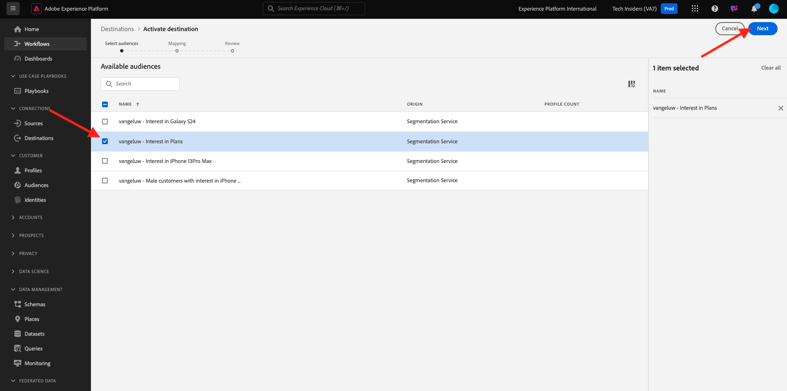

# 2.4.5 Zielgruppe aktivieren

## Zielgruppe zum Azure Event Hub-Ziel hinzufügen

In dieser Übung fügen Sie Ihre `--aepUserLdap-- - Interest in Plans` zu Ihrem `--aepUserLdap---aep-enablement` Azure Event Hub -Ziel hinzu.

Melden Sie sich über die folgende URL bei Adobe Experience Platform an: [https://experience.adobe.com/platform](https://experience.adobe.com/platform).

Nach dem Login landen Sie auf der Homepage von Adobe Experience Platform.

Bevor Sie fortfahren, müssen Sie eine **Sandbox“**. Die auszuwählende Sandbox hat den Namen ``--aepSandboxName--``. Nach Auswahl der entsprechenden Sandbox wird der Bildschirm geändert und Sie befinden sich nun in Ihrer dedizierten Sandbox.

Gehen Sie zu **Ziele** und klicken Sie dann auf **Durchsuchen**. Anschließend werden alle verfügbaren Ziele angezeigt. Suchen Sie Ihr Ziel und klicken Sie auf die drei Punkte&#x200B;**…** wie unten angegeben und klicken Sie dann auf **Zielgruppen aktivieren**.

Sie werden es dann sehen. Suchen Sie mithilfe Ihres LDAP nach Ihrer Audience und wählen Sie `--aepUserLdap-- - Interest in Plans` aus der Liste der Audiences aus.

Klicken Sie auf **Weiter**.

Klicken Sie **Neues Feld hinzufügen**, klicken Sie auf Schema durchsuchen und wählen Sie die `--aepTenantId--identification.core.ecid` aus (löschen Sie alle anderen Felder, die automatisch angezeigt werden sollen).

Klicken Sie auf **Weiter**.

Klicken Sie auf **Fertigstellen**.

Ihre Zielgruppe ist jetzt für Ihr Microsoft Event Hub-Ziel aktiviert.

## Nächste Schritte

Navigieren Sie zu [2.4.6 Erstellen Sie Ihr Microsoft Azure-Projekt](./ex6.md){target="_blank"}

Zurück zu [Real-Time CDP: Audience Activation zum Microsoft Azure Event Hub](./segment-activation-microsoft-azure-eventhub.md){target="_blank"}

Zurück zu [Alle Module](./../../../../overview.md){target="_blank"}
