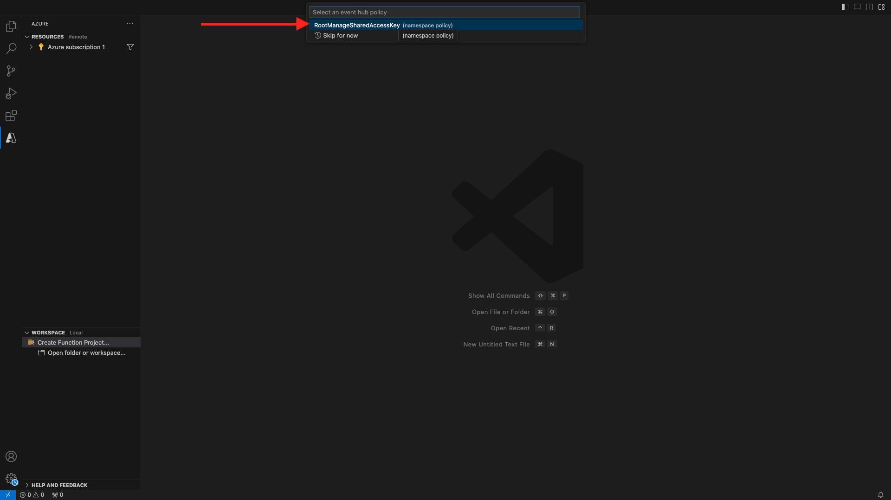

# 2.4.6 Microsoft Azure-Projekt erstellen

## Kennenlernen der Azure Event Hub-Funktionen

Mit Azure-Funktionen können Sie kleine Code-Abschnitte (so genannte **) ausführen** ohne sich Gedanken über die Anwendungsinfrastruktur machen zu müssen. Mit Azure Functions stellt die Cloud-Infrastruktur alle aktuellen Server bereit, die Sie benötigen, um Ihre Anwendung skaliert laufen zu lassen.
Eine Funktion wird **einem** Ereignistyp ausgelöst. Zu den unterstützten Trigger gehören die Reaktion auf Datenänderungen, die Reaktion auf Nachrichten (z. B. Event Hubs), die nach einem Zeitplan oder als Ergebnis einer HTTP-Anfrage ausgeführt werden.
Azure Functions ist ein Server-loser Compute-Service, mit dem Sie ereignisgesteuerten Code ausführen können, ohne die Infrastruktur explizit bereitstellen oder verwalten zu müssen.
Azure Event Hubs lässt sich mit Azure-Funktionen für eine Server-lose Architektur integrieren.

## Öffnen Sie Visual Studio Code und melden Sie sich bei Azure an

Visual Studio Code erleichtert das…
- Definieren und Binden von Azure-Funktionen an Event Hubs- Lokaler Test- Bereitstellen in Azure- Remote-Protokollfunktion

### Visual Studio Code öffnen

### Bei Azure anmelden

Wenn Sie sich mit Ihrem Azure-Konto anmelden, das Sie in der vorherigen Übung registriert haben, können Sie mit Visual Studio Code alle Event Hub-Ressourcen finden und binden.
Öffnen Sie Visual Studio Code und klicken Sie auf das Symbol **Azure**.
Wählen Sie als Nächstes **Bei Azure anmelden**:

Sie werden zum Anmelden zu Ihrem Browser weitergeleitet. Denken Sie daran, das Azure-Konto auszuwählen, das Sie für die Registrierung verwendet haben.
Wenn der folgende Bildschirm im Browser angezeigt wird, sind Sie mit Visual Code Studio angemeldet:

Kehren Sie zu Visual Code Studio zurück (Sie sehen den Namen Ihres Azure-Abonnements, z. B. **Azure-Abonnement 1**):


## Erstellen eines Azure-Projekts

Klicken Sie **Funktionsprojekt erstellen…**:

Wählen oder erstellen Sie einen lokalen Ordner Ihrer Wahl, um das Projekt zu speichern, und klicken Sie auf **Auswählen**:

Sie gelangen nun in den Assistenten zur Projekterstellung. Klicken Sie **JavaScript** als Sprache für Ihr Projekt:

Wählen Sie dann **Modell v4** aus.

Trigger Wählen Sie **Azure Event Hub** als erste Funktionsvorlage Ihres Projekts aus:

Geben Sie einen Namen für Ihre Funktion ein, verwenden Sie das folgende `--aepUserLdap---aep-event-hub-trigger` und drücken Sie die Eingabetaste:

Wählen Sie **Neue lokale App-Einstellung erstellen**:

Klicken Sie auf den zuvor erstellten Event Hub-Namespace, der `--aepUserLdap---aep-enablement` heißt, um ihn auszuwählen.

Klicken Sie als Nächstes auf den zuvor erstellten Event Hub mit dem Namen `--aepUserLdap---aep-enablement-event-hub`.

Klicken Sie, um **RootManageSharedAccessKey** als Event Hub-Richtlinie auszuwählen:

Wählen Sie **Zu Arbeitsbereich hinzufügen** aus, um Ihr Projekt zu öffnen:

Sie erhalten dann möglicherweise eine Nachricht wie diese. Klicken Sie dann auf **Ja, ich vertraue den Autoren**.

Öffnen Sie nach dem Erstellen des Projekts die Datei `--aepUserLdap---aep-event-hub-trigger.js` im Editor:

Die Payload, die von Adobe Experience Platform an Ihren Event Hub gesendet wird, sieht wie folgt aus:

```json
{
  "identityMap": {
    "ecid": [
      {
        "id": "36281682065771928820739672071812090802"
      }
    ]
  },
  "segmentMembership": {
    "ups": {
      "94db5aed-b90e-478d-9637-9b0fad5bba11": {
        "createdAt": 1732129904025,
        "lastQualificationTime": "2024-11-21T07:33:52Z",
        "mappingCreatedAt": 1732130611000,
        "mappingUpdatedAt": 1732130611000,
        "name": "vangeluw - Interest in Plans",
        "status": "realized",
        "updatedAt": 1732129904025
      }
    }
  }
}
```

Aktualisieren Sie den Code in der `--aepUserLdap---aep-event-hub-trigger.js` Ihres Visual Studio-Codes mit dem folgenden Code. Dieser Code wird jedes Mal ausgeführt, wenn Real-Time CDP Zielgruppenqualifikationen an Ihr Event Hub-Ziel sendet. In diesem Beispiel geht es im Code nur um die Anzeige eingehender Payload. Sie können sich jedoch jede Art zusätzlicher Funktionen vorstellen, um Zielgruppenqualifikationen in Echtzeit zu verarbeiten und sie weiter unten in Ihrem Datenpipeline-Ökosystem zu verwenden.
Zeile 11 in Ihrer Datei `--aepUserLdap---aep-event-hub-trigger.js` zeigt derzeit Folgendes:

```javascript
context.log('Event hub message:', message);
```

Ändern Sie Zeile 11 in `--aepUserLdap---aep-event-hub-trigger.js` so, dass sie wie folgt aussieht:

```javascript
context.log('Event hub message:', JSON.stringify(message));
```

Die gesamte Payload sollte dann wie folgt aussehen:

```javascript
const { app } = require('@azure/functions');

app.eventHub('--aepUserLdap---aep-event-hub-trigger', {
    connection: '--aepUserLdap--aepenablement_RootManageSharedAccessKey_EVENTHUB',
    eventHubName: '--aepUserLdap---aep-enablement-event-hub',
    cardinality: 'many',
    handler: (messages, context) => {
        if (Array.isArray(messages)) {
            context.log(`Event hub function processed ${messages.length} messages`);
            for (const message of messages) {
                context.log('Event hub message:', message);
            }
        } else {
            context.log('Event hub function processed message:', messages);
        }
    }
});
```


Das Ergebnis sollte wie folgt aussehen:


## Azure-Projekt ausführen

Jetzt ist es Zeit, Ihr Projekt auszuführen. In dieser Phase werden wir das Projekt nicht in Azure bereitstellen. Wir führen es lokal im Debug-Modus aus. Wählen Sie das Symbol Ausführen aus und klicken Sie auf den grünen Pfeil.

Wenn Sie Ihr Projekt zum ersten Mal im Debugging-Modus ausführen, müssen Sie ein Azure-Speicherkonto anhängen. Klicken Sie dann auf **Speicherkonto auswählen**.

Wählen Sie anschließend das zuvor erstellte Speicherkonto mit dem Namen `--aepUserLdap--aepstorage` aus.

Ihr Projekt läuft jetzt und wird für Ereignisse im Event Hub aufgelistet. In der nächsten Übung demonstrieren Sie das Verhalten auf der Demo-Website von CitiSignal, das Sie für Zielgruppen qualifiziert. Als Ergebnis erhalten Sie eine Payload zur Zielgruppen-Qualifizierung im Terminal Ihrer Event Hub-Trigger-Funktion.


## Azure-Projekt stoppen

Um Ihr Projekt zu stoppen, gehen Sie zum Lenu **CALL STACK** in VSC, klicken Sie auf den Pfeil Ihres laufenden Projekts und dann auf **Stopp**.


## Nächste Schritte

Zum End-to-End-Szenario [2.4.7](./ex7.md){target="_blank"}
Zurück zu [Real-Time CDP: Audience Activation zum Microsoft Azure Event Hub](./segment-activation-microsoft-azure-eventhub.md){target="_blank"}
Zurück zu [Alle Module](./../../../../overview.md){target="_blank"}
