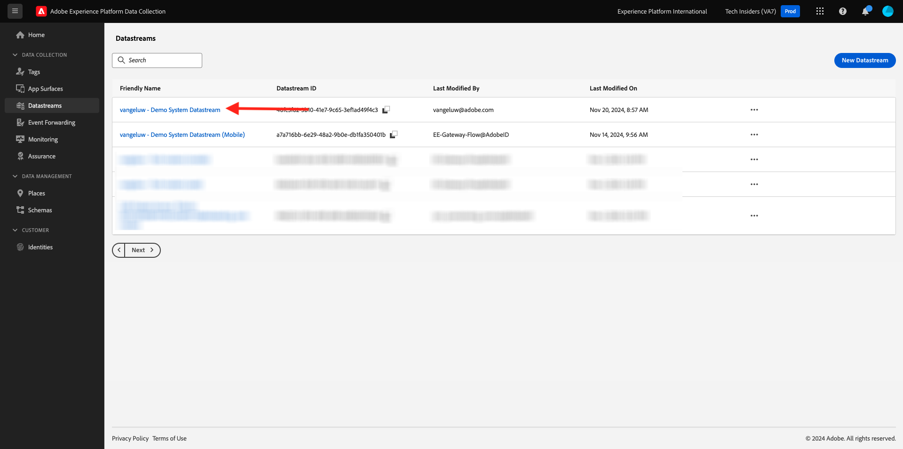

# 2.5.2 Aktualisieren Sie Ihren Datenstrom, um Daten für Ihre Adobe Experience Platform-Datenerfassungsserver-Eigenschaft verfügbar zu machen

## Aktualisieren des Datenstroms

In [Erste Schritte](./../../../getting-started/gettingstarted/ex2.md) haben Sie Ihren eigenen **[!UICONTROL Datenstrom]** erstellt. Sie haben dann den Namen `--aepUserLdap-- - Demo System Datastream` verwendet.

In dieser Übung müssen Sie diesen **[!UICONTROL Datenstrom) so konfigurieren]** dass er mit Ihrer **Datenerfassungs-Server-Eigenschaft)**.

Navigieren Sie dazu zu [https://experience.adobe.com/#/data-collection/](https://experience.adobe.com/#/data-collection/). Sie werden es dann sehen. Klicken Sie im linken Menü auf **[!UICONTROL Datenströme]**.

Wählen Sie oben rechts im Bildschirm den Namen Ihrer Sandbox aus, der `--aepSandboxName--` werden soll.

Suchen Sie nach Ihrem **[!UICONTROL Datenstrom]**, der `--aepUserLdap-- - Demo System Datastream` heißt. Klicken Sie auf **[!UICONTROL Datenstrom]**, um ihn zu öffnen.

Sie werden es dann sehen. Klicken Sie auf **[!UICONTROL + Service hinzufügen]**.

Wählen Sie den Service **Ereignisweiterleitung** aus. Dadurch werden zwei zusätzliche Einstellungen angezeigt. Wählen Sie die in der vorherigen Übung erstellte Ereignisweiterleitungseigenschaft mit dem Namen `--aepUserLdap-- - Demo System (DD/MM/YYYY) (Edge)` aus. Wählen Sie dann **Entwicklung** unter **Umgebung** aus. Klicken Sie auf **Speichern**.

Ihr Datenstrom wurde jetzt aktualisiert und ist einsatzbereit.

Ihr Datenstrom ist jetzt für die Arbeit mit Ihrem **[!DNL Event Forwarding property]** bereit.

## Nächste Schritte

Navigieren Sie zu [2.5.3 Erstellen und konfigurieren Sie einen benutzerdefinierten Webhook](./ex3.md){target="_blank"}

Zurück zu [Real-Time CDP Connections: Ereignisweiterleitung](./aep-data-collection-ssf.md){target="_blank"}

Zurück zu [Alle Module](./../../../../overview.md){target="_blank"}
