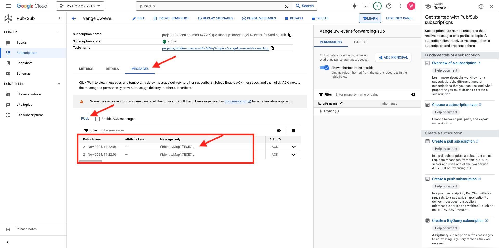

# 2.5.4 Weiterleiten von Ereignissen an GCP Pub/Sub

>[!NOTE]
>
>Für diese Übung benötigen Sie Zugriff auf eine Google Cloud Platform-Umgebung. Wenn Sie noch keinen Zugriff auf GCP haben, erstellen Sie ein neues Konto mit Ihrer persönlichen E-Mail-Adresse.

## Erstellen eines Google Cloud Pub/Sub-Themas

Navigieren Sie zu [https://console.cloud.google.com/](https://console.cloud.google.com/). Geben Sie in der Suchleiste `pub/sub` ein. Klicken Sie auf das Suchergebnis **Pub/Sub - Globale Echtzeit-Nachrichten**.

Sie werden es dann sehen. Klicken Sie **THEMA ERSTELLEN**.

Sie werden es dann sehen. Verwenden Sie für Ihre Themen-ID `--aepUserLdap---event-forwarding`. Klicken Sie auf **Erstellen**.

Ihr Thema wurde erstellt. Klicken Sie auf die „Abonnement **ID“ des**.

Sie werden es dann sehen. Kopieren Sie den **Themennamen** in die Zwischenablage und speichern Sie ihn so, wie Sie ihn in den nächsten Übungen benötigen werden.

Wechseln wir jetzt zur Ereignisweiterleitung bei der Adobe Experience Platform-Datenerfassung, um Ihre Ereignisweiterleitungseigenschaft zu aktualisieren und mit der Ereignisweiterleitung an Pub/Sub zu beginnen.

## Aktualisieren Sie die Ereignisweiterleitungseigenschaft: Geheimnisse

**Geheimnisse** in den Properties der Ereignisweiterleitung werden zum Speichern von Anmeldeinformationen verwendet, die für die Authentifizierung bei externen APIs verwendet werden. In diesem Beispiel müssen Sie einen geheimen Schlüssel konfigurieren, um Ihr Google Cloud Platform OAuth-Token zu speichern, das zur Authentifizierung verwendet wird, wenn Pub/Sub zum Streamen von Daten an GCP verwendet wird.

Wechseln Sie zu [https://experience.adobe.com/#/data-collection/](https://experience.adobe.com/#/data-collection/) und dann zu **Secrets**. Klicken Sie **Neue geheimen Daten erstellen**.

Sie werden es dann sehen. Befolgen Sie diese Anweisungen:

- Name: use `--aepUserLdap---gcp-secret`
- Zielumgebung: Wählen Sie **Entwicklung**
- Typ: **Google OAuth 2**
- Aktivieren Sie das Kontrollkästchen für **Pub/Sub**

Klicken Sie **Geheimnis erstellen**.

Nachdem Sie auf **Geheimnis erstellen** geklickt haben, wird ein Popup angezeigt, in dem Sie die Authentifizierung zwischen dem Geheimnis Ihrer Ereignisweiterleitungseigenschaft und Google einrichten können. Klicken Sie **Geheimnis `--aepUserLdap---gcp-secret` mit Google erstellen und autorisieren**.

Klicken Sie, um Ihr Google-Konto auszuwählen.

Klicken Sie auf **Weiter**.

>[!NOTE]
>
>Ihre Popup-Nachricht kann variieren. Bitte autorisieren/erlauben Sie den angeforderten Zugriff, um die Übung fortsetzen zu können.

Nach erfolgreicher Authentifizierung sehen Sie Folgendes.

Die geheimen Daten wurden erfolgreich konfiguriert und können in einem Datenelement verwendet werden.

## Aktualisieren der Ereignisweiterleitungseigenschaft: Datenelement

Um Ihre geheimen Daten in der Ereignisweiterleitungs-Eigenschaft zu verwenden, müssen Sie ein Datenelement erstellen, in dem der Wert der geheimen Daten gespeichert wird.

Wechseln Sie zu [https://experience.adobe.com/#/data-collection/](https://experience.adobe.com/#/data-collection/) und dann zu **Ereignisweiterleitung**. Suchen Sie Ihre Ereignisweiterleitungs-Eigenschaft und klicken Sie darauf, um sie zu öffnen.

Wechseln Sie im linken Menü zu **Datenelemente**. Klicken Sie **Datenelement hinzufügen**.

Konfigurieren Sie Ihr Datenelement wie folgt:

- Name: **GCP-Geheimnis**
- Erweiterung: **core**
- Datenelementtyp: **secret**
- Entwicklungsgeheimnis : Wählen Sie die von Ihnen erstellten geheimen Daten aus, die `--aepUserLdap---gcp-secret` heißen

Klicken Sie auf **Speichern**.

## Aktualisieren Sie die Ereignisweiterleitungseigenschaft: Erweiterung

Nachdem Sie Ihre geheimen Daten und Ihr Datenelement konfiguriert haben, können Sie jetzt die Erweiterung für Google Cloud Platform in Ihrer Ereignisweiterleitungs-Eigenschaft einrichten.

Wechseln Sie zu [https://experience.adobe.com/#/data-collection/](https://experience.adobe.com/#/data-collection/), wechseln Sie zu **Ereignisweiterleitung** und öffnen Sie Ihre Ereignisweiterleitungseigenschaft.

Gehen Sie dann zu **Erweiterungen**, zu **Katalog**. Klicken Sie auf die Erweiterung **Google Cloud Platform** und dann auf **Installieren**.

Sie werden es dann sehen. Klicken Sie auf das Symbol Datenelement .

Wählen Sie das Datenelement aus, das Sie in der vorherigen Übung erstellt haben. Es heißt **GCP-Geheimnis**. Klicken Sie auf **Auswählen**.

Sie werden es dann sehen. Klicken Sie auf **Speichern**.

## Aktualisieren der Ereignisweiterleitungseigenschaft: Aktualisieren einer Regel

Nachdem Sie Ihre Google Cloud Platform-Erweiterung konfiguriert haben, können Sie eine Regel definieren, um mit der Weiterleitung von Ereignisdaten an Ihr Pub/Sub-Thema zu beginnen. Dazu müssen Sie Ihre Regel **Alle Seiten** aktualisieren, die Sie in einer der vorherigen Übungen erstellt haben.

Navigieren Sie im linken Menü zu **Regeln**. In der vorherigen Übung haben Sie die Regel &quot;**Seiten“**. Klicken Sie auf diese Regel, um sie zu öffnen.

Dann wirst du das hier. Klicken Sie auf das Symbol **+** unter **Aktionen**, um eine neue Aktion hinzuzufügen.

Sie werden es dann sehen. Nehmen Sie die folgende Auswahl vor:

- Wählen Sie **Erweiterung** aus: **Google Cloud Platform**.
- Wählen Sie den **Aktionstyp** aus: **Daten an Cloud Pub/Sub senden**.

Daraus sollte folgender **bestehenName**: **Google Cloud Platform - Senden von Daten an Cloud Pub/Sub**. Sie sollten dies jetzt sehen:

Jetzt müssen Sie das zuvor erstellte Pub/Sub-Thema konfigurieren.

Den **Themennamen“ finden** hier kopieren.

Fügen Sie den **Themennamen** in Ihre Regelkonfiguration ein. Klicken Sie anschließend auf das Datenelementsymbol neben dem Feld **Daten (erforderlich)**.

Wählen Sie **XDM-Ereignis** aus und klicken Sie auf **Auswählen**.

Sie werden es dann sehen. Klicken Sie auf **Änderungen beibehalten**.

Klicken Sie auf **Speichern**.

Sie werden es dann sehen.

## Veröffentlichen der Änderungen

Ihre Konfiguration ist jetzt abgeschlossen. Gehen Sie zu **Veröffentlichungsfluss**, um Ihre Änderungen zu veröffentlichen. Öffnen Sie Ihre Entwicklungsbibliothek **Main**, indem Sie wie **auf** Bearbeiten“ klicken.

Klicken Sie auf **Schaltfläche „Alle geänderten Ressourcen hinzufügen**. Danach werden Ihre Regel und Ihr Datenelement in dieser Bibliothek angezeigt. Klicken Sie anschließend auf **Für Entwicklung speichern und erstellen**. Ihre Änderungen werden jetzt bereitgestellt.

Nach einigen Minuten sehen Sie, dass die Bereitstellung abgeschlossen ist und getestet werden kann.

## Testen der Konfiguration

Navigieren Sie zu [https://dsn.adobe.com](https://dsn.adobe.com). Nachdem Sie sich mit Ihrer Adobe ID angemeldet haben, sehen Sie Folgendes. Klicken Sie auf die 3 Punkte **…** in Ihrem Website-Projekt und dann auf **Ausführen**, um es zu öffnen.

Anschließend wird Ihre Demo-Website geöffnet. Wählen Sie die URL aus und kopieren Sie sie in die Zwischenablage.

Öffnen Sie ein neues Inkognito-Browser-Fenster.

Fügen Sie die URL Ihrer Demo-Website ein, die Sie im vorherigen Schritt kopiert haben. Sie werden dann aufgefordert, sich mit Ihrer Adobe ID anzumelden.

Wählen Sie Ihren Kontotyp aus und schließen Sie den Anmeldevorgang ab.

Ihre Website wird dann in einem Inkognito-Browser-Fenster geladen. Für jede Übung müssen Sie ein neues Inkognito-Browser-Fenster verwenden, um Ihre Demo-Website-URL zu laden.

Wechseln Sie zur Ansicht Ihres Google Cloud Pub/Sub und navigieren Sie zu **NACHRICHTEN**. Klicken Sie **PULL** und nach einigen Sekunden werden einige Meldungen in der Liste angezeigt. Klicken Sie auf eine Nachricht, um deren Inhalt zu visualisieren.

Jetzt können Sie die XDM-Payload Ihres Ereignisses in Google Pub/Sub sehen. Sie haben jetzt erfolgreich Daten, die von der Adobe Experience Platform-Datenerfassung erfasst wurden, in Echtzeit an einen Google Cloud Pub/Sub-Endpunkt gesendet. Von dort aus können diese Daten von jeder Google Cloud Platform-Anwendung verwendet werden, z. B. BigQuery für Speicherung und Reporting oder für Anwendungsfälle des maschinellen Lernens.

## Nächste Schritte

Navigieren Sie zu [2.5.5 Ereignisse an AWS Kinesis und AWS S3 weiterleiten](./ex5.md){target="_blank"}

Zurück zu [Real-Time CDP Connections: Ereignisweiterleitung](./aep-data-collection-ssf.md){target="_blank"}

Zurück zu [Alle Module](./../../../../overview.md){target="_blank"}
