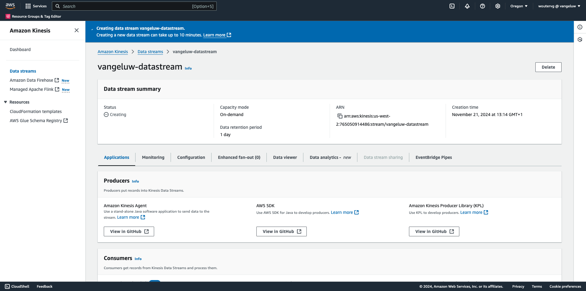
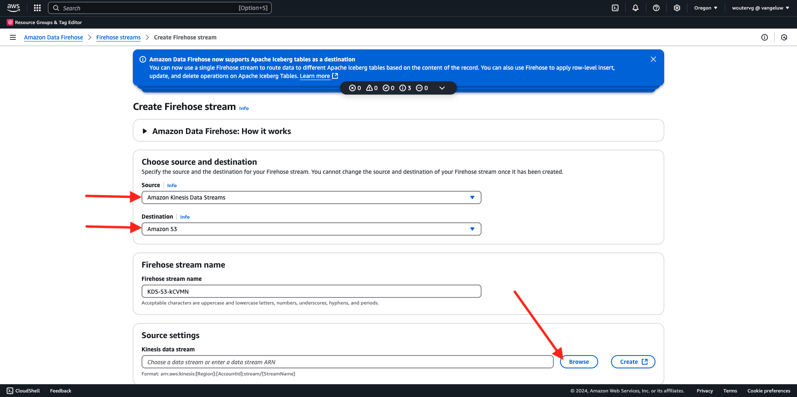
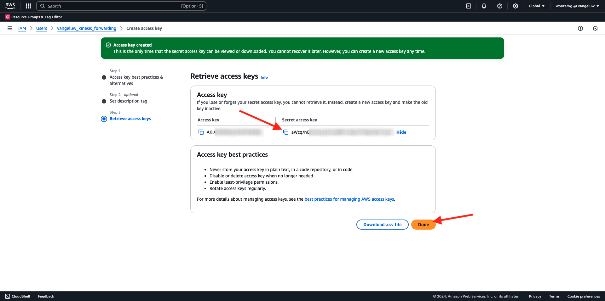
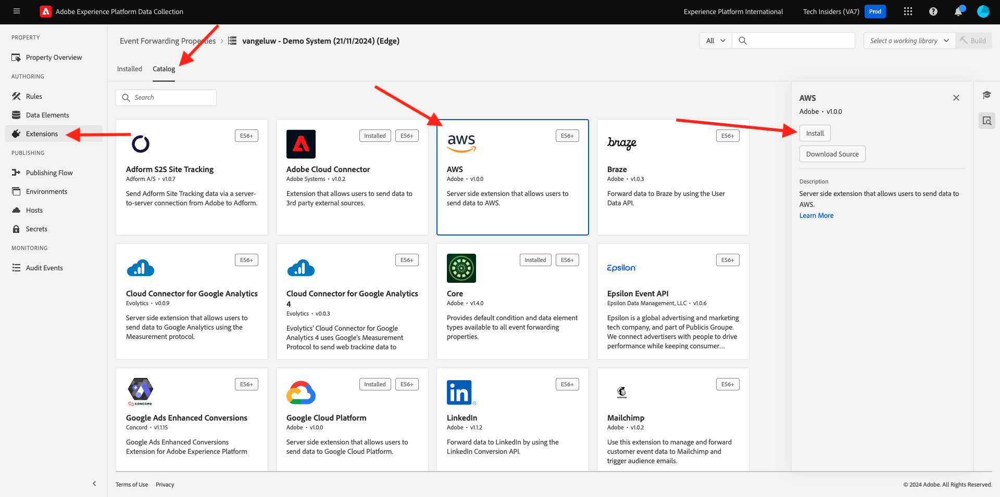
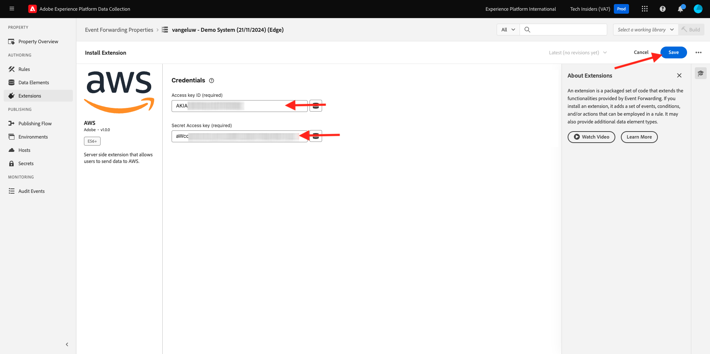
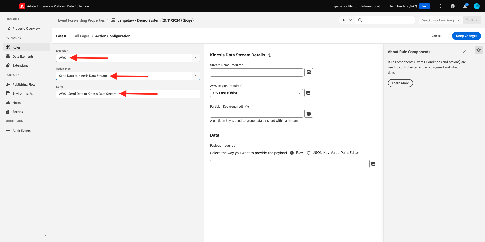

# 2.5.5 Weiterleiten von Veranstaltungen an AWS Kinesis und AWS S3

>[!IMPORTANT]
>
>Der Abschluss dieser Übung ist optional, und die Verwendung von AWS Kinesis ist mit Kosten verbunden. Während AWS ein Free-Tier-Konto bereitstellt, mit dem Sie viele Services kostenlos testen und konfigurieren können, ist AWS Kinesis nicht Teil dieses Free-Tier-Kontos. Um diese Übung also zu implementieren und zu testen, fallen Kosten für die Verwendung von AWS Kinesis an.

## Gut zu wissen

Adobe Experience Platform unterstützt verschiedene Amazon-Services als Ziel.
Kinesis und S3 sind beide [Profilexportziele](https://experienceleague.adobe.com/docs/experience-platform/destinations/destination-types.html?lang=de) und können als Teil von Adobe Experience Platforms Real-Time CDP verwendet werden.
Sie können mühelos hochwertige Segmentereignisse und zugehörige Profilattribute in Ihre gewünschten Systeme einfließen lassen.

In dieser Übung erfahren Sie, wie Sie Ihren eigenen Amazon Kinesis-Stream einrichten, um Ereignisdaten aus dem Adobe Experience Platform Edge-Ökosystem an ein Cloud-Speicherziel wie Amazon S3 zu streamen. Dies ist nützlich, wenn Sie Erlebnisereignisse aus Web- und Mobile-Eigenschaften erfassen und für Analysen und operative Berichte in Ihren Data Lake pushen möchten. DataLake nimmt im Allgemeinen Daten im Batch-Modus mit großen täglichen Dateiimporten auf, sie stellen keinen öffentlichen HTTP-Endpunkt bereit, der in Verbindung mit der Ereignisweiterleitung verwendet werden könnte.

Die Unterstützung der oben genannten Anwendungsfälle bedeutet, dass Streaming-Daten gepuffert oder in einer Warteschlange platziert werden müssen, bevor sie in eine Datei geschrieben werden. Es ist darauf zu achten, dass keine Datei für den Schreibzugriff über mehrere Prozesse hinweg geöffnet wird. Die Übertragung dieser Aufgabe an ein dediziertes System ist ideal, um es schön zu skalieren und gleichzeitig ein hohes Serviceniveau zu gewährleisten. Hier kommt Kinesis zu Hilfe.

Amazon Kinesis Data Streams konzentriert sich auf die Aufnahme und Speicherung von Datenströmen. Kinesis Data Firehose konzentriert sich auf die Bereitstellung von Datenströmen an ausgewählte Ziele, wie S3-Buckets.

Im Rahmen dieser Übung werden Sie…

- Durchführen einer grundlegenden Einrichtung eines Kinesis-Datenstroms
- Erstellen eines Firehose-Versand-Streams und Verwenden des S3-Buckets als Ziel
- Konfigurieren Sie das Amazon-API-Gateway als REST-API-Endpunkt, um Ihre Ereignisdaten zu erhalten
- Weiterleiten von Rohdaten von Ereignissen aus Adobe Edge an Ihren Kinesis-Stream

## Konfigurieren des AWS S3-Buckets

Navigieren Sie zu [https://console.aws.amazon.com](https://console.aws.amazon.com) und melden Sie sich mit Ihrem Amazon-Konto an.

Nach der Anmeldung werden Sie zur **AWS Management Console** weitergeleitet.

Suchen Sie im Menü **Dienste suchen** nach **s3**. Klicken Sie auf das erste Suchergebnis: **S3 - Scalable Storage in the Cloud**.

Anschließend wird die Startseite von **Amazon S3** angezeigt. Klicken Sie **Bucket erstellen**.

Im Bildschirm **Bucket erstellen** müssen Sie zwei Dinge konfigurieren:

- Name: Verwenden Sie den Namen `eventforwarding---aepUserLdap--`.

Belassen Sie alle anderen Standardeinstellungen. Scrollen Sie nach unten und klicken Sie auf **Bucket erstellen**.

Anschließend wird Ihr Bucket erstellt und zur Amazon S3-Homepage weitergeleitet.

## Konfigurieren des AWS Kinesis-Datenstroms

Suchen Sie im Menü **Dienste suchen** nach **kinesis**. Klicken Sie auf das erste Suchergebnis: **Kinesis - Arbeiten mit Echtzeit-Streaming-Daten**.

Wählen Sie **Kinesis Data Streams** aus. Klicken Sie **Daten-Stream erstellen**.

Verwenden Sie für **Datenstromnamen** &quot;`--aepUserLdap---datastream`&quot;.

Sie müssen keine der anderen Einstellungen ändern. Scrollen Sie nach unten und klicken Sie **Daten-Stream erstellen**.

Sie werden es dann sehen. Nachdem Ihr Daten-Stream erfolgreich erstellt wurde, können Sie mit der nächsten Übung fortfahren.

## Konfigurieren des AWS Firehose-Bereitstellungs-Streams

Suchen Sie im Menü **Dienste suchen** nach **kinesis**. Klicken Sie **Kinesis Data Firehose**.

Klicken Sie **Firehose-Stream erstellen**.

Wählen Sie für **Source** die Option **Amazon Kinesis Data Streams**. Wählen Sie **Ziel** die Option **Amazon S3** aus. Klicken Sie **Durchsuchen**, um Ihren Datenstrom auszuwählen.

Wählen Sie Ihren Datenstrom aus. Klicken Sie **Auswählen**.

Sie werden es dann sehen. Merken Sie sich den **Namen des Firehose** Streams), da Sie ihn später benötigen werden.

Scrollen Sie nach unten, bis Sie **Zieleinstellungen** sehen. Klicken Sie **Durchsuchen**, um Ihren S3-Bucket auszuwählen.

Wählen Sie Ihren S3-Bucket aus und klicken Sie auf **Auswählen**.

Sie werden dann so etwas sehen. Aktualisieren Sie die folgenden Einstellungen:

- Neues Zeilentrennzeichen: auf (**)**
- Dynamische Partitionierung: auf **Nicht aktiviert** eingestellt

Scrollen Sie ein wenig weiter nach unten und klicken Sie auf **Firehose-Stream erstellen**

Nach einigen Minuten wird Ihr Firehose-Stream erstellt und **Aktiv**.

## IAM-Benutzer erstellen

Klicken Sie im linken AWS IAM-Menü auf **Benutzer**. Anschließend wird der Bildschirm **Benutzer** angezeigt. Klicken Sie **Benutzer erstellen**.

Konfigurieren Sie anschließend Ihren Benutzer:

- Benutzername: `--aepUserLdap--_kinesis_forwarding` verwenden

Klicken Sie auf **Weiter**.

Anschließend wird dieser Bildschirm mit den Berechtigungen angezeigt. Klicken Sie **Richtlinien direkt anhängen**.

Geben Sie den Suchbegriff **kinesisfirehose** ein, um alle zugehörigen Richtlinien anzuzeigen. Wählen Sie die Richtlinie **AmazonKinesisFirehoseFullAccess**. Scrollen Sie nach unten und klicken Sie auf **Weiter**.

Überprüfen Sie Ihre Konfiguration. Klicken Sie **Benutzer erstellen**.

Sie werden es dann sehen. Klicken Sie **Benutzer anzeigen**.

Klicken Sie auf **Berechtigungen hinzufügen** und anschließend auf **Inline-Richtlinie erstellen**.

Sie werden es dann sehen. Wählen Sie den Dienst **Kinesis** aus.

Navigieren Sie zu **Schreiben** und aktivieren Sie das Kontrollkästchen für **PutRecord**.

Scrollen Sie nach unten zu **Ressourcen** und wählen Sie **Alle** aus. Klicken Sie auf **Weiter**.

Benennen Sie Ihre Richtlinie wie folgt: **Kinesis_PutRecord** und klicken Sie auf **Richtlinie erstellen**.

Sie werden es dann sehen. Klicken Sie **Sicherheitsberechtigungen**.

Klicken Sie **Zugriffsschlüssel erstellen**.

Wählen Sie **Anwendung, die außerhalb von AWS ausgeführt wird**. Scrollen Sie nach unten und klicken Sie auf **Weiter**.

Klicken Sie **Zugriffsschlüssel erstellen**

Sie werden es dann sehen. Klicken Sie **Anzeigen**, um Ihren geheimen Zugriffsschlüssel anzuzeigen:

Ihr **geheimer Zugriffsschlüssel** wird jetzt angezeigt.

>[!IMPORTANT]
>
>Speichern Sie Ihre Anmeldedaten in einer Textdatei auf Ihrem Computer.
>
> - Zugriffsschlüssel-ID: …
> - Geheimer Zugriffsschlüssel: …
>
> Wenn Sie auf **Fertig** klicken, werden Ihre Anmeldeinformationen nie mehr angezeigt!

Klicken Sie auf **Fertig**.

Sie haben jetzt erfolgreich einen IAM-Benutzer mit entsprechenden Berechtigungen erstellt, die Sie beim Konfigurieren der AWS-Erweiterung in Ihrer Ereignisweiterleitungseigenschaft angeben müssen.

## Aktualisieren Sie die Ereignisweiterleitungseigenschaft: Erweiterung

Nachdem Sie Ihre geheimen Daten und Ihr Datenelement konfiguriert haben, können Sie jetzt die Erweiterung für Google Cloud Platform in Ihrer Ereignisweiterleitungs-Eigenschaft einrichten.

Wechseln Sie zu [https://experience.adobe.com/#/data-collection/](https://experience.adobe.com/#/data-collection/), wechseln Sie zu **Ereignisweiterleitung** und öffnen Sie Ihre Ereignisweiterleitungseigenschaft.

Gehen Sie dann zu **Erweiterungen**, zu **Katalog**. Klicken Sie auf die Erweiterung **AWS** und dann auf **Installieren**.

Geben Sie die IAM-Benutzeranmeldeinformationen ein, die Sie in der vorherigen Übung generiert haben. Klicken Sie auf **Speichern**.

Als Nächstes müssen Sie eine Regel konfigurieren, die mit der Weiterleitung von Ereignisdaten an Kinesis beginnt.

## Aktualisieren Sie die Ereignisweiterleitungseigenschaft: Regel

Navigieren Sie im linken Menü zu **Regeln**. Klicken Sie, um die Regel **Alle Seiten** zu öffnen, die Sie in einer der vorherigen Übungen erstellt haben.

Sie werden es dann sehen. Klicken Sie auf das Symbol **+** , um eine neue Aktion hinzuzufügen.

Sie werden es dann sehen. Nehmen Sie die folgende Auswahl vor:

- Wählen Sie die **Erweiterung** aus: **AWS**
- Wählen Sie den **Aktionstyp** aus: **Daten an Kinesis-Datenstrom senden**
- Name: **AWS - Senden von Daten an Kinesis Data Stream**

Sie sollten dies jetzt sehen:

Konfigurieren Sie anschließend Folgendes:

- Stream-Name: `--aepUserLdap---datastream`
- AWS-Region: Überprüfen Sie Ihre Region bei der Einrichtung Ihres AWS-Datenstroms
- Partitionsschlüssel: **0**

Ihre AWS-Region finden Sie hier:

Du solltest das jetzt haben. Klicken Sie anschließend auf das Datenelementsymbol für das Feld **Daten**.

Wählen Sie **XDM-Ereignis** aus und klicken Sie auf **Auswählen**.

Dann hast du das hier. Klicken Sie auf **Änderungen beibehalten**.

Sie werden es dann sehen. Klicken Sie auf **Speichern**.

Gehen Sie zu **Veröffentlichungsfluss**, um Ihre Änderungen zu veröffentlichen.
Öffnen Sie Ihre Entwicklungsbibliothek, indem Sie auf **Main** klicken.

Klicken Sie auf **Schaltfläche Alle geänderten Ressourcen**. Danach werden Ihre Regel- und Datenelementänderungen in dieser Bibliothek angezeigt. Klicken Sie anschließend auf **Für Entwicklung speichern und erstellen**. Ihre Änderungen werden jetzt bereitgestellt.

Nach einigen Minuten sehen Sie, dass die Bereitstellung abgeschlossen ist und getestet werden kann.

## Testen der Konfiguration

Navigieren Sie zu [https://dsn.adobe.com](https://dsn.adobe.com). Nachdem Sie sich mit Ihrer Adobe ID angemeldet haben, sehen Sie Folgendes. Klicken Sie auf die 3 Punkte **…** in Ihrem Website-Projekt und dann auf **Ausführen**, um es zu öffnen.

Anschließend wird Ihre Demo-Website geöffnet. Wählen Sie die URL aus und kopieren Sie sie in die Zwischenablage.

Öffnen Sie ein neues Inkognito-Browser-Fenster.

Fügen Sie die URL Ihrer Demo-Website ein, die Sie im vorherigen Schritt kopiert haben. Sie werden dann aufgefordert, sich mit Ihrer Adobe ID anzumelden.

Wählen Sie Ihren Kontotyp aus und schließen Sie den Anmeldevorgang ab.

Ihre Website wird dann in einem Inkognito-Browser-Fenster geladen. Für jede Übung müssen Sie ein neues Inkognito-Browser-Fenster verwenden, um Ihre Demo-Website-URL zu laden.

Ansicht zu **AWS wechseln**. Wenn Sie Ihren Daten-Stream öffnen und auf die Registerkarte **Überwachung** wechseln, sehen Sie jetzt eingehenden Traffic.

Wenn Sie dann Ihren Data Firehose-Stream öffnen und zur Registerkarte **Überwachung** wechseln, sehen Sie auch eingehenden Traffic.

Wenn Sie sich schließlich Ihren S3-Bucket ansehen, werden Sie feststellen, dass dort infolge Ihrer Datenaufnahme Dateien erstellt werden.

Wenn Sie eine solche Datei herunterladen und in einem Texteditor öffnen, sehen Sie, dass sie die XDM-Payload der weitergeleiteten Ereignisse enthält.

>[!IMPORTANT]
>
>Sobald Ihr Setup erwartungsgemäß funktioniert, vergessen Sie nicht, Ihren AWS Kinesis Data Stream und Data Firehose abzuschalten, um Gebühren zu vermeiden!

## Nächste Schritte

Zurück zu [Real-Time CDP Connections: Ereignisweiterleitung](./aep-data-collection-ssf.md){target="_blank"}

Zurück zu [Alle Module](./../../../../overview.md){target="_blank"}
