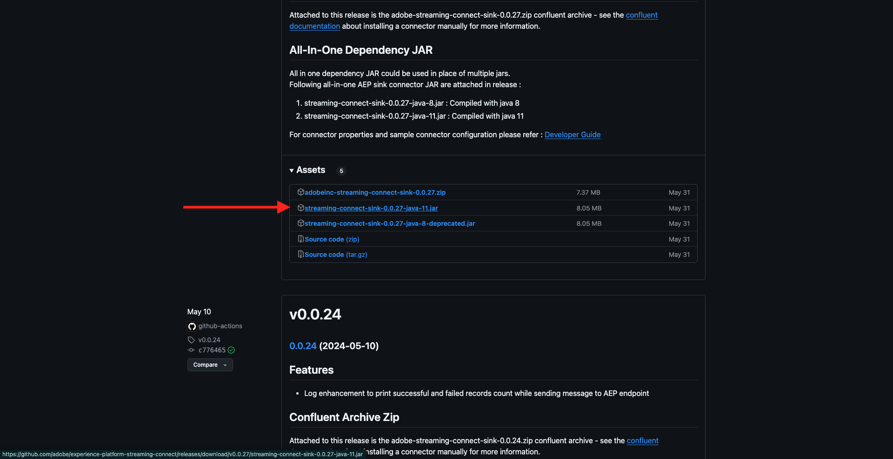
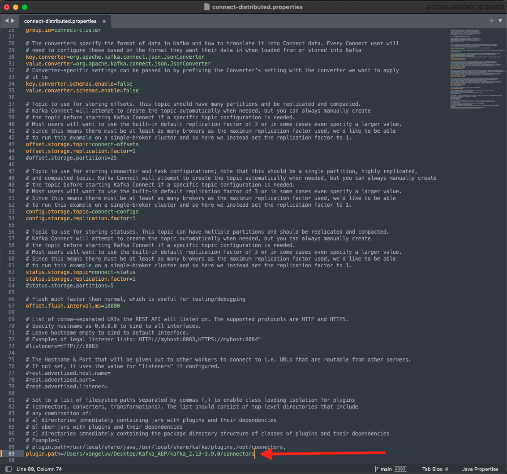
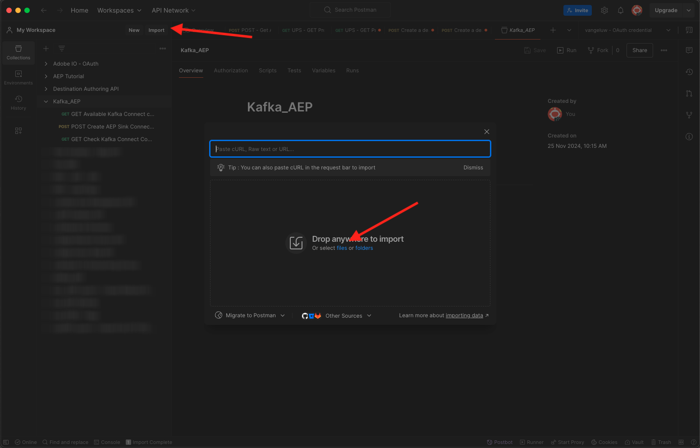

# 2.6.4 Installieren und konfigurieren Sie Kafka Connect und den Adobe Experience Platform Sink Connector

## Herunterladen des Adobe Experience Platform Sink Connectors

Navigieren Sie zu [https://github.com/adobe/experience-platform-streaming-connect/releases](https://github.com/adobe/experience-platform-streaming-connect/releases) und laden Sie die neueste offizielle Version des Adobe Experience Platform Sink Connectors herunter.


Laden Sie die Datei **streaming-connect-sink-0.0.27-java-11.jar** herunter.



Platzieren Sie die Download-Datei **streaming-connect-sink-0.0.27-java-11.jar** auf Ihrem Desktop.


## Kafka Connect konfigurieren

Gehen Sie zum Ordner auf Ihrem Desktop mit dem Namen **Kafka_AEP** und navigieren Sie zum `kafka_2.13-3.9.0/config`.
Öffnen Sie in diesem Ordner die Datei **connect-distributed.properties** mit einem Texteditor.


Wechseln Sie in Ihrem Texteditor zu Zeile 34 und 35 und stellen Sie sicher, dass Sie die Felder `key.converter.schemas.enable` und `value.converter.schemas.enable` auf `false` festlegen

```json
key.converter.schemas.enable=false
value.converter.schemas.enable=false
```

Speichern Sie Ihre Änderungen in dieser Datei.


Gehen Sie dann zurück zum Ordner `kafka_2.13-3.1.0` und erstellen Sie manuell einen neuen Ordner und benennen Sie ihn `connectors`.


Klicken Sie mit der rechten Maustaste auf den neuen Ordner und klicken Sie auf **Neues Terminal unter Ordner**.


Sie werden es dann sehen. Geben Sie den `pwd` ein, um den vollständigen Pfad für diesen Ordner abzurufen. Wählen Sie den vollständigen Pfad aus und kopieren Sie ihn in die Zwischenablage.


Gehen Sie zurück zu Ihrem Texteditor, zur Datei **connect-distributed.properties** und scrollen Sie bis zur letzten Zeile (Zeile 89 im Screenshot). Sie sollten die Auskommentierung der Zeile, die mit `#` beginnt (`# plugin.path=` entfernen), aufheben und den vollständigen Pfad in den Ordner mit dem Namen `connectors` einfügen. Das Ergebnis sollte in etwa wie folgt aussehen:

`plugin.path=/Users/woutervangeluwe/Desktop/Kafka_AEP/kafka_2.13-3.9.0/connectors`

Speichern Sie Ihre Änderungen in der Datei **connect-distributed.properties** und schließen Sie den Texteditor.



Kopieren Sie als Nächstes die neueste offizielle Version des Adobe Experience Platform Sink Connectors, die Sie heruntergeladen haben, in den Ordner mit dem Namen `connectors`. Die Datei, die Sie zuvor heruntergeladen haben, heißt **streaming-connect-sink-0.0.27-java-11.jar**. Sie können sie einfach in den `connectors` Ordner verschieben.


Öffnen Sie als Nächstes ein neues Terminal-Fenster auf der Ebene des Ordners **kafka_2.13-3.9.0**. Klicken Sie mit der rechten Maustaste auf diesen Ordner und klicken Sie auf **Neues Terminal unter Ordner**.

Fügen Sie im Terminal-Fenster folgenden Befehl ein: `bin/connect-distributed.sh config/connect-distributed.properties` und klicken Sie auf **Enter**. Dieser Befehl startet Kafka Connect und lädt die Bibliothek des Adobe Experience Platform Sink Connectors.


Nach ein paar Sekunden sehen Sie so etwas:


## Erstellen des Adobe Experience Platform Sink Connectors mit Postman

Sie können jetzt mit Kafka Connect über Postman interagieren. Laden Sie dazu [diese Postman-Sammlung](./../../../../assets/postman/postman_kafka.zip) herunter und entpacken Sie sie auf Ihrem lokalen Computer auf dem Desktop. Sie erhalten dann eine Datei mit dem Namen `Kafka_AEP.postman_collection.json`.


Sie müssen diese Datei in Postman importieren. Öffnen Sie dazu Postman, klicken Sie auf **Importieren** ziehen Sie die `Kafka_AEP.postman_collection.json` in das Popup und klicken Sie auf **Importieren**.



Diese Kollektion finden Sie dann im linken Menü von Postman. Klicken Sie auf die erste Anforderung **GET Available Kafka Connect Connectors**, um sie zu öffnen.


Sie werden es dann sehen. Klicken Sie auf die blaue **Senden**-Schaltfläche, nach der Sie eine leere Antwort-`[]` sehen sollten. Die leere Antwort ist darauf zurückzuführen, dass derzeit keine Kafka Connect-Connectoren definiert sind.


Um einen Connector zu erstellen, klicken Sie auf , um die zweite Anforderung in der Kafka-Sammlung **POST Create AEP Sink Connector** zu öffnen, und gehen Sie zu **Body**. Sie werden es dann sehen. In Zeile 11, in der es **„aep.endpoint“ lautet: &quot;**, müssen Sie die HTTP-API-Streaming-Endpunkt-URL einfügen, die Sie am Ende einer der vorherigen Übungen erhalten haben. Die HTTP-API-Streaming-Endpunkt-URL sieht wie folgt aus: `https://dcs.adobedc.net/collection/63751d0f299eeb7aa48a2f22acb284ed64de575f8640986d8e5a935741be9067`.


Nach dem Einfügen sollte der Textkörper Ihrer Anfrage wie folgt aussehen. Klicken Sie auf die blaue **Senden**-Schaltfläche, um Ihren Connector zu erstellen. Sie erhalten eine sofortige Antwort auf die Erstellung Ihres Connectors.


Klicken Sie auf die erste Anforderung, **GET Available Kafka Connect Connectors**, um sie erneut zu öffnen, und klicken Sie erneut auf die blaue Schaltfläche **Senden**. Sie sehen jetzt, dass ein Kafka Connect-Connector vorhanden ist.


Öffnen Sie als Nächstes die dritte Anfrage in der Kafka-Sammlung, **GET Überprüfen des Kafka Connect-Connector-Status**. Klicken Sie auf die blaue **Senden**-Schaltfläche. Sie erhalten dann eine Antwort wie die unten stehende, die besagt, dass der Connector ausgeführt wird.


## Erzeugen eines Erlebnisereignisses

Öffnen Sie ein neues **Terminal**-Fenster, indem Sie mit der rechten Maustaste auf den Ordner **kafka_2.13-3.9.0** und dann auf **Neues Terminal im Ordner** klicken.


Geben Sie den folgenden Befehl ein:

`bin/kafka-console-producer.sh --broker-list 127.0.0.1:9092 --topic aep`

Sie werden es dann sehen. Jede neue Zeile, gefolgt vom Drücken der Eingabetaste, führt dazu, dass eine neue Nachricht an das Thema gesendet wird **aep**.


Sie können jetzt eine Nachricht senden, die dazu führt, dass sie vom Adobe Experience Platform Sink Connector genutzt wird und die in Echtzeit in Adobe Experience Platform aufgenommen wird.

Nehmen Sie die folgende Beispiel-Payload für Erlebnisereignisse und kopieren Sie sie in einen Texteditor.

```json
{
  "header": {
    "datasetId": "61fe23fd242870194a6d779c",
    "imsOrgId": "--aepImsOrgID--",
    "source": {
      "name": "Launch"
    },
    "schemaRef": {
      "id": "https://ns.adobe.com/experienceplatform/schemas/b0190276c6e1e1e99cf56c99f4c07a6e517bf02091dcec90",
      "contentType": "application/vnd.adobe.xed-full+json;version=1"
    }
  },
  "body": {
    "xdmMeta": {
      "schemaRef": {
        "id": "https://ns.adobe.com/experienceplatform/schemas/b0190276c6e1e1e99cf56c99f4c07a6e517bf02091dcec90",
        "contentType": "application/vnd.adobe.xed-full+json;version=1"
      }
    },
    "xdmEntity": {
      "eventType": "callCenterInteractionKafka",
      "_id": "",
      "timestamp": "2024-11-25T09:54:12.232Z",
      "_experienceplatform": {
        "identification": {
          "core": {
            "phoneNumber": ""
          }
        },
        "interactionDetails": {
          "core": {
            "callCenterAgent": {
              "callID": "Support Contact - 3767767",
              "callTopic": "contract",
              "callFeeling": "negative"
            }
          }
        }
      }
    }
  }
}
```

Sie werden es dann sehen. Sie müssen zwei Felder manuell aktualisieren:

- **_id**: Bitte setzen Sie eine zufällige ID wie `--aepUserLdap--1234`
- **Zeitstempel**: Aktualisieren Sie den Zeitstempel auf das aktuelle Datum und die aktuelle Uhrzeit
- **phoneNumber**: Geben Sie die Telefonnummer des Kontos ein, das zuvor auf der Demo-Website erstellt wurde. Sie finden ihn im Bedienfeld Profil-Viewer unter **Identitäten**.

Sie müssen auch diese Felder überprüfen und möglicherweise aktualisieren:

- **datasetId**: Sie müssen die Datensatz-ID für das Datensatz-Demosystem - Ereignisdatensatz für Callcenter (Global v1.1) kopieren


- **imsOrgID**: Ihre IMS-Org-ID ist `--aepImsOrgId--`

>[!NOTE]
>
>Das Feld **_id** muss für jede Datenaufnahme eindeutig sein. Wenn Sie mehrere Ereignisse generieren, stellen Sie sicher, dass Sie das Feld **_id** jedes Mal auf einen neuen, eindeutigen Wert aktualisieren.

Sie sollten dann etwas wie das folgende haben:


Kopieren Sie als Nächstes Ihr vollständiges Erlebnisereignis in die Zwischenablage. Der Leerraum Ihrer JSON-Payload muss entfernt werden, und wir werden ein Online-Tool verwenden, um dies zu tun. Gehen Sie dazu zu [](http://jsonviewer.stack.hu/)http://jsonviewer.stack.hu/.

Fügen Sie Ihr Erlebnisereignis in den Editor ein und klicken Sie auf **Leerzeichen entfernen**.


Wählen Sie als Nächstes den gesamten Ausgabetext aus und kopieren Sie ihn in die Zwischenablage.


Zurück zum Terminal-Fenster.


Fügen Sie die neue Payload ohne Leerzeichen in das Terminal-Fenster ein und klicken Sie auf **Eingabe**.


Gehen Sie dann zurück zu Ihrer Demo-Website und aktualisieren Sie die Seite. Jetzt sollte in Ihrem Profil unter „Erlebnisereignisse“ ein Erlebnisereignis **werden** genau wie im folgenden:


>[!NOTE]
>
>Wenn Ihre Callcenter-Interaktionen im Bereich Profil-Viewer angezeigt werden sollen, müssen Sie die folgende Beschriftung und den folgenden Filter in Ihrem Projekt auf [https://dsn.adobe.com](https://dsn.adobe.com) hinzufügen, indem Sie zur Registerkarte **Profil-Viewer** wechseln und eine neue Zeile unter **Ereignisse** mit den folgenden Variablen hinzufügen:
>- **Titel Ereignistyp**: Interaktionen mit dem Callcenter
>- **Filter Ereignistyp**: callCenterInteractionKafka
>- **Titel**: `--aepTenantId--.interactionDetails.core.callCenterAgent.callID`


Du hast diese Übung beendet.

## Nächste Schritte

Gehen Sie zurück zu [Streamen Sie Daten von Apache Kafka nach Adobe Experience Platform](./aep-apache-kafka.md){target="_blank"}

Zurück zu [Alle Module](./../../../../overview.md){target="_blank"}
