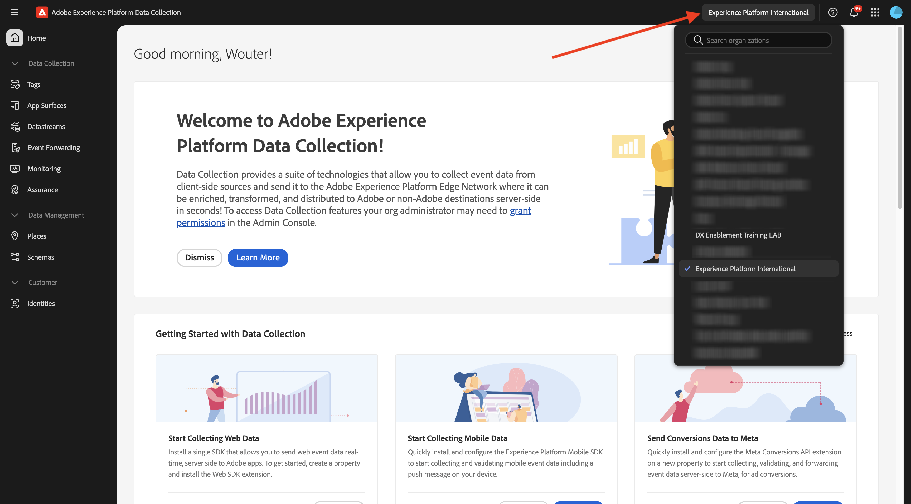
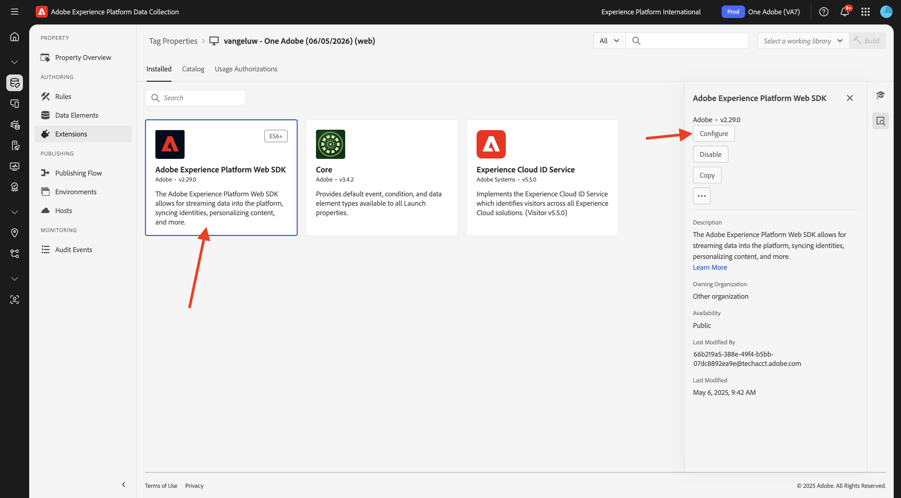
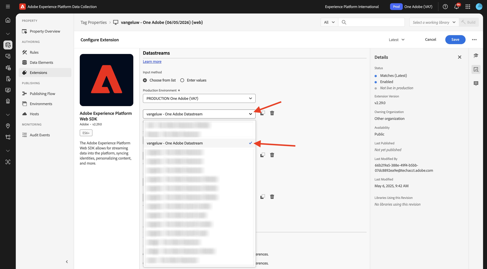

# Erstellen eines Datenstroms

Navigieren Sie zu [https://experience.adobe.com/#/data-collection/](https://experience.adobe.com/#/data-collection/){target="_blank"}.

Stellen Sie sicher, dass Sie die richtige Umgebung ausgewählt haben, bevor Sie fortfahren, indem Sie den Umgebungsumschalter in der oberen rechten Ecke Ihres Bildschirms verwenden. Die richtige Umgebung heißt `--aepImsOrgName--`.

>[!NOTE]
>
> Der folgende Screenshot zeigt, wie eine bestimmte Organisation ausgewählt wird. Wenn Sie dieses Tutorial durchlaufen, hat Ihre Organisation höchstwahrscheinlich einen anderen Namen. Wenn Sie sich für dieses Tutorial angemeldet haben, wurden Ihnen die zu verwendenden Umgebungsdetails zur Verfügung gestellt. Befolgen Sie bitte diese Anweisungen.

Klicken Sie im linken Menü auf &quot;**[!UICONTROL &quot;]**. Nach der vorherigen Übung verfügen Sie jetzt über drei Datenerfassungseigenschaften: eine für das Web, eine für Mobilgeräte und eine für die CX-App.

Diese Eigenschaften sind fast einsatzbereit. Bevor Sie jedoch mit der Datenerfassung mit diesen Eigenschaften beginnen können, müssen Sie einen Datenstrom einrichten. In einer späteren Übung im Datenerfassungsmodul erfahren Sie mehr darüber, was ein Datenstrom ist und was er bedeutet.

Führen Sie zunächst die folgenden Schritte aus.

## Erstellen eines Datenstroms für das Web

Klicken Sie **[!UICONTROL Datenströme]**.

Wählen Sie oben rechts im Bildschirm den Namen Ihrer Sandbox aus, der `--aepSandboxName--` werden soll.

>[!NOTE]
>
> Der folgende Screenshot zeigt, wie eine bestimmte Sandbox ausgewählt wird. Wenn Sie dieses Tutorial durchlaufen, hat Ihre Sandbox höchstwahrscheinlich einen anderen Namen. Wenn Sie sich für dieses Tutorial angemeldet haben, wurden Ihnen die zu verwendenden Umgebungsdetails zur Verfügung gestellt. Befolgen Sie bitte diese Anweisungen.

Klicken Sie **[!UICONTROL Neuer Datenstrom]**.

Geben **als** und als optionale Beschreibung `--aepUserLdap-- - One Adobe Datastream` ein. Wählen Sie **Zuordnungsschema** die Option **Demosystem - Ereignisschema für Website (Global v1.1)**. Klicken Sie auf **Speichern**.

Sie werden es dann sehen. Klicken Sie **Service hinzufügen**.

Wählen Sie den Dienst **[!UICONTROL Adobe Experience Platform]** aus, wodurch zusätzliche Felder angezeigt werden. Sie werden es dann sehen.

Wählen Sie für den Ereignisdatensatz die Option **Demosystem - Ereignisdatensatz für die Website (Global v1.1)** und für den Profildatensatz die Option **Demosystem - Profildatensatz für die Website (Global v1.1)**. Klicken Sie auf **Speichern**.

Das wirst du jetzt sehen.

Klicken Sie im linken Menü auf &quot;**[!UICONTROL &quot;]**.

Filtern Sie die Suchergebnisse, um Ihre Datenerfassungseigenschaften anzuzeigen. Öffnen Sie die Eigenschaft für **Web** durch Klicken.

Sie werden es dann sehen. Klicken Sie **Erweiterungen**.

Klicken Sie zunächst auf die Adobe Experience Platform Web SDK-Erweiterung und dann auf **Konfigurieren**.

Sie werden es dann sehen. Sehen Sie sich das Menü **Datenströme** an und stellen Sie sicher, dass die richtige Sandbox ausgewählt ist, was in Ihrem Fall `--aepSandboxName--` werden sollte.

Öffnen Sie das **Datenströme** und wählen Sie den zuvor erstellten Datenstrom aus.

Stellen Sie sicher, dass Sie Ihren **Datenstrom** in allen drei verschiedenen Umgebungen ausgewählt haben. Klicken Sie dann auf **Speichern**.

Navigieren Sie **Veröffentlichungsfluss**.

Klicken Sie auf **…** für **Main** und dann auf **Bearbeiten**.

Klicken Sie auf **Alle geänderten Ressourcen hinzufügen** und anschließend auf **Für Entwicklung speichern und erstellen**.

Ihre Änderungen werden jetzt veröffentlicht und sind in einigen Minuten bereit. Danach wird der grüne Punkt neben &quot;**&quot;**.

## Erstellen eines Datenstroms für Mobilgeräte

Navigieren Sie zu [https://experience.adobe.com/#/data-collection/](https://experience.adobe.com/#/data-collection/){target="_blank"}.

Klicken Sie **[!UICONTROL Datenströme]**.

Wählen Sie oben rechts im Bildschirm den Namen Ihrer Sandbox aus, der `--aepSandboxName--` werden soll.

>[!NOTE]
>
> Der folgende Screenshot zeigt, wie eine bestimmte Sandbox ausgewählt wird. Wenn Sie dieses Tutorial durchlaufen, hat Ihre Sandbox höchstwahrscheinlich einen anderen Namen. Wenn Sie sich für dieses Tutorial angemeldet haben, wurden Ihnen die zu verwendenden Umgebungsdetails zur Verfügung gestellt. Befolgen Sie bitte diese Anweisungen.

Klicken Sie **[!UICONTROL Neuer Datenstrom]**.

Geben **[!UICONTROL als Anzeigename]** als optionale Beschreibung `--aepUserLdap-- - One Adobe Datastream (Mobile)` ein. Wählen Sie **Zuordnungsschema** die Option **Demosystem - Ereignisschema für Mobile App (Global v1.1)**. Klicken Sie auf **Speichern**.

Klicken Sie auf **[!UICONTROL Speichern]**.

Sie werden es dann sehen. Klicken Sie **Service hinzufügen**.

Wählen Sie den Dienst **[!UICONTROL Adobe Experience Platform]** aus, wodurch zusätzliche Felder angezeigt werden. Sie werden es dann sehen.

Wählen Sie für den Ereignisdatensatz **Demosystem - Ereignisdatensatz für die Mobile App (Global v1.1)** und für den Profildatensatz **Demosystem - Profildatensatz für die Mobile App (Global v1.1)**. Klicken Sie auf **Speichern**.

Sie werden es dann sehen.

Ihr Datenstrom kann jetzt in Ihrer Adobe Experience Platform-Datenerfassungs-Client-Eigenschaft für Mobilgeräte verwendet werden.

Navigieren Sie **Tags** und filtern Sie die Suchergebnisse, um Ihre beiden Datenerfassungseigenschaften anzuzeigen. Öffnen Sie die Eigenschaft für **Mobile**, indem Sie darauf klicken.

Sie werden es dann sehen. Klicken Sie **Erweiterungen**.

Klicken Sie auf die Erweiterung **Adobe Experience Platform Edge Network** und dann auf **Konfigurieren**.

Sie werden es dann sehen. Jetzt müssen Sie die richtige Sandbox und den richtigen Datenstrom auswählen, die Sie gerade konfiguriert haben. Die zu verwendende Sandbox wird `--aepSandboxName--` und der Datenstrom heißt `--aepUserLdap-- - One Adobe Datastream (Mobile)`.

Für die **Edge Network-Domain** verwenden Sie die Standard-Domain.

Klicken Sie **Speichern**, um Ihre Änderungen zu speichern.

Navigieren Sie **Veröffentlichungsfluss**.

Klicken Sie auf **…** neben **Main** und dann auf **Edit**.

Klicken Sie **Alle geänderten Ressourcen hinzufügen** und anschließend auf **Für Entwicklung speichern und erstellen**.

Ihre Änderungen werden jetzt veröffentlicht und sind in einigen Minuten bereit. Danach wird der grüne Punkt neben &quot;**&quot;**.

## Nächste Schritte

Navigieren Sie zu [Website verwenden](./ex4.md){target="_blank"}

Zurück zu [Erste Schritte](./getting-started.md){target="_blank"}

Zurück zu [Alle Module](./../../../overview.md){target="_blank"}