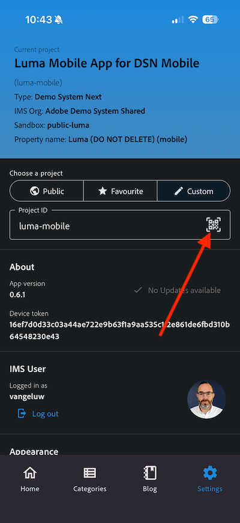

# Verwenden der Mobile App

## Herunterladen der App

Navigieren Sie auf Ihrem Computer zu [0}https://dsn.adobe.com/installund dann zu ](https://dsn.adobe.com/install){target="_blank"}Beta-Version **.** Melden Sie sich mit Ihrer Adobe ID an. Sie sehen dann Folgendes.

Verwenden Sie die **Camera**-App auf Ihrem Smartphone, um die Mobile App für das Betriebssystem Ihres Geräts zu installieren. Für diese Aktivierung müssen Sie die Version **0.6.1** (oder höher) installieren, die den SDK von Adobe Experience Platform Mobile verwendet.

>[!NOTE]
>
>Nachdem Sie die App zum ersten Mal auf einem iOS-Gerät installiert haben, erhalten Sie möglicherweise eine Fehlermeldung, wenn Sie versuchen, die App zu öffnen. Diese lautet: **Untrusted Enterprise Developer**. Um dies zu beheben, müssen Sie zu **Einstellungen > Allgemein > VPN- und Geräteverwaltung > Adobe Systems Inc.** gehen und auf **Adobe Systems Inc.** klicken.

Wählen Sie nach dem Scannen des QR-Codes **Installieren** aus.

Sobald die App installiert ist, finden Sie sie auf dem Startbildschirm Ihres Geräts. Klicken Sie auf das Symbol, um die App zu öffnen.

Nach der Anmeldung wird eine Benachrichtigung angezeigt, in der Sie um Ihre Erlaubnis zum Senden von Benachrichtigungen gebeten werden. Wir senden Benachrichtigungen im Rahmen des Tutorials. Klicken Sie daher auf **Zulassen**.

Anschließend wird die Startseite der App angezeigt. Navigieren Sie zu **Einstellungen**.

In den Einstellungen wird angezeigt, dass derzeit ein &quot;**Projekt** in der App geladen ist. Klicken Sie auf **Benutzerdefiniertes Projekt**.

Sie können jetzt ein benutzerdefiniertes Projekt laden. Klicken Sie auf den QR-Code, um Ihr Projekt einfach zu laden.

Nach der vorherigen Übung hatten Sie dieses Ergebnis. Klicken Sie hier, um das **Mobile Edge Telco-Projekt** zu öffnen, das für Sie erstellt wurde.

Falls Sie Ihr Browser-Fenster versehentlich geschlossen haben oder zukünftige Demo- oder Aktivierungssitzungen geplant sind, können Sie unter [https://dsn.adobe.com](https://dsn.adobe.com){target="_blank"} auch auf Ihr Website-Projekt zugreifen. Nachdem Sie sich mit Ihrer Adobe ID angemeldet haben, sehen Sie Folgendes. Klicken Sie auf die drei Punkte **…** in Ihrem Mobile-App-Projekt und dann auf **Bearbeiten**.

Auf der **Integrationen** müssen Sie die Datenerfassungseigenschaft auswählen, die in der vorherigen Übung erstellt wurde. Klicken Sie dazu auf **Umgebung auswählen**.

Klicken Sie **der Datenerfassungseigenschaft** die im vorherigen Schritt erstellt wurde und `--aepUserLdap - One Adobe (DD/MM/YYYY) (mobile)` heißt, auf „Auswählen“. Klicken Sie dann auf **Speichern**.

Sie werden es dann sehen. Klicken Sie anschließend auf **Ausführen**.

Sie sehen dann dieses Popup, das einen QR-Code enthält. Scannen Sie diesen QR-Code aus der mobilen App heraus.

Anschließend wird Ihre Projekt-ID in die App geladen, wonach Sie auf &quot;**&quot;** können.

Sie sollten dann sehen, **die Demo-Marke** CitiSignal) geladen wird. Ihre App kann jetzt verwendet werden.

## Nächste Schritte

Navigieren Sie zu [Adobe I/O-Projekt konfigurieren](./ex6.md){target="_blank"}

Zurück zu [Erste Schritte](./getting-started.md){target="_blank"}

Zurück zu [Alle Module](./../../../overview.md){target="_blank"}