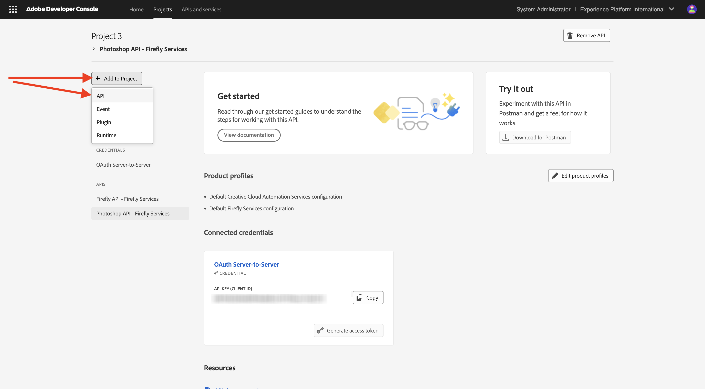

# Konfigurieren des Adobe I/O-Projekts

## Erstellen eines Adobe I/O-Projekts

In dieser Übung wird Adobe I/O verwendet, um verschiedene Adobe-Endpunkte abzufragen. Führen Sie diese Schritte aus, um Adobe I/O einzurichten.

Navigieren Sie zu [https://developer.adobe.com/console/home](https://developer.adobe.com/console/home){target="_blank"}.

{zoomable="yes"}

Achten Sie darauf, dass Sie die richtige Instanz in der oberen rechten Ecke Ihres Bildschirms auswählen. Ihre Instanz ist `--aepImsOrgName--`.
Wählen Sie anschließend **Neues Projekt erstellen**.

{zoomable="yes"}

### Firefly Services-API

Sie sollten das dann sehen. Wählen Sie **+ Zu Projekt hinzufügen** und dann **API**.

{zoomable="yes"}

Ihr Bildschirm sollte wie folgt aussehen.

{zoomable="yes"}

Wählen Sie **Creative Cloud** und **Firefly - Firefly Services** aus und klicken Sie dann auf **Weiter**.

{zoomable="yes"}

Geben Sie einen Namen für Ihre Berechtigung ein: `--aepUserLdap-- - One Adobe OAuth credential`und wählen Sie **Weiter**.

{zoomable="yes"}

Wählen Sie das Standardprofil **Standardkonfiguration für Firefly Services** und dann **Konfigurierte API speichern** aus.

{zoomable="yes"}

Sie sollten das dann sehen.

{zoomable="yes"}

### Photoshop Services-API

Wählen Sie **+ Zu Projekt hinzufügen** dann **API** aus.

{zoomable="yes"}

Wählen Sie **Creative Cloud** und **Photoshop - Firefly Services** aus. Klicken Sie auf **Weiter**.

{zoomable="yes"}

Klicken Sie auf **Weiter**.

{zoomable="yes"}

Als Nächstes müssen Sie ein Produktprofil auswählen, das definiert, welche Berechtigungen für diese Integration verfügbar sind.

Wählen Sie **Standardkonfiguration für Firefly** und **Standardkonfiguration für Creative Cloud-Automatisierungsdienste** aus.

Wählen Sie **Konfigurierte API speichern**.

{zoomable="yes"}

Sie sollten das dann sehen.

{zoomable="yes"}

### Adobe Experience Platform-API

Wählen Sie **+ Zu Projekt hinzufügen** dann **API** aus.

{zoomable="yes"}

Wählen Sie **Adobe Experience** und **Experience Platform API**. Klicken Sie auf **Weiter**.

{zoomable="yes"}

Klicken Sie auf **Weiter**.

{zoomable="yes"}

Als Nächstes müssen Sie ein Produktprofil auswählen, das definiert, welche Berechtigungen für diese Integration verfügbar sind.

Wählen Sie **Adobe Experience Platform - Alle Benutzer - PROD** aus.

Wählen Sie **Konfigurierte API speichern**.

{zoomable="yes"}

Sie sollten das dann sehen.

{zoomable="yes"}

### Projektname

Klicken Sie auf Ihren Projektnamen.

{zoomable="yes"}

Wählen Sie **Projekt bearbeiten** aus.

{zoomable="yes"}

Geben Sie einen Anzeigenamen für Ihre Integration ein: `--aepUserLdap-- One Adobe tutorial`und wählen Sie **Speichern**.

{zoomable="yes"}

Die Einrichtung Ihres Adobe I/O-Projekts ist jetzt abgeschlossen.

{zoomable="yes"}

## Nächste Schritte

Navigieren Sie zu [Option 1: Postman-Setup](./ex7.md){target="_blank"}

Gehen Sie zu [Option 2: PostBuster-Einrichtung](./ex8.md){target="_blank"}

Zurück zu [Erste Schritte](./getting-started.md){target="_blank"}

Zurück zu [Alle Module](./../../../overview.md){target="_blank"}