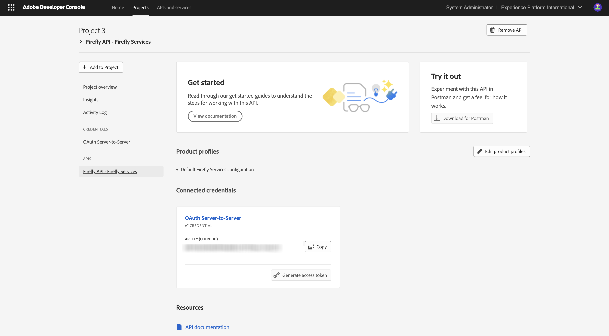
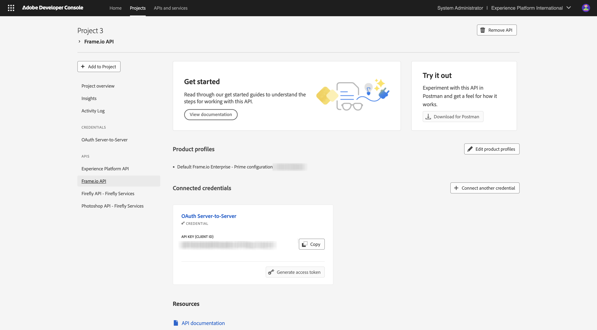

# Konfigurieren des Adobe I/O-Projekts

## Erstellen eines Adobe I/O-Projekts

In dieser Übung wird Adobe I/O verwendet, um verschiedene Adobe-Endpunkte abzufragen. Führen Sie diese Schritte aus, um Adobe I/O einzurichten.

Navigieren Sie zu [https://developer.adobe.com/console/home](https://developer.adobe.com/console/home){target="_blank"}.

Achten Sie darauf, dass Sie die richtige Instanz in der oberen rechten Ecke Ihres Bildschirms auswählen. Ihre Instanz ist `--aepImsOrgName--`.

>[!NOTE]
>
> Der folgende Screenshot zeigt, wie eine bestimmte Organisation ausgewählt wird. Wenn Sie dieses Tutorial durchlaufen, hat Ihre Organisation höchstwahrscheinlich einen anderen Namen. Wenn Sie sich für dieses Tutorial angemeldet haben, wurden Ihnen die zu verwendenden Umgebungsdetails zur Verfügung gestellt. Befolgen Sie bitte diese Anweisungen.

Wählen Sie anschließend **Neues Projekt erstellen**.

### Firefly Services-API

>[!IMPORTANT]
>
>Je nach ausgewähltem Lernpfad haben Sie möglicherweise keinen Zugriff auf die Firefly Services-API. Sie haben nur Zugriff auf die Firefly Services-API, wenn Sie sich auf dem Lernpfad **Firefly**, **Workfront Fusion**, **ALL** befinden oder wenn Sie an einem **Live-Workshop**. Sie können diesen Schritt überspringen, wenn Sie nicht auf einem dieser Lernpfade sind.

Sie sollten das dann sehen. Wählen Sie **+ Zu Projekt hinzufügen** und dann **API**.

Wählen Sie **Adobe Firefly Services** und **Firefly - Firefly Services** aus und klicken Sie dann auf **Weiter**.

Geben Sie einen Namen für Ihre Berechtigung ein: `--aepUserLdap-- - One Adobe OAuth credential` und wählen Sie **Weiter**.

Wählen Sie das Standardprofil **Standardkonfiguration für Firefly Services** und anschließend **Konfigurierte API speichern** aus.

Sie sollten das dann sehen.

### Photoshop Services-API

>[!IMPORTANT]
>
>Je nach ausgewähltem Lernpfad haben Sie möglicherweise keinen Zugriff auf die Photoshop Services-API. Sie haben nur Zugriff auf die Photoshop Services-API, wenn Sie sich auf dem Lernpfad **Firefly**, **Workfront Fusion**, **ALL** befinden oder wenn Sie an einem **Live-Workshop**. Sie können diesen Schritt überspringen, wenn Sie nicht auf einem dieser Lernpfade sind.
>
Wählen Sie **+ Zu Projekt hinzufügen** dann **API** aus.

Wählen Sie **Adobe Firefly Services** und dann **Photoshop - Firefly Services**. Klicken Sie auf **Weiter**.

Klicken Sie auf **Weiter**.

Als Nächstes müssen Sie ein Produktprofil auswählen, das definiert, welche Berechtigungen für diese Integration verfügbar sind.

Wählen Sie **Standardkonfiguration für Firefly Services** und **Standardkonfiguration für Creative Cloud-Automatisierungsdienste** aus.

Wählen Sie **Konfigurierte API speichern**.

Sie sollten das dann sehen.

### Adobe Experience Platform-API

>[!IMPORTANT]
>
>Je nach ausgewähltem Lernpfad haben Sie möglicherweise keinen Zugriff auf die Adobe Experience Platform-API. Sie haben nur Zugriff auf die Adobe Experience Platform-API, wenn Sie sich auf dem Lernpfad **AEP + Apps**, **ALL** befinden oder wenn Sie an einem **Live-Workshop**. Sie können diesen Schritt überspringen, wenn Sie nicht auf einem dieser Lernpfade sind.

Wählen Sie **+ Zu Projekt hinzufügen** dann **API** aus.

Wählen Sie **Adobe Experience** und **Experience Platform API**. Klicken Sie auf **Weiter**.

Klicken Sie auf **Weiter**.

Als Nächstes müssen Sie ein Produktprofil auswählen, das definiert, welche Berechtigungen für diese Integration verfügbar sind.

Wählen Sie **Adobe Experience Platform - Alle Benutzer - PROD** aus.

>[!NOTE]
>
>Der Name des Produktprofils für AEP hängt davon ab, wie die Umgebung konfiguriert wurde. Wenn das oben genannte Produktprofil nicht angezeigt wird, verfügen Sie möglicherweise über ein Produktprofil mit dem Namen **Standardzugriff auf alle Produktionssysteme**. Wenn Sie sich nicht sicher sind, welches ausgewählt werden soll, wenden Sie sich an Ihren AEP-Systemadministrator.

Wählen Sie **Konfigurierte API speichern**.

Sie sollten das dann sehen.

### Frame.io-API

>[!IMPORTANT]
>
>Je nach ausgewähltem Lernpfad haben Sie möglicherweise keinen Zugriff auf die Frame.io-API. Sie haben nur Zugriff auf die Frame.io-API, wenn Sie sich auf dem Lernpfad **Workfront Fusion**, **ALL** befinden oder wenn Sie einen **Live-Workshop** besuchen. Sie können diesen Schritt überspringen, wenn Sie nicht auf einem dieser Lernpfade sind.

Wählen Sie **+ Zu Projekt hinzufügen** dann **API** aus.

Wählen Sie **Creative Cloud** und dann **Frame.io API**. Klicken Sie auf **Weiter**.

Wählen Sie **Server-zu-Server-Authentifizierung** aus und klicken Sie dann auf **Weiter**.

Wählen Sie **OAuth Server-zu-Server** aus und klicken Sie dann auf **Weiter**.

Als Nächstes müssen Sie ein Produktprofil auswählen, das definiert, welche Berechtigungen für diese Integration verfügbar sind.

Wählen Sie **Default Frame.io Enterprise - Prime Configuration** und klicken Sie auf **Konfigurierte API speichern**.

Sie sollten das dann sehen.

### Projektname

Klicken Sie auf Ihren Projektnamen.

{zoomable="yes"}

Wählen Sie **Projekt bearbeiten** aus.

{zoomable="yes"}

Geben Sie einen Anzeigenamen für Ihre Integration ein: `--aepUserLdap-- One Adobe tutorial` und wählen Sie **Speichern**.

{zoomable="yes"}

Die Einrichtung Ihres Adobe I/O-Projekts ist jetzt abgeschlossen.

{zoomable="yes"}

## Nächste Schritte

Navigieren Sie zu [Option 1: Postman-Setup](./ex7.md){target="_blank"}

Gehen Sie zu [Option 2: PostBuster-Einrichtung](./ex8.md){target="_blank"}

Zurück zu [Erste Schritte](./getting-started.md){target="_blank"}

Zurück zu [Alle Module](./../../../overview.md){target="_blank"}
